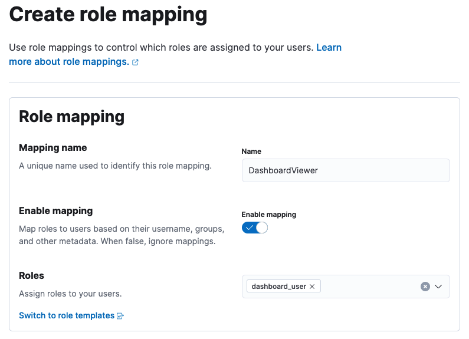
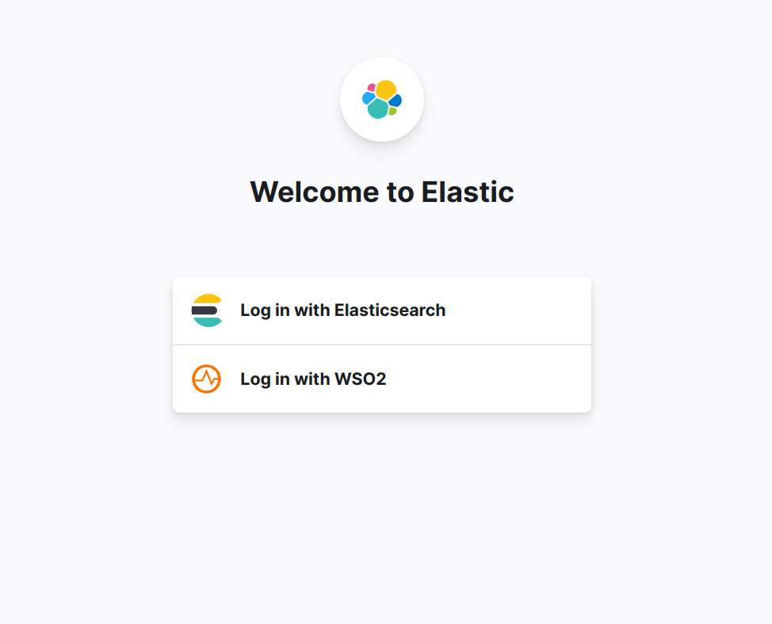
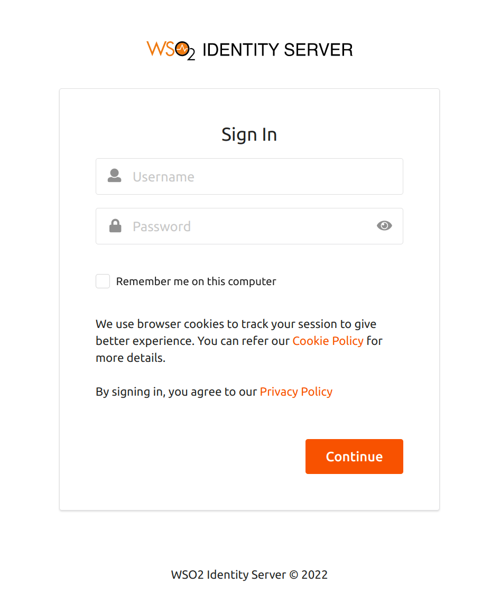

# ELK-based Analytics Installation Guide

The following steps required to configure the ELK-based Analytics for WSO2 Identity Server.  ELK-based Analytics solution supports ELK version 8.X.X.

#### Step 1 : Configuring WSO2 Identity Server

Follow the steps below to enable ELK-based analytics in WSO2 Identity Server.

##### Step 1.1 - Configuring the deployment.toml file

1.  Download and install WSO2 Identity Server. For detailed information
    on how to install WSO2 IS, see [Installing the
    Product](../../setup/installing-the-product).

2.  Open the `          deployment.toml         ` file in the
    `          <IS_HOME>/repository/conf/         ` directory.

3.  Enable the following configurations in the `deployment.toml` file.

    ```
    [analytics.elk]
    enable=true
    ```
##### Step 1.2 - Enabling Logs

Open the `<IS_HOME>/repository/conf directory` and edit the `log4j2.properties` file following the instructions given below to enable logging.

1. Add ANALYTICS_EVENT_LOGFILE to the appenders list:
   `appenders = {other appenders} , ANALYTICS_EVENT_LOGFILE`

2. Then add appender configs.

(Note: To change the file location & name, edit parameter fileName & filePattern )
```
appender.ANALYTICS_EVENT_LOGFILE.type = RollingFile
appender.ANALYTICS_EVENT_LOGFILE.name = ANALYTICS_EVENT_LOGFILE
appender.ANALYTICS_EVENT_LOGFILE.fileName =${sys:carbon.home}/repository/logs/analytics_events.log
appender.ANALYTICS_EVENT_LOGFILE.filePattern = ${sys:carbon.home}/repository/logs/analytics_events-%d{MM-dd-yyyy}.%i.log
appender.ANALYTICS_EVENT_LOGFILE.layout.type = PatternLayout
appender.ANALYTICS_EVENT_LOGFILE.layout.pattern=TID: [%tenantId] [%appName] [%d] [%X{Correlation-ID}] %5p {%c} — %mm%ex%n
appender.ANALYTICS_EVENT_LOGFILE.policies.type = Policies
appender.ANALYTICS_EVENT_LOGFILE.policies.time.type = TimeBasedTriggeringPolicy
appender.ANALYTICS_EVENT_LOGFILE.policies.time.interval = 1
appender.ANALYTICS_EVENT_LOGFILE.policies.time.modulate = true
appender.ANALYTICS_EVENT_LOGFILE.policies.size.type = SizeBasedTriggeringPolicy
appender.ANALYTICS_EVENT_LOGFILE.policies.size.size=10MB
appender.ANALYTICS_EVENT_LOGFILE.strategy.type = DefaultRolloverStrategy
appender.ANALYTICS_EVENT_LOGFILE.strategy.max = 20
appender.ANALYTICS_EVENT_LOGFILE.filter.threshold.type = ThresholdFilter
appender.ANALYTICS_EVENT_LOGFILE.filter.threshold.level = INFO
```

3. Add the following configurations to the logger
```
logger.org-wso2-carbon-event.output-adapter-logger-LoggerEventAdapter.name=org.wso2.carbon.event.output.adapter.logger.LoggerEventAdapter
logger.org-wso2-carbon-event.output-adapter-logger-LoggerEventAdapter.level=INFO
logger.org-wso2-carbon-event.output-adapter-logger-LoggerEventAdapter.appenderRef.CUSTOM_LOGFILE.ref=ANALYTICS_EVENT_LOGFILE
```

4. Add `org.wso2.carbon.event.output.adapter.logger.LoggerEventAdapter` to loggers.
```
loggers = {existing loggers}, org-wso2-carbon-event.output-adapter-logger-LoggerEventAdapter
```
!!! Note
The `analytics_events.log` file will be rolled each day or when the log size reaches the limit of 1000 MB by default. Furthermore, only 10 revisions will be kept and older revisions will be deleted automatically. You can change these configurations by updating the configurations provided in step 2 given above in this. section.

#### Step 2 : Configuring ELK

1. [Install Elasticsearch](https://www.elastic.co/guide/en/elastic-stack-get-started/current/get-started-elastic-stack.html#install-elasticsearch) according to your operating system.
2. Make sure Elasticsearch is [up and running](https://www.elastic.co/guide/en/elastic-stack-get-started/current/get-started-elastic-stack.html#_make_sure_that_elasticsearch_is_up_and_running).

In Elasticsearch version 8.x, security features are enabled by default. Basic authentication is enabled and cluster connections are encrypted. Please note down the password of the default elastic user or create a new user with required roles using this [document](https://www.elastic.co/guide/en/elasticsearch/reference/current/users-command.html) for next steps.


##### Installing Logstash

1. [Install Logstash](https://www.elastic.co/guide/en/logstash/current/installing-logstash.html) according to your operating system.
2. Create a file with '.conf'  extension in logstash directory and add the configurations in [here](https://github.com/wso2-extensions/identity-elk-integration/blob/main/filebeat/filebeat.yml). Change the variable parameters according to your setup.
   Pass this file as the CONFIG_PATH argument when [starting the logstash server](https://www.elastic.co/guide/en/logstash/8.1/running-logstash-command-line.html#running-logstash-command-line).

##### Installing Filebeat[**]
1. Install Filebeat according to your operating system.
2. Add the configurations in here to filebeat.yml file  to read the log file in the {IS_HOME}/repository/logs folder. Change the {LOGSTASH_HOST} accordingly.

##### Installing Kibana[**]
1. [Install Kibana](https://www.elastic.co/guide/en/elastic-stack-get-started/current/get-started-elastic-stack.html#install-kibana) according to your operating system and do this [one time configuration](https://www.elastic.co/guide/en/elasticsearch/reference/8.2/configuring-stack-security.html#stack-start-with-security).
   .
2. [Launch](https://www.elastic.co/guide/en/elastic-stack-get-started/current/get-started-elastic-stack.html#_access_the_kibana_web_interface) the Kibana web interface.

#### Step 3 : Configuring ELK Analytics Dashboards

1. Log in to the Kibana.
2. Navigate to Stack Management > Index Management >  Index Pattern. If you already have any index patterns created under the following names, delete them before importing the saved artifacts.

      - wso2-iam-alert-auth*
      - wso2-iam-alert-session*
      - wso2-iam-auth-raw*
      - wso2-iam-session-raw*
      - wso2-iam-session-time-series*

3. Download the artifact file [here](https://github.com/wso2-extensions/identity-elk-integration/blob/main/kibana/saved-objects/kibana-8-x-auth-and-session.ndjson).
4. Navigate to Stack Management > Saved Object and click on the import button and add the downloaded artifact file as an import object, and import.
   You can see the Auth, Session dashboards in the Dashboard section.


### Configure Security in ELK

Elastic search supports several authentication modes ranging from basic authentication to Single sign-on with several identity providers.

In Elasticsearch version 8.x, security features are enabled by default. Basic authentication is enabled and cluster connections are encrypted.

### Configure Single-Sign-On with WSO2 Identity Server via OpenID Connect

ElasticSearch/Kibana deployment can be configured to enable Single-sign-on with WSO2 Identity Server via OpenID Connect. To set up SSO with WSO2 Identity Server, follow the steps given below.

!!! Prerequisite  
To enable Single-sign-on security features in ELK, an ElasticSearch Platinum subscription is required.

#### Step 1 : Configure a service provider at WSO2 Identity Server

To enable SSO with WSO2 Identity Server, a service provider needs to be created. Follow the steps given below to create a service provider.

1. Login to the WSO2 Identity Server management console via https://<IS_HOST>:<PORT>/carbon

2. From the **Main**, click **Add** under the **Service Providers** section.
   

3. In the Add New Service Provider page, create a new service provider by         providing the service provider name (e.g.,kibana).

   

4. Once the service provider is created, go to the service provider, expand the  **Claim Configuration** section. Configure the claims as shown in the image below and click **Update**. Read more about claims.

   

5.  Expand the **Inbound Authentication Configuration** section, then **OAuth/OpenID Connect Configuration** and click **Edit**.

    

6. Click Update to save your changes.

7. Navigate to **Manage -> OIDC Scopes -> List** and click on the **Add claims** on the **Openid**. Add the claims you’ve used in step 4(email, groups, username, name) and finish.


#### Step 2 : Configure OIDC Realm in Elasticsearch

To configure single sign-on to the Elastic Stack using OpenID connect, follow the steps given here.

A sample OpenID connect realm is as follows.

```
xpack.security.authc.token.enabled: true
xpack.security.authc.realms.oidc.oidc1:
   order: 1
   rp.client_id: "<<CLIENT ID>>"
   rp.response_type: code
   rp.redirect_uri: "http:///<KIBANA_HOST>:5601/api/security/oidc/callback"
   op.issuer: "https://<IS_HOST>:<PORT>/oauth2/token"
   op.authorization_endpoint: "https://<IS_HOST>:<PORT>/oauth2/authorize"
   op.token_endpoint: "https://<IS_HOST>:<PORT>/oauth2/token"
   op.jwkset_path: "https://<IS_HOST>:<PORT>/oauth2/jwks"
   op.endsession_endpoint: "https://<IS_HOST>:<PORT>/oidc/logout"
   op.userinfo_endpoint: "https://<IS_HOST>:<PORT>/oauth2/userinfo"
   rp.post_logout_redirect_uri: "http://<KIBANA_HOST>:5601/security/logged_out"
   claims.principal: sub
   ssl.verification_mode: none
   claims.groups: groups
   claims.name: name
   claims.mail: email
```

#### Step 3 : Configure role mapping for Kibana Dashboard

Once the above steps are completed, role mapping needs to be configured in Kibana to allow WSO2 Identity Server users to access the dashboards in Kibana. For that follow the steps mentioned below.

##### Create Users and Roles in WSO2 API Manager

1. Login to the WSO2 Identity Server management console via https://<IS_HOST>:<PORT>/carbon
2. Create a new role (e.g., AnalyticsViewer) using this link.
3. Create a new user and assign the created role.
   

#### Configure role mapping in Kibana

1. Login to Kibana using basic authentication and go to **Stack Management** under the **Management** section in the left menu. Click **Role Mappings** under the **Security** section.

2. In the **Create Role Mapping** section, add a new role mapping by providing a **Mapping name**.

3. Select a role that has access to the particular dashboard from the **Roles**.

   

4. Under **Mapping Rule**s select **groups** as the user field and name of the previously-created role as the value and click **Add**.

   


5. Logout from the Kibana and re-login by selecting the **Log in with WSO2 option**.

   

6. This will navigate to the WSO2 Identity Server login page. Try login with the previously created user credentials.

   
