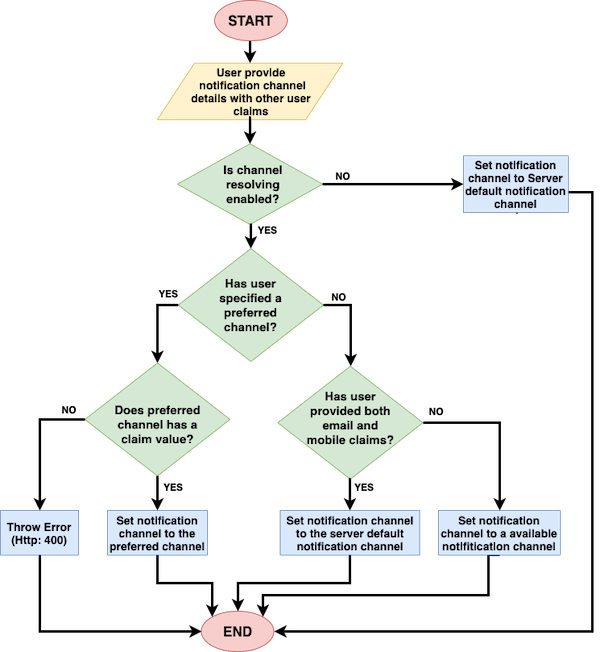

# Extended User Self Registration API and Account Confirmation API

WSO2 Identity Server (WSO2 IS) supports self-registration to allow users set up their account and 
receive confirmation when the account is created.

WSO2 Identity Server allows the user to confirm their account via a user-preferred 
channel of communication. Based on the user-preference, the user self-registration process supports 
email or mobile as the preferred account confirmation channel for the user. 

!!! Note
    Currently, WSO2 IS supports **SMS** and **EMAIL** as Internal Notification channels. 
    Each channel has the following attributes.
    
    ```text
    Channel Type: SMS
    Claim: http://wso2.org/claims/mobile
    Channel Verified Claim:	http://wso2.org/claims/identity/emailVerified
    
    Channel Type: EMAIL
    Claim: http://wso2.org/claims/emailaddress
    Channel Verified Claim: http://wso2.org/claims/identity/phoneVerified
    ```

The account confirmation channel is selected based on the following scenarios.

1. SMS: If the user has provided only the mobile number, the confirmation channel will be SMS.

2. Email: If the user has provided only the email address, the confirmation channel will be email. 

3. Either SMS or email: If the user has provided both mobile number and email address, 
the confirmation channel will be either sms or email.

    **NOTE:** In this case, the account confirmation channel will be the preferred channel 
    selected by the specific user. If the user has not specified any preferred channel, 
    the server configured channel is selected as the account confirmation channel.
    
Following sections will guide you via the usage of APIs to configure user self-registration to 
support multiple confirmation channels.   

!!! Note
    This feature is **only available via the Self Registration and Account confirmation REST APis**. 
    Currently, WSO2 does not support this feature via the End User Dashboard.
    
    To try out self-registration, click [User Self Registration and Account confirmation via Mobile and Email 
    Channels](../../learn/multi-channel-self-registration-and-account-confirmation).
    
## Self registration API

This section describes how the self registration API works, the flow, and sample API requests 
and responses.

### **How it works**

- In a self-registration request, either the mobile number or email address (or both claims) 
is required for the server to initiate an account verification request (i.e., at least one 
claim should be in the request).

    ```
    Mobile claim: http://wso2.org/claims/mobile
    Email claim: http://wso2.org/claims/emailaddress
    ```
    
- WSO2 Self Register API support two types of registration requests.

    - Self-registration with pre-verified claims
    - Self-registration with post user account verifications
    
<table>
    <tr>
        <th>Self Register Request Type</th>
        <th>Description</th>
    </tr>
        <td>Self-registration with pre-verified claims</td>
        <td>
            <li>
                The user is already verified prior to the self-registration by an external 
                mechanism. Therefore, no need to verify the user account again.
                <br><b>NOTE</b>: This feature is only supported when the prior verified channel 
                is either <b>EMAIL</b> or <b>SMS</b>.
            </li>    
            <div class="admonition info">
                <p class="admonition-title">Note</p>
                <p>To enable this feature add the following configuration to the 
                <code>deployment.toml</code>.</p>
                <p>
                   ```toml
                   [identity_mgt.user_self_registration]
                   enable_account_lock_for_verified_preferred_channel = false
                   ```
                </p>
                <p>
                    After enabling this feature, if the user has verified channels, the 
                    user will not be asked to verify the account and account will be 
                    unclocked on creation.
                </p>
                <div class="admonition warning">
                    <p class="admonition-title">Warning</p>
                    <p>WSO2 recommends verifying users after self registration (Post channel verification).
                    Therefore, it is recommended to set the property to 
                    <code>true</code>.</p>
                </div>
                After enabling this feature, if the user has verified channels, the user will not be asked 
                to verify the account and account will be unlocked on creation.
            </div>
            <li>
                If a channel is verified external to WSO2 Identity Server, 
                the corresponding channel verified claim needs 
                to be in the request with the value set to <code>TRUE</code>.
            </li>
            <b>Example</b>: If the mobile number is already verified, then the <code>Phone verified</code> 
            claim needs to be in the self-registration request with the value set to <code>TRUE</code>.
            <div class="admonition info">
                <p class="admonition-title">Following are the claims associated with each channel</p>
                <p>
                    <li>Phone Verified: http://wso2.org/claims/identity/phoneVerified</li>
                    <li>Email Verified: http://wso2.org/claims/identity/emailVerified</li>
                </p>
             </div>
        </td>
    <tr>
        <td>Self-registration with post user account verifications</td>
        <td>
            The user is not verified prior to the self-registration. The user account 
            needs to be verified after the user self-registration process via internal 
            channels or external channels.
        </td>
    </tr>
    <tr>
    </tr>
</table>

- A claim with a user’s preference can be included in the request. Enable claim `Preferred Channel` from 
the management console.
    
    ```text
    Preferred channel: http://wso2.org/claims/identity/preferredChannel
    ```

- Once the server receives a self-registration request, the server will send notifications 
based on the following scenarios.
    
    - **Initiate a self-registration request and verify the user account via WSO2 IS**
        
        The server sends notifications to the user by resolving the communication channel 
        internally. The notification channel resolution is as follows.
    
    - **Initiate a self-registration request, verify user account externally and confirm the flow to 
    WSO2 IS**
    
        The server provides a confirmation code to be used to confirm the user account.
    
    - **Self-register after pre-confirmation of the user account, with verified claims**
    
        The user is already verified. In this case, the user account should not be locked 
        or prompted for verification. Therefore, no notifications are sent.
        
### **Notification channel selection criteria**        




1. The user inputs the notification channel details with other user claims. 

2. If channel resolving is `not enabled`, the notification channel is set to use the server default 
notification channel. 

    !!! Note
        - Navigate to the `deployment.toml` and set `enable_resolve_notification_channel` 
        to `true` to enable channel resolving.  
        
        - To configure default notification channel, navigate to the `deployment.toml` and 
        set a value (`EMAIL` or `SMS`).
        
        - For more information , 
        see [Configuring self-registration](../.
        ./learn/multi-channel-self-registration-and-account-confirmation/#configuring-self-registration).
    
3. If channel resolving  property is `enabled`, the server will check for a user preferred notification channel.

    1. If the user has only provided an email address or a mobile number as the notification 
    channel and the user has not specified a preferred channel, the notification will be sent via 
    the channel that is given in the request as a claim value. 
        
        **Example**: If only the mobile number has been provided, mobile number is considered as 
        the preferred channel.  
    
    2. If the user has specified a preferred channel and the preferred channel matches with the 
    given claim values, the confirmation info will be sent via the user specified preferred channel.
    
        **Example**: If the preferred channel is specified as SMS and the provided 
        claim value is a mobile number, an OTP will be sent to the user.
        
    3. If the user has specified a preferred channel and the preferred channel does not match with 
    the given claim values, a **400 ERROR** is returned. 
    
        **Example**: The preferred channel is specified as SMS but there is no value for the 
        mobile number.
        
        !!! Note
            Each notification channel is bound with the claim channel.
            <table>
                <tr>
                    <th>Notification Channel</th>
                    <th>Bounded Value Claim</th>
                </tr>
                <tr>
                    <td>EMAIL</td>
                    <td>http://wso2.org/claims/emailaddress</td>
                </tr>
                <tr>
                    <td>SMS</td>
                    <td>http://wso2.org/claims/mobile</td>
                </tr>
            </table>
            
            !!! warning
                Changing the bounded value claim will cause errors.
            
     4. If the user has provided both email and a mobile as communication channels and has also specified 
     a preferred channel, the notification will be sent via the preferred channel.
     
     5. If the user has provided both email and mobile as communication channels but has not 
     specified a preferred channel, notification will be sent via the server default channel. 
     
4. Once the communication channel is resolved, an event is triggered. Once the event is 
triggered, the notification handlers will send notifications to the user.
   
    The event names will be in the following format.
    
    <table>
    <tr>
        <th>Channel</th>
        <th>Event Name</th>
    </tr>
    <tr>
        <td>SMS</td>
        <td>TRIGGER_SMS_NOTIFICATION</td>
    </tr>
    <tr>
        <td>Email</td>
        <td>TRIGGER_NOTIFICATION</td>
    </tr>
    </table>     
    
    !!! note
        If you have any custom notification handlers, you need to subscribe the notification handler 
        to above events.

### **API Requests and Responses**

There are three scenarios associated with user self registration.

1. **Self registration with internally managed notifications and account lock on creation.**

    ??? info "User Self Registers without Verified Claims"
        **Sub scenario:** The user self registers without verified claims.
        
        A notification will be sent to the user and the user will be asked to verify 
        via the preferred channel. After confirmation, verified claims will be set as 
        attributes of the user (HTTP: 201). 
        
        **Sample Request**
        ```
        curl -X POST -H "Authorization: Basic YWRtaW46YWRtaW4=" -H "Content-Type: application/json" -d '{"user": {"username": "kim","realm": "PRIMARY", "password": "Password12!","claims": [{"uri": "http://wso2.org/claims/givenname","value": "kim" },{"uri": "http://wso2.org/claims/emailaddress","value": "kim.anderson@gmail.com"},{"uri": "http://wso2.org/claims/lastname","value": "Anderson"},{"uri": "http://wso2.org/claims/mobile","value": "+947721584558"} ] },"properties": []}' "https://localhost:9443/api/identity/user/v1.0/me"
        ```
        
        **Sample Response**
        ```
        {
        "code": "USR-02001",
        "message": "Successful user self registration. Pending account verification",
        "notificationChannel": "SMS",
        "confirmationCode": null
        }
        ```
    
    ??? info "User Self Registers with Verified Claims"
        **Sub scenario:** The user self registers with verified claims. 
        
        If the verified claims match the preferred notification channel, 
        the user will be created and the account will be unlocked (HTTP: 201). 
        
        **Sample Request**
        ```
        curl -X POST -H "Authorization: Basic YWRtaW46YWRtaW4=" -H "Content-Type: application/json" -d '{"user": {"username": "kim","realm": "PRIMARY", "password": "Password12!","claims": [{"uri": "http://wso2.org/claims/givenname","value": "kim" },{"uri": "http://wso2.org/claims/emailaddress","value": "kim.anderson@gmail.com"},{"uri": "http://wso2.org/claims/identity/emailVerified","value": "true"},{"uri": "http://wso2.org/claims/lastname","value": "Anderson"},{"uri": "http://wso2.org/claims/mobile","value": "+947721584558"} ] },"properties": []}' "https://localhost:9443/api/identity/user/v1.0/me"
        ```
        
        **Sample Response**
        ```
        {
        "code": "USR-02004",
        "message": "Successful user self registration with verified channel. Account verification not required.",
        "notificationChannel": null,
        "confirmationCode": null
        }
        ```
        
        !!! note
            - If the verified claims do not match the preferred notification channel, the user will be 
            created and the user will be asked to verify the account via the preferred channel. 
            
            - **Example**: User's `SMS` channel is already verified but user wants `EMAIL` to be the preferred 
            channel of communication.
            
            **Sample Response**
            ```
            {
            "code": "USR-02001",
            "message": "Successful user self registration. Pending account verification",
            "notificationChannel": "EMAIL",
            "confirmationCode": null
            }
            ```

2. **Self registration with externally managed notifications and account lock on creation.** 

    ??? info "User Self Registers without Verified Claims"
        **Sub scenario:** The user self registers without verified claims.
     
        A notification will be sent to the user and the user will be asked to verify 
        via the preferred channel. After confirmation, verified claims will be set as 
        attributes of the user (HTTP: 201). 
         
        **Sample Request**
        ```
        curl -X POST -H "Authorization: Basic YWRtaW46YWRtaW4=" -H "Content-Type: application/json" -d '{"user": {"username": "kim","realm": "PRIMARY", "password": "Password12!","claims": [{"uri": "http://wso2.org/claims/givenname","value": "kim" },{"uri": "http://wso2.org/claims/emailaddress","value": "kim.anderson@gmail.com"},{"uri": "http://wso2.org/claims/lastname","value": "Anderson"},{"uri": "http://wso2.org/claims/mobile","value": "+947721584558"} ] },"properties": []}' "https://localhost:9443/api/identity/user/v1.0/me"
        ```
        
        **Sample Response**
        ```
        {
        "code": "USR-02002", 
        "message":"Successful user self registration. External verification required",
        "notificationChannel": "EXTERNAL",
        "confirmationCode": "fb03f437-a46f-4da1-8e99-fafab4aad4a4"
        }
        ```
        
    ??? info "User Self Registers with Verified Claims"
        **Sub scenario:** The user self registers with verified claims. 
        
        If the verified claims match the preferred notification channel, 
        the user will be created and the account will be unlocked (HTTP: 201). 
        
        **Sample Request**
        ```
        curl -X POST -H "Authorization: Basic YWRtaW46YWRtaW4=" -H "Content-Type: application/json" -d '{"user": {"username": "kim","realm": "PRIMARY", "password": "Password12!","claims": [{"uri": "http://wso2.org/claims/givenname","value": "kim" },{"uri": "http://wso2.org/claims/emailaddress","value": "kim.anderson@gmail.com"},{"uri": "http://wso2.org/claims/identity/emailVerified","value": "true"},{"uri": "http://wso2.org/claims/lastname","value": "Anderson"},{"uri": "http://wso2.org/claims/mobile","value": "+947721584558"} ] },"properties": []}' "https://localhost:9443/api/identity/user/v1.0/me"
        ```
        
        **Sample Response**
        ```
        {
        "code":"USR-02004",
        "message":"Successful user self registration with verified channel. Account verification not required.",
        "notificationChannel":null,
        "confirmationCode":null
        }
        ```
        
        !!! note
            - If the verified claims do not match the preferred notification channel, the user will be 
            created and the API will return a confirmation code. 
            
            - **Example**: User's `SMS` channel is already verified but user wants `EMAIL` to be the preferred 
            channel of communication.
            
            **Sample Response**
            ```
            {
            "code": "USR-02002", 
            "message":"Successful user self registration. External verification required",
            "notificationChannel": "EXTERNAL",
            "confirmationCode": "fb03f437-a46f-4da1-8e99-fafab4aad4a4"
            }
            ```    
        
        

3. **Self registration with account not locked creation.**
   
    This scenario is almost similar to the above two scenarios. The difference is, 
    the `account lock on creation` is disabled in **Resident IDP Settings**. 

    !!! note
        For more information on configuring self registration, see [Configuring self-registration](../.
        ./learn/multi-channel-self-registration-and-account-confirmation/#configuring-self-registration).
        
    ??? info "Sample Response"
        ```
        {
        "code": "USR-02003",
        "message": "Successful user self registration. Account not locked on user creation",
        "notificationChannel": null,
        "confirmationCode": null
        }  
        ```     
     
### **Error responses**

- Providing an existing username (HTTP: 409)

    ```
    {
    "code": "20030",
    "message": "Conflict",
    "description": "User TestUser1 already exists in the system. Please use a different username."
    }
    ```
- Preferred channel not supported by the server (HTTP: 400)

    ```
    {
    "code": "USR-10001",
    "message": "Bad Request",
    "description": "User specified communication channel is not supported by the server"
    }
    ```
    
- Not providing value to the preferred channel claim (HTTP: 400)

    **Example:** specifying the preferred channel as EMAIL but not providing the claim value for the http://wso2
    .org/claims/emailaddress claim/
    
    ```
    {
    "code": "USR-10002",
    "message": "Bad Request",
    "description": "User specified communication channel does not have any value"
    }
    ```
    
## Account confirmation API     

For account confirmations, WSO2 Identity Server supports multiple verification channels 
and allows defining the verified channel (i.e., whether the account confirmation was 
communicated via email or sms) in the API request.

!!! info "Using the` verifiedChannel` parameter"       
    - Using the` verifiedChannel` parameter, the user can be verified with any server 
    supported channel (`SMS` or `EMAIL`). 
    
    - In the following sample, the SMS 
    channel for the user is set as the verified notification channel.
    
    !!! note "Sample JSON request body"
        ```
        {
        "code": "1a39ec29-9417-4f69-93b6-b7f2bbf75413",
        "verifiedChannel":{"type":"SMS", "claim":"http://wso2.org/claims/mobile"},
        "properties": []
        }
        ```
        
        
### Sample Request

``` tab="Notification Channel is either EMAIL or SMS"
curl -k -v -X POST -H "Authorization: Basic YWRtaW46YWRtaW4=" -H  "Content-Type: application/json" -d '{ "code": "84325529-8aa7-4851-8751-5980a7f2d9f7","properties": []}' "https://localhost:9443/api/identity/user/v1.0/validate-code"
```

``` tab="Notification Channel is EXTERNAL"
curl -k -v -X POST -H "Authorization: Basic YWRtaW46YWRtaW4=" -H  "Content-Type: application/json" -d '{ "code": "84325529-8aa7-4851-8751-5980a7f2d9f7","verifiedChannel":{"type":"SMS", "claim":"http://wso2.org/claims/mobile"},"properties": []}' "https://localhost:9443/api/identity/user/v1.0/validate-code"
```

!!! warning
    When the **notification are externally managed**, if the verified channel is not 
    specified in the account confirmation request, **EMAIL** will be considered as the 
    verified notification channel for the user.      

## Try out self-registration

To try out self-registration, click [User Self Registration and Account confirmation via Mobile and Email 
Channels](../../learn/multi-channel-self-registration-and-account-confirmation).