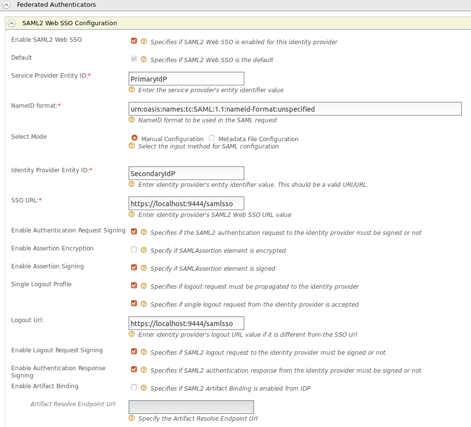
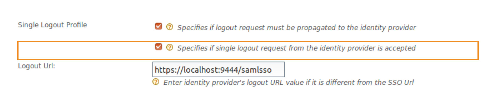
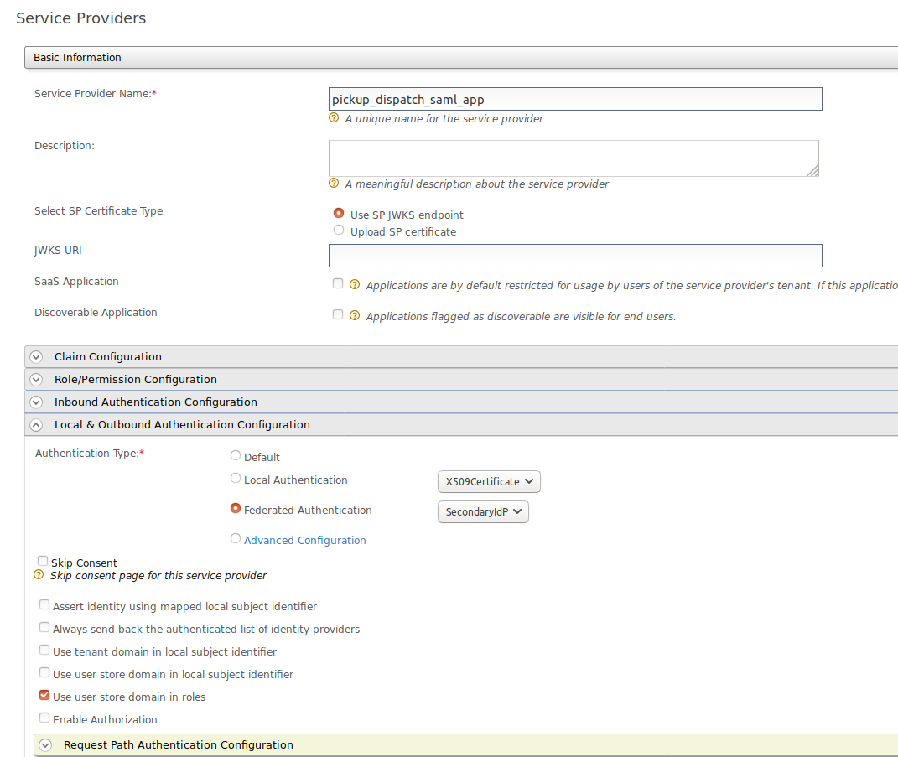
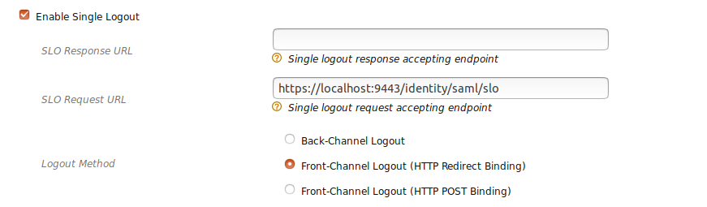
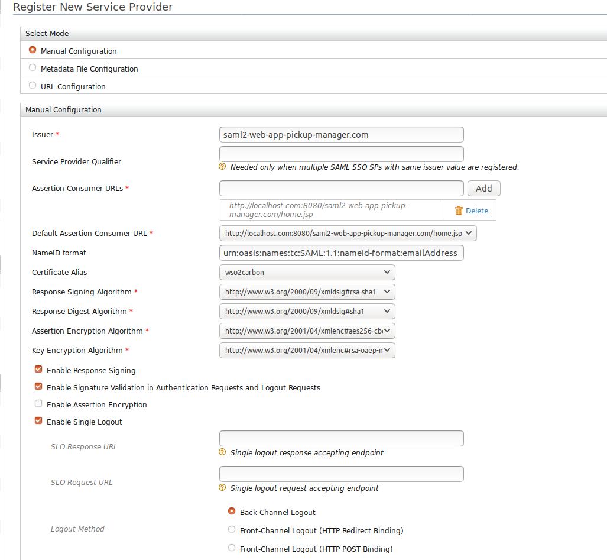

# Handling SAML Single Logout Requests from Federated Identity Providers

WSO2 Identity Server (WSO2 IS) supports handling SAML single logout requests from federated identity providers.
After the SAML single logout request is received from the federated identity provider, Identity Server processes 
the request and responds back to the identity provider after the session termination. This tutorial allows you to have
hands-on experience on handling SAML single logout requests from the federated identity provider. 

## Scenario

Consider the following diagram where, WSO2 identity server, App 01 and App 02 are service providers of the federated 
identity provider. App03 and App04 are service providers of wso2 identity server. When a user tries to logout
from the App01, it will send a logout request to the federated IdP. Federated IdP will determine the session 
participants using the session index available in the logout request. As the Identity server is a session participant,
the Identity Server will receive a logout request from the federated IdP. Therefor the Identity Server needs to handle this
request,terminate the session and response back with a valid logout response.

        
## Trying out the flow with WSO2 Identity Server

To demonstrate the scenario, let's follow through the diagram given below.We are going to use two WSO2 IS servers which 
are running on port 9443(Primary IS) and 9444 (Secondary IS) and two sample web applications called pickup-dispatch and 
pickup-manager.

The following sections guide you through configuring SAML single logout requests handling and trying it out with 
the sample applications.

-   [Configuring Identity Provider(Secondary IS) in the Primary IS]
-   [Configuring Pickup Dispatch application in the Primary IS]
-   [Configuring Primary IS(Service Provider) in the Secondary IS]
-   [Configuring Pickup Manager application in the Secondary IS]

### Configuring Identity Provider(Secondary IS) in the Primary IS

1. Run the WSO2 Identity Server on port 9443 (Primary IS).
2. Log in to the management console as an administration.
3. Navigate to the Main menu to access the Identity menu. Click Add under Identity Providers. 
4. Fill in the details in the Basic Information section. Give a suitable name for Identity Provider Name.

5. Expand the SAML2 Web SSO Configuration section and fill the required details. 
    

   

  !!! info "Note"
  
      Select **Specifies if logout request from the identity provider is accepted** to accept single logout requests from 
      the identity provider. Once this is enabled, WSO2 Identity Server accepts and handles the logout requests. 
      This configuration is a must to try this scenario.
      

   
   
5. After providing values for required fields, click the register.

### Configuring Pickup Dispatch application in the Primary IS

The next step is to configure the pickup dispatch application as a service provider in the Primary IS.

1. Navigate to Service Providers > Add in the Main menu of the management console and add a new service provider 
   called " saml2-web-app-dispatch.com "
   
2. Expand the Inbound Authentication configuration > SAML2 Web SSO configuration section, and click Configure. 
    Fill in the following fields. 

    - Issuer:  saml2-web-app-pickup-dispatch.com
    - Assertion Consumer URL:  http://localhost.com:8080/saml2-web-app-dispatch.com/consumer 
    
    
    
3. Leave the rest of the default configurations as it is and click Register. 

    !!! Note 
       To enable the federated authentication, go to the Service Provider Configuration and expand the Local & Outbound
       Authentication Configuration. Again expand the SAML2 Web SSO Configuration and click on Configure. Enable the federated 
       authentication and select **Secondary IS** as the authenticator.
  

    
 
 
 
### Configuring Primary IS(Service Provider) in the Secondary IS
 
The next step is to configure the Primary IS as a service provider in the Secondary IS.
 
1. Run the WSO2 Identity Server on port 9444 (Secondary IS).

2. Log in to the management console of the Secondary IS.

3. Follow the steps in [Configuring Pickup Dispatch application in the Primary IS](Configuring Pickup Dispatch application in the Primary IS)
and configure the service provider with below details.

    - Issuer : SP Entity Id of the Secondary IS
    - Assertion Consumer URL : URL of the endpoint which receives SAML responses from the identity provider
    - Enable Single Logout (https://localhost:9443/commonauth)
    - SLO Request URL ; "http:/localhost:8080/identity/saml/slo" 

    `Providing SLO Request URL is a must. WSO2 IS receives the SAML single logout requests from this URL. For now, only front channel 
    bindings are supported with this feature. For logout method, select one of front channel bindings.`
    
    

4. Leave the rest of the default configurations as it is and click Register. 

    
 
 
### Configuring Pickup Manager application in the Secondary IS

The next step is to configure the Pickup Manager application  as a service provider in the Secondary IS.
 
1. Follow the steps in [Configuring Service Provider in the Primary IS](Configuring Pickup Dispatch application in the Primary IS) and
and configure the service provider with below details.
 
  - Issuer:  saml2-web-app-pickup-manager.com
  - Assertion Consumer URL:  http://localhost.com:8080/saml2-web-app-pickup-manager.com/consumer 
  
2. Leave the rest of the default configurations as it is and click Register. 
  
  
  
  
### Try it out !

After all configurations mentioned above, we can try out the flow running sample applications.

1. Go to http://localhost.com:8080/saml2-web-app-pickup-dispatch.com and  click on the login button.

2. You will be redirected to the login page of WSO2 Identity Server(federated IdP - port 9444). Login using your Identity Server credentials. You will be redirected to saml2-web-app-pickup-dispatch.com application home page.

3. Now you go to http://localhost.com:8080/saml2-web-app-pickup-manager.com, which is registered in the federated identity provider.

4. You will be redirected to the login page of WSO2 Identity Server(federated IdP - port 9444). Login using your Identity Server credentials. You will be redirected to saml2-web-app-pickup-manager.com application home page.

5. Logout from the saml2-web-app-pickup-manager.com application and you will be redirected to the login page of the application.

6. You will automatically be logout from the saml2-web-app-pickup-dispatch.com application

