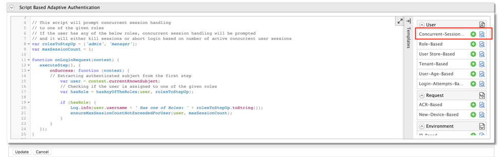
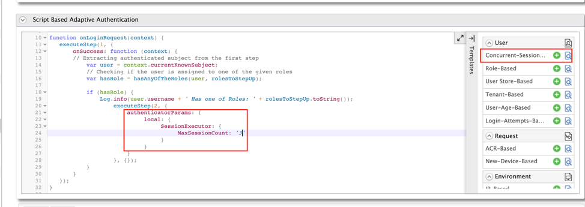
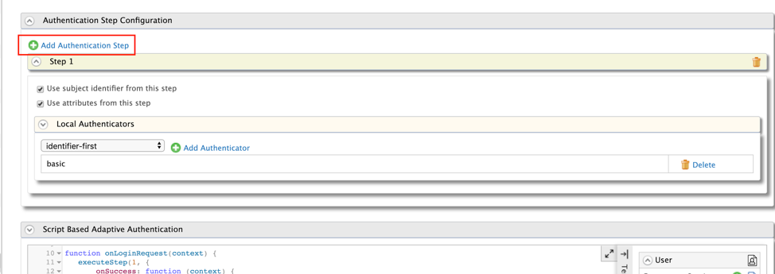
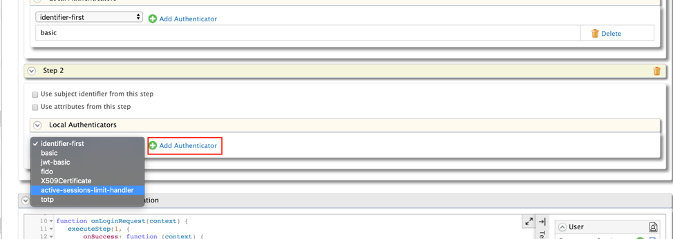
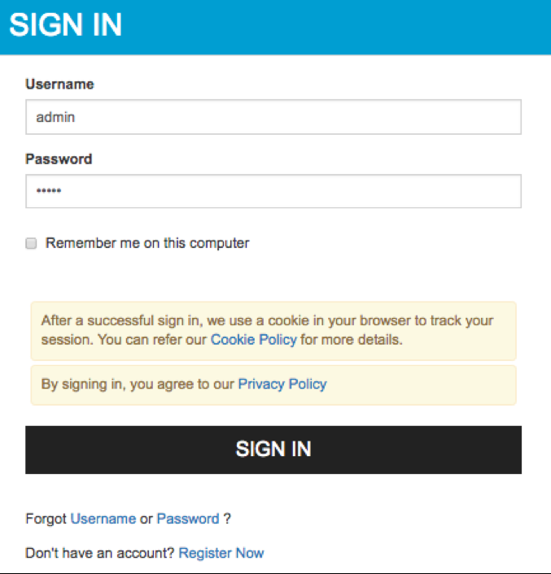
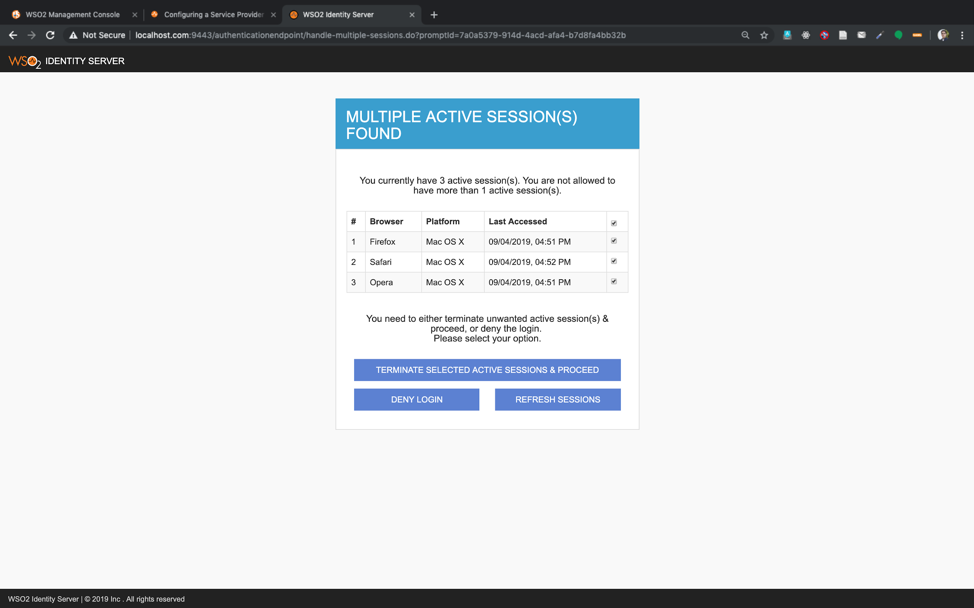
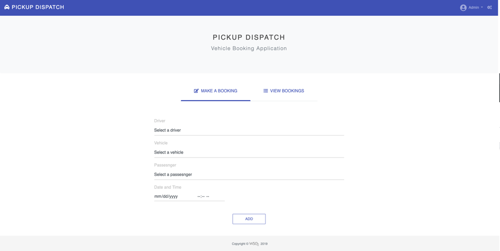
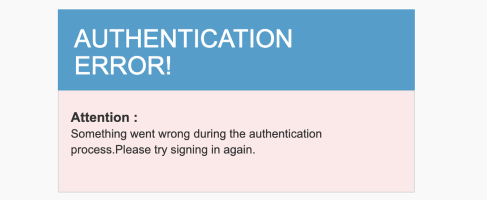

# Limiting Active User Sessions Based On Criteria

This tutorial demonstrates how you can set up active user session limiting based on a particular criteria with WSO2 Identity Server.
To understand how to set up the concurrent session limiting feature, let's consider a scenario where you want a user who has an administrator role that cannot have more than one active concurrent session at a time.
Here, you will use a sample application named **Pickup Dispatch** to deploy and set up sample authenticators required to try out the scenario. 

!!! tip "Before you begin"
    
    -   Set up the service provider and sample application for adaptive
        authentication if you have not done so already. For instructions on
        how to do this, see [Configuring a Service Provider for Adaptive
        Authentication](../../learn/configuring-a-service-provider-for-adaptive-authentication/).
    -   For more information about adaptive authentication with WSO2
        Identity Server, see [Adaptive Authentication](../../learn/adaptive-authentication/).

### Configuring the sample scenario

1.  On the Main menu of WSO2 Identity Server Management Console, click 
    **Service Providers&gt;List** and click Edit on the **saml2-web-app-pickup-dispatch.com** service provider.
2.  Expand the **Local and Outbound Configuration** section and click **Advanced Authentication**. 
3.  Expand **Script Based Conditional Authentication**.
4.  Click **Templates** on the right side of the  **Script Based Conditional Authentication** field and then click **Concurrent-Session-Management**. 
    
5.  Click **Ok**.

    !!! note
        The authentication script defines a conditional step that executes session handling prompt  only if the user belongs to an 'admin' or 'manager' role.  Here you can specify the value of `MaxSessionCount` variable to indicate the maximum number of allowed sessions. The default value is 1. For the purpose of this demo, change the value to 3. You can configure the `MaxSessionCount` variable via the deployment.toml file in the  `<IS_HOME>/repository/conf/` directory as well. Priority will be given to the configuration in the adaptive authentication script. To configure the `MaxSessionCount` variable through `deployment.toml` file, append the following configuration with the intended value for `MaxSessionCount`.
   
    ```
    
    authentication.authenticator.session_handler.parameters.max_session_count = “3”
    
    ```
    
6.  Click **Add Authentication Step**.
    
7.  Select **active-sessions-limit-handler** from the dropdown under **Local Authenticators** and click **Add Authenticator**. 
    
8.  Click **Update**.

### Testing the sample scenario

1.  Access the sample PickUp application using the following URL: http://localhost.com:8080/saml2-web-app-pickup-dispatch.com.
2.  Click **Login** and enter admin/admin credentials.
    
3.  Repeat the previous two steps in three different web browsers, e.g. Firefox, Safari, and Opera.
    
4.  Now you can either terminate one or more active sessions or deny the login. 

    !!! tip 
        -   If you select and terminate the active sessions exceeding the maximum limit, you will be naviagated to the application home page. Otherwise you will be re-prompted until the minimum required number of sessions are terminated. 
        -   You can use the **Refresh Sessions** button re-check active user sessions.
    
5.  If you deny the login, the Authentication Error screen appears.
    
