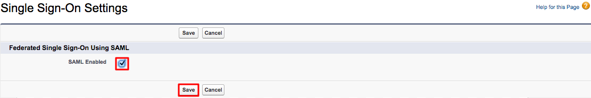
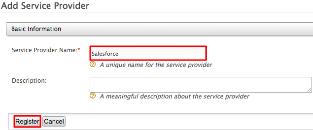

# Logging in to Salesforce with Integrated Windows Authentication

Integrated Windows Authentication (IWA) is an authentication mechanism
introduced by Microsoft to authenticate users in Microsoft Windows
NT-based operating systems. IWA authentication provides an easier way
for users to log in to applications that use Windows Active Directory as
a userstore. It is a popular choice of authentication among Windows
server users and administrators, since it eliminates the need of
remembering extra credentials of the users, and reduces the
authentication overhead for the server administrators.

This topic provides instructions on how to configure WSO2 Identity
Server to authenticate Salesforce users using Integrated Windows
Authentication.

!!! info "Related links"
	See [Integrated Windows Authentication](../../learn/integrated-windows-authentication-overview) and
    [Configuring IWA Single-Sign-On](../../learn/configuring-iwa-single-sign-on)
    for more information on Integrated Windows Authentication and
    details on how to enable it in the Identity Server.

!!! tip "Before you begin" 
    -	When you log in to Salesforce, you normally use an email address. To integrate this with WSO2 Identity Server, configure users in WSO2 Identity Server so that the users can log in using their email addresses.
    -	Configuring the email address as the username in an **already running Identity Server** is not the production recommended way. Therefore, **make sure to configure it before you begin working with WSO2 IS**.

### Configuring email address as the user name 

Follow the steps below to configure the email address as the user name.          

1.  Open the `<IS_HOME>/repository/conf/deployment.toml             `
	file.
	
2.  Set the `enable_email_domain` configuration under `[tenant_mgt]` to `true`.

	```toml
	[tenant_mgt]
	enable_email_domain= "true"
	``` 

3.  Open the `               <IS_HOME>/repository/conf/claim-config.xml              `
	file and configure the `               AttributeID              `
	property of the
	`                               http://wso2.org/claims/username                             `
	claim ID that is under
	`               <Dialect dialectURI="                               http://wso2.org/claims                              ">              `
	to `               mail              ` .

	``` java
	<Claim>
	   <ClaimURI>http://wso2.org/claims/username</ClaimURI>
	   <DisplayName>Username</DisplayName>
	   <AttributeID>mail</AttributeID>
	   <Description>Username</Description>
	</Claim>
	```

	!!! note
		This file is checked only when WSO2 IS is starting for the first
		time. Therefore, if you haven't configured this property at the time
		of starting up the server for the first time, you will get errors at
		the start up.


4.  Open the `<IS_HOME>/repository/conf/identity/identity-mgt.properties               `
	file and set the following property to
	`               true              ` .

	!!! warning
		This step is required due to a known issue that prevents the
		confirmation codes from being removed after they are used when email
		usernames are enabled. This occurs because the '@' character (and
		some special characters) are not allowed in the registry. To
		overcome this issue, enable hashed usernames when saving the
		confirmation codes by configuring the properties below.
		``` toml
		UserInfoRecovery.UseHashedUserNames=true
		```

	!!! tip
		Optionally, you can also configure the following property to
		determine which hash algorithm to use.
		``` toml
		UserInfoRecovery.UsernameHashAlg=SHA-1
		```

5.  Configure the following set of parameters in the user store
	configuration, depending on the type of user store you are connected
	to (LDAP/Active Directory/ JDBC).

	!!! note 
		If you are connected to the active directory user store these properties should be added within [user_store.properties] instead of [user_store].

	<table>
	<thead>
	<tr class="header">
	<th>Parameter</th>
	<th>Description</th>
	</tr>
	</thead>
	<tbody>
	<tr class="odd">
	<td><p><code>                    user_name_attribute                   </code></p>
	<p><br />
	</p></td>
	<td><div class="content-wrapper">
	<p>Set the mail attribute of the user. <strong>LDAP/Active Directory only</strong></p>
	<div class="code panel pdl" style="border-width: 1px;">
	<div class="codeContent panelContent pdl">
	<pre class="html/xml" data-syntaxhighlighter-params="brush: html/xml; gutter: false; theme: Confluence" data-theme="Confluence" style="brush: html/xml; gutter: false; theme: Confluence"><code>[user_store]<br>user_name_attribute = "mail"</code></pre>
	</div>
	</div>
	</div></td>
	</tr>
	<tr class="even">
	<td><code>                   user_name_search_filter                  </code></td>
	<td><div class="content-wrapper">
	<p>Use the mail attribute of the user instead of <code>                     cn                    </code> or <code>                     uid                    </code> . <strong>LDAP/Active Directory only</strong></p>
	<div class="code panel pdl" style="border-width: 1px;">
	<div class="codeContent panelContent pdl">
	<pre class="html/xml" data-syntaxhighlighter-params="brush: html/xml; gutter: false; theme: Confluence" data-theme="Confluence" style="brush: html/xml; gutter: false; theme: Confluence"><code>[user_store]<br>user_name_search_filter = "(&amp;(objectClass=identityPerson)(mail=?))"</code></pre>
	</div>
	</div>
	</div></td>
	</tr>
	<tr class="odd">
	<td><code>                   user_name_list_filter                  </code></td>
	<td><div class="content-wrapper">
	<p>Use the mail attribute of the user. <strong>LDAP/Active Directory only</strong></p>
	<div class="code panel pdl" style="border-width: 1px;">
	<div class="codeContent panelContent pdl">
	<pre class="html/xml" data-syntaxhighlighter-params="brush: html/xml; gutter: false; theme: Confluence" data-theme="Confluence" style="brush: html/xml; gutter: false; theme: Confluence"><code>[user_store]<br>user_name_list_filter = "(&amp;(objectClass=identityPerson)(mail=*))"</code></pre>
	</div>
	</div>
	</div></td>
	</tr>
	<tr class="odd">
	<td><pre><code>username_javas_cript_regex</code></pre>
	<p><code>                                       </code></p></td>
	<td><div class="content-wrapper">
	<p>Change this property that is under the relevant user store manager tag as follows. This property allows you to add special characters like "@" in the username.</p>
	<div class="code panel pdl" style="border-width: 1px;">
	<div class="codeContent panelContent pdl">
	<div class="sourceCode" id="cb6" data-syntaxhighlighter-params="brush: xml; gutter: false; theme: Confluence" data-theme="Confluence" style="brush: xml; gutter: false; theme: Confluence"><pre class="sourceCode xml"><code class="sourceCode xml"><a class="sourceLine" id="cb6-1" title="1"><span class="kw">[user_store]<br>user_name_javascript_regex="^[a-zA-Z0-9._-]+@[a-zA-Z0-9.-]+\.[a-zA-Z]{2,4}$"</a></code></pre></div>
	</div>
	</div>
	</div></td>
	</tr>
	<tr class="even">
	<td><pre><code>username_java_regex</code></pre></td>
	<td><div class="content-wrapper">
	<p>This is a regular expression to validate usernames. By default, strings have a length of 5 to 30. Only non-empty characters are allowed. You can provide ranges of alphabets, numbers and also ranges of ASCII values in the RegEx properties.</p>
	<div class="code panel pdl" style="border-width: 1px;">
	<div class="codeContent panelContent pdl">
	<div class="sourceCode" id="cb8" data-syntaxhighlighter-params="brush: xml; gutter: false; theme: Confluence" data-theme="Confluence" style="brush: xml; gutter: false; theme: Confluence"><pre class="sourceCode xml"><code class="sourceCode xml"><a class="sourceLine" id="cb8-1" title="1"><span class="kw">[user_store]<br>username_java_regex="^[a-zA-Z0-9._-]+@[a-zA-Z0-9.-]+\.[a-zA-Z]{2,4}$"</a></code></pre></div>
	</div>
	</div>
	</div></td>
	</tr>
	<tr class="odd">
	<td>Realm configurations</td>
	<td><div class="content-wrapper">
	<p>The <code>                     [super_admin]                    </code> username must use the email attribute of the admin user.</p>
	<div class="code panel pdl" style="border-width: 1px;">
	<div class="codeContent panelContent pdl">
	<pre class="html/xml" data-syntaxhighlighter-params="brush: html/xml; gutter: false; theme: Confluence" data-theme="Confluence" style="brush: html/xml; gutter: false; theme: Confluence"><code>[super_admin]<br>username = "admin@wso2.com"<br>password = "admin"</code></pre>
	<div class="admonition note">
	<p class="admonition-title">Note</p>
	<p>Before this configuration, the user having the username <strong>admin</strong> and password <strong>admin</strong> was considered the super administrator. The super administrator user cannot be deleted.</p>
	<p>After this configuration, the user having the username <strong><code>                      admin@wso2.com                     </code></strong> is considered the super administrator. The user having the username admin is considered as a normal administrator.<br />
	</p></div>
	<div class="admonition title">
	<p class="admonition-title">Tip</p>
	<p>If you changed the password of the admin user to something other than 'admin', start the WSO2 IS server using the -Dsetup parameter as shown in the command below.</p>
	<div class="code panel pdl" style="border-width: 1px;">
	<div class="codeContent panelContent pdl">
	<div class="sourceCode" id="cb10" data-syntaxhighlighter-params="brush: java; gutter: false; theme: Confluence" data-theme="Confluence" style="brush: java; gutter: false; theme: Confluence">
	<pre class="sourceCode java"><code class="sourceCode java"><a class="sourceLine" id="cb10-1" title="1">sh wso2server.sh -Dsetup</a></code></pre></div>
	</div>
	</div>
	</div>	
	</div>
	</div>
	</div></td>
	</tr>
	</tbody>
	</table>

	!!! info 
		With these configuration users can log in to super tenant with both
		email user name ( *[bob@gmal.com](mailto:bob@wso2.com)* ) or
		non-email user names (alice). But for tenant only email user names
		allowed (tod@ [gmail.com](http://gmail.com) @
		[wso2.com](http://wso2.com) )

	!!! note
		You can configure email user name without enabling
		**`                EnableEmailUserName               `** property,
		then users can login to both super tenant and tenant using email and
		non-email user names. But super tenant users should always use
		***@carbon.super*** at the end of user names.


6.  Restart WSO2 Identity Server.

!!! info "Related Topics"
	For more information on how to configure primary and secondary user
	stores, see [Configuring User
	Stores](../../setup/configuring-user-stores).


Now that you have configured the email addresses, let's configure Salesforce.

### Configuring Salesforce

1.  Sign up as a Salesforce developer if you don't have an account. If
    you already have an account, move on to step 2 and log in to
    Salesforce.
    1.  Fill out the relevant information found in the following URL:
        <https://developer.salesforce.com/signup>
    2.  Click **Sign me up**.
    3.  You will receive a security token by email to confirm your new
        account. If you did not receive the email successfully, you will
        be able to reset it by following the steps given
        [here](https://help.salesforce.com/apex/HTViewHelpDoc?id=user_security_token.htm&language=en_US).
2.  Log in with your new credentials as a Salesforce developer. Do this
    by clicking the **Login** link in the top right hand side of
    [https://login.salesforce.com/](https://login.salesforce.com/?lt=de)         
    
    ??? note "Click here to find the steps on how to switch from the classic to the lightning theme"
    	This document is explained using the Salesforce lightning theme. If you are using the classic theme, follow the steps given below to switch to the lightning theme: 

		1.  Click your username to expand the drop down.

		2.  Click **Switch to Lightning Experience**.  
						

		3.  Click the settings icon on the top-right-hand corner, and click
			**Set Up**.  
			

    	Now you are navigated to the lightening theme of Salesforce.
    

3.  Click **Allow** to enable Salesforce to access your basic
    information.
4.  Once you are logged in, create a new domain and access it.

    !!! note
    
       	This step is required only if the validation request is
        sent by the service provider. For identity provider initiated
        validation requests, this is not required.
    

    To do this, do the following steps.  

    1.  Search for My Domain in the search bar that is on the left
        navigation panel.  
        
        
    2.  Click **My Domain**.
    
    3.  In the page that appears, come up with a name for your domain.
        You can check if the domain is available by clicking the **Check
        Availability** button.

        For the page given below to load on your browser, make sure that
        the Salesforce cookies are not blocked.

        

    4.  If the domain is available, select **I agree to Terms and
        Conditions** and click **Register Domain** to register your new
        domain.

    5.  Once the domain is registered to your account, click the **Click
        here to login** button to test this out.

5.  On the left navigation menu, go to **Security Controls** and click
    **Single Sign-On Settings**.
    
6.  In the page that appears, click **Edit** and then select the **SAML
    Enabled** checkbox to enable federated single sign-on using SAML.  
    
    
7.  Click **Save** to save this configuration change.

8.  Click **New** under **SAML Single Sign-On Settings**. The following
    screen appears.  
     Ensure that
    you configure the following properties.
    <table>
    <thead>
    <tr class="header">
    <th>Field</th>
    <th>Value</th>
    </tr>
    </thead>
    <tbody>
    <tr class="odd">
    <td>Name</td>
    <td>SSO</td>
    </tr>
    <tr class="even">
    <td>API Name</td>
    <td>SSO</td>
    </tr>
    <tr class="odd">
    <td>Issuer</td>
    <td><div class="content-wrapper">
    <p>localhost</p>
    <div class="admonition note">
	<p class="admonition-title">Note</p>
	<p>In this case we have localhost as the Issuer as this topic is a sample of how this should work. 
	In a production environment where you need to run this scenario, you must have the domain name or host name of the server that you are hosting the WSO2 Identity Server.</p>
	</div>
    </div></td>
    </tr>
    <tr class="even">
    <td>Entity Id</td>
    <td>http://saml.salesforce.com</td>
    </tr>
    <tr class="odd">
    <td>Identity Provider Certificate</td>
    <td><div class="content-wrapper">
    <p>wso2.crt</p>
    <div class="admonition note">
	<p class="admonition-title">Note</p>
    <p>To create the Identity Provider Certificate, open your Command Line interface, traverse to the <code>                 &lt;IS_HOME&gt;/repository/resources/security/                </code> directory. Next you must execute the following command.</p></div>
	<div class="code panel pdl" style="border-width: 1px;">
	<div class="codeContent panelContent pdl">
	<div class="sourceCode" id="cb1" data-syntaxhighlighter-params="brush: java; gutter: false; theme: Confluence" data-theme="Confluence" style="brush: java; gutter: false; theme: Confluence">
	<pre class="sourceCode java"><code class="sourceCode java"><a class="sourceLine" id="cb1-1" title="1">keytool -export -alias wso2carbon -file wso2.crt -keystore wso2carbon.jks -storepass wso2carbon</a></code></pre></div>
	</div>
	</div>
	<p>Once this command is run, the wso2.crt file is generated and can be found in the <code>                 &lt;IS_HOME&gt;/repository/resources/security/                </code> directory. Click <strong>Choose File</strong> and navigate to this location in order to obtain and upload this file.</p>
	</div></td>
    </tr>
    <tr class="even">
    <td>Request Signing Certificate</td>
    <td>From the dropdown, you must select the public certificate of Salesforce. If you have not created this already, check step 15 of this section for details on how to create the certificate.</td>
    </tr>
    <tr class="odd">
    <td>Request Signature Method</td>
    <td>RSA-SHA1</td>
    </tr>
    <tr class="even">
    <td>Assertion Decryption Certificate</td>
    <td>Assertion not encrypted</td>
    </tr>
    <tr class="odd">
    <td>SAML Identity Type</td>
    <td><p>Assertion contains User's salesforce.com username</p></td>
    </tr>
    <tr class="even">
    <td>SAML Identity Location</td>
    <td><p>Identity is in the NameIdentifier element of the Subject statement</p></td>
    </tr>
    <tr class="odd">
    <td>Identity Provider Login URL</td>
    <td><div class="content-wrapper">
    <p>https://localhost:9443/samlsso</p>
    <div class="admonition note">
	<p class="admonition-title">Note</p>
    <p> In this case we have localhost as the URL as this topic is a sample of how this should work. 
    In a production environment where you need to run this scenario, you must have the domain name or host name of the server that you are hosting the WSO2 Identity Server.</p>
    </div></td>
    </tr>
    <tr class="even">
    <td>Identity Provider Logout URL</td>
    <td><div class="content-wrapper">
    <p>https://localhost:9443/samlsso</p>
    <div class="admonition note">
	<p class="admonition-title">Note</p>
    <p>In this case we have localhost as the URL as this topic is a sample of how this should work. In a production environment where you need to run this scenario, 
    you must have the domain name or host name of the server that you are hosting the WSO2 Identity Server.</p>
    </div></td>
    </tr>
    <tr class="odd">
    <td>Custom Error URL</td>
    <td>Leave blank</td>
    </tr>
    <tr class="even">
    <td><p>Service Provider Initiated Request Binding</p></td>
    <td>HTTP POST</td>
    </tr>
    <tr class="odd">
    <td>User Provisioning Enabled</td>
    <td>Leave blank</td>
    </tr>
    </tbody>
    </table>

9.  Click **Save** to save your configurations.

10. Go to **Domain Management** in the left navigation pane and click
    **My Domain**.
    
11. Click **Deploy to Users**. Click **Ok** to the confirmation message
    that appears.
    
12. In the page that appears, you must configure the **Authentication
    Configuration** section. Scroll down to this section and click
    **Edit**.
    
13. Under **Authentication Service**, select **SSO** instead of **Login
    Page**.  
    
    
14. Click **Save**.

15. Next you need to obtain the Salesforce certificate and upload it to
    the Identity Server.

    !!! info "About the Salesforce certificate"

		The validation request sent from Salesforce must be validated by the
		Identity Server. For this purpose, the Salesforce public certificate
		must be uploaded to the Identity Server and is used to validate the
		request.

    Do the following steps to obtain the certificate.

    1.  On the left navigation menu, go to **Security Controls** and
        click **Certificate and Key Management**.
        
    2.  If you have not done so already, you must create the certificate
        first. Do the following steps to create this.
        1.  Click **Create Self-Signed Certificate**.
        2.  Enter the **Label** and a **Unique Name** and click **Save**. The certificate is generated.
        
    3.  Click the **Download Certificate** button to download the
        certificate.

### Configuring the service provider

1.  Sign in. Enter your username and password to log on to the
    [management console](../../setup/getting-started-with-the-management-console).
    
2.  Navigate to the **Main** menu to access the **Identity** menu. Click
    **Add** under **Service Providers**.
    
3.  Fill in the **Service Provider Name** and provide a brief
    **Description** of the service provider. Only **Service Provider
    Name** is a required field and we use Salesforce as the name for
    this example.  
    
    
4.  Click **Register**.

5.  Expand the **Inbound Authentication Configuration** and the **SAML2
    Web SSO Configuration** and click **Configure**.
    
6.  In the form that appears, fill out the following configuration
    details required for single sign-on.  
      
    See the following table for details.

    | Field                                      | Value                                                                    | Description                                                                                                                                                                                                                                                                                                                                                                                                                                                                                                                                                                                                                                                                                                                 |
    |--------------------------------------------|--------------------------------------------------------------------------|-----------------------------------------------------------------------------------------------------------------------------------------------------------------------------------------------------------------------------------------------------------------------------------------------------------------------------------------------------------------------------------------------------------------------------------------------------------------------------------------------------------------------------------------------------------------------------------------------------------------------------------------------------------------------------------------------------------------------------|
    | Issuer                                     | https://saml.salesforce.com/                                             | This is the `               <saml:Issuer>              ` element that contains the unique identifier of the service provider. This is also the issuer value specified in the SAML Authentication Request issued by the service provider. When configuring single-sign-on across Carbon servers, ensure that this value is equal to the **ServiceProviderID** value mentioned in the `               <IS_HOME>/repository/conf/security/authenticators.xml              ` file of the relying party Carbon server.                                                                                                                                                                                                           |
    | Assertion Consumer URL                     | https://identityprovisioning-dev-ed.my.salesforce.com?so=00D90000000ySEn | This is the URL to which the browser should be redirected to after the authentication is successful. This is the Assertion Consumer Service (ACS) URL of the service provider. The identity provider redirects the SAML2 response to this ACS URL. However, if the SAML2 request is signed and SAML2 request contains the ACS URL, the Identity Server will honor the ACS URL of the SAML2 request. In this case, you must use your Salesforce login URL. In Salesforce, click **Security Controls** on your left menu and then click **Single Sign-On Settings** . In the page that appears, click on the SSO settings that you created to view the details. Use the **Salesforce Login URL** listed there for this value. |
    | NameID Format                              | The default value can be used here.                                      | This defines the name identifier formats supported by the identity provider. The service provider and identity provider usually communicate with each other regarding a specific subject. That subject should be identified through a Name-Identifier (NameID) , which should be in some format so that It is easy for the other party to identify it based on the format. Name identifiers are used to provide information regarding a user.                                                                                                                                                                                                                                                                               |
    | Use fully qualified username in the NameID | Selected                                                                 | A fully qualified username is basically the user name with the user store domain. In short, the username must be in the following format: `               {user store domain}{user name}              ` .                                                                                                                                                                                                                                                                                                                                                                                                                                                                                                                   |
    | Enable Response Signing                    | Selected                                                                 | Select **Enable Response Signing** to sign the SAML2 Responses returned after the authentication process.                                                                                                                                                                                                                                                                                                                                                                                                                                                                                                                                                                                                                   |
    | Enable Assertion Signing                   | Selected                                                                 | Select **Enable Assertion Signing** to sign the SAML2 Assertions returned after the authentication. SAML2 relying party components expect these assertions to be signed by the Identity Server.                                                                                                                                                                                                                                                                                                                                                                                                                                                                                                                             |
    | Enable Attribute Profile                   | Selected                                                                 | Select **Enable Attribute Profile** to enable this and add a claim by entering the claim link and clicking the **Add Claim** button. The Identity Server provides support for a basic attribute profile where the identity provider can include the user’s attributes in the SAML Assertions as part of the attribute statement. Once you select the checkbox to **Include Attributes in the Response Always** , the identity provider always includes the attribute values related to the selected claims in the SAML attribute statement.                                                                                                                                                                                 |

7.  Click **Register** to save your configurations.
