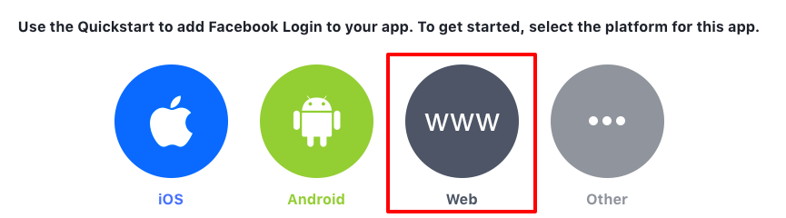
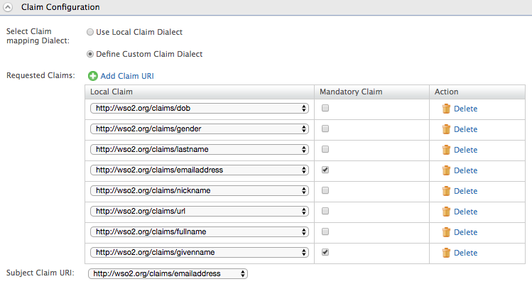

# Logging in to your application via Identity Server using Facebook Credentials

Current trends require usage of services from hundreds of websites in a
connected world. Most of these websites need the user to create an
account with them by providing a valid email address and password.
Remembering all the different user IDs and passwords that you use can be
difficult and cumbersome. To make life easier most websites now provide
the user with an option to log in using their Facebook account, Twitter
account or Google account. Since most of the internet users have one of
these accounts, it makes creating a new account an instant action.

WSO2 Identity Server enables users to log in to applications with their
Facebook account. To do that, create a Facebook app after registering as
a Facebook developer.

This topic provides instructions on how to configure the Facebook app
and the Identity Server to integrate using a sample app. See the
following sections for more information.

## Configuring the Facebook app

1.  Go to <https://developers.facebook.com/> and log in using your
    Facebook credentials.
    
2.  Click on **Create App**.  
    
    
3.  Enter a **Display Name**, Contact Email, and click **Create App
    ID**.  
    
    
4.  Enter code for security check, and click **Submit**.
5.  On Select product page, click **Set up** under **Facebook Login**.  
    
    
6.  Select **Website** as the platform for the app used in this
    sample.  
    
    
7.  Enter **`             https://localhost:9443/            `** as the
    Site URL and click **Save**.

    !!! info 
		If you have configured [WSO2 Identity Server to run using the IP or
		hostname](../../setup/running-the-product#accessing-the-management-console)
		, you need to provide the IP or hostname instead of
		`             localhost            `.

    

8.  Under Products on the left navigation panel, Click **Facebook
    Login**.

9.  You can configure the **Client OAuth Settings** on the window that
    appears.  
    

    1.  **Client OAuth Login** should be set to **Yes**.  
        Client OAuth Login is the global on-off switch for using OAuth
        client token flows. It helps to secure your application and
        prevent abuse by locking down which token redirect URIs are
        allowed.
    2.  **Web OAuth Login** should be set to **Yes**.  
        Web OAuth Login settings enables any OAuth client token flows
        that use the Facebook web login dialog to return tokens to your
        own website.
    3.  **Valid OAuth redirect URIs** should be set to
        ` https://localhost:9443/commonauth.  ` Enter the ACS URL (Assertion Consumer URL) which is the endpoint
        in WSO2 Identity Server which accepts the response sent by
        facebook.

10. Scroll down and click **Save Changes** button to save the changes.

11. Click on **Dashboard.** You can see the **App ID** and **App
    Secret** as shown in the image below. Click **Show** to view the
    **App Secret**.

	!!! info 
		**App ID** is the Client ID and the **App Secret** is the Client
		Secret in OAuth terminology. The API Version is Facebook’s API that
		is used to create the application.

    

12. Click **Settings** on the left menu and navigate to the **Basic**
    tab. Add the **App Domains** (since WSO2 IS is running on localhost,
    you can add localhost as the App Domain)

13. Click **Save Changes**.

Now you have finished configuring Facebook as an Identity Provider.

!!! info "About accessing the app"

	The app is not available to general public yet. To make to app available
	to every Facebook user, you have to submit the app for review. After a
	review, Facebook makes the app available to every Facebook user. You can
	find more information on the review process by clicking on **App
	Review** in the left navigation menu of your app's dashboard.

	The review process may take some time, so for the purposes of this
	sample, you can specify some Facebook users as Developers or Testers.
	Only the users specified here can use this app to log in with Facebook
	until the app goes public. To do this, click on **Roles** in the left
	navigation menu of the dashboard and specify the required Facebook users
	as Developers or Testers.

	

## Deploying travelocity sample application

The next step is to configure the `         travelocity.com        ` sample
app in order to use it in this scenario.

Refer to [Deploying the Sample App](../../learn/deploying-the-sample-app/#deploying-the-travelocity-webapp) for the 
instruction on deploying and configuring travelocity sample application.

Once this is done, the next step is to configure the WSO2 Identity
Server by adding a service provider and identity provider.

## Configuring the identity provider

Follow the steps given below to [add a new identity
provider](../../learn/adding-and-configuring-an-identity-provider)
in WSO2 Identity Server.

1.  Download the WSO2 Identity Server from
    [here](http://wso2.com/products/identity-server/) and [run
    it](../../setup/running-the-product).  
    Log in to the [Management
    Console](../../setup/getting-started-with-the-management-console)
    as administrator.
    
2.  In the **Identity** section under the **Main** tab of the Management
    Console, click **Add** under **Identity Providers**.
    
3.  Give a suitable name as the **Identity Provider Name**.  
    
    
4.  Go to **Facebook Configuration** under **Federated Authenticators**.

5.  Enter the following values in the form that appears:
    <table style="fixed width">
    <col width="0">
    <col width="70">
    <col width="10">
    <thead>
    <tr class="header">
    <th>Field</th>
    <th>Description</th>
    <th>Sample Value</th>
    </tr>
    </thead>
    <tbody>
    <tr class="odd">
    <td>Client Id</td>
    <td>

    
This refers to the App ID you received from the Facebook app you created.

	

	
Don't know the client ID? See more information

	
<ol>
    <li>Go to <a href="https://developers.facebook.com/">https://developers.facebook.com/</a> and log in using your Facebook credentials.</li>
    <li>Click on your app from the <strong>My Apps</strong> drop-down list. 
    You are navigated to the <strong>Dashboard</strong> of the application. Note down the App ID and the App secret.</li>
    </ol>
    

.

    
    
    </td>
    <td>

    
&lt;Application ID of the Facebook App&gt;

    
 
    

    
</td>
    </tr>
    <tr class="even">
    <td>Client Secret</td>
    <td>This refers to the App Secret you received from the Facebook app you created.</td>
    <td>&lt;App Secret of the Facebook App&gt;</td>
    </tr>
    <tr class="odd">
    <td>Scope</td>
    <td>Defines the permission to access particular information from a Facebook profile. See the <a href="https://developers.facebook.com/docs/facebook-login/permissions">Permissions Reference</a> for a list of the different permission groups in Facebook APIs.</td>
    <td>email</td>
    </tr>
    <tr class="even">
    <td>User Information Fields</td>
    <td>These are the claims related to the user account on Facebook. WSO2 Identity Server requests these fields from Facebook when a user is authenticated with Facebook through the IS. See <a href="https://developers.facebook.com/docs/facebook-login/permissions#reference-public_profile">public_profile permission</a> for more information about these fields.</td>
    <td>id,name,gender,email,first_name,last_name,age_range,link</td>
    </tr>
    <tr class="odd">
    <td>Callback Url</td>
    <td>This is the URL to which the browser should be redirected after the authentication is successful. This should be the commonauth endpoint of Identity server.</td>
    <td><a href="https://localhost:9443/commonauth">https://localhost:9443/commonauth</a></td>
    </tr>
    </tbody>
    </table>

    

6.  Select both checkboxes to **Enable Facebook Authenticator** and make
    it the **Default**.

7.  Click **Register**.

You have now added the identity provider.

## Configuring the service provider

The next step is to [configure the service
provider.](../../learn/adding-and-configuring-a-service-provider)

1.  Return to the Management Console.
    
    !!! Tip "Before You Proceed" 
        In the beginning of this guide you have
        [registered the `ravelocity.com` webapp](learn/deploying-the-sample-app/#configuring-the-service-provider_1)
        when setting up the `travelocity.com` sample. If you complete that
        you can skip steps 2 to 5 below.

2.  In the **Identity** section under the **Main** tab, click **Add**
    under **Service Providers**.
    
3.  Enter travelocity.com in the **Service Provider Name** text box and
    click **Register**.
    
4.  In the **Inbound Authentication Configuration** section, click
    **Configure** under the **SAML2 Web SSO Configuration** section and
    set the configuration as follows:
    1.  Enter the following values:

        1.	**Issuer** : travelocity.com

        2.	**Assertion Consumer URL** : http://wso2is.local:8080/travelocity.com/home.jsp

    2.  Select the following check-boxes:

        1.	Enable Response Signing

        2.	Enable Single Logout

        3.	Enable Attribute Profile

        4.	Include Attributes in the Response Always

    
    
5.  Click **Register**. Now you will be sent back to the **Service
    Providers** page.

6.  Go to the **Local and Outbound Authentication Configuration**
    section.

7.  Select the **Federated Authentication** radio button and select the
    Identity Provider you created from the dropdown list under
    **Federated Authentication**.  
    

8.  Click **Update** to save the changes.

You have now added and configured the service provider.

!!! note
    The default client-truststore.jks found in the
    `         <IS_HOME>/repository/resources/security/        ` directory
    contains the Facebook certificate by default.
    

!!! note "Related Topics"

	For more information on SSO, see [Single Sign-On](../../learn/single-sign-on).

## Configuring claim mappings for Facebook (optional)

All the basic information of a user/application is stored in the form of
claims. But for the same information, different Identity Providers(IDP)
have different claims. Therefore, there should be a proper mechanism to
map those claims within Identity Providers.

Here, we are authenticating the service provider application using
facebook IDP. Therefore we need to map FaceBook claims with our WSO2 IDP
claims.

So our next step is to configure claims in the Identity Server and map
them with Facebook.

1.  In the **Identity** section under the **Main** tab, click **List**
    under **Identity Providers**.
    
2.  Click **Edit** to edit the facebook identity provider you created.

3.  Under **Claim Configuration**, go to **Basic Claim Configuration**.
    
4.  Select the **Define Custom Claim Dialect** option under **Select
    Claim mapping Dialect**.
    
5.  Click **Add Claim Mapping.** The following screen will be
    displayed.  
    
    
6.  Now add custom claim mappings as follows.  
    
    
7.  You can retrieve all the public information of the user and the
    email address. The following are some common attribute names.

    -	id  
    -	email  
    -	name  
    -	first\_name  
    -	last\_name  
    -	link  
    -	gender  
    -	locale  
    -	age\_range

    More information is available from the following link:
    <https://developers.facebook.com/docs/facebook-login/permissions/v2.0>

    You can map these attributes to any **Local Claim URI** that is
    suitable.

8.  From the receiving claims, you can select one claim as the user
    identifier for that particular identity provider. You can configure
    this through **User ID Claim URI** (e.g., email).
9.  Click **Update** to save changes.

## Configuring requested claims for travelocity.com (optional)

Generally, the service providers need some information from the Identity
Provider side after the authentication process in order to provide their
service. To help this process we need to configure the necessary claims
on the service provider side.

For that follow the below steps:

1.  In the **Identity** section under the **Main** tab, click **List**
    under **Service Providers**.
2.  Click **Edit** to edit the travelocity.com service provider.
3.  Go to **Claim Configuration**.
4.  Click on **Add Claim URI** under **Requested Claims** to add the
    requested claims as follows. Here you should add the claims you
    mapped in the Identity Provider claim configuration. Select the
    **Mandatory Claim** checkbox for any claims that are mandatory.

    !!! info "Do only,"

		If the service provider needs any claims to be used after
		authentication process, the SP can request those claims from IDP as
		" **Requested Claims**".

    

	!!! info 
		Here, the claims which are marked as **mandatory** are requested by
		the service provider from the identity provider. If they are not
		available, the user will be redirected to a different page to
		request those mandatory claim values from the user as they are
		mandatory.

5.  **Subject Claim URI** is the unique claim which we can use to
    identify a service provider. Therefore, select a suitable claim for
    the **Subject Claim URI** such that it will become a unique
    identifier for the service provider.

6.  Click **Update** to save changes.

Now you have configured the Identity Server.

## Testing the sample

1.  To test the sample, go to the following URL:
    `                     http://wso2is.local:8080/travelocity.com                   `.  
    
    
2.  Click the link to log in with SAML from WSO2 Identity Server.

3.  You are redirected to the Facebook Login page. Enter your Facebook
    credentials and you will be taken to the home page of the
    travelocity.com app.
