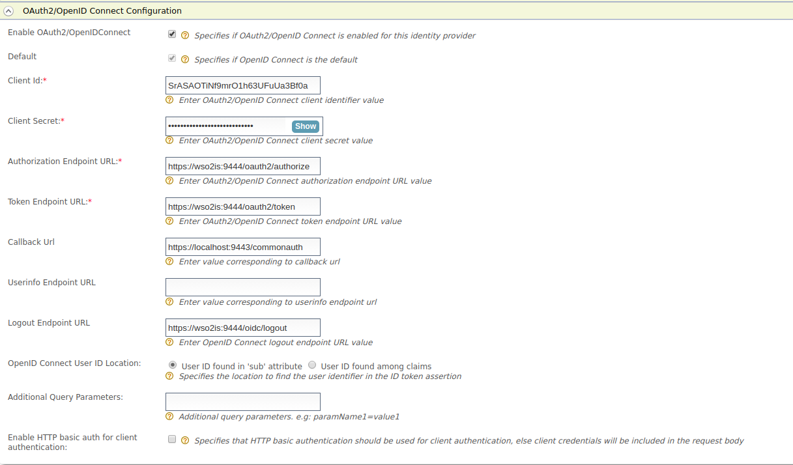

# Login to Identity Server using another Identity Server - OAuth2

This tutorial guides you through setting up two instances of WSO2
Identity Server and using one Identity Server to authenticate the user
and login to the other one.

1.  Start 2 Identity Servers. Start the 2nd Identity Server with a port
    offset of 1.  
    For more information on how to do this, see [Default Ports of WSO2
    Products](../../references/default-ports-of-wso2-products#changing-the-offset-for-default-ports)
    .
2.  Configure an OAuth/OIDC service provider in the 2nd Identity
    Server.  
    For more infomation on how to do this, see [Configuring
    OAuth2-OpenID Connect
    Single-Sign-On](../../learn/configuring-oauth2-openid-connect-single-sign-on)
    .

    Callback Url: <https://localhost:9443/commonauth>

    

3.  Create an identity provider in the first Identity Server.  
    For more information on how to do this, see [Configuring
    OAuth2-OpenID Connect](../../learn/configuring-oauth2-openid-connect).

    -   Enable OAuth2/OpenIDConnect: selected

    -   Default: selected

    -   Client Id: (client id of the service provider registered in
        second identity server)

    -   Client Secret: (client secret of the service provider registered
        in second identity server)

    -   Authorization Endpoint URL:
        <https://localhost:9444/oauth2/authorize>

    -   Token Endpoint URL: <https://localhost:9444/oauth2/token>

    -   Callback Url: <https://localhost:9443/commonauth>

       

4.  Setup the [playground sample](../../learn/deploying-the-sample-app/#deploying-the-playground2-webapp) in the
    first Identity Server instance.
5.  Edit the service provider in the first Identity Server and select
    the Federation Authentication for Authentication type in Local and
    Outbound Authentication Configuration. Then select the created
    identity provider from the dropdown menu in Federation
    Authentication.  
    
6.  Try the authorization code grant as described
    [here](../../learn/try-authorization-code-grant). You will be redirected to
    the 2nd Identity Server instead of the 1st Identity Server for
    authentication.
     
