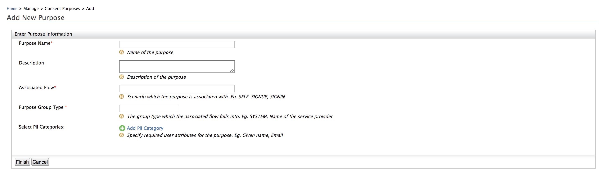
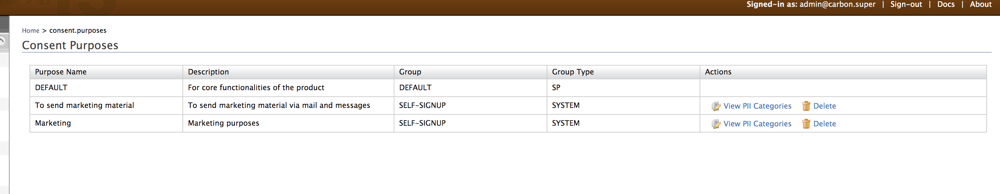

# Managing Consent Purposes

This section guides you through adding consent purposes and defining
attributes of personal user information that need to be collected and
shared by WSO2 Identity Server. The purposes defined through the
management console will be used to prompt the user to provide consent
during self sign up in WSO2 Identity Server. It can be configured
tenant-wise in which case the user will be prompted to provide consent
for the purposes and attributes relevant to the user's specific tenant
domain.

  

!!! note
    
    -   For more information on how the consent purpose is used within the
        self registration flow, see [Configuring self-registration consent
        purposes](../../learn/self-registration-and-account-confirmation)
        .
    -   Following are the definitions on the consent receipt, purposes, and PII
        categories.      
        -   **Personally Identifiable Information (PII)**: Any information that can be used to identify the PII Principal to whom the information relates to.    
        -   **PII Principal**: The natural person to whom the personally identifiable information (PII) relates to.   
        -   **Consent**: A Personally identifiable information (PII) Principal’s freely given, specific and informed agreement to the processing of their PII.   
        -   **Purpose**: The business, operational or regulatory requirement for the collection, use and/or disclosure of a PII Principal's data. In other words, it is the reason personal information is collected by the entity.
        

### Adding a consent purpose

The following steps describe how you can add a consent purpose using the
management console.

!!! info 
    Before adding the consent purposes using the Management Console, make
    sure you have the following permissions set:

    -   `            /permission/admin/manage/identity/consentmgt/add           `

    -   `            /permission/admin/manage/identity/claimmgt/metadata/view           `

1.  Sign in to the [Management
    Console](../../setup/getting-started-with-the-management-console).  
    To add a consent purpose within a specific tenant domain, login
    using tenant credentials.
2.  On the **Main** menu, click **Manage > Consent Purposes > Add**.  
       
    The following window will be displayed.

     

3.  Add a **Purpose Name** and a **Description**.

    1.  **Purpose Name:** A short name for the requirement of why the
        PII item is required.

    2.  **Description:** A short, clear explanation of why the PII item
        is required.
    
    3.  **Associated Flow:** The flow in which the user will be prompted with the PIIs, requiring consent.  

    4.  **Purpose Group Type:** The subtype of the associated flow chosen. 

    3.  **PII Categories:** In WSO2 Identity Server context, PII
        categories are the user claims. Users can give consent to share
        claims (PII categories) for different reasons. These PII
        Categories can be defined by clicking **Add PII Category** and
        selecting the relevant claim.

    
    !!! info "Sample Purpose"

        -   **Purpose Name:** Marketing

        -   **Description:** For marketing purposes

        -   **Associated Flow:** SELF-SIGNUP

        -   **Purpose Group Type:** SYSTEM

        -   **PII Categories:**
            -   http://wso2.org/claims/fullname
            -   http://wso2.org/claims/dob
            -   http://wso2.org/claims/emailaddress
            -   http://wso2.org/claims/phonenumber

4.  Click **Finish** to save the purpose.The following screen will be
    displayed:

     

### List consent purposes

The following steps describe how you can list consent purposes using the
management console.

!!! info 
    Before listing consent purposes using the Management Console, make sure
    you have the following permissions set:

    -   `            /permission/admin/manage/identity/consentmgt/list           `

    -   `            /permission/admin/manage/identity/consentmgt/view                       `

1.  Sign in to the [Management
    Console](../../setup/getting-started-with-the-management-console).
2.  On the **Main** menu, click **Manage > Consent Purposes > List**.  
     

3.  The following window will be displayed.

    !!! tip 
        The **DEFAULT** purpose listed at the top is used by the
        WSO2 IS resident identity provider (IdP) when sharing user
        attributes with external applications for the single sign-on (SSO)
        authentication flow. Basically, it is used when WSO2 IS acts as the
        IdP for SSO authentication. This **DEFAULT** purpose includes all
        the PII categories. For more information about consent management
        with single sign on, see [Consent Management with single sign on](../../learn/consent-management-with-single-sign-on)

     

4.  You can delete a purpose by clicking **Delete**. You can also view
    the PII categories associated with the **Purpose** by clicking
    **View PII Categories** in the **Action** column. The following
    window will be displayed when you click **View PII Categories.**

    

    !!! tip "Deleting PII Category"
    
        To delete a specific PII cateogry, use the consent management [Delete PII Category REST API](https://docs.wso2.com/display/IS590/apidocs/Consent-management-apis/index.html#!/operations#PIICategory#consentsPiiCategoriesPiiCategoryIdDelete). Note that you can not delete a PII category that is already
        associated with a consent receipt.
    
