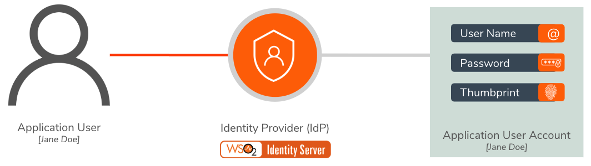

# Managing User Accounts

A **user account** is the digital representation of a physical user who interacts with an application. It is an entity that comprises the private information such as the user name and password of a user. 

    

WSO2 Identity Server enables the following user account management features:

-	[User Registration](../../learn/user-registration)
-	[Password Policies](../../learn/configuring-password-policies)
-	[Password Reset](../../learn/configuring-password-reset)
-	[User Name Recovery](../../learn/configuring-user-name-recovery/)
-	[Account Locking](../../learn/configuring-account-locking/) 
-	[Account Disabling](../../learn/configuring-account-disabling)

!!! note

	To learn about how to create users and roles, see [Adding Users and Roles](../..//learn/adding-users-and-roles/). 
