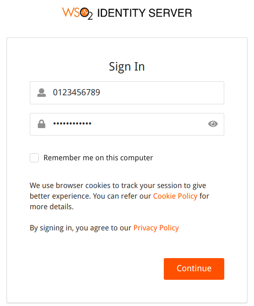

# Multi Attribute Login

WSO2 Identity Server can be configured to use multiple attributes as the login identifier. 
By default, WSO2 Identity server uses the username as the login identifier.  First, you need to
configure WSO2 identity server for multi attribute authentication. The following section explains
how to configure this.

## Configuring WSO2 IS for Multi Attribute Login

1.  Log in to the [WSO2 Identity Server Management Console](`https://<IS_HOST>:<PORT>/carbon`) using your 
    tenant credentials.

    !!! info
        'admin' is the default administrative user in WSO2 Identity Server.
   
    !!! info
        If you use multiple tenant domains, you need to configure the multi attribute login tenant-wise.

2.  Click **Main** > **Identity Providers** > **Resident** and expand the **Account Management** section.

3.  Expand **Multi Attribute Login** and select **Enable Multi Attribute Login**.

4.  Add claim URIs which allow for multi-attribute login in the given text box.

    

5. Add Regular Expression for Allowed Claims.

    Once you have configured WSO2 Identity Server for multi attribute login, you need to provide regular expression 
    for the allowed claims.
    Some claims have a default regex. If they don't, you need to provide it.

    1.  Open the WSO2 Identity Server Management Console. 
    2.  In the **Main** menu, click **List** under **Claims**.
    3.  Select the claim you want to provide the regular expression for and click **Edit**.
    4.  Enter the regex pattern under the **Regular Expression** field.
    5.  Click **Update** to save the changes.

    

    Here are a few examples for regex patterns.

    | Claim URI                           | Example Regex pattern    |
    |-------------------------------------|-----------------------------------------------------------------|
    | http://wso2.org/claims/emailaddress | ^([a-zA-Z0–9_\.\-])+\@(([a-zA-Z0–9\-])+\.)+([a-zA-Z0–9]{2,4})+$ |
    | http://wso2.org/claims/mobile       | ^(\+\d{1,2}\s?)?1?\-?\.?\s?\(?\d{3}\)?[\s.-]?\d{3}[\s.-]?\d{4}$ |
    | http://wso2.org/claims/username     | ^[a-zA-Z0–9._-]{3,}$                                            |

You have now successfully set up WSO2 Identity Server to enable multi-attribute login.

## Using Multi Attribute login
After configuring the multi attribute login in WSO2 IS, the users can use any of the configured attributes to login. 

**Example:** Allow users to user the mobile number as the login identifier.

1. Configure Multi Attribute login for `http://wso2.org/claims/mobile` claim.
2. Go to the My Account URL: (`https://localhost:9443/myaccount`).
3. Enter mobile number as the login identifier and click **Continue**.

### Supported flows
This feature is supported via the following flows. So you can use multi attribute login feature
using any of following flow.

1. Identifier first authenticator
2. Basic Authenticator
3. Request path authenticator
4. Authentication REST APIs
5. Oauth Password grant
6. Password recovery flow

!!! Note "What happens if two users use the same value for the same claim?"
    If two users use the same value for the same claim, the multi attribute login feature
    does not support those claims for those users. Retaining the uniqueness of claim values avoids this conflict.

!!! Note "Using email address as the login attribute for super tenant users"
    For the super tenant users who are using the email address as a login attribute need to append the tenant domain 
    to the email address (Ex: `john@wso2.com@caron.super`) when login to a SaaS application.

!!! info "Related Topics"
    See the [Configuring Uniqueness of Claims](../../learn/configuring-uniqueness-of-claims) topic for more information.
