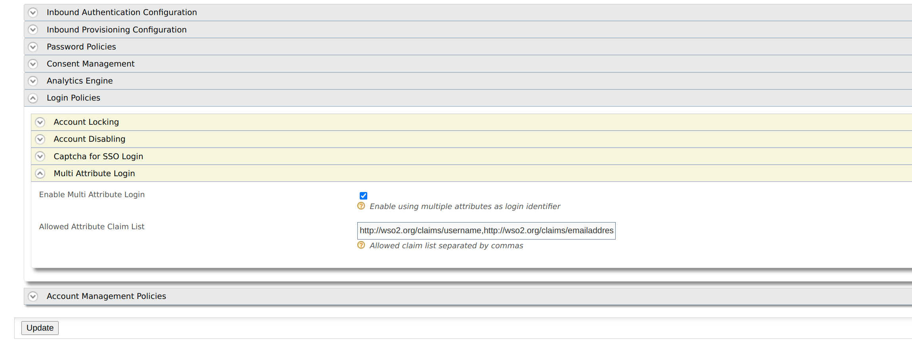

# Multi Attribute Login

WSO2 Identity Server can be configured to use multiple attributes as the login identifier. 
By default, WSO2 Identity server uses the username as the login identifier.  First, you need to
configure WSO2 identity server for multi attribute authentication. The following section explains
how to configure this.

## Configuring WSO2 IS for Multi Attribute Login

1. Start the Identity Server and log in to the [Management Console](https://localhost:9443/carbon) using your tenant credentials.

   !!! info
       'admin' is the default administrative user in WSO2 Identity Server.
   
   !!! info
       If you use multiple tenant domains, you need to configure the multi attribute login tenant-wise.

2. Click **Main** > **Identity Providers** > **Resident**  and expand the **Account Management** section.

3. Expand **Multi Attribute Login** and select **Enable Multi Attribute Login**.

4. Then add claim URIs which allow for multi-attribute login in the given text box.

   

5. Add Regular Expression for Allowed Claims. 

   Once you have configured WSO2 Identity Server for multi attribute login, you need to provide regular expression for multi attribute allowed claims. Some claims already have a default regex, if not you need to provide it under the claim edit window.
   Select claim from claim list and open the Edit window. Then enter the Regex pattern under Regular Expression field.
   
   

   Here are a few examples for regex patterns.
   
    <table>
        <thead>
            <tr class="header">
                <th>Claim URI</th>
                <th>Example Regex pattern</th>
            </tr>
        </thead>
        <tbody>
            <tr class="odd">
                <td>http://wso2.org/claims/emailaddress</td>
                <td>^([a-zA-Z0–9_\.\-])+\@(([a-zA-Z0–9\-])+\.)+([a-zA-Z0–9]{2,4})+$</td>
            </tr>
            <tr class="even">
                <td>http://wso2.org/claims/telephone</td>
                <td>^(\+\d{1,2}\s?)?1?\-?\.?\s?\(?\d{3}\)?[\s.-]?\d{3}[\s.-]?\d{4}$</td>
            </tr>
            <tr class="odd">
                <td>http://wso2.org/claims/username</td>
                <td>^[a-zA-Z0–9._-]{3,}$</td>
            </tr>
        </tbody>
    </table>

You have now successfully set up WSO2 Identity Server to enable multi-attribute login.

### Try it out

This feature is supported via the following flows. So you can try multi attribute login feature 
using any of following flow. 

1. Identifier first authenticator
2. Basic Authenticator
3. Request path authenticator
4. Authentication REST APIs
5. Oauth Password grant
6. Password recovery flow

!!! Note "What happens if two users use the same value for the same claim?"

   If two users use the same value for the same claim, the multi attribute login feature
   does not support those claims for those users. Retaining the uniqueness of claim values avoids this conflict.

!!! info "Related Topics"
    See the [Configuring Uniqueness of Claims](../../learn/configuring-uniqueness-of-claims) topic for information on configuring uniqueness of claims.
