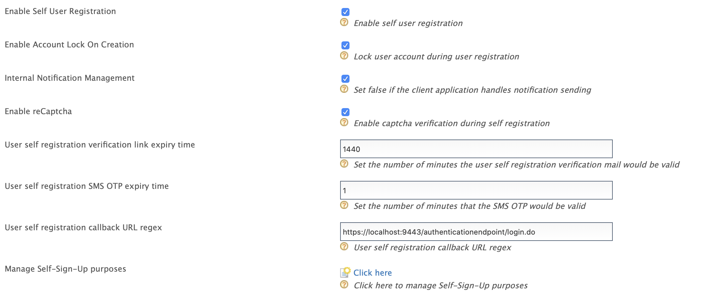

# User Self Registration and Account confirmation via Mobile and Email Channels

WSO2 Identity Server (WSO2 IS) supports self-registration to allow users
set up their account and receive confirmation when the account is
created.

When a user self-registers, the self-registration process creates the
user account and locks the account until the user confirms account
ownership via a confirmation mail or a SMS One Time Password(OTP) that WSO2 IS sends.


If a user does not confirm account ownership before the specified expiry
period, the user account is locked assuming that the expired account is
not owned by the creator. If necessary, the system administrator can
delete such accounts to manage resources better.

!!! Note
    This feature is only available via the Self Registration and Account confirmation REST APis. 
    Currently, WSO2 IS does not support this feature via the End User Dashboard.
    
    For more information about the feature, see [Extended Self Registration API and Account Confirmation API](../.
    ./learn/extended-self-registration-api-and-account-confirmation-api)

The following sections walk you through configuring and trying out
self-registration via SMS and Email Channels.
    
??? Warning "If you have migrated from a previous IS version"
    If you have migrated from a previous IS version, ensure that the `IdentityMgtEventListener` with the
    `         orderId=50        ` is set to **false** and that the Identity
    Listeners with `         orderId=95        ` and
    `         orderId=97        ` are set to **true** in the
    `         <IS_HOME>/repository/conf/deployment.toml        ` file.
   
    !!! Note 
        You can skip this step if there are no entries for `event.default_listener.xxx`, in 
        the `deployment.toml` file.
    
    
    ``` java
    [event.default_listener.identity_mgt]
    priority= "50"
    enable = false
    [event.default_listener.governance_identity_mgt]
    priority= "95"
    enable = true
    [event.default_listener.governance_identity_store]
    priority= "97"
    enable = true
    ```
    
## Configuring self-registration

Follow the steps given below to register users for the super tenant,
which is `         carbon.super        `.

1.  Add the following properties to the `deployment.toml` file in the `IS_HOME/repository/conf` folder to 
configure the the identity server to send confirmation emails.
    
    !!! Note
        You need to add this configuration only if you wish to configure WSO2 IS to send confirmation 
        emails. Alternatively, you can use your own email managing mechanism.

    ``` toml
    [output_adapter.email]
    from_address= "wso2iamtest@gmail.com"
    username= "wso2iamtest"
    password= "Wso2@iam70"
    hostname= "smtp.gmail.com"
    port= 587
    enable_start_tls= true
    enable_authentication= true
    ```    
    
2. Add the following properties to the `deployemnt.toml` to configure notification handling and 
self registration to support multiple notification channels.

    ```toml
    [identity_mgt.notification]
    default_notification_channel = "EMAIL"
    resolve_notification_channel = true
    
    [identity_mgt.user_self_registration]
    enable_account_lock_for_verified_preferred_channel = false
    enable_detailed_api_response = true
    ```    
    
    <table>
    <tr>
        <th>Property Name</th>
        <th>Functionality</th>
    </tr>
    <tr>
    <td>default_notification_channel</td>
    <td>
        <ul>
            <li>Default notification channel. If the user has not specified a notification channel
            user will be notified via the defined channel.</li>
            <div class="admonition warning">
                <p class="admonition-title">warning</p>
                <p>
                    Currently, WSO2 IS supports **SMS** and **EMAIL** as Internal Notification channels.
                    **DO NOT** change the values since they are case sensitive. Changing the case will
                    lead to Errors. 
                </p>
            </div>
            <li>By default this value is set to <code>EMAIL</code>.</li>
        </ul>
    </td>
    </tr>
    <tr>
    <td>resolve_notification_channel</td>
    <td>
        <ul>
        <li>Enable server to determine whether to send notifications via a SMS or an email.</li> 
        <li>Disabling this property would send notifications via the channel defined by 
        <code>default_notification_channel</code>.</li>
        </ul> 
    </td>
    </tr>
    <tr>
    <td>enable_account_lock_for_verified_preferred_channel</td>
    <td>
        <ul>
            <li>Allows a user to skip account confirmation if the user is already veirifed.</li>
            <div class="admonition warning">
                <p class="admonition-title">Warning</p>
                <p>
                    WSO2 recommends verifying users after self registration rather than 
                    using pre-verified user self registration. Therefore, it is recommended 
                    to set the property to <code>true</code>. 
                </p>
            </div>
        </ul>
    </td>
    </tr>
    <tr>
    <td>enable_detailed_api_response</td>
    <td>
        <ul>
            <li>Enable detailed API response body.</li> 
            <li>By default this value is set to <code>false</code>.</li>
        <ul>
    </td>
    </tr>
    </table>

3.  Add an event publisher to `<IS_HOME/repository/deployment/server/eventpublishers`. For this 
sample, `http output adapter` is used. Following is a sample publisher to call a REST Service 
to send confirmation codes.

    ??? info "Sample Event Publisher"
        ```
        <?xml version="1.0" encoding="UTF-8"?>
        <eventPublisher name="HTTPOutputEventAdapter" processing="enable"
            statistics="disable" trace="disable" xmlns="http://wso2.org/carbon/eventpublisher">
            <from streamName="id_gov_sms_notify_stream" version="1.0.0"/>
            <mapping customMapping="enable" type="json">
                <inline>{"api_key"="4c9374",
                    "api_secret"="FtqyPggE93",
                    "from"="NEXMO",
                    "to"={{mobile}},
                    "text"={{body}}
                    }</inline>
            </mapping>
            <to eventAdapterType="http">
                <property name="http.client.method">httpPost</property>
                <property name="http.url">https://rest.nexmo.com/sms/json</property>
            </to>
        </eventPublisher>
        ``` 
        
        !!! note
            This publisher uses NEXMO as the SMS REST service provider. For more information 
            on writing a custom http event publisher, see [HTTP Event Publisher](https://docs.wso2.com
            /display/DAS300/HTTP+Event+Publisher).   
        
4.  [Start WSO2 IS](../../setup/running-the-product#starting-the-server)
    and [log in to the management console](../../setup/running-the-product#accessing-the-management-console)
    : ` https://<IS_HOST>:<IS_PORT>/carbon `.  
    **NOTE:** If your IS is already running, make sure to restart to apply above configurations. 

5.  Navigate to **Main** -> **Identity Providers** -> **Resident** -> **Account 
Management Policies** section.
    
6.  Expand the **User Self Registration** section and configure the
    following properties.    
    
    
    
    <table>
        <thead>
            <tr class="header">
                <th>Field</th>
                <th>Description</th>
            </tr>
        </thead>
        <tbody>
            <tr class="odd">
                <td>Enable Self User Registration</td>
                <td>Enable self registration.</td>
            </tr>
            <tr class="even">
                <td>Enable Account Lock On Creation Enabled</td>
                <td>Enable account lock during self registration. The account will be unclocked 
                upon confirmation.</td>
            </tr>
            <tr class="odd">
                <td>Enable Notification Internally Management</td>
                <td>
                    <p>
                        Select to configure Identity server to send confirmation emails to the user.
                        If the client application handles notification sending already, unselect it. 
                    </p>
                </td>
            </tr>
            <tr class="even">
                <td>Enable reCaptcha</td>
                <td>Select to enable reCaptcha for self-registration. 
                See <a href="../../learn/configuring_google_recaptcha_for_security_question_based_password_recovery">
                Configuring Google reCaptcha for Security-Question Based Password Recovery</a> for more information.</td>
            </tr>
            <tr class="odd">
                <td>User self registration verification link expiry time.</td>
                <td>
                    <div class="content-wrapper">
                    <p>Number of minutes that the confirmation link would be valid. The confirmation link 
                    will expire after the specified time has elapsed.</p>
                        <div class="admonition note">
                        <p class="admonition-title">Note</p>
                        <p>Alternatively, you can configure the expiry time from the <code>deployment.toml</code>  file.</p>
                        <p>
                            <code>
                            [identity_mgt.user_self_registration]<br>
                            allow_self_registration= true<br> 
                            expiry_time="1440"
                            </code>
                        </p>
                        </div> 
                    </div>
                </td>
            </tr>
            <tr class="even">
                <td>User self registration SMS OTP expiry time</td>
                <td>
                    <ul>
                        <li>User self registration verification link expiry time.</li>
                        <li>The <b>default and minimum</b> value is <code>1</code> minute.
                    <ul>
                </td>
            </tr>
        </tbody>
        </table>
        
## Manage notification templates

### Manage EMAIL Notification templates

The email notification templates are stored in the `IS_HOME>/repository/conf/email/email-admin-config.xml` 
file and they can be edited using the Management Console.

!!! tip
    The **AccountConfirmation** template is used to send email notifications.You can edit and 
    customize the email template. For more information, 
    see [Customizing Automated Emails](../../learn/customizing-automated-emails).

### Manage SMS Notification templates 
    
The templates for SMS notifications are stored in the registry. You can edit the default template using the 
management console or using the configuration files.

!!! tip
    The **accountconfirmation**, template is used to send SMS notifications. You can edit and customize the SMS 
    template. For more information, 
    see [Managing SMS Notification Templates From the Registry](../../learn/managing-sms-templates-from-the-registry).
                    
## Configuring self-registration consent purposes
    
For more details see, 
[Configuring self-registration consent purposes](../.
./learn/self-registration-and-account-confirmation/#configuring-self-registration-consent-purposes).

## Try out self-registration  

WSO2 Identity Server provides the functionality to confirm the user account internally or externally.

!!! tip "Before you begin"
    Complete the steps given above before trying out self-registration.

1. **Internal Notification Management** : Notification sending for account confirmation is managed 
by WSO2 Identity Server.
    
2. **External Notification Management** : Notification sending and confirming the registration flow 
to WSO2 Identity Server is managed by an external notification management mechanism.

!!! note
    To configure external notification management, `disable` the property `Enable Notification 
    Internally Management` using the self registration configurations.
    
    
    
### **Self Registration with Internal Notification Management** 


1. Use the following command to create a user self-registration request. 
    
    ``` tab="If the preferred channel is EMAIL" 
    curl -X POST -H "Authorization: Basic YWRtaW46YWRtaW4=" -H "Content-Type: application/json" -d '{"user": {"username": "kim","realm": "PRIMARY", "password": "Password12!","claims": [{"uri": "http://wso2.org/claims/givenname","value": "kim" },{"uri": "http://wso2.org/claims/emailaddress","value": "kim.anderson@gmail.com"},{"uri": "http://wso2.org/claims/identity/preferredChannel","value": "EMAIL"},{"uri": "http://wso2.org/claims/lastname","value": "Anderson"},{"uri": "http://wso2.org/claims/mobile","value": "947721584558"} ] },"properties": []}' "https://localhost:9443/api/identity/user/v1.0/me"
    ```
    
    ``` tab="If the Preferred channel is SMS" 
    curl -X POST -H "Authorization: Basic YWRtaW46YWRtaW4=" -H "Content-Type: application/json" -d '{"user": {"username":"kim","realm": "PRIMARY", "password": "Password12!","claims": [{"uri": "http://wso2.org/claims/givenname","value": "kim" },{"uri": "http://wso2.org/claims/emailaddress","value": "kim.anderson@gmail.com"},{"uri": "http://wso2.org/claims/identity/preferredChannel","value": "SMS"},{"uri": "http://wso2.org/claims/lastname","value": "Anderson"},{"uri": "http://wso2.org/claims/mobile","value": "94774747551"} ] },"properties": []}' "https://localhost:9443/api/identity/user/v1.0/me"
    ```
    
    !!! note
        For more information, see 
        [API Requests and Responses](.././learn/extended-self-registration-api-and-account-confirmation-api/#api-requests-and-responses).
   
2.  Following response will be returned by the API.

    ``` tab="Preferred channel as EMAIL" 
    {
        "code":"USR-02001",
        "message":"Successful user self registration. Pending account verification.",
        "notificationChannel":"EMAIL",
        "confirmationCode":null
    } 
    ```
    
    ``` tab="Preferred channel as SMS" 
    {
        "code":"USR-02001",
        "message":"Successful user self registration. Pending account verification.",
        "notificationChannel":"SMS",
        "confirmationCode":null
    } 
    ```
    
    !!! Note
        - If the preferred channel has not been specified in the request, the server will 
        decide which notification channel to use. If the `resolve_notification_channel` 
        property is set to `true`, the notification channel that was used will be returned 
        in the response with the `notificationChannel` parameter.
        
        - **NOTE:** If the above property is not enabled the user will be notified via 
        the channel specfied by `default_notification_channel` 
        proerty in `deployment.toml`.
        
        - For more information, see [Notification channel selection criteria](../.
        ./learn/extended-self-registration-api-and-account-confirmation-api/#notification-channel-selection-criteria).
        
3. If the notification channel is **EMAIL**, access the relevant email account and and click 
the button or the confirmation link. Then the user account will be unlocked.

    !!! Note
        If you have not provided a `callback` in the properties of the self registration 
        request, you will not be navigated to the user dashboard.
        
4. If the notification channel is **SMS**, the user will receive an OTP (One-Time-Password). 
Use the following command to confirm the user account.

    ```curl
    curl -k -v -X POST -H "Authorization: Basic YWRtaW46YWRtaW4=" -H  "Content-Type: application/json" -d '{ "code": "SBH3F3","properties": []}' "https://localhost:9443/api/identity/user/v1.0/validate-code"
    ```
    
### **Self Registration with External Notification Management**

1. Use the following command to create a user self-registration request. 
    
    ``` tab="If the preferred channel is EMAIL" 
    curl -X POST -H "Authorization: Basic YWRtaW46YWRtaW4=" -H "Content-Type: application/json" -d '{"user": {"username": "kim","realm": "PRIMARY", "password": "Password12!","claims": [{"uri": "http://wso2.org/claims/givenname","value": "kim" },{"uri": "http://wso2.org/claims/emailaddress","value": "kim.anderson@gmail.com"},{"uri": "http://wso2.org/claims/identity/preferredChannel","value": "EMAIL"},{"uri": "http://wso2.org/claims/lastname","value": "Anderson"},{"uri": "http://wso2.org/claims/mobile","value": "947721584558"} ] },"properties": []}' "https://localhost:9443/api/identity/user/v1.0/me"
    ```
    
    ``` tab="If the Preferred channel is SMS" 
    curl -X POST -H "Authorization: Basic YWRtaW46YWRtaW4=" -H "Content-Type: application/json" -d '{"user": {"username":"kim","realm": "PRIMARY", "password": "Password12!","claims": [{"uri": "http://wso2.org/claims/givenname","value": "kim" },{"uri": "http://wso2.org/claims/emailaddress","value": "kim.anderson@gmail.com"},{"uri": "http://wso2.org/claims/identity/preferredChannel","value": "SMS"},{"uri": "http://wso2.org/claims/lastname","value": "Anderson"},{"uri": "http://wso2.org/claims/mobile","value": "94774747551"} ] },"properties": []}' "https://localhost:9443/api/identity/user/v1.0/me"
    ```
    !!! note
        For more information, see 
        [API Requests and Responses](.././learn/extended-self-registration-api-and-account-confirmation-api/#api-requests-and-responses).

2.  Following response will be returned by the API.     
    
    ```
    {
    "code":"USR-02002",
    "message":"Successful user self registration. Pending External verification.",
    "notificationChannel":"EXTERNAL",
    "confirmationCode":"64928c66-18c2-4092-923b-fb8ce10eeccc"
    }
    ```
   
    !!! note
        Note that a confirmation code has been returned by the API. This code needs to be used 
        to confirm the self registration flow.
        
3. Verify the user via an external mechanism.

4. To confirm the verification flow, use the following command.

    ```curl
    curl -k -v -X POST -H "Authorization: Basic YWRtaW46YWRtaW4=" -H  "Content-Type: application/json" -d '{ "code": "84325529-8aa7-4851-8751-5980a7f2d9f7","verifiedChannel":{"type":"SMS", "claim":"http://wso2.org/claims/mobile"},"properties": []}' "https://localhost:9443/api/identity/user/v1.0/validate-code"
    ```
    
    !!! note
        Note that you can specify the externally verified channel in the request by entering 
        the channel name and the value claim associated to it.
        
        <table>
            <tr>
                <th>Notification Channel</th>
                <th>Value Claim</th>
            </tr>
            <tr>
                <td>SMS</td>
                <td>http://wso2.org/claims/mobile</td>
            </tr>
            <tr>
                <td>EMAIL</td>
                <td>http://wso2.org/claims/emailaddress</td>
            </tr>
        </table>
        
        !!! warning
            If the verified channel is not specified, **EMAIL** will be considered as the 
            verified notification channel for the user.      
