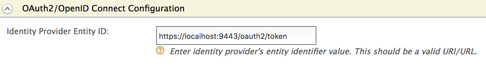

# OpenID Connect Discovery

WSO2 Identity Server supports [OpenID Connect
Discovery](https://openid.net/specs/openid-connect-discovery-1_0.html)
to discover an end user's OpenID provider, and also to obtain
information required to interact with the OpenID provider, including its
OAuth 2.0 endpoint locations. For more information, see
[IssuerDiscovery](https://openid.net/specs/openid-connect-discovery-1_0.html#IssuerDiscovery)
.

The OpenID Connect discovery endpoint is as follows:

``` java
https://localhost:9443/.well-known/oidcdiscovery
```

The following sections provide information and instructions on the
following:

### OpenID Provider Issuer discovery

OpenID Provider Issuer discovery refers to the process of determining
the location of the OpenID Provider.

!!! tip     
    In WSO2 Identity Server, the default OpenID Provider Issuer location
    path is set to
    `         oidcdiscovery/.well-known/openid-configuration        ` .
    
    To move the OpenID provider issuer location path to the root
    `         <issuer>/.well-known/openid-configuration        `, add the following configuration to the `         <IS_HOME>/repository/conf/deployment.toml        ` file.
    
    ``` java
    [oauth.endpoints]
    oidc_discovery_url= "${carbon.protocol}://${carbon.host}:${carbon.management.port}/oauth2/token</"
    ```


##### Configuring the OpenID Provider Issuer location

In WSO2 Identity Server, the resident IdP Entity ID for OpenID Connect
can be configured as the OpenID Provider Issuer location. Follow the
instructions given below to configure the OpenID Provider Issuer
location.

1.  Add the following property to the `            deployment.toml         ` file found in the
    `            <IS_HOME>/repository/conf/          ` folder.

    ``` java
    [oauth]
    use_entityid_as_issuer_in_oidc_discovery= "true"
    ```

    !!! warning
        In future releases, the Entity ID will be used as the OpenID
        Provider Issuer location by default and will not need to be enabled
        manually using the property mentioned above. Therefore, the
        `            use_entityid_as_issuer_in_oidc_discovery           `
        property will be deprecated in the next release.
    

2.  Log in to the management console.

3.  Click **Resident** under **Identity Providers** on the **Main** tab.
4.  Expand the **Inbound Authentication Configuration** section and then
    expand OAuth2/OpenID Connect Configuration.
5.  Enter a valid OpenID Provider issuer location as the **Identity
    Provider Entity Id** value.  
     

    !!! tip
        A valid OpenID Provider Issuer location in WSO2 Identity Server has
        the following format.
    
        **OpenID Provider Issuer URL format**
    
        ``` java
        <Host>/oauth2/{issuer}
        ```

    -   **\<Host\>:** The host number of WSO2 Identity Server (e.g.,
        [https://localhost:9443](https://localhost:9443/) )

    -   **{issuer}:** The issuer path component. This value can be
        either ‘token’ or ‘oidcdiscovery’.

    **Sample OpenID Provider Issuer location**

    ``` java
    https://localhost:9443/oauth2/token
    ```


### Obtaining the OpenID Provider Issuer location

Once the issuer location has been configured as instructed in the
previous section, you can send a request to the endpoint to obtain the
configured OpenID Provider Issuer location.

The following information is required to make a request.

<table>
<thead>
<tr class="header">
<th>Parameter</th>
<th>Description</th>
<th>Sample Value</th>
</tr>
</thead>
<tbody>
<tr class="odd">
<td>Resource</td>
<td>Identifier for the target end user that is the subject of the discovery request.</td>
<td>acct:admin@localhost (for super tenant)<br />
acct:admin@ wso2.com@localhost (for tenant)</td>
</tr>
<tr class="even">
<td>HostServer</td>
<td>Where the WebFinger service is hosted.</td>
<td>localhost</td>
</tr>
<tr class="odd">
<td>rel</td>
<td>URI identifying the type of service whose location is being requested.</td>
<td>http://openid.net/specs/connect/1.0/issuer</td>
</tr>
</tbody>
</table>


Sample requests and responses are given below:

<table>
<tbody>
<tr class="odd">
<td>Request (for super tenant)</td>
<td><div class="content-wrapper">
<div class="code panel pdl" style="border-width: 1px;">
<div class="codeHeader panelHeader pdl" style="border-bottom-width: 1px;">
<strong>Sample Request</strong>
</div>
<div class="codeContent panelContent pdl">
<div class="sourceCode" id="cb1" data-syntaxhighlighter-params="brush: java; gutter: false; theme: Confluence" data-theme="Confluence" style="brush: java; gutter: false; theme: Confluence"><pre class="sourceCode java"><code class="sourceCode java"><a class="sourceLine" id="cb1-1" title="1">curl -v -k https:<span class="co">//localhost:9443/.well-known/webfinger?resource=&#39;acct:admin@localhost&amp;rel=http://openid.net/specs/connect/1.0/issuer&#39;</span></a></code></pre></div>
</div>
</div>
</div></td>
</tr>
<tr class="even">
<td>Response (for super tenant)</td>
<td><div class="content-wrapper">
<div class="code panel pdl" style="border-width: 1px;">
<div class="codeContent panelContent pdl">
<div class="sourceCode" id="cb2" data-syntaxhighlighter-params="brush: java; gutter: false; theme: Confluence" data-theme="Confluence" style="brush: java; gutter: false; theme: Confluence"><pre class="sourceCode java"><code class="sourceCode java"><a class="sourceLine" id="cb2-1" title="1">{</a>
<a class="sourceLine" id="cb2-2" title="2">   <span class="st">&quot;subject&quot;</span>: <span class="st">&quot;acct:admin@localhost&quot;</span>,</a>
<a class="sourceLine" id="cb2-3" title="3">   <span class="st">&quot;links&quot;</span>: [</a>
<a class="sourceLine" id="cb2-4" title="4">      {</a>
<a class="sourceLine" id="cb2-5" title="5">         <span class="st">&quot;rel&quot;</span>: <span class="st">&quot;http://openid.net/specs/connect/1.0/issuer&quot;</span>,</a>
<a class="sourceLine" id="cb2-6" title="6">         <span class="st">&quot;href&quot;</span>: <span class="st">&quot;https://localhost:9443/oauth2/token&quot;</span></a>
<a class="sourceLine" id="cb2-7" title="7">      }</a>
<a class="sourceLine" id="cb2-8" title="8">   ]</a>
<a class="sourceLine" id="cb2-9" title="9">}</a></code></pre></div>
</div>
</div>
</div></td>
</tr>
<tr class="odd">
<td>Request (for tenant: <a href="http://wso2.com">wso2.com</a> )</td>
<td><div class="content-wrapper">
<div class="code panel pdl" style="border-width: 1px;">
<div class="codeHeader panelHeader pdl" style="border-bottom-width: 1px;">
<strong>Sample Request</strong>
</div>
<div class="codeContent panelContent pdl">
<div class="sourceCode" id="cb3" data-syntaxhighlighter-params="brush: java; gutter: false; theme: Confluence" data-theme="Confluence" style="brush: java; gutter: false; theme: Confluence"><pre class="sourceCode java"><code class="sourceCode java"><a class="sourceLine" id="cb3-1" title="1">curl -v -k https:<span class="co">//localhost:9443/.well-known/webfinger?resource=&#39;acct:admin%40wso2.com@localhost&amp;rel=http://openid.net/specs/connect/1.0/issuer&#39;</span></a></code></pre></div>
</div>
</div>
</div></td>
</tr>
<tr class="even">
<td>Response (for tenant: <a href="http://wso2.com">wso2.com</a> )</td>
<td><div class="content-wrapper">
<div class="code panel pdl" style="border-width: 1px;">
<div class="codeContent panelContent pdl">
<div class="sourceCode" id="cb4" data-syntaxhighlighter-params="brush: java; gutter: false; theme: Confluence" data-theme="Confluence" style="brush: java; gutter: false; theme: Confluence"><pre class="sourceCode java"><code class="sourceCode java"><a class="sourceLine" id="cb4-1" title="1">{</a>
<a class="sourceLine" id="cb4-2" title="2">   <span class="st">&quot;subject&quot;</span>: <span class="st">&quot;acct:admin@wso2.com@localhost&quot;</span>,</a>
<a class="sourceLine" id="cb4-3" title="3">   <span class="st">&quot;links&quot;</span>: [</a>
<a class="sourceLine" id="cb4-4" title="4">      {</a>
<a class="sourceLine" id="cb4-5" title="5">         <span class="st">&quot;rel&quot;</span>: <span class="st">&quot;http://openid.net/specs/connect/1.0/issuer&quot;</span>,</a>
<a class="sourceLine" id="cb4-6" title="6">         <span class="st">&quot;href&quot;</span>: <span class="st">&quot;https://localhost:9443/t/wso2.com/oauth2/token&quot;</span></a>
<a class="sourceLine" id="cb4-7" title="7">      }</a>
<a class="sourceLine" id="cb4-8" title="8">   ]</a>
<a class="sourceLine" id="cb4-9" title="9">}</a></code></pre></div>
</div>
</div>
</div></td>
</tr>
</tbody>
</table>

### Obtaining the OpenID Provider configuration information

Follow the instructions below to obtain configuration details of the
OpenID Proivder.

1.  Once you receive the response as shown in the sample response of the
    previous section, append "
    `           /.well-known/openid-configuration"          ` to the
    href value that you received.

    ``` java
    https://localhost:9443/oauth2/token/.well-known/openid-configuration
    ```

2.  Send a request to the endpoint as shown below.

    <table>
    <tbody>
    <tr class="odd">
    <td>Request</td>
    <td><div class="content-wrapper">
    <div class="code panel pdl" style="border-width: 1px;">
    <div class="codeHeader panelHeader pdl" style="border-bottom-width: 1px;">
    <strong>Sample Request</strong>
    </div>
    <div class="codeContent panelContent pdl">
    <div class="sourceCode" id="cb1" data-syntaxhighlighter-params="brush: java; gutter: false; theme: Confluence" data-theme="Confluence" style="brush: java; gutter: false; theme: Confluence"><pre class="sourceCode java"><code class="sourceCode java"><a class="sourceLine" id="cb1-1" title="1">curl -v -k https:<span class="co">//localhost:9443/oauth2/token/.well-known/openid-configuration</span></a></code></pre></div>
    </div>
    </div>
    </div></td>
    </tr>
    <tr class="even">
    <td>Response</td>
    <td><div class="content-wrapper">
    <div class="code panel pdl" style="border-width: 1px;">
    <div class="codeHeader panelHeader pdl" style="border-bottom-width: 1px;">
    <strong>Sample Response</strong>
    </div>
    <div class="codeContent panelContent pdl">
    <div class="sourceCode" id="cb2" data-syntaxhighlighter-params="brush: java; gutter: false; theme: Confluence" data-theme="Confluence" style="brush: java; gutter: false; theme: Confluence"><pre class="sourceCode java"><code class="sourceCode java"><a class="sourceLine" id="cb2-1" title="1">{</a>
    <a class="sourceLine" id="cb2-2" title="2">    <span class="st">&quot;scopes_supported&quot;</span>: [</a>
    <a class="sourceLine" id="cb2-3" title="3">        <span class="st">&quot;address&quot;</span>,</a>
    <a class="sourceLine" id="cb2-4" title="4">        <span class="st">&quot;phone&quot;</span>,</a>
    <a class="sourceLine" id="cb2-5" title="5">        <span class="st">&quot;email&quot;</span>,</a>
    <a class="sourceLine" id="cb2-6" title="6">        <span class="st">&quot;profile&quot;</span>,</a>
    <a class="sourceLine" id="cb2-7" title="7">        <span class="st">&quot;openid&quot;</span></a>
    <a class="sourceLine" id="cb2-8" title="8">    ],</a>
    <a class="sourceLine" id="cb2-9" title="9">    <span class="st">&quot;check_session_iframe&quot;</span>: <span class="st">&quot;https://localhost:9443/oidc/checksession&quot;</span>,</a>
    <a class="sourceLine" id="cb2-10" title="10">    <span class="st">&quot;issuer&quot;</span>: <span class="st">&quot;https://localhost:9443/oauth2/token&quot;</span>,</a>
    <a class="sourceLine" id="cb2-11" title="11">    <span class="st">&quot;authorization_endpoint&quot;</span>: <span class="st">&quot;https://localhost:9443/oauth2/authorize&quot;</span>,</a>
    <a class="sourceLine" id="cb2-12" title="12">    <span class="st">&quot;claims_supported&quot;</span>: [</a>
    <a class="sourceLine" id="cb2-13" title="13">        <span class="st">&quot;formatted&quot;</span>,</a>
    <a class="sourceLine" id="cb2-14" title="14">        <span class="st">&quot;name&quot;</span>,</a>
    <a class="sourceLine" id="cb2-15" title="15">        <span class="st">&quot;phone_number&quot;</span>,</a>
    <a class="sourceLine" id="cb2-16" title="16">        <span class="st">&quot;given_name&quot;</span>,</a>
    <a class="sourceLine" id="cb2-17" title="17">        <span class="st">&quot;picture&quot;</span>,</a>
    <a class="sourceLine" id="cb2-18" title="18">        <span class="st">&quot;region&quot;</span>,</a>
    <a class="sourceLine" id="cb2-19" title="19">        <span class="st">&quot;street_address&quot;</span>,</a>
    <a class="sourceLine" id="cb2-20" title="20">        <span class="st">&quot;postal_code&quot;</span>,</a>
    <a class="sourceLine" id="cb2-21" title="21">        <span class="st">&quot;zoneinfo&quot;</span>,</a>
    <a class="sourceLine" id="cb2-22" title="22">        <span class="st">&quot;locale&quot;</span>,</a>
    <a class="sourceLine" id="cb2-23" title="23">        <span class="st">&quot;profile&quot;</span>,</a>
    <a class="sourceLine" id="cb2-24" title="24">        <span class="st">&quot;locality&quot;</span>,</a>
    <a class="sourceLine" id="cb2-25" title="25">        <span class="st">&quot;sub&quot;</span>,</a>
    <a class="sourceLine" id="cb2-26" title="26">        <span class="st">&quot;updated_at&quot;</span>,</a>
    <a class="sourceLine" id="cb2-27" title="27">        <span class="st">&quot;email_verified&quot;</span>,</a>
    <a class="sourceLine" id="cb2-28" title="28">        <span class="st">&quot;nickname&quot;</span>,</a>
    <a class="sourceLine" id="cb2-29" title="29">        <span class="st">&quot;middle_name&quot;</span>,</a>
    <a class="sourceLine" id="cb2-30" title="30">        <span class="st">&quot;email&quot;</span>,</a>
    <a class="sourceLine" id="cb2-31" title="31">        <span class="st">&quot;family_name&quot;</span>,</a>
    <a class="sourceLine" id="cb2-32" title="32">        <span class="st">&quot;website&quot;</span>,</a>
    <a class="sourceLine" id="cb2-33" title="33">        <span class="st">&quot;birthdate&quot;</span>,</a>
    <a class="sourceLine" id="cb2-34" title="34">        <span class="st">&quot;address&quot;</span>,</a>
    <a class="sourceLine" id="cb2-35" title="35">        <span class="st">&quot;preferred_username&quot;</span>,</a>
    <a class="sourceLine" id="cb2-36" title="36">        <span class="st">&quot;phone_number_verified&quot;</span>,</a>
    <a class="sourceLine" id="cb2-37" title="37">        <span class="st">&quot;country&quot;</span>,</a>
    <a class="sourceLine" id="cb2-38" title="38">        <span class="st">&quot;gender&quot;</span>,</a>
    <a class="sourceLine" id="cb2-39" title="39">        <span class="st">&quot;iss&quot;</span>,</a>
    <a class="sourceLine" id="cb2-40" title="40">        <span class="st">&quot;acr&quot;</span></a>
    <a class="sourceLine" id="cb2-41" title="41">    ],</a>
    <a class="sourceLine" id="cb2-42" title="42">    <span class="st">&quot;token_endpoint&quot;</span>: <span class="st">&quot;https://localhost:9443/oauth2/token&quot;</span>,</a>
    <a class="sourceLine" id="cb2-43" title="43">    <span class="st">&quot;response_types_supported&quot;</span>: [</a>
    <a class="sourceLine" id="cb2-44" title="44">        <span class="st">&quot;id_token token&quot;</span>,</a>
    <a class="sourceLine" id="cb2-45" title="45">        <span class="st">&quot;code&quot;</span>,</a>
    <a class="sourceLine" id="cb2-46" title="46">        <span class="st">&quot;id_token&quot;</span>,</a>
    <a class="sourceLine" id="cb2-47" title="47">        <span class="st">&quot;token&quot;</span></a>
    <a class="sourceLine" id="cb2-48" title="48">    ],</a>
    <a class="sourceLine" id="cb2-49" title="49">    <span class="st">&quot;end_session_endpoint&quot;</span>: <span class="st">&quot;https://localhost:9443/oidc/logout&quot;</span>,</a>
    <a class="sourceLine" id="cb2-50" title="50">    <span class="st">&quot;userinfo_endpoint&quot;</span>: <span class="st">&quot;https://localhost:9443/oauth2/userinfo&quot;</span>,</a>
    <a class="sourceLine" id="cb2-51" title="51">    <span class="st">&quot;jwks_uri&quot;</span>: <span class="st">&quot;https://localhost:9443/oauth2/jwks&quot;</span>,</a>
    <a class="sourceLine" id="cb2-52" title="52">    <span class="st">&quot;subject_types_supported&quot;</span>: [</a>
    <a class="sourceLine" id="cb2-53" title="53">        <span class="st">&quot;pairwise&quot;</span></a>
    <a class="sourceLine" id="cb2-54" title="54">    ],</a>
    <a class="sourceLine" id="cb2-55" title="55">    <span class="st">&quot;id_token_signing_alg_values_supported&quot;</span>: [</a>
    <a class="sourceLine" id="cb2-56" title="56">        <span class="st">&quot;RS256&quot;</span></a>
    <a class="sourceLine" id="cb2-57" title="57">    ],</a>
    <a class="sourceLine" id="cb2-58" title="58">    <span class="st">&quot;registration_endpoint&quot;</span>: <span class="st">&quot;https://localhost:9443/identity/connect/register&quot;</span></a>
    <a class="sourceLine" id="cb2-59" title="59">}</a></code></pre></div>
    </div>
    </div>
    </div></td>
    </tr>
    </tbody>
    </table>
