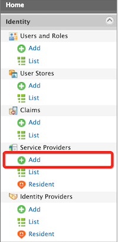
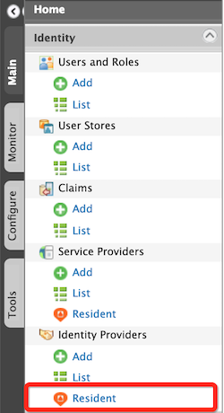

# OpenID Connect Single Logout

**What is Single Logout (SLO)?**

When a user logs out from a particular client application, the user will
be automatically logged out from all the other client applications in
the same login session. This eliminates the need to log out from each
client application one by one.

!!! note
    The following phrases will be interchangeably used within this document:
    -   **Identity provider** and **OpenID Connect Provider (OP)** : These
        indicate the OAuth2 authentication servers that implement OpenID
        Connect (OIDC).
    -   **Client application** and **Relying Party (RP)** : These are the
        OAuth2 clients that rely on OIDC for authentication.
    -   **Browser** and **user agent**
    

Following are the three SLO mechanisms supported by OIDC:

-   [OIDC Session
    Management](#oidc-session-management)
-   [OIDC Back-Channel
    Logout](#oidc-back-channel-logout)
-   [OIDC Front-Channel
    Logout](#oidc-front-channel-logout)

### OIDC Session Management

This mechanism enables defining how to monitor the user's login status
at the identity provider's end so that the client application can
automatically log out the user who is logged out from the identity
provider.

As per the [OIDC session management
specification](http://openid.net/specs/openid-connect-session-1_0.html)
, WSO2 Identity Server enables an application to monitor login status of
an end user against the identity provider so that the RP can log out any
end users that have logged out of the identity provider. For example,
suppose there are two RPs relying on the identity provider, when an end
user logs out of one of the applications, the user will be automatically
logged out of the other RP. In this logout mechanism, **front-channel**
**communication** is used to communicate the request messages.

**Front-channel communication**

-   Front-channel communication enables communication between two or
    more observable parties.
-   In this method, the request messages are communicated between the
    servers via a user agent.

#### Endpoint discovery

To enable OIDC session management, the RP needs to obtain the following
OP endpoint URLs:

-   [OP logout endpoint
    URL](#op-logout-endpoint-url)
-   [OP iframe URL](#op-iframe-url)

##### OP logout endpoint URL

-   When a user is logged out from the RP, the RP redirects to the OP's
    logout endpoint URL to log out the user at the OP.

-   The logout endpoint URL can be discovered using the
    `           end_session_endpoint          ` parameter in the OIDC
    Discovery response.

    For more information on OIDC Discovery, see [OpenID Connect
    Discovery](../../learn/openid-connect-discovery).

-   The logout endpoint URL is in the following format.

    ``` java tab="Format"
    https://<PRODUCT_HOST>:<PRODUCT_PORT>/oidc/logout
    ```

    ``` java tab="Example"
        https://localhost:9443/oidc/logout
    ```

-   The logout request sent by the RP to OP includes the following query
    parameters.
    <table>
    <thead>
    <tr class="header">
    <th>Query Parameter</th>
    <th>Applicability</th>
    <th>Description</th>
    </tr>
    </thead>
    <tbody>
    <tr class="odd">
    <td><strong>id_token_hint</strong></td>
    <td>Recommended</td>
    <td><div class="content-wrapper">
    <p>This is the previously-issued ID token that was passed to the logout endpoint hinting about the user's current authentication session with the RP. This indicates the identity of the user that the RP is requesting to be logged out by the OP.</p>
    <p>If the <code>                 id_token_hint                </code> is passed to the logout endpoint, WSO2 Identity Server identifies the RP to which the token is issued to and redirects the user to the <code>                 callback URL                </code> of the RP that is configured in WSO2 Identity Server. To learn how to configure the RP in WSO2 Identity Server, see <a href="../../learn/openid-connect-single-logout#configurations">Configurations</a> .</p>
    <p>If the <code>                 id_token_hint                </code> is not passed to the logout endpoint, the user is redirected to the default logout page subsequent to a successful logout.</p>
    </div></td>
    </tr>
    <tr class="even">
    <td><strong>post_logout_redirect_uri</strong></td>
    <td>Optional</td>
    <td><div class="content-wrapper">
    <p>This is the URL to which the RP requests the end user's user agent be redirected after a logout.</p>
    <div class="admonition note">
    <p class="admonition-title">Note</p>
    <p>The <code>                 post_logout_redirect_uri                </code> should be registered in WSO2 Identity Server based on the regex option provided for configuring multiple callback URLs.</p>
    <p>To learn how to configure the RP with multiple callback URLs in WSO2 Server, see <a href="../../learn/openid-connect-single-logout#configurations">Configurations</a> .</p>
    </div>
    </div></td>
    </tr>
    <tr class="odd">
    <td><strong>state</strong></td>
    <td>Optional</td>
    <td><p>This is an opaque value that is used by the RP for maintaining the state between the logout request and the callback to the endpoint that is specified in the <code>                post_logout_redirect               </code> query parameter.</p>
    <p>If the state is included in the logout request, WSO2 Identity Server passes this value back to the RP in the <code>                state               </code> query parameter when redirecting the user agent back to the RP.</p></td>
    </tr>
    </tbody>
    </table>

### OP iframe URL

-   The RP may rely on the ID token that comes with an expiration date
    to expire the RP session. In case the user logs out of OP prior to
    token expiration, there should be a mechanism for user login status
    verification at the OP. For this, once the session is established
    with the authentication request and response the login status at the
    OP is verified by polling a hidden OP iframe from an RP iframe.

-   The OP iframe URL is the URL of the OP iframe that supports
    cross-origin communications for session state information with the
    RP, using the HTML5 postMessage API. The page is loaded from an
    invisible iframe that is embedded in an RP page enabling it to run
    the OP's security context. The OP iframe URL accepts postMessage
    requests from the relevant RP iframe and uses postMessage to post
    back the user login status at the OP.

-   The OP iframe URL can be discoverd using the
    `           check_session_iframe          ` parameter in the OIDC
    Discovery response.

    For more information on OIDC Discovery, see [OpenID Connect
    Discovery](../../learn/openid-connect-discovery).

-   The OP iframe URL is in the following format.

    ``` java tab="Format"
    https://<PRODUCT_HOST>:<PRODUCT_PORT>/oidc/checksession
    ```

    ``` java tab="Example"
    https://localhost:9443/oidc/checksession
    ```

-   The RP should request the page from the OP iframe URL with the
    following query parameter.

    <table>
    <thead>
    <tr class="header">
    <th>Query Parameter</th>
    <th>Applicability</th>
    <th>Description</th>
    </tr>
    </thead>
    <tbody>
    <tr class="odd">
    <td><strong>client_id</strong></td>
    <td>Mandatory</td>
    <td><div class="content-wrapper">
    <p>This is the <code>                 client key                </code> of the RP that is configured in WSO2 Identity Server.</p>
    <div class="admonition tip">
    <p class="admonition-title">Tip</p>
    <p>To learn the step at which the <code>                 client key                </code> is generated when configuring the RP in WSO2 Identity Server, see step 2.g under <a href="../../learn/openid-connect-single-logout#configurations">Configurations</a> .</p>
    </div>
    </div></td>
    </tr>
    </tbody>
    </table>

#### How it works

OIDC session management works with two hidden iframes, one at the RP and
the other at identity provider. The RP checks the session state by using
the RP iframe to continuously poll a hidden identity provider iframe,
without causing network traffic. Thereby, the RP is notified when the
session state of the end user has changed. The flow of this is as
follows.

1.  The RP iframe polls the identity provider iframe for a session
    status.
2.  The identity provider iframe sends back a post message about the
    session state as `          changed         `,
    `          unchanged         ` or `          error         ` .
3.  If the session state is `          changed         `, the RP sends
    a passive request for re-authentication.
4.  If the end user has logged out from the identity provider, the RP
    will receive an authentication failure message along with a new
    session state value. The RP handles this as an end user logout.
5.  If the end user has not logged out, the RP will receive a successful
    authentication response along with a new session state value.
<a name="manualconfigs"></a>
#### Configurations

You can configure an RP for OIDC session management in WSO2 Identity
Server with either of the following methods:

-   [OpenID Connect Dynamic Client
    Registration](../../learn/openid-connect-dynamic-client-registration)

-   [Manual configuration through WSO2 Identity Server Management Console](#manualconfigs)

**Manual configuration through WSO2 Identity Server Management Console**

Follow the steps below to configure an RP for OIDC session management in
WSO2 Identity Server Management Console:

1.  Sign in to the WSO2 Identity Server Management Console.
2.  To register a web application as a service provider:  
    1.  On the **Main** menu, click **Identity \> Service Providers \>
        Add**.  
         
    2.  Enter the name of the application in the **Service Provider
        Name** text box.  
         
    3.  Click **Register**. Note that you will be redirected to the
        **Service Providers** screen.
    4.  To sign the ID token with the user's tenant domain, in the
        **Local & Outbound Authentication Configuration** section,
        select **Use tenant domain in local subject identifier** check
        box.
        !!! note
                **Alternative method to sign the ID token**
        
                Open the `             deployment.toml           ` file in the
                `             <IS_HOME>/conf/repository/conf           `
                directory and add the following property.
        
                ``` java
                [authentication]
                sign_auth_response_with_tenant_of= "sp"
                ```

         

    5.  In the **Inbound Authentication Configuration** section, click
        **OAuth/OpenID Connect Configuration \> Configure**.  
         
    6.  Enter the `             callback URL            ` as given
        below.  
         
        <a name="configs"></a>
        <table>
        <thead>
        <tr class="header">
        <th>Field</th>
        <th>Description</th>
        </tr>
        </thead>
        <tbody>
        <tr class="odd">
        <td><strong>Callback URL</strong></td>
        <td><div class="content-wrapper">
        <p>This is the service provider's URL to which the <code>                   authorization codes                  </code> are sent. Upon a successful authentication, the browser should be redirected to this URL.</p>
        <div>
        <p>Configure multiple callback URLs</p>
        <p>From IS 5.2.0 onwards, regex-based consumer URLs are supported when defining the callback URL. This enables you to configure multiple callback URLs for one application by entering a regex pattern as the value for the callback URL field.<br />
        For example, if you have two service providers that use the same application, you can now define a regex pattern which will work for both callback URLs instead of having to configure two different applications for the two service providers. Assume the two callback URLs for your two service providers are as follows:</p>
        <ul>
        <li><code>                                             https://myapp.com/callback                                           </code></li>
        <li><code>                                             https://testapp:8000/callback                                           </code></li>
        </ul>
        <p>To configure the callback URL to work for <strong>both</strong> of these URLs, set it using a regex pattern as follows:<br />
        </p>
        <div class="code panel pdl" style="border-width: 1px;">
        <div class="codeContent panelContent pdl">
        <div class="sourceCode" id="cb1" data-syntaxhighlighter-params="brush: java; gutter: false; theme: Confluence" data-theme="Confluence" style="brush: java; gutter: false; theme: Confluence"><pre class="sourceCode java"><code class="sourceCode java"><a class="sourceLine" id="cb1-1" title="1">regexp=(https:<span class="co">//((myapp\.com)|(testapp:8000))(/callback))</span></a></code></pre></div>
        </div>
        </div>
        <div class="admonition note">
        <p class="admonition-title">Note</p>
        <p>You must have the prefix ' <strong>regexp=</strong> ' before your regex pattern. To define a normal URL, you can specify the callback URL without this prefix.</p>
        <p>You can also configure a regex pattern that contains dynamic values as seen below.</p>
        <div class="code panel pdl" style="border-width: 1px;">
        <div class="codeContent panelContent pdl">
        <div class="sourceCode" id="cb2" data-syntaxhighlighter-params="brush: java; gutter: false; theme: Confluence" data-theme="Confluence" style="brush: java; gutter: false; theme: Confluence"><pre class="sourceCode java"><code class="sourceCode java"><a class="sourceLine" id="cb2-1" title="1">regexp=https:<span class="co">//mchcon.clance.local\?id=(.*)</span></a></code></pre></div>
        </div>
        </div>
        </div>
        </div>
        </div></td>
        </tr>
        </tbody>
        </table>

    7.  Click **Add**. Note that a `             client ID            `
        and `             client secret            ` have been
        created.  
           
        You have successfully added the service provider. Similarly,
        register another service provider to test single logout.

3.  To view the identity provider's logout endpoint URL, which gets
    called when the logout is triggered from the service provider:
    1.  On the **Main** menu, click **Identity \> Identity Providers \>
        Resident**.  
         
    2.  Under **Inbound Authentication Configuration**, click
        **OAuth2/OpenID Connect Configuration**.  
           
        Note that the identity provider's logout endpoint URL is listed
        out.  
         

### OIDC Back-Channel Logout

[OIDC back-channel
logout](https://openid.net/specs/openid-connect-backchannel-1_0.html#Backchannel)
feature utilizes **back-channel communication** to log out users from a
client application by **directly communicating** the logout requests
between the client application and authorization server.

**What is back-channel communication?**

-   Back-channel communication enables communication between two or more
    unobservable parties.
-   In this method, the request messages are communicated between the
    servers via direct network links between the servers.
-   This method also enables the client application to communicate with
    the identity provider and resource server without user involvement
    as well as the identity provider to communicate with the resources
    server without the client application's involvement.

**What is direct communication?**

Direct communication enables communicating the requests between the
client application and authorization server through direct network links
without having to rely on a browser.

This approach is more reliable as it does not require communicating the
logout requests through a user agent and maintain active RP browser
sessions for the communication to succeed. Instead, when a user triggers
a logout request, all the RPs belonging to the same browser session will
be sent a logout token from the identity provider to initiate logouts at
the RPs.

#### Endpoint discovery

To enable OIDC back-channel logout, the RP needs to obtain the OP's
logout endpoint URL.

##### OP logout endpoint URL

-   When a user is logged out from the RP, the RP redirects to the OP's
    logout endpoint URL to log out the user at the OP.
-   The logout endpoint URL can be discovered using the
    `           end_session_endpoint          ` parameter in the OIDC
    Discovery response.

    For more information on OIDC Discovery, see [OpenID Connect
    Discovery](../../learn/openid-connect-discovery).

-   The logout endpoint URL is in the following format.

    ``` java tab="Format"
    https://<PRODUCT_HOST>:<PRODUCT_PORT>/oidc/logout
    ```

    ``` java tab="Example"
    https://localhost:9443/oidc/logout
    ```

-   The logout request sent by the RP to OP includes the following query
    parameters.

    <table>
    <thead>
    <tr class="header">
    <th>Query Parameter</th>
    <th>Applicability</th>
    <th>Description</th>
    </tr>
    </thead>
    <tbody>
    <tr class="odd">
    <td><strong>id_token_hint</strong></td>
    <td>Recommended</td>
    <td><div class="content-wrapper">
    <p>This is the previously-issued ID token that was passed to the logout endpoint hinting about the user's current authentication session with the RP. This indicates the identity of the user that the RP is requesting to be logged out by the OP.</p>
    <p>If the <code>                 id_token_hint                </code> is passed to the logout endpoint, WSO2 Identity Server identifies the RP to which the token is issued to and the user's session that the RP participated in using the <code>                 sid                </code> in the ID token and redirects the user to the <code>                 callback URL                </code> of the RP that is configured in WSO2 Identity Server. To learn how to configure the RP in WSO2 Identity Server, see <a href="#configs">Configurations</a> .</p>
    <p>If the <code>                 id_token_hint                </code> is not passed to the logout endpoint, the user is redirected to the default logout page subsequent to a successful logout.</p>
    <p>When WSO2 Identity Server receives a logout request from the RP, WSO2 Identity Server identifies all other RPs that participated in the same session and triggers back-channel logout requests for them where those RPs are registered in WSO2 Identity Server with a back-channel logout URL.</p>
    </div></td>
    </tr>
    <tr class="even">
    <td><strong>post_logout_redirect_uri</strong></td>
    <td>Optional</td>
    <td><div class="content-wrapper">
    <p>This is the URL to which the RP requests the end user's user agent be redirected after a logout.</p>
    <div class="admonition note">
    <p class="admonition-title">Note</p>
    <p>The post_logout_redirect_uri should be registered in WSO2 Identity Server based on the regex option provided for configuring multiple callback URLs.</p>
    <p>To learn how to configure the RP with multiple callback URLs in WSO2 Server, see <a href="#configs">Configurations</a> .</p>
    </div>
    </div></td>
    </tr>
    <tr class="odd">
    <td><strong>state</strong></td>
    <td>Optional</td>
    <td><p>This is an opaque valued that is used by the RP for maintaining the state between the logout request and the callback to the endpoint that is specified in the <code>                post_logout_redirect               </code> query parameter.</p>
    <p>If the state is included in the logout request, WSO2 Identity Server passes this value back to the RP in the <code>                state               </code> query parameter when redirecting the user agent back to the RP.</p></td>
    </tr>
    </tbody>
    </table>

### How it works

Let's take a look at the underlying message flow of the
OIDC back-channel logout.

1.  RP registers a logout endpoint at the OP.
2.  The session ID, which identifies the application session at the OP
    is injected to the ID token.

    **What is an ID token?**

    It is a JSON Web Token (JWT) containing the user's authentication
    status and profile information in the form of claims.

3.  The RP triggers a user logout.
4.  The OP identifies the session of the respective RP and obtains the
    session ID, which corresponds to the browser session.
5.  The OP identifies all the client applications that share the same
    user session using the session ID.
6.  The authorization server generates a logout token and sends it with
    the logout request to the logout endpoints of the client
    applications via back-channel.

    **What is a logout token?**

    Logout token is a special JWT is a type of [security event
    token](https://tools.ietf.org/html/draft-ietf-secevent-token-02)
    similar to ID token. It contains the following claims that are
    specific to the logout action and are required by the RPs to
    validate and verify the logout request and trigger the logout
    process for a user:

    <table>
    <thead>
    <tr class="header">
    <th>Claim</th>
    <th>Definition</th>
    <th>Description</th>
    </tr>
    </thead>
    <tbody>
    <tr class="odd">
    <td><strong>iss</strong></td>
    <td>Issuer Identifier</td>
    <td><div class="content-wrapper">
    <p>This identifies the OP. To learn how WSO2 Identity Server manages identity providers, see <a href="../../learn/adding-and-configuring-an-identity-provider#configuring-a-resident-identity-provider">Configuring a resident identity provider</a> .</p>
    </div></td>
    </tr>
    <tr class="even">
    <td><strong>sub</strong></td>
    <td>Subject Identifier</td>
    <td><div class="content-wrapper">
    <p>This is a unique identifier that is assigned by the OP to the Client, which is the <code>                  client key                 </code> .</p>
    <div class="admonition tip">
    <p class="admonition-title">Tip</p>
    <p>To learn the step at which the <code>                  client key                 </code> is generated when configuring the RP in WSO2 Identity Server, see step 2.f under <a href="#configs">Configurations</a> .</p>
    </div>
    </div></td>
    </tr>
    <tr class="odd">
    <td><strong>aud</strong></td>
    <td>Audience</td>
    <td>This is the list of clients to which the logout token is intended for.</td>
    </tr>
    <tr class="even">
    <td><strong>iat</strong></td>
    <td>Issued At Time</td>
    <td>This is the time at which the token was issued.</td>
    </tr>
    <tr class="odd">
    <td><strong>jti</strong></td>
    <td>JWT ID</td>
    <td>This uniquely identifies the token and is used to prevent logout token replays.</td>
    </tr>
    <tr class="even">
    <td><strong>events</strong></td>
    <td><br />
    </td>
    <td>This is the JSON object containing the member name <code>                http://schemas.openid.net/event/backchannel-logout               </code> . This should be an empty JSON object. This is to declare that this JWT is a logout token.</td>
    </tr>
    <tr class="odd">
    <td><strong>sid</strong></td>
    <td>Session ID</td>
    <td>This identifies the session of the user agent at the RP.</td>
    </tr>
    </tbody>
    </table>

    **Sample logout token**

    ``` java
    {
    "sub": "admin",
    "aud": "Fv7m40gUl7WT430oLUkOlCdr6X8a",
    "iss": "https://localhost:9443/oauth2/token",
    "event": {
    "http://schemas.openid.net/event/backchannel-logout": {}
    },
    "exp": 1556562242,
    "iat": 1556562122,
    "jti": "ec68f2b2-01ce-4d51-94b1-9d178eaa5f7d",
    "sid": "6cb64c02-ab2a-466c-a8fb-04107a165691"
    }
    ```

7.  Upon receiving the logout token, the client application validates
    the logout token and invalidates the user session causing the
    session to logout.
<a name="manualconfigs2"></a>
#### Configurations

You can configure an RP for OIDC back-channel logout in WSO2 Identity
Server with either of the following methods:

-   [OpenID Connect Dynamic Client
    Registration](../../learn/openid-connect-dynamic-client-registration)

    !!! note
        If you are configuring the RP for OIDC back-channel logout in WSO2
        Identity Server through dynamic client registration, make sure you
        add the following parameters to the request:
    
        -   **backchannel\_logout\_uri** : This is the logoout URL.
        -   **backchannel\_logout\_session\_required** : Set this to
            `            true           ` .
    
        **Sample request**
    
        ``` java
        {
        "redirect_uris": ["server.example.com"],
        "client_name": "application_1",
        "ext_param_owner": "application_owner",
        "grant_types": ["password"],
        "backchannel_logout_uri": "http://localhost:8080/pickup/bclogout",
        "backchannel_logout_session_required": true
        }
        ```

-   [Manual configuration through WSO2 Identity Server Management Console](#manualconfigs2)

**Manual configuration through WSO2 Identity Server Management Console**

Follow the steps below to configure an RP for OIDC back-channel logout
in WSO2 Identity Server:

1.  Sign in to the WSO2 Identity Server Management Console.
2.  To register a web application as a service provider:  
    1.  On the **Main** menu, click **Identity \> Service Providers \>
        Add**.  
         
    2.  Enter the name of the application in the **Service Provider
        Name** text box.  
         
    3.  Click **Register**. Note that you will be redirected to the
        **Service Providers** screen.
    4.  In the **Inbound Authentication Configuration** section, click
        **OAuth/OpenID Connect Configuration \> Configure**.  
         
    5.  Enter the configurations as follows:  
         

        | Field                              | Description                                                                                                                                                                                        |
        |------------------------------------|----------------------------------------------------------------------------------------------------------------------------------------------------------------------------------------------------|
        | **Callback URL**                   | This is the service provider's URL to which the `                  authorization codes                 ` are sent. Upon a successful authentication, the browser should be redirected to this URL. |
        | **Enable OIDC Backchannel Logout** | This defines whether the back-channel communication is used to communicate the `                 logout token                ` or not.                                                             |
        | **Logout URL**                     | This is the service provider's back-channel logout endpoint URL to which the `                 logout token                ` is sent to.                                                           |

    6.  Click **Add**. Note that a `             client ID            `
        and `             client secret            ` have been
        created.  
         

        You have successfully added the service provider. Similarly,
        register another service provider to test single logout.

3.  To view the identity provider's logout endpoint URL, which gets
    called when the logout is triggered from the service provider:

    1.  On the **Main** menu, click **Identity \> Identity Providers \>
        Resident**.  
         
    2.  Under **Inbound Authentication Configuration**, click
        **OAuth2/OpenID Connect Configuration**.  
           
        Note that the identity provider's logout endpoint URL is listed
        out.  
         

### OIDC Front-Channel Logout

!!! note
    OIDC front-channel logout mechanism is already added to the WSO2
    Identity Server roadmap and will be available in a future WSO2 Identity
    Server version.
    
