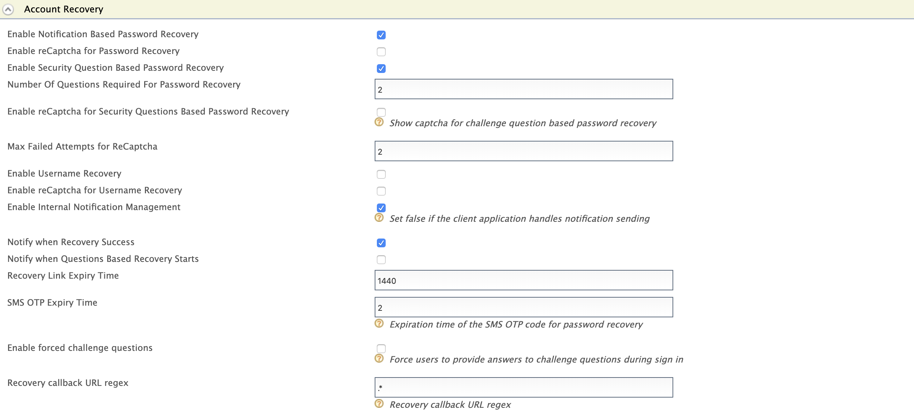

# Password Recovery Via User Preferred Notification Channel

This section guides you through setting up password recovery for users to recover a lost or 
forgotten password.

!!! Note
    This feature is only available via Account Recovery REST APis. Currently, WSO2 IS does not 
    support this feature via the User Portal.

**Password Recovery Flow**

 - User provides a set of unique claims to identify the user account.
 - Then the server will prompt available notification channels to the user to receive username 
 recovery notification.
 - User selects a notification channel.
 - Sever send the recovery notification to the user via the preferred notification channel.
 - If the preferred channel is,
    - Email: Click on the reset link in the email and reset the password.
    - SMS: Provide the received One-Time Password(OTP) and reset the password. 

The following sections walk you through configuring and trying out password recovery via SMS and Email 
Channels.   

??? Warning "If you have migrated from a previous IS version"
    If you have migrated from a previous IS version, ensure that the `IdentityMgtEventListener` with the
    `         orderId=50        ` is set to **false** and that the Identity
    Listeners with `         orderId=95        ` and
    `         orderId=97        ` are set to **true** in the
    `         <IS_HOME>/repository/conf/deployment.toml        ` file.
   
    !!! Note 
        You can skip this step if there are no entries for `event.default_listener.xxx`, in 
        the `deployment.toml` file.
    
    
    ``` java
    [event.default_listener.identity_mgt]
    priority= "50"
    enable = false
    [event.default_listener.governance_identity_mgt]
    priority= "95"
    enable = true
    [event.default_listener.governance_identity_store]
    priority= "97"
    enable = true
    ```
    
## Configuring Password recovery

Following steps given below are to recover a user in the the super tenant, which is `carbon.super`.

1.  Add the following properties to the `deployment.toml` file in the `IS_HOME/repository/conf` folder to 
configure the the identity server to send confirmation emails.
    
    !!! Note
        You need to add this configuration only if you wish to configure WSO2 IS to send confirmation 
        emails. Alternatively, you can use your own email managing mechanism.

    ``` toml
    [output_adapter.email]
    from_address= "wso2iamtest@gmail.com"
    username= "wso2iamtest"
    password= "Wso2@iam70"
    hostname= "smtp.gmail.com"
    port= 587
    enable_start_tls= true
    enable_authentication= true
    ```    
    
2. Add the following properties to the `deployemnt.toml`. 

    ```
    [identity_mgt.notification_channel_recovery]
    recovery_code_validity=1
    resend_code_validity=5
    
    [identity_mgt.password_reset_sms]
    sms_otp_validity=2
    ```
    <table>
       <tr>
           <th>Property Name</th>
           <th>Functionality</th>
       </tr>
       <tr>
          <td>recovery_code_validity</td>
          <td>
            <ul>
                <li>Validity period of the recovery code given after initiating username/ password 
                recovery.
                <li>Unit : <code>minutes</code>
                <li>Default value : <code>1 minute</code>
            </ul> 
            <div class="admonition note">
                <p class="admonition-title">note</p>
                <p>
                    If you have configured Username Recovery Via User Preferred Notification 
                    Channel, the above field might be already configured.
                </p>
            </div>   
          </td>
       </tr>
       <tr>
          <td>resend_code_validity</td>
          <td>
            <ul>
                <li>Validity period of the recovery code given after initiating password recovery.
                <li>Unit : <code>minutes</code>
                <li>Default value : <code>1 minute</code>
            </ul>
          </td>
       </tr>
       <tr>
         <td>sms_otp_validity</td>
         <td>
           <ul>
                <li>Validity period of SMS OTP when the selected channel is <code>SMS</code>
                <li>Unit : <code>minutes</code>
                <li>Default value : <code>1 minute</code>
           </ul>
         </td>
      </tr>
    </table>
          
3.  Add an event publisher to `<IS_HOME/repository/deployment/server/eventpublishers`. For this 
sample, `http output adapter` is used. Following is a sample publisher to call a REST Service 
to send confirmation codes.

    ??? info "Sample Event Publisher"
        ```
        <?xml version="1.0" encoding="UTF-8"?>
        <eventPublisher name="HTTPOutputEventAdapter" processing="enable"
            statistics="disable" trace="disable" xmlns="http://wso2.org/carbon/eventpublisher">
            <from streamName="id_gov_sms_notify_stream" version="1.0.0"/>
            <mapping customMapping="enable" type="json">
                <inline>{"api_key"="4c9374",
                    "api_secret"="FtqyPE93",
                    "from"="NEXMO",
                    "to"={{mobile}},
                    "text"={{body}}
                    }</inline>
            </mapping>
            <to eventAdapterType="http">
                <property name="http.client.method">httpPost</property>
                <property name="http.url">https://rest.nexmo.com/sms/json</property>
            </to>
        </eventPublisher>
        ``` 
        
        !!! note
            This publisher uses NEXMO as the SMS REST service provider. For more information 
            on writing a custom http event publisher, see [HTTP Event Publisher](https://docs.wso2.com
            /display/DAS300/HTTP+Event+Publisher).  
            
4.  [Start WSO2 IS](../../setup/running-the-product#starting-the-server)
    and [log in to the management console](../../setup/running-the-product#accessing-the-management-console)
    : ` https://<IS_HOST>:<IS_PORT>/carbon `.  
    **NOTE:** If your IS is already running, make sure to restart to apply above configurations. 
    
5.  Navigate to `Main -> Identity Providers -> Resident -> Account Management Policies` section.

6.  Expand the `Account Recovery` section and configure the following properties. 

    
    
    <table>
        <thead>
            <tr class="header">
                <th>Field</th>
                <th>Description</th>
            </tr>
        </thead>
        <tbody>
            <tr class="odd">
                <td>Enable Notification Based Password Recovery</td>
                <td>Enable password recovery with notifications for the current tenant domain</td>
            </tr>
            <tr class="odd">
                <td>Enable Security Question Based Password Recovery</td>
                <td>Enable security question based password recovery</td>
            </tr>
            <tr class="odd">
                <td>Enable Internal Notification Management</td>
                <td>
                    <p>
                        Select to configure Identity server to send confirmation emails to the user.
                        If the client application handles notification sending already, unselect it. 
                    </p>
                </td>
            </tr>
            <tr class="odd">
                <td>Notify when Recovery Success</td>
                <td>Send a notification when password reset is successful</td>
            </tr>
            <tr class="odd">
                <td>Recovery Link Expiry Time</td>
                <td>
                    <ul>
                        <li>Validity period of the password reset email link.
                        <li>Unit : <code>minutes</code>
                        <li>Default : <code>1440 minutes = 1 day</code>
                    </ul>
                </td>
            </tr>
            <tr class="odd">
                <td>SMS OTP Expiry Time</td>
                <td>
                    <ul>
                        <li>Validity period of the password reset OTP.
                        <li>Unit : <code>minutes</code>
                        <li>Default : <code>1 minutes</code>
                </td>
            </tr>            
        </tbody>    
    </table>

## Managing Notification templates

### Managing EMAIL Notification templates

The email notification templates are stored in the `IS_HOME>/repository/conf/email/email-admin-config.xml` 
file and they can be edited using the Management Console.

!!! tip
    The **PasswordReset**, **passwordResetSucess** and **resendPasswordReset** templates are used to 
    send email notifications. You can edit and customize the email templates. For more information, 
    see [Customizing Automated Emails](../../learn/customizing-automated-emails).

### Managing SMS Notification templates  
  
The templates for SMS notifications are stored in the registry. Follow the steps below to edit the existing 
sms notification templates.

1. Log in to the Management Console and click `Main> Registry> Browse`.

2. On the **tree view** tab, click `system -> config ->identity -> sms`. This will display all the 
available SMS notification templates.

    

3. Select a template and Click on `en_us` to view the template.

4. Click `Display as text` to view the template or click `Edit as text` to edit the template.
    
    

!!! tip
    The **passwordreset**, **passwordresetsucess** and **resendpasswordreset** templates are used to 
    send SMS notifications. You can edit and customize the SMS templates. For more information, 
    see [Managing SMS Notification Templates From the Registry](../../learn/managing-sms-templates-from-the-registry).      
    
## Try out password recovery 

!!! tip "Before you begin"
    Complete the steps given to configure the identity server.

!!! info "Notification Mechanisms"
    WSO2 Identity Server provides the functionality to receive account recovery notifications 
    internally or externally.
    
    1. **Internal Notification Management** : Notification sending is managed by WSO2 Identity Server.
        
    2. **External Notification Management** : Notification sending is managed by an external 
    notification management mechanism.
    
    !!! note
        To configure external notification management, `disable` the property `Enable Internal 
        Notification Management` in `Account Recovery` configurations.
        
        
    
### Creating a user for recovery

!!! tip "Before you begin" 
    Make sure you have a user with Email or Mobile configured. If you already have 
    a user, skip to the next heading. 
    If not follow the steps below to create a new user and assign notification channels.

1. Log in to the Management Console and click `Main -> Identity -> Users and Roles -> Add`.

2. Click on `Add New User` and enter user credentials.

    
    
    !!! Note
        For more details on creating users and roles Click [Adding Users and Roles](../.
        ./learn/adding-users-and-roles/)
    
3. Navigate to `Main -> Identity -> Users and Roles -> List -> Users`.

4. Find the user from the list and click `View Roles`.     
    
    

5. Click on `Permissions` to edit the default permissions.

    

6. From the list of permissions select `Login` permission and click `Update`.     

     
    
    !!! warning
        This will update the permissions of the role. Therefore, all the users with the current role 
        will receive login permissions.

7. Navigate to `Main -> Identity -> Users and Roles -> List -> Users` and click on `User Profile` to 
update the Email and Mobile of the user.

    
    
### **Password recovery with Internal Notification Management**   

1. Use the following command to create a user name recovery request.

    ```
    curl -X POST "https://localhost:9443/api/users/v1/recovery/password/init" -H "accept: application/json" -H "Content-Type: application/json" -d "{\"claims\":[{\"uri\":\"http://wso2.org/claims/givenname\",\"value\":\"user1\"}],\"properties\":[{\"key\":\"key\",\"value\":\"value\"}]}"
    ```
     
2.  Following response will be returned by the API.

    ```
    [
    {
      "mode": "recoverWithNotifications",
      "channelInfo": {
          "recoveryCode": "254d9446-faef-4763-be8a-f71e80c4715b",
          "channels": [
            {
                "id": "1",
                "type": "EMAIL",
                "value": "s********@g***l.com",
                "preferred": false
            },
            {
                "id": "2",
                "type": "SMS",
                "value": "*******3902",
                "preferred": true
            }
          ]
    },
      "links": [
        {
            "rel": "next", 
            "href": "/t/carbon.super/api/users/v1/recovery/password/recover",
            "type": "POST"
        }
      ]
    },
    {
      "mode": "recoverWithChallengeQuestions",
      "links": [
        {
          "rel": "next",
          "href": "/t/carbon.superidentity/recovery/v0.9/security-question?username=sominda2",
          "type": "GET"
        }
      ]
    }
    ]
    ``` 
    
    !!! note
        The validity period of the recovery code is determined by the 2nd step of 
        Configuring Password Recovery.  
        
    !!! info
        To tryout password recovery with challenge question, refer [Configuring Password Reset with Challenge 
        Questions](../../learn/configuring-password-reset-with-challenge/).
    
3. Use the `recoveryCode` and a preferred channel `id` to get notifications via that channel.

    ```
    curl -X POST "https://localhost:9443/api/users/v1/recovery/password/recover" -H "accept: application/json" -H "Content-Type: application/json" -d "{\"recoveryCode\":\"1234-5678-2455-3433\",\"channelId\":\"1\",\"properties\":[{\"key\":\"key\",\"value\":\"value\"}]}"
    ```      
    
4. The API will return the following response upon a successful recovery and the user will be notified 
via the selected channel.

    ```
    {
      "code": "PWR-02001",
      "message": "Password recovery information sent via user preferred notification channel.",
      "notificationChannel": "EMAIL",
      "resendCode": "8dde8fd4-c58d-4408-a835-a9954ebc278a",
      "links": [
         {
            "rel": "next",
            "href": "/t/carbon.super/api/users/v1/recovery/password/confirm",
            "type": "POST"
         },
         {
            "rel": "resend",
            "href": "/t/carbon.super/api/users/v1/recovery/password/resend",
            "type": "POST"
         }
      ]
    }
    ```
    
5. If you want to resend the notifications to the user via the notified channel in the above step, use the 
`resendCode` with the resend notifications API.

    ```
    curl -X POST "https://localhost:9443/api/users/v1/recovery/password/resend" -H "accept: application/json" -H "Content-Type: application/json" -d "{\"resendCode\":\"1234-2ws34-1234\",\"properties\":[{\"key\":\"key\",\"value\":\"value\"}]}"
    ```        

6. The API will send the following response upon successful notification.

    ```
    {
    "code": "UAR-02001",
    "message": "Confirmation code resent to the user.",
    "notificationChannel": "EMAIL",
    "resendCode": "8ebefae5-0a80-4edf-ac2d-6034384e45c0",
    "links": [
        {
            "rel": "next",
            "href": "/t/carbon.super/api/users/v1/recovery/password/confirm",
            "type": "POST"
        },
        {
            "rel": "resend",
            "href": "/t/carbon.super/api/users/v1/recovery/password/resend",
            "type": "POST"
        }
    ]
    }
    ```

7. Use the confirmation code received by the user to verify the confirmation code.

    ```
    curl -X POST "https://localhost:9443/api/users/v1/recovery/password/confirm" -H "accept: application/json" -H "Content-Type: application/json" -d "{\"confirmationCode\":\"1234-2ws34-12345\",\"properties\":[{\"key\":\"key\",\"value\":\"value\"}]}"
    ```   

8. The API will return the following response.

    ```
    {
        "resetCode": "90b9ce11-7642-4f50-aa06-386011b7de66",
        "links": [
            {
                "rel": "next",
                "href": "/t/carbon.super/api/users/v1/recovery/password/reset",
                "type": "POST"
            }
        ]
    }
    ```    
9. Use the `resetCode` and the new password to update the existing password and recover the account.

    ```
    curl -X POST "https://localhost:9443/api/users/v1/recovery/password/reset" -H "accept: application/json" -H "Content-Type: application/json" -d "{\"resetCode\":\"string\",\"password\":\"string\",\"properties\":[{\"key\":\"key\",\"value\":\"value\"}]}"
    ```
    
10. The API will return the following response upon successful password reset.

    ```
    {
        "code": "PWR-02005",
        "message": "Successful password reset."
    }
    ```    
    
### **Password recovery with External Notification Management**   

1. Use the following command to create a user name recovery request.

    ```
    curl -X POST "https://localhost:9443/api/users/v1/recovery/password/init" -H "accept: application/json" -H "Content-Type: application/json" -d "{\"claims\":[{\"uri\":\"http://wso2.org/claims/givenname\",\"value\":\"user1\"}],\"properties\":[{\"key\":\"key\",\"value\":\"value\"}]}"
    ```    
    
2.  Following response will be returned by the API.

    ```
    [{
      "mode": "recoverWithNotifications",
      "channelInfo": {
          "recoveryCode": "9ed0ed58-593a-48d8-90b3-ae745a6d7aae",
          "channels": [
              {
                "id": "1",
                "type": "EXTERNAL",
                "value": ""
              }
          ]
      },
      "links": [
          {
            "rel": "next",
            "href": "/t/carbon.super/api/users/v1/recovery/username/recover",
            "type": "POST"
          }
      ]
    }]
    ```
    
    !!! note
            The validity period of the recovery code is determined by the 2nd step of 
            Configuring Username Recovery. 

3. Use the `recoveryCode` and a channel `id` to get the recovered username.

    ```
    curl -X POST "https://localhost:9443/api/users/v1/recovery/password/recover" -H "accept: application/json" -H "Content-Type: application/json" -d "{\"recoveryCode\":\"1234-5678-2455-3433\",\"channelId\":\"1\",\"properties\":[{\"key\":\"key\",\"value\":\"value\"}]}"
    ```   
    
4. The API will return the following response upon a successful notification.

    ```
    {
    "code": "PWR-02001",
    "message": "Password recovery information sent via user preferred notification channel.",
    "notificationChannel": "EXTERNAL",
    "confirmationCode": "90b9ce11-7642-4f50-aa06-386011b7de66",
    "resendCode": "b24bcfc0-3ee3-4a7d-964c-e3e6e3098c08",
    "links": [
        {
            "rel": "next",
            "href": "/t/carbon.super/api/users/v1/recovery/password/confirm",
            "type": "POST"
        },
        {
            "rel": "resend",
            "href": "/t/carbon.super/api/users/v1/recovery/password/resend",
            "type": "POST"
        }
    ]
    }
    ```

5. If you want to resend the notifications, use the `resendCode` with the resend notifications API.

    ```
    curl -X POST "https://localhost:9443/api/users/v1/recovery/password/resend" -H "accept: application/json" -H "Content-Type: application/json" -d "{\"resendCode\":\"1234-2ws34-1234\",\"properties\":[{\"key\":\"key\",\"value\":\"value\"}]}"
    ```            
    
6. The API will return the following response.

    ```
    {
    "code": "UAR-02001",
    "message": "Confirmation code resent to the user.",
    "notificationChannel": "EXTERNAL",
    "confirmationCode": "8ebcf3a1-b278-415c-b077-9b15fbf9bfdf",
    "resendCode": "b037478d-15e1-4f3d-ab7b-ad917dc73904",
    "links": [
        {
            "rel": "next",
            "href": "/t/carbon.super/api/users/v1/recovery/password/confirm",
            "type": "POST"
        },
        {
            "rel": "resend",
            "href": "/t/carbon.super/api/users/v1/recovery/password/resend",
            "type": "POST"
        }
    ]
    }
    ```    
    
7. Use the `confirmationCode` to verify the password reset..

    ```
    curl -X POST "https://localhost:9443/api/users/v1/recovery/password/confirm" -H "accept: application/json" -H "Content-Type: application/json" -d "{\"confirmationCode\":\"1234-2ws34-12345\",\"properties\":[{\"key\":\"key\",\"value\":\"value\"}]}"
    ```   

8. The API will return the following response.

    ```
    {
        "resetCode": "90b9ce11-7642-4f50-aa06-386011b7de66",
        "links": [
            {
                "rel": "next",
                "href": "/t/carbon.super/api/users/v1/recovery/password/reset",
                "type": "POST"
            }
        ]
    }
    ```    
9. Use the `resetCode` and the new password to update the existing password and recover the account.

    ```
    curl -X POST "https://localhost:9443/api/users/v1/recovery/password/reset" -H "accept: application/json" -H "Content-Type: application/json" -d "{\"resetCode\":\"string\",\"password\":\"string\",\"properties\":[{\"key\":\"key\",\"value\":\"value\"}]}"
    ```
    
10. The API will return the following response upon successful password reset.

    ```
    {
        "code": "PWR-02005",
        "message": "Successful password reset."
    }
    ```        