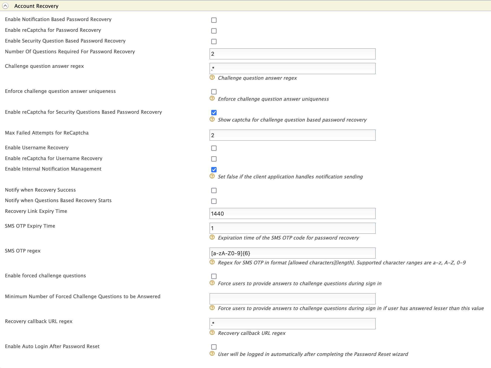
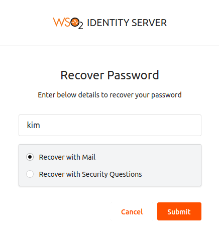
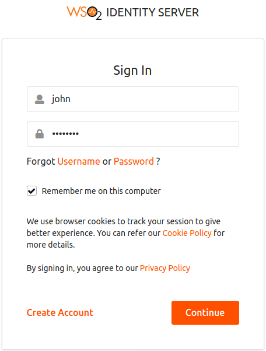
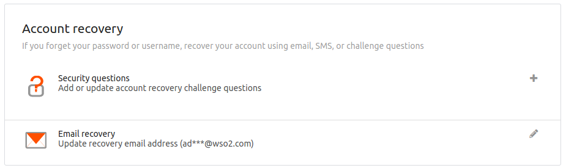
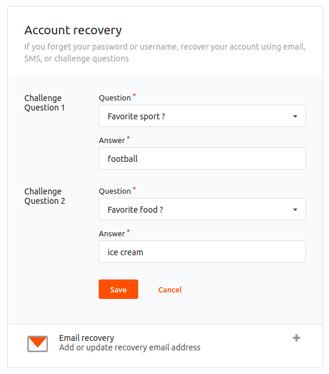
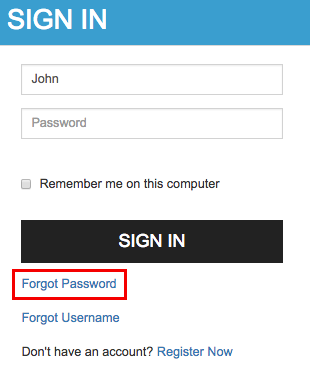
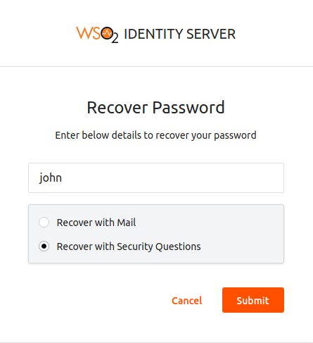
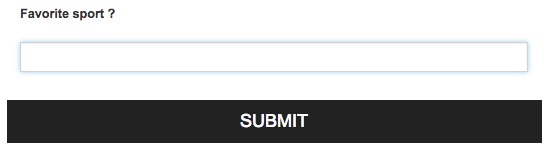
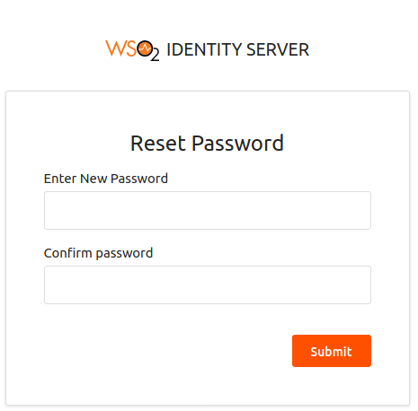

# Password Recovery

This section guides you through setting up password recovery for users
to recover a lost or forgotten password. There are two methods of
password recovery:

!!! warning
    From 5.3.0 onwards there is a new implementation for identity management
    features. The steps given below in this document follows the new
    implemenation which is the **recommended approach** for password
    recovery.
    
    Alternatively, to see steps on how to enable this identity management
    feature using the **old implementation**, see [Password Recovery
    documentation in WSO2 IS
    5.2.0](https://docs.wso2.com/display/IS520/Password+Recovery). The old
    implementation has been retained within the WSO2 IS pack for backward
    compatitbility and can still be used if required.

!!! note
	WSO2 IS validates whether the user account is locked or disabled prior to account recovery. In addition, if any customization prior to account recovery such as checking the eligibility of the user for account recovery by validating certain conditions/ user claims is needed, WSO2 Identity Server provides an extension for that.

	WSO2 IS triggers the `PRE_ACCOUNT_RECOVERY` event prior to user account recovery using the WSO2 IS eventing framework. A custom event handler can be written upon which the `PRE_ACCOUNT_RECOVERY` event is triggered. For more information on how to write a custom handler and trigger an event, see [Writing a custom handler](../../develop/writing-a-custom-event-handler).


### Recovery using notifications

WSO2 Identity Server supports password recovery using email-based
notifications. The flow of this method is as follows:

-   The user initiates the password recovery flow by clicking on "Forgot
    Password" at the point of login.
-   The user enters the username and selects **Recovery with Email**.
-   An email is sent to the user with a URL which directs the user to a
    screen where he/she can enter a new password.

Follow the steps given below to set up and try out password recovery
with email notification.

!!! tip "Before you begin"
    
    Ensure that the identity listener with the
    `         priority=50        ` is set to **false** and that the Identity
    Listeners with `         priority=95        ` and
    `         priority=97        ` are set to **true** by adding the following configuration in the
    `         <IS_HOME>/repository/conf/deployment.toml        ` file.
    
    ``` java
    [event.default_listener.identity_mgt]
    priority= "50"
    enable = false
    [event.default_listener.governance_identity_mgt]
    priority= "95"
    enable = true
    [event.default_listener.governance_identity_store]
    priority= "97"
    enable = true
    ```


1.  Enable the email sending configurations of the WSO2 Identity Server
    as explained [here](../../setup/configuring-email-sending).
    
    !!! tip
        The email template used to send this email notification is
        the **PasswordReset** template.
    
        You can edit and customize the email template. For more information
        on how to do this, see [Customizing Automated
        Emails](../../learn/customizing-automated-emails).
    
2.  Start the WSO2 Identity Server and log in to the management console.
3.  Click on **Resident** found under the **Identity Providers** section
    on the **Main** tab of the management console.
4.  Expand the **Account Management Policies** tab, then the **Account
    Recovery** tab and select the **Enable Notification Based Password
    Recovery** checkbox.  
    For more information on the fields seen on this screen, see [Account
    Recovery REST
    API](../../develop/using-the-account-recovery-rest-apis)
.

    
    
    !!! info 
        - To enable password recovery with reCaptcha verification, select the **Enable reCaptcha for Password Recovery** checkbox. For more information, see [Configuring reCaptcha for Password Recovery](../../learn/configuring-recaptcha-for-password-recovery).

        - To enable auto-login after password reset, select the **Enable Auto Login After Password Reset** checkbox. Alternatively, you can enable this server-wide by adding the following configuration to the `<IS_HOME>/repository/conf/deployment.toml` file. 

        ```toml
        [identity_mgt.recovery]
        enable_auto_login=true
        ```

5.  To enable sending a confirmation email to the user's registered
    email address after the password reset, select the **Notify when
    Recovery Success** checkbox.

    !!! tip
    
        The email template used to send the confirmation email
        notification is the **passwordResetSuccess** template.
    
        You can edit and customize the email template. For more information
        on how to do this, see [Customizing Automated
        Emails](../../learn/customizing-automated-emails)
.
    

!!! note
    
    If you are using a Google mail account, note that Google has restricted
    third-party apps and less secure apps from sending emails by default.
    Therefore, you need to configure your account to disable this
    restriction, as WSO2 IS acts as a third-party application when sending
    emails to confirm user registrations or notification for password reset
    WSO2 IS.
    
    ??? note "Click here for more information"
    
        Follow the steps given below to enable your Google mail account to
        provide access to third-party applications.
        
        1.  Navigate to <https://myaccount.google.com/security>.
        2.  Click **Signing in to Google** on the left menu and make sure that
                the **2-step Verification** is disabled or off.  
                 
        3.  Click **Connected apps and sites** on the left menu and enable
                **Allow less secure apps**.  
                 
        

### Try out recovery using notification

1.  [Create a user using the management
    console](../../learn/configuring-users#creating-a-new-user-using-the-management-console)
. Ensure that the user has login permissions.
2.  Edit the user profile and enter an email address for the user. The
    email notification for password recovery is sent to the email
    address given.
3.  Access the WSO2 Identity Server **My Account** using the following link:
    `          https://localhost:<port_number>/user-portal         `.
4.  Click the **Forgot Password** link.
5.  Enter the user's username and select **Recover with Mail**. Click
    **Submit**.  
    
     

    !!! note
    
        In case you have enabled password recovery with reCaptcha
        verification, enter the required fields as specified above and
        select the recaptcha checkbox as well.
    
         
    

6.  An email notification is sent to the user's email address. Click on
    the **Reset Password** button given on the email.  
     
7.  Enter a new password and click **Submit**.  
     

!!! tip
    For information on the REST APIs for password recovery, see [the swagger docs on Account Recovery REST APIs](../../develop/using-the-account-recovery-rest-apis).
    

### Recovery using challenge questions

The WSO2 Identity Server provides an alternative means of recovering
passwords. This is by using challenge questions. If users forget their
password, they can recover it by answering challenge questions that were
set up for their accounts.

Before setting this up, you must configure the required claims for this
feature. To do this, do the following.

1.  Enter your username and password to log on to the [Management
    Console](../../setup/getting-started-with-the-management-console)
.
2.  Click on **Resident** found under the **Identity Providers** section
    on the **Main** tab of the Management Console.
3.  Expand the **Account Management Policies** tab, then the **Account
    Recovery** tab and select the **Enable the Security Questions Based
    Password Recovery** checkbox.
4.  Configure the required number of questions in the **Number of
    Questions Required for Password Recovery**.  
    Optionally, select the **Notify when Questions Based Recovery
    Starts** checkbox to send an email notification to the user when the
    question based recovery starts.

    !!! info 
        - To enable password recovery with reCaptcha verification, select the **Enable reCaptcha for Password Recovery** checkbox. For more information, see [Configuring reCaptcha for Password Recovery](../../learn/configuring-recaptcha-for-password-recovery).

        - To enable auto-login after password reset, select the **Enable Auto Login After Password Reset** checkbox. Alternatively, you can enable this server-wide by adding the following configuration to the `<IS_HOME>/repository/conf/deployment.toml` file. 

        ```toml
        [identity_mgt.recovery]
        enable_auto_login=true
        ```
        
You can set up challenge questions for users in one of the following
ways:

#### Using the management console

To set up challenge questions or to manage the questions with different
locales (languages), see [Managing Challenge
Questions](../../learn/managing-challenge-questions).

#### Using the **My Account**

To try this out, first create a user in the Identity Server.

1.  On the **Main** tab in the Management Console, click **Add** under
    **Users and Roles**.  
2.  Click **Users**. This link is only visible to users with the Admin
    role.  
3.  Click **Add New User**.  
     

4.  Log out of the Identity Server.
5.  The URL for accessing **My Account** is the following if the hostname is
    localhost and the Identity Server is running on port 9443:
    <https://localhost:9443/myaccount>. Click this link to access the
    **My Account** and log in using the credentials of the user you just
    created.  
       
6.  Go to the **Security** tab. Click the **+** button near **Security questions** under the
    **Account Recovery** section.  
     
7.  Set challenge questions for the user account. There are two sets of
    challenge questions by default. You can pick one question for each
    set and give an answer for the question.  
       
8.  Click **Save**.
9.  Sign out of the **My Account** and click **Forgot Password** on the login
    screen.  
     
10. Enter the username and select **Recover with Security Questions**.
    Click **Submit**.

    !!! tip
    
        **Tip** : If you have configured WSO2 IS to use email address as the
        username, enter the username in the format of "john@
        [foo.com](http://foo.com) ". If the user is in the super tenant,
        this is in the format of "john@ [foo.com](http://foo.com)
        @carbon.super". If the user is in the tenant
        [bar.com](http://bar.com), the format you must enter is "john@
        [foo.com](http://foo.com) @ [bar.com](http://bar.com) ".
    

     

    !!! note
    
        In case you have enabled password recovery with reCaptcha
        verification, enter the required fields as specified above and
        select the recaptcha checkbox as well.
    
           
    

      

11. Enter the answers to the challenge questions and click **Submit**
.  
     

12. Enter a new password and click **Submit**. You will receive a
    notification of successful password reset.  

 

 

!!! tip
    
    For information on the REST APIs for password recovery using challenge
    questions, see [the swagger docs on Account Recovery REST
    APIs](../../develop/using-the-account-recovery-rest-apis).
    

!!! info "Related Links"

        -   To set up reCaptcha for password recovery with secret questions, see
        [Configuring Google reCaptcha for Security-Question Based Password
        Recovery](../../learn/configuring-google-recaptcha-for-security-question-based-password-recovery).
        -   See [Configuring
        Claims](../../learn/configuring-claims) for
        more information on how to store the claim values in the user store.

  

  
