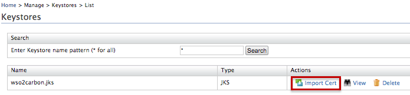
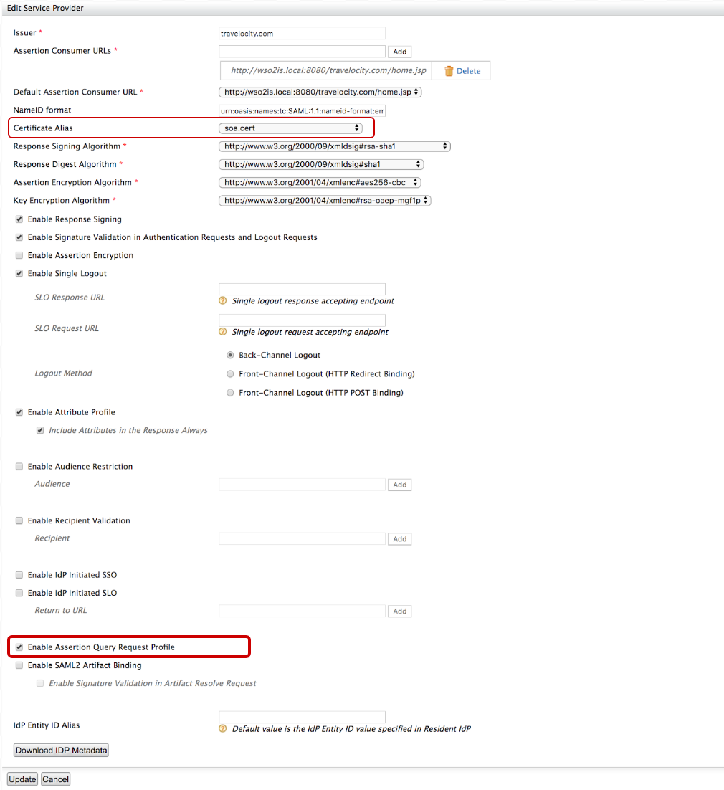
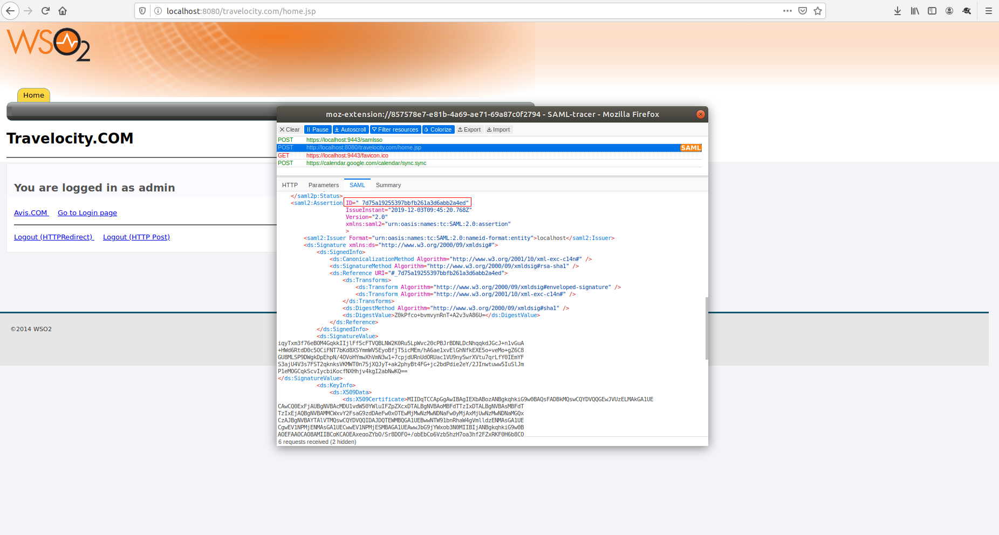
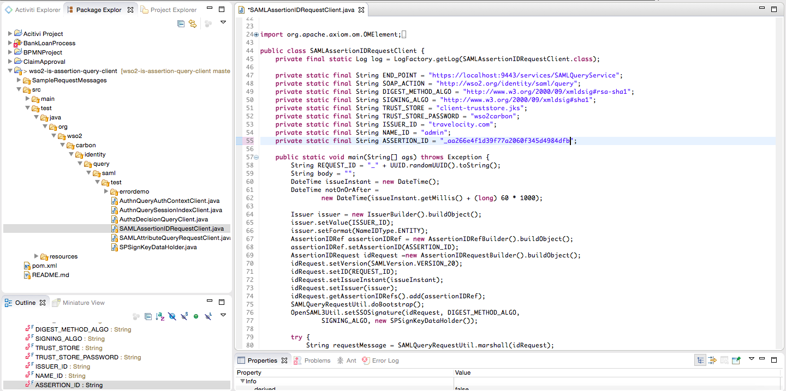

# Querying SAML Assertions

The SAML Assertion Query/Request profile enables service providers to
query dynamic or existing assertions using standard request messages via
the WSO2 Identity Server. According to the specification the following
two entities are used for this interaction:

1.  **SAML Requester** -  issues the SAML query/request message.
2.  **SAML Authority** - returns the SAML2 Assertion based on the above
    request/query.  

The Assertion Query/Request Profile defines five major request/query
message types which can be used to request assertions from SAML
authority.

1.  **AssertionIDRequest** - used to request an assertion when given
    it's unique ID.  
2.  **SubjectQuery** -  used to query the assertion by presenting a
    subject to the SAML authority and assembling response messages.
3.  **AuthnQuery** - used to request existing assertions about an
    existing subject. It is inherited from the SubjectQuery message
    type.
4.  **AttributeQuery** - used to request attributes about an existing
    subject. It is inherited from the SubjectQuery message type.
5.  **AuthzDecisionQuery** - used to request an authorization decision
    based on an existing subject.

  

### Configuring WSO2 Identity Server

!!! note "Before you begin"

    1.  Clone or download the client application from [this GitHub
        location](https://github.com/gayangithub/wso2-is-assertion-query-client)
        and extract it. This folder location will be referred to as
        `            <CLIENT_HOME>           ` in this document.

    2.  Build the client application by executing the following command on
        the `             <CLIENT_HOME>            ` root folder.

        ``` java
        mvn clean install
        ```

1.  Start the WSO2 Identity Server and log in to the management console.
2.  Navigate to **Keystores** under **Manage** on the **Main** tab of
    the management console and click **List**.
3.  Click **Import Cert** to import a certificate to the
    **wso2carbon.jks** keystore.  
    
4.  Upload the certificate found in
    `          <CLIENT_HOME>/src/test/resources/soa.cert         ` and
    click **Import**.
5.  Click **Add** under **Service Providers** on the **Main** tab.
6.  Configure a service provider for SAML and click **Update**.  
    To try querying an assertion using the a sample application,
    configure the service provider for the travelocity sample
    application and follow the steps in the
    [try out scenario](#try-out-scenario) section.

!!! tip "What's Next?"   
    To query the assertion, you can do one of the following:
    
    -   Follow the steps in [Try out
        scenario](#try-out-scenario) section to try
        an AssertionID request with the travelocity sample application
        **OR**
    -   Follow the steps in [Querying an
        assertion](#querying-an-assertion) section for
        instructions on querying an assertion with your own application.
    

### Querying an assertion

1.  Follow the steps above to configure WSO2 Identity Server.
2.  You have to use a custom assertion builder with the capability to
    persist assertions to the database for this profile.  
    Open the
    `           <IS_HOME>/repository/conf/deployment.toml          `
    file and add the following configuration.

    ``` java
    [saml.extensions] 
    assertion_builder= "org.wso2.carbon.identity.sso.saml.builders.assertion.ExtendedDefaultAssertionBuilder"
    ```

3.  To see the created assertions in the WSO2IS H2 database and access
    the AssertionID, logout of the WSO2 IS management console and then
    enable browsing of the H2 database.

    !!! tip
        For more information on how to enable browsing of the H2 database,
        see [Browsing the H2 Database](../../setup/browsing-the-h2-database)
    
4.  Access the application you configured a service provider for via the
    assertion consumer URL you configured in step 6.
5.  Log in to the application.  

6.  When a user logs in, the created assertion will be persisted to the
    `           IDN_SAML2_ASSERTION_STORE          ` table on the H2
    database. Check the database for the new assertion.

7.  Open the repository source code you cloned from GitHub using an IDE
    and navigate to
    `          <CLIENT_HOME>          \src\test\java\org\wso2\carbon\identity\query\saml\test         `
    . `         `
8.  Open the relevant java class of the query type you wish to request
    (e.g., `          SAMLAssertionIDRequestClient.java         ` ),
    enter the required values, and run the main() method of the
    class. An assertion request will be generated.
9.  You will receive a response according to the query type.

You have successfully queried an assertion.

### Try out scenario

This section guides you through querying an assertion using the
AssertionID for the travelocity sample application.

1.  Follow the steps in the [Configuring WSO2 Identity
    Server](#configuring-wso2-identity-server) section to configure
    the WSO2 Identity Server.
2.  [Set up the travelocity sample application](../../learn/deploying-the-sample-app/#deploying-travelocity-webapp) and [configure the service
    provider](../../learn/deploying-the-sample-app/#configuring-service-provider).  
    
    1.  Expand the **SAML2 Web SSO Configuration** and click
        **Configure** of the configured service provider for
        'travelocity.com'.
    
    2.  Configure the required fields. Select
        `            soa.cert           ` as the **Certificate Alias**
        and tick the **Enable Assertion Query Request Profile**
        checkbox.  
    
        
        
3.  Click **Update**.
4.  You have to use a custom assertion builder with the capability to
    persist assertions to the database for this profile.  
    Open the
    `           <IS_HOME>/repository/conf/deployment.toml         `
    file and add the following configuration.

    ``` java
    [saml.extensions] 
    assertion_builder= "org.wso2.carbon.identity.sso.saml.builders.assertion.ExtendedDefaultAssertionBuilder"
    ```

5.  To see the created assertions in the WSO2IS H2 database and access
    the AssertionID, enable browsing of the H2 database.

    !!! tip
        For more information on how to enable browsing of the H2 database,
        see [Browsing the H2 Database](../../setup/browsing-the-h2-database)

6.  Restart WSO2 IS and access the travelocity.com application by
    accessing this URL:
    `http://wso2is.local:8080/travelocity.com/index.jsp`

7.  Login using admin/admin credentials.

8.  When a user logs in, the created assertion will be persisted to the
    `          IDN_SAML2_ASSERTION_STORE         ` table on the H2
    database. Check the database for the new assertion.
9.  Copy the SAMLID of the created assertion. You can use this ID to
    query the assertion using a AssertionIDRequest.  
    
10. Open the repository source code you cloned from GitHub using an IDE
    and navigate to
    `          <CLIENT_HOME>          \src\test\java\org\wso2\carbon\identity\query\saml\test         `
    . `         ` `                   `
11. Open the `          SAMLAssertionIDRequestClient.java         `
    class and assign AssertionID value you copied from the database to
    the `          ASSERTION_ID         ` variable.  
    
12. Run the main() method of the class. You will see a generated request
    and a response similiar to the following:

    ??? note "AssertionIDRequest Request"
        ```xml
            <?xml version="1.0" encoding="UTF-8" ?>
            <saml2p:AssertionIDRequest xmlns:saml2p="urn:oasis:names:tc:SAML:2.0:protocol" ID="_1c785f98-4e41-4a4d-a496-5e7432e700fa" IssueInstant="2016-09-12T03:18:24.762Z" Version="2.0">
                <saml2:Issuer xmlns:saml2="urn:oasis:names:tc:SAML:2.0:assertion" Format="urn:oasis:names:tc:SAML:2.0:nameid-format:entity">travelocity.com</saml2:Issuer>
                <ds:Signature xmlns:ds="http://www.w3.org/2000/09/xmldsig#">
                    <ds:SignedInfo>
                        <ds:CanonicalizationMethod Algorithm="http://www.w3.org/2001/10/xml-exc-c14n#" />
                        <ds:SignatureMethod Algorithm="http://www.w3.org/2000/09/xmldsig#rsa-sha1" />
                        <ds:Reference URI="#_1c785f98-4e41-4a4d-a496-5e7432e700fa">
                            <ds:Transforms>
                                <ds:Transform Algorithm="http://www.w3.org/2000/09/xmldsig#enveloped-signature" />
                                <ds:Transform Algorithm="http://www.w3.org/2001/10/xml-exc-c14n#" />
                            </ds:Transforms>
                            <ds:DigestMethod Algorithm="http://www.w3.org/2000/09/xmldsig#sha1" />
                            <ds:DigestValue>TFH3NQVv2N41PnPh3G2dKDgg0mw=</ds:DigestValue>
                        </ds:Reference>
                    </ds:SignedInfo>
                    <ds:SignatureValue>a1wabcJTMDUv0KYTU3ftukKDR7e2zgd9Q6OFMDJmee7HcKb896spUprQIjMuvoMie9fxnm2+7346 q/zi5fe5Vdjid9MMAN7ls4iNbrIYnlHTdJzYX7ulQpNQ76GJevZw4N65qf/oaamc4HOOFw3TZYtv jYX0osmGqW5MjR9b748lQJ4kKgtgxzvT92s8Yn9OndJ+970pRuPdgZO57/LueSvUjHLfA7AuGGbH 5WDYuK4BJ6WnrhqzJ2Zc/OpilOO3uoP/RW4kJEtbMFpH6xWnb552uRYdS121qJasZM9aqzfKa0NH sWrZpmqwz0inXmZliqFShuhRKkIOF+2CmdZgXg==
                    </ds:SignatureValue>
                    <ds:KeyInfo>
                        <ds:X509Data>
                            <ds:X509Certificate>MIIDezCCAmOgAwIBAgIEa4wPCDANBgkqhkiG9w0BAQsFADBuMQswCQYDVQQGEwJMSzEQMA4GA1UE CBMHd2VzdGVybjEQMA4GA1UEBxMHY29sb21ibzEUMBIGA1UEChMLc29hc2VjdXJpdHkxETAPBgNV BAsTCHNlY3VyaXR5MRIwEAYDVQQDEwlsb2NhbGhvc3QwHhcNMTYwNzEzMTczMDQ5WhcNMTYxMDEx MTczMDQ5WjBuMQswCQYDVQQGEwJMSzEQMA4GA1UECBMHd2VzdGVybjEQMA4GA1UEBxMHY29sb21i bzEUMBIGA1UEChMLc29hc2VjdXJpdHkxETAPBgNVBAsTCHNlY3VyaXR5MRIwEAYDVQQDEwlsb2Nh bGhvc3QwggEiMA0GCSqGSIb3DQEBAQUAA4IBDwAwggEKAoIBAQCRo50ubPqW09rzptxmKIaeSjFP UbkmsMUn1jQvrH5vyumRjBKDY//uXQwcCAcmTw4Bb5RVdZVOiJPxQixQghBGgaVv3UobuilYtNuS /qEVZvnX4RBNkADOXXp+inf5a8OQYjVV7aac1bcSFx/4DgvcWT6mPLpm4dMVMhBWYye0gfPHKMIR 1W1BR/+dJuZePJVa0xFzJ33CBA38vrqg6OuEsZY0fMMfFasyxepUlIECTkKq7ie5PP+31gqw9cAu bIfeO9HtXcQBC7GPgcCgRV7+azJS1MgxbpvlDHJnVxcTcX3IdMCrclCC87DJIMVpbDeK6oGSqbhu Kn69sqnq6e9PAgMBAAGjITAfMB0GA1UdDgQWBBRRWwyTdsm/QxyObtcHBKtH0EMQ2zANBgkqhkiG 9w0BAQsFAAOCAQEANy3xYK8wD9EuKyXbAeEJs5jvoL/2cI4EOZfP1VKAa3SHv+AYPzxqmuyMpD2f 6Tx9yyOP+0QNNynHMC6RPjz8Ib5GzSbvUfbJKXAU7GPc/7riKMJzv52NI8KqFdQ1Y7YiKAMs5dpJ QAhiLlRU9yuhljWqXQ5h8eVJ+vO+9+VPSctDuNpHrhbIZbwAd5Cf+Avp7VDdaU2UIG3Xg7AJkXRF Oa0pEVPW+brkq9uLYTA4bMcr+ROH9REUA0f1AuWfi4aVDFptfVwULCqT9PPliqoZxJEzqccGjWgf Q0NktrBaTVRQo5BPpfRja5l7ajYAPKL7vS3OGCF1Ycocq6Wa6WMj7g==
                            </ds:X509Certificate>
                        </ds:X509Data>
                    </ds:KeyInfo>
                </ds:Signature>
                <saml2:AssertionIDRef xmlns:saml2="urn:oasis:names:tc:SAML:2.0:assertion">_f013b1db55d7bdea33102b4d72159011</saml2:AssertionIDRef>
            </saml2p:AssertionIDRequest>
        ```

    ??? note "AssertionIDRequest Response"
        ```xml
            <?xml version="1.0" encoding="UTF-8" ?>
            <saml2p:Response xmlns:saml2p="urn:oasis:names:tc:SAML:2.0:protocol" ID="_714cddb7f1c42d64376f0e6bd9d2f310" IssueInstant="2016-09-12T03:18:31.233Z" Version="2.0">
                <saml2:Issuer xmlns:saml2="urn:oasis:names:tc:SAML:2.0:assertion" Format="urn:oasis:names:tc:SAML:2.0:nameid-format:entity">localhost</saml2:Issuer>
                <ds:Signature xmlns:ds="http://www.w3.org/2000/09/xmldsig#">
                    <ds:SignedInfo>
                        <ds:CanonicalizationMethod Algorithm="http://www.w3.org/2001/10/xml-exc-c14n#" />
                        <ds:SignatureMethod Algorithm="http://www.w3.org/2000/09/xmldsig#rsa-sha1" />
                        <ds:Reference URI="#_714cddb7f1c42d64376f0e6bd9d2f310">
                            <ds:Transforms>
                                <ds:Transform Algorithm="http://www.w3.org/2000/09/xmldsig#enveloped-signature" />
                                <ds:Transform Algorithm="http://www.w3.org/2001/10/xml-exc-c14n#" />
                            </ds:Transforms>
                            <ds:DigestMethod Algorithm="http://www.w3.org/2000/09/xmldsig#sha1" />
                            <ds:DigestValue>+ghoomfq6hsNvVqr3+SKcGowIu0=</ds:DigestValue>
                        </ds:Reference>
                    </ds:SignedInfo>
                    <ds:SignatureValue>YofQrnFqtF2bDrq7w1CsKQKI/E3GdimZ4INryN27hX4bSXa3EP4gHsGr0MH+Hhk6g9xYHbVBuCQR ht+/j8EBBmBnqHIxPrg43Xn+zNg9FmKtwqa8rXJeu5pELq0dhx/X6tSVzXAuDmLoOlyO/YwEYmuJ wnUZce4MfIlNt7UdyqM=
                    </ds:SignatureValue>
                    <ds:KeyInfo>
                        <ds:X509Data>
                            <ds:X509Certificate>MIICNTCCAZ6gAwIBAgIES343gjANBgkqhkiG9w0BAQUFADBVMQswCQYDVQQGEwJVUzELMAkGA1UE CAwCQ0ExFjAUBgNVBAcMDU1vdW50YWluIFZpZXcxDTALBgNVBAoMBFdTTzIxEjAQBgNVBAMMCWxv Y2FsaG9zdDAeFw0xMDAyMTkwNzAyMjZaFw0zNTAyMTMwNzAyMjZaMFUxCzAJBgNVBAYTAlVTMQsw CQYDVQQIDAJDQTEWMBQGA1UEBwwNTW91bnRhaW4gVmlldzENMAsGA1UECgwEV1NPMjESMBAGA1UE AwwJbG9jYWxob3N0MIGfMA0GCSqGSIb3DQEBAQUAA4GNADCBiQKBgQCUp/oV1vWc8/TkQSiAvTou sMzOM4asB2iltr2QKozni5aVFu818MpOLZIr8LMnTzWllJvvaA5RAAdpbECb+48FjbBe0hseUdN5 HpwvnH/DW8ZccGvk53I6Orq7hLCv1ZHtuOCokghz/ATrhyPq+QktMfXnRS4HrKGJTzxaCcU7OQID AQABoxIwEDAOBgNVHQ8BAf8EBAMCBPAwDQYJKoZIhvcNAQEFBQADgYEAW5wPR7cr1LAdq+IrR44i QlRG5ITCZXY9hI0PygLP2rHANh+PYfTmxbuOnykNGyhM6FjFLbW2uZHQTY1jMrPprjOrmyK5sjJR O4d1DeGHT/YnIjs9JogRKv4XHECwLtIVdAbIdWHEtVZJyMSktcyysFcvuhPQK8Qc/E/Wq8uHSCo=
                            </ds:X509Certificate>
                        </ds:X509Data>
                    </ds:KeyInfo>
                </ds:Signature>
                <saml2p:Status>
                    <saml2p:StatusCode Value="urn:oasis:names:tc:SAML:2.0:status:Success" />
                </saml2p:Status>
                <saml2:Assertion xmlns:saml2="urn:oasis:names:tc:SAML:2.0:assertion" ID="_f013b1db55d7bdea33102b4d72159011" IssueInstant="2016-09-11T10:51:06.563Z" Version="2.0">
                    <saml2:Issuer Format="urn:oasis:names:tc:SAML:2.0:nameid-format:entity">localhost</saml2:Issuer>
                    <ds:Signature xmlns:ds="http://www.w3.org/2000/09/xmldsig#">
                        <ds:SignedInfo>
                            <ds:CanonicalizationMethod Algorithm="http://www.w3.org/2001/10/xml-exc-c14n#" />
                            <ds:SignatureMethod Algorithm="http://www.w3.org/2000/09/xmldsig#rsa-sha1" />
                            <ds:Reference URI="#_f013b1db55d7bdea33102b4d72159011">
                                <ds:Transforms>
                                    <ds:Transform Algorithm="http://www.w3.org/2000/09/xmldsig#enveloped-signature" />
                                    <ds:Transform Algorithm="http://www.w3.org/2001/10/xml-exc-c14n#" />
                                </ds:Transforms>
                                <ds:DigestMethod Algorithm="http://www.w3.org/2000/09/xmldsig#sha1" />
                                <ds:DigestValue>4Ga5N4FTMUTAdkxiiuj9OeGTf3c=</ds:DigestValue>
                            </ds:Reference>
                        </ds:SignedInfo>
                        <ds:SignatureValue>LRh6u1wTb7h7NgY+UoWtlgxhXRFyceYGxI7Q+ava2r+MhXl/N/uL5PgW6Bad5UwhqivINGuSrYJd L++taWxyaOVFQPNp2nEMRn+BhMgR2lWpyU/aaXgDIPyZGG5MrF0VI3r1s1NNBc1n0tREOeqxTSFZ eDLW/J2xCRYIZm8HKSU=
                        </ds:SignatureValue>
                        <ds:KeyInfo>
                            <ds:X509Data>
                                <ds:X509Certificate>MIICNTCCAZ6gAwIBAgIES343gjANBgkqhkiG9w0BAQUFADBVMQswCQYDVQQGEwJVUzELMAkGA1UE CAwCQ0ExFjAUBgNVBAcMDU1vdW50YWluIFZpZXcxDTALBgNVBAoMBFdTTzIxEjAQBgNVBAMMCWxv Y2FsaG9zdDAeFw0xMDAyMTkwNzAyMjZaFw0zNTAyMTMwNzAyMjZaMFUxCzAJBgNVBAYTAlVTMQsw CQYDVQQIDAJDQTEWMBQGA1UEBwwNTW91bnRhaW4gVmlldzENMAsGA1UECgwEV1NPMjESMBAGA1UE AwwJbG9jYWxob3N0MIGfMA0GCSqGSIb3DQEBAQUAA4GNADCBiQKBgQCUp/oV1vWc8/TkQSiAvTou sMzOM4asB2iltr2QKozni5aVFu818MpOLZIr8LMnTzWllJvvaA5RAAdpbECb+48FjbBe0hseUdN5 HpwvnH/DW8ZccGvk53I6Orq7hLCv1ZHtuOCokghz/ATrhyPq+QktMfXnRS4HrKGJTzxaCcU7OQID AQABoxIwEDAOBgNVHQ8BAf8EBAMCBPAwDQYJKoZIhvcNAQEFBQADgYEAW5wPR7cr1LAdq+IrR44i QlRG5ITCZXY9hI0PygLP2rHANh+PYfTmxbuOnykNGyhM6FjFLbW2uZHQTY1jMrPprjOrmyK5sjJR O4d1DeGHT/YnIjs9JogRKv4XHECwLtIVdAbIdWHEtVZJyMSktcyysFcvuhPQK8Qc/E/Wq8uHSCo=
                                </ds:X509Certificate>
                            </ds:X509Data>
                        </ds:KeyInfo>
                    </ds:Signature>
                    <saml2:Subject>
                        <saml2:NameID Format="urn:oasis:names:tc:SAML:1.1:nameid-format:emailAddress">admin</saml2:NameID>
                        <saml2:SubjectConfirmation Method="urn:oasis:names:tc:SAML:2.0:cm:bearer">
                            <saml2:SubjectConfirmationData NotOnOrAfter="2016-09-11T10:56:06.467Z" Recipient="http://travelocity.com" />
                        </saml2:SubjectConfirmation>
                    </saml2:Subject>
                    <saml2:Conditions NotBefore="2016-09-11T10:51:06.563Z" NotOnOrAfter="2016-09-11T10:56:06.467Z">
                        <saml2:AudienceRestriction>
                            <saml2:Audience>travelocity.com</saml2:Audience>
                        </saml2:AudienceRestriction>
                    </saml2:Conditions>
                    <saml2:AuthnStatement AuthnInstant="2016-09-11T10:51:06.580Z" SessionIndex="d1e12225-6c86-49f7-9d13-b07793caecc4">
                        <saml2:AuthnContext>
                            <saml2:AuthnContextClassRef>urn:oasis:names:tc:SAML:2.0:ac:classes:Password</saml2:AuthnContextClassRef>
                        </saml2:AuthnContext>
                    </saml2:AuthnStatement>
                </saml2:Assertion>
            </saml2p:Response>
        ```

You have successfully queried an assertion using the AssertionIDRequest.
