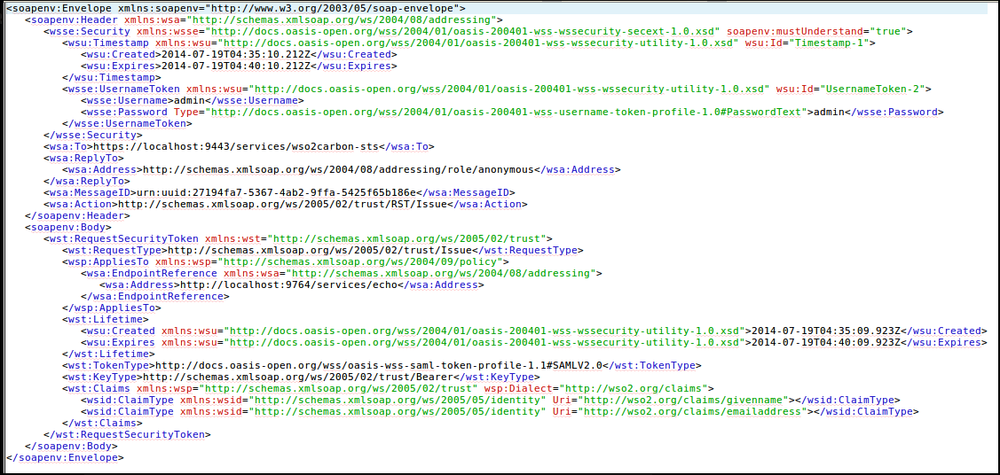

# Running an STS Client

The following sample demonstrates the steps required to run a Security
Token Service (STS) client. The STS provides the service of issuing a
security token to authenticate a user for your client application, using
WS-Trust protocols.

### Prerequisites

The WS-Trust STS needs to be configured. You can do this by following
the instructions found
[here](../../learn/configuring-ws-trust-security-token-service).

### Running the STS client

1.  The code for the sample can be checked out from the [GitHub
    repository](https://github.com/wso2/samples-is).

2.  Once downloaded the identity server samples, go inside to
    `           IS-SAMPLES/modules/samples/sts/sts-client          `
    directory to build the STS client.  

    !!! info 
        When running the sts-client sample it sends the username and
        password that is defined in the
        `            IS-SAMPLES/modules/samples/sts/sts-client/src/main/resources/client.properties           `
        file. WSO2 Identity Server authenticates if the user is in the
        system and if the user is in the system a token is sent to the
        requesting party, which is the sts-client application in this case.

        The default username and password defined are that of the default
        super administrator. You can change it accordingly.

        ``` java
        ut.username=admin
        ut.password=admin
        ```

3.  Build the client using `           mvn install          ` .

4.  Once the client is built successfully, run the
    `           sts-client.sh          ` file in Unix or
    `           sts-client.bat          ` in Windows. You can see that
    the SAML token issued from the STS is being printed by the client.

    !!! note
    
        The "connection refuse" error occurs in a situation where the STS
        client attempts to send the received SAML token to a service that is
        not running in this case.
    

### Request and response messages to and from the STS

**Request**

 

**Response**

 
