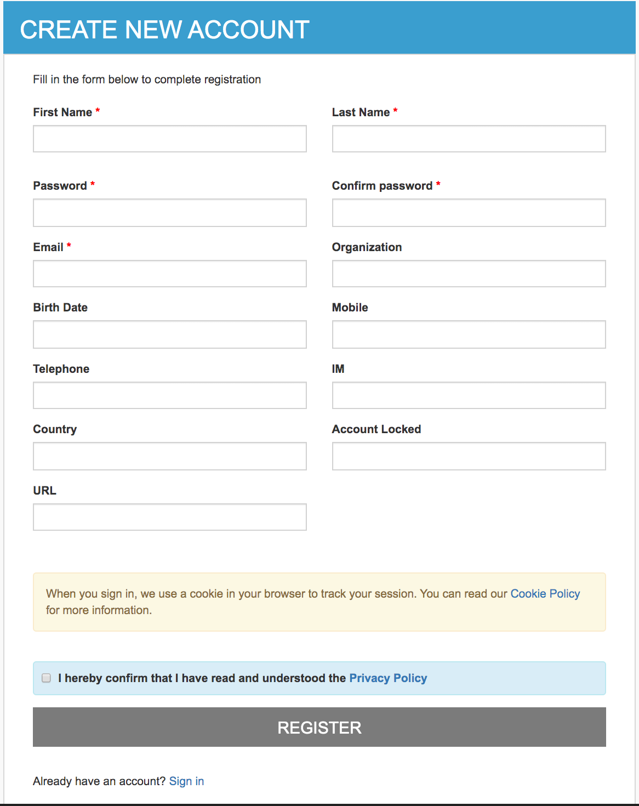
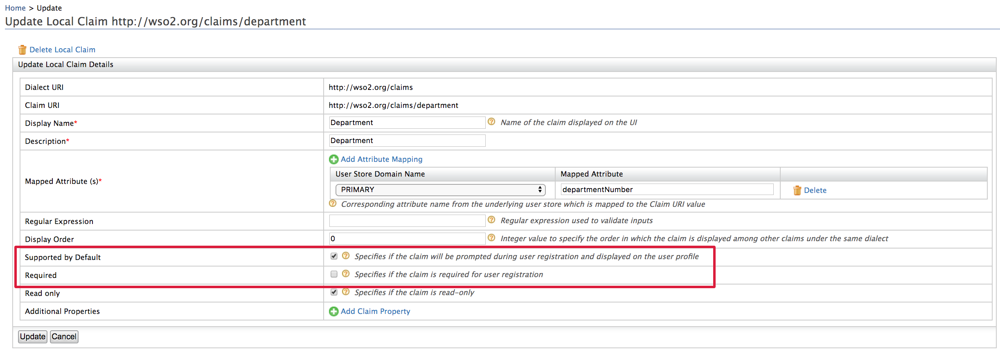

# Self-Registration and Account Confirmation

WSO2 Identity Server (WSO2 IS) supports self-registration to allow users
set up their account and receive confirmation when the account is
created.

When a user self-registers, the self-registration process creates the
user account and locks the account until the user confirms account
ownership via a confirmation mail sent by WSO2 IS.

If a user does not confirm account ownership before the specified expiry
period, the user account is locked assuming that the expired account is
not owned by the creator. If necessary, the system administrator can
delete such accounts to manage resources better.

The following sections walk you through configuring and trying out
self-registration.
    
??? Warning "Click to see instructions specific for a migrated deployment" 
    If you have migrated from a previous WSO2 Identity Server version, ensure that the `event.default_listener.identity_mgt` with the
    `         priority=50        ` is set to **false** and that the Identity
    Listeners with `         priority=95        ` and
    `         priority=97        ` are set to **true** in the
    `         <IS_HOME>/repository/conf/deployment.toml        ` file.
   
    !!! Note 
        If the following configurations are not present in the `deployment.toml ` file already, you do not have to add it. 
    
    ``` java
    [event.default_listener.identity_mgt]
    priority= "50"
    enable = false
    [event.default_listener.governance_identity_mgt]
    priority= "95"
    enable = true
    [event.default_listener.governance_identity_store]
    priority= "97"
    enable = true
    ```


## Configuring self-registration

Follow the steps given below to register users for the super tenant,
which is `         carbon.super        `.


1.  Enable the email sending configurations of the WSO2 Identity Server
    as explained [here](../../setup/configuring-email-sending).

    
    !!! Note
        You need to add this configuration only if you wish to configure WSO2 IS to send confirmation 
        emails. Alternatively, you can use your own email managing mechanism.

    !!! tip
        Typically, the **AccountConfirmation** template is used to send email notifications.
    
        You can edit and customize the email template. For more information
        on how to do this, see [Customizing Automated
        Emails](../../learn/customizing-automated-emails).
    

2.  [Start WSO2
    IS](../../setup/running-the-product#starting-the-server)
    and [log in to the management
    console](../../setup/running-the-product#accessing-the-management-console)
    : `          https://<IS_HOST>:<IS_PORT>/carbon         `  
    **NOTE:** If your IS is already running, make sure to stop and start to apply configurations. 
    
3.  Navigate to **Main** -> **Identity Providers** -> **Resident** -> **Account Management Policies** section.
    
4.  Expand the **User Self Registration** section and configure the
    following properties.
    
     
    
    <table>
    <thead>
    <tr class="header">
    <th>Field</th>
    <th>Description</th>
    </tr>
    </thead>
    <tbody>
    <tr class="odd">
    <td>Enable Self User Registration</td>
    <td>Enable self registration.</td>
    </tr>
    <tr class="even">
    <td>Enable Account Lock On Creation Enabled</td>
    <td>Enable account lock during self registration. The account will be unclocked upon confirmation.</td>
    </tr>
    <tr class="odd">
    <td>Enable Notification Internally Management</td>
    <td>
    <p>
    Select to configure Identity server to send confirmation emails to the user.
    If the client application handles notification sending already, unselect it. 
    </p>
    </td>
    </tr>
    <tr class="even">
    <td>Enable reCaptcha</td>
    <td>Select to enable reCaptcha for self-registration. See <a href="../../learn/configuring_google_recaptcha_for_security_question_based_password_recovery">Configuring Google reCaptcha for Security-Question Based Password Recovery</a> for more information.</td>
    </tr>
    <tr class="odd">
    <td>User self registration code expiry time</td>
    <td><div class="content-wrapper">
    <p>Number of minutes that the confirmation link would be valid. The confirmation link will expire 
    after the specified time has elapsed.</p>
    <div class="admonition note">
    <p class="admonition-title">Note</p>
    <p>Alternatively, you can configure the expiry time from the <code>deployment.toml</code>  file.</p>
    <div class="code panel pdl" style="border-width: 1px;">
    <div class="codeContent panelContent pdl">
    <div class="sourceCode" id="cb1" data-syntaxhighlighter-params="brush: java; gutter: false; theme: Confluence" data-theme="Confluence" style="brush: java; gutter: false; theme: Confluence"><pre class="sourceCode java"><code class="sourceCode java"><a class="sourceLine" id="cb1-1" title="1">[identity_mgt.user_self_registration]</a>
    <a class="sourceLine" id="cb1-2" title="2">allow_self_registration= true </a>
    <a class="sourceLine" id="cb1-3" title="3">expiry_time="1440"</a></code></pre></div> 
    </div>
    </div></div> 
    </div></td>
    </tr>
    </tbody>
    </table>

Now you have set up self registration. Next let's see how you can
configure self-registration consent purposes via the management console
of WSO2 Identity Server.

!!! tip
    For information on the REST APIs for self-registration, see 
    [Self-Registration Using REST APIs](../../develop/using-the-self-sign-up-rest-apis).
    

## Configuring self-registration consent purposes

Follow the instructions below to configure self-registration consent
purposes and appropriate user attributes:

1.  Start WSO2 Identity Server and access the management console via
    `                       https://localhost:9443/carbon/                     `.

2.  Navigate to **Main** -> **Identity** -> **Identity
    Providers** -> **Resident** ->**Account Management Policies** -> **User Self Registration** section. 

3.  Select `Click here` to configure self-registration consent purposes. This displays 
the **Consent Purposes** screen that allows you to add consent purposes.

       
    

4.  Click **Add New Purpose**. 

5.  Specify appropriate values for the **Purpose** and **Description**
    fields, and then click **Add PII Category** to add user attributes
    requires to obtain user consent.

    !!! tip
        You can add one or more user attributes to obtain consent for a
        particular purpose.
    
     

6.  If you want consent on a specific user attribute to be mandatory,
    select the **Mandatory** check box for that attribute.

    !!! tip    
        -   When you configure consent purposes for self-registration, the
            attributes that you specify for a particular purposes are the
            only attributes for which users are prompted to provide consent.
        -   If a user attribute is set as **Mandatory**, a user has to
            provide consent for that attribute to proceed with
            self-registration.
        -   If a user does not provide consent for any of the non-mandatory
            attributes, WSO2 Identity Server will not store those
            attributes.
    

7.  Click **Finish**. 

8.  Depending on your requirement, you can either add another new
    purpose and related user attributes, or click **Finish** if you have
    added all the purposes you want.

9.  Click **Update**.

Now you have configured required self-registration purposes and user
attributes for which you require user consent.

Next, you can try out self-registration.

## Try out self-registration

1.  Access the [WSO2 Identity Server dashboard](https://localhost:9443/dashboard/).
2.  Click the **Register Now?** link and then enter the new user's
    username.

    !!! info "Register Users for a Tenant"
        If you want to self-register to a specific tenant, you need to
        provide the **Username** in the following format:
        `            <USERNAME>@<TENAND_DOMAIN>           `

        For example, if you have a tenant domain as
        `           foo.com          `, the username needs to be
        `           kim@foo.com          `

     

3.  Fill in the user details, provide consent to share the requested
    information and then click **Register**.
     
        
    ??? Abstract "Click to see steps on configuring requested attributes for self registration" 
        
        -   The attributes that show up on the self sign up page are WSO2 [local dialect](../../learn/adding-claim-mapping/#add-local-claim) claims that have the Supported by Default configuration enabled.
        -   From the Management console click **List** under **Claims** and select the **http://wso2.org/claims** dialect. Expand any claim to view the configuration. 
        -   Mandatory attributes of
        the self sign-up page are the claims have the **Required**
        configuration enabled. 
        -   For example see below configurations of the
        department claim.
        

    
4.  Once the user has registered, user will receive a confirmation mail.

5.  Click **Confirm Registration** in the email or copy the link in the
    email to your browser to confirm the account.  
    Once you confirm the account, the account will be unlocked.

!!! info "Want to resend the confirmation email?"

    Follow the steps given below to resend the confirmation email.

    1.  Access the [WSO2 Identity Server
        dashboard](https://localhost:9443/dashboard/) and try to login with
        the user you just registered.  
        The user account should not be activated for the user, which means
        you should not have confirmed the account.

    2.  Click on the **Re-send** link to resend the email.  
         

    !!! tip
        The email template used to resend the confirmation email
        notification is the **ResendAccountConfirmation** template.
        
        You can edit and customize the email template. For more information on
        how to do this, see [Customizing Automated
        Emails](../../learn/customizing-automated-emails).

!!! Note
    If you wish to send a account unlocked email upon account confirmation, do the following 
    configurations.
    
    1. Navigate to **Resident IDP**.
    
    2. Expand the **Login Policies** -> **Account Locking** and select **Account Lock Enabled**.  
        Once the user activates the account via the confirmation email, an **Account Unlocked** email 
        will be sent by the Identity server.
        
        For more information about account locking, see [Account
        Locking](../../learn/account-locking-by-failed-login-attempts).
    
        

## Related Links

See [Configuring
Claims](../../learn/configuring-claims) for more information on how to store the
claim values in the user store.
