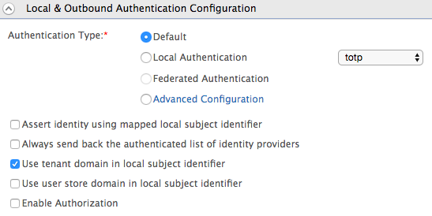

# Session Management with Playground

This topic documents instructions on how to test the OpenID Connect
session management feature with the WSO2 Playground sample application
as the Relying Party (RP) with WSO2 Identity Server as the OpenID
Connect Provider (OP). See [Configuring OpenID Connect Single Logout](../../learn/configuring-openid-connect-single-logout/)
for more information.

!!! info 
    Relying Party (RP) and OpenID Provider (OP) definitions in this context
    is as follows,

    **Relying Parties (RPs)** - OAuth 2.0 Clients using OpenID Connect

    **OpenID Providers (OPs)** - OAuth 2.0 Authentication Servers
    implementing OpenID Connect

### Prerequisites

1.  In order to test the OpenID Connect session management feature, you
    need to have a relying party (RP) implementation. You can use either
    of the following options for this:  
    -   The example pseudo-code for the RP iframe provided in the
        official specification.
    -   The WSO2 Identity Server `playground` sample application. In
        this guide you will be using sample `playground` application to
        try out the scenario.
    
    !!! Tip "Before you begin" 
        To deploy and configure the Playground 
        sample, follow the steps
        [here](../../learn/deploying-the-sample-app/#deploying-the-playground2-webapp).

2.  For this scenario we need two relying party applications. To do
    this, make a copy of the `playground2.war` file that was generated
    when you
    [set up the sample webapp](../../learn/deploying-the-sample-app/#deploying-the-playground2-webapp),
    and rename it as **playground3.war** in the same location.

    Navigate to the following URLs to check both were deployed properly.
    You will be able to see the following screen.

    -   `             http://wso2is.local:8080/playground2/            `
    -   `             http://wso2is.local:8080/playground3/            `

     

### Registering the relying party applications

1.  In the previous section you have
    [registered the `playground2` webapp](learn/deploying-the-sample-app/#configuring-the-service-provider_1).
    If you complete that you can skip steps 2 to 5 below. 
    
2.  Log into the management
    console.[Add a new service provider](../../learn/adding-and-configuring-a-service-provider#adding-a-service-provider)
    named "playground2" and click **Register**.  
    

3.  Expand the **Inbound Authentication Configuration** section and then
    the **OAuth/OpenID Connect Configuration** and click
    **Configure.**  
    For more information, see [Configuring OAuth2-OpenID Connect](../../learn/configuring-oauth2-openid-connect-single-sign-on/).
    
4.  Expand the **Local & Outbound Authentication Configuration** section
    and select **Use tenant domain in local subject identifier** to sign
    the ID token with the user's tenant domain.

     

    !!! note
        **Alternatively,** to sign the ID token with the service provider's
        tenant domain, open the `           deployment.toml          ` file
        found in the
        `           <IS_HOME>/repository/conf          ` folder and
        set the following property to true.
    
        ```toml
        [oauth.oidc.id_token]
        sign_with_sp_key=true
        ```

5.  Enter
    `                       http://wso2is.local:8080/playground2/oauth2client                     `
    as the callback URL and click **Add**.  
     

    !!! note
        At this point, you will see the **client key** and **client secret**.
    
         
    
        Note these values as you will need them later in this process.
    

6.  Repeat steps 1- 4 and register a service provider named as
    "playground3". This step is needed because you need to register the
    second replying party application "playground3`.

### Testing session management with WSO2 Playground

1.  Access the following URL :
    `          http://wso2is.local:8080/playground2/         ` and click
    on **Import Photos**.

2.  Enter the following values and click **Authorize**.  
    -   **Authorization Grant Type:** Authorization Code (with this
        sample you can only test OIDC for the Authorization Code flow)
    -   **Client Id:** Enter the client ID (OAuth Client Key under
        Registering the relying Application, step 4) of the registered
        playground2 application
    -   **Scope:** `            openid           `
    -   **Callback URL:**
        `            http://wso2is.local:8080/playground2/oauth2client           `
    -   **Authorize Endpoint:**
        `            https://localhost:9443/oauth2/authorize           `
    -   **Logout Endpoint:**
        `            https://localhost:9443/oidc/logout           `
    -   **Session Iframe Endpoint:**
        `            https://localhost:9443/oidc/checksession?client_id=<clientID of playground2 application>           `

     

3.  Log in with the user credentials and click **Approve Always** at the
    consent page.

    In order to enable single logout (SLO) you must use the **Approve
    Always** option. If this is not done, the passive request will not
    work, and without passive requests, the SLO protocol will not work. 
    Do this to avoid errors during execution.

     

4.  Once it is successfully authenticated, the OpenIDConnect
    Provider(OP) will redirect back to the client application with the
    authorization code and the session state. You can see this in the
    logs of the console, as seen below.
    
5.  Enter the following values and click **Get Access Token** to receive
    the ID token and access token.  
    -   **Callback URL:**
        `                         http://wso2is.local:8080/playground2/oauth2client                       `
    -   **Access Token Endpoint:**
        `                         https://localhost:9443/oauth2/token                       `
    -   **Client Secret:** Enter the client secret of playground2
        application

    
    
6.  You will receive the access token. You can also enter the **UserInfo
    Endpoint** as
    `                     https://localhost:9443/oauth2/userinfo?schema=openid                   `
    to use the received access token to obtain user claims if needed.  
     
    
7.  Access the following URL on a separate window of the browser, and
    click on **Import Photos:**
    `          http://wso2is.local:8080/playground3/         `
    
8.  Repeat steps 2-6 to invoke the **playground3** application. Make
    sure to change the **Callback URL**, **Client Id** and **Client
    secret** corresponding to **playground3** application when you
    follow the steps.
    
    !!! Tip 
        Step 3 will not be prompted to you as there is already a
        valid session and WSO2 Identity Server will apply SSO for the second
        application.

9.  Once you receive the authorization code for the playground3 app,
    open the browser console of the playground2 app. You will see that
    the RP iframe of playground2 has initiated a passive authentication
    request as the session state changed. Since the response has been
    received, the app will update it’s session state value and keep
    polling the OP iframe again.

     

10. Go back to the browser window of the playground3 app, and click
    **Logout**. Click **Approve** when prompted for consent.
11. Go back to the browser window of the playground2 app. You will see
    that the home page has loaded. If you check the console logs, you
    will note that the the playground2 app’s RP iframe has initiated a
    passive authentication request and has received an error since the
    end user session has ended. This means the app has successfully
    handled this as a single logout scenario.  
     

!!! info "How to keep the user session live in Identity Server"
    In WSO2 Identity Server, you can use an authorization endpoint to
    increase the session idle time.

    To do this, add an iframe to the service provider application which
    sends a `          prompt=none         ` call to the OAuth2
    authorization endpoint after each iteration of n minutes and refreshes
    the user session at the server end. A sample iframe is shown below.

    ``` xml
    <iframe id="refresh_iframe" src="#" style="width:0;height:0;border:0; border:none;"></iframe><script>setInterval(function(){document.getElementById('refresh_iframe').src
    ="https://localhost:9443/oauth2/authorize prompt=none&scope=openid&response_type=code&redirect_uri=http%3A%2F%2Flocalhost%3A8080%2Fplayground2%2Fprompt-none callback.jsp&client_id=7x72byIYC40dlCuu6bovOTdK2MMa";},300000);</script>
    ```

!!! tip
    
    Redirect to a logout URL after RP-initiated logout
    
    You can specify a logout URL so that the application redirects to a
    particular page after the RP sends the OpenID Connect logout request.
    For more information on how to configure the redirect logout, see
    [OpenID Connect Logout URL
    Redirection](../../learn/openid-connect-logout-url-redirection/).