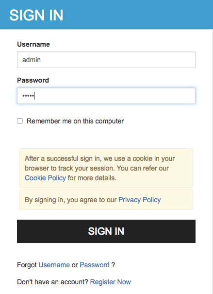

# Try Authorization Code Grant

The Authorization Code Grant is one of the grant types in the OAuth 2.0
specification. For more information about this grant type, see
[Authorization Code Grant](../../learn/authorization-code-grant).

!!! note "Before you begin" 
    You must first
    [set up the `playground` sample webapp.](../../learn/deploying-the-sample-app/#deploying-the-playground2-webapp)
    in order to try the following scenario.   

This section demonstrates the Authorization Code Grant with PKCE and
without PKCE.

!!! info 
    The Proof Key for Code Exchange (PKCE) is a specification supported by
    WSO2 Identity Server to mitigate code interception attacks. See
    [Mitigating Authorization Code Interception
    Attacks](../../administer/mitigating-authorization-code-interception-attacks)
    to configure PKCE for an OAuth application.

#### **Running the application (without PKCE)**

1.  Visit the URL <http://wso2is.local:8080/playground2/oauth2.jsp> to
    start the application.

2.  Enter the following details and click **Authorize**. For
    information on how to obtain these authorization details, see
    [Configuring OAuth2-OpenID
    Connect](../../learn/configuring-oauth2-openid-connect).

    **Authorization Grant Type:** Authorization Code 
    
    **Client ID:** (the client id received at the
    [application registration](../../learn/deploying-the-sample-app/#configuring-the-service-provider_1)
    
    **Callback URL:**
    <http://wso2is.local:8080/playground2/oauth2client>  
    
    **Authorize Endpoint:** <https://localhost:9443/oauth2/authorize>
    
    **Scope:** Any scope you wish to obtain the token for (Optional)

      
     
    
    !!! Tip 
        The playground application will send an
        [authorization request](https://tools.ietf.org/html/rfc6749#section-4.1.1)
        the **authorize** endpoint of the WSO2 Identity Server using the
        following format.
        
        ```java
        https://<host>:<port>/oauth2/authorize?response_type=code
        &client_id=<client-ID>
        &redirect_uri=<callback-url>
        &scope=<scope>
        ```
        
        !!! Example
            ```java
            https://localhost:9443/oauth2/authorize?response_type=code
            &client_id=Cx4LKFNObeuXocx7xgOpz5vfzFoa
            &redirect_uri=http://wso2is.local:8080/playground2/oauth2client
            &scope=openid
            ``` 

3.  Log in with the user credentials.  
     

      

4.  Select **Approve Once** or **Approve Always** in Access to profile
    information section. Also, select the attributes you agree to share.
    Click **Continue**.  
     

      

5.  Provide the following details and click on **Get Access Token**.

    Callback URL: <http://wso2is.local:8080/playground2/oauth2client>  
    Access Token Endpoint: <https://localhost:9443/oauth2/token>  
    Client Secret: (client secret received at the [application
                                    registration](../../learn/deploying-the-sample-app/#configuring-the-service-provider_1))  

       
      

    At this point, the application receives the Access Token. Enter the
    introspection endpoint (i.e,
    <https://localhost:9443/oauth2/introspect> ) and click **Get
    TokenInfo** to get the token information.  
      

    ??? note "Click here for more information on OAuth 2.0 Token Introspection"
        OAuth 2.0 Token Introspection defines a protocol that allows
        authorized protected resources to query the authorization server to
        determine the set of metadata for a given token that was presented
        to them by an OAuth Client. This metadata includes whether or not
        the token is currently active (or if it has expired or otherwise
        been revoked), what rights of access the token carries (usually
        conveyed through OAuth 2.0 scopes), and the authorization context in
        which the token was granted (including who authorized the token and
        which client it was issued to). Token introspection allows a
        protected resource to query this information regardless of whether
        or not it is carried in the token itself, allowing this method to be
        used along with or independently of structured token values.

    

6.  Now you should be able to see the access token information as seen
    below, as long as the provided access token is valid.  
    

#### **Running the application (with PKCE)**

1.  Visit the URL <http://wso2is.local:8080/playground2/oauth2.jsp> to
    start the application.

2.  Enter the following details and click **Authorize**.

    Authorization Grant Type: Authorization Code  
    Client ID: (the client id received at the [application
                                    registration](../../learn/deploying-the-sample-app/#configuring-the-service-provider_1))  
    Callback URL: <http://wso2is.local:8080/playground2/oauth2client>  
    Authorize Endpoint: <https://localhost:9443/oauth2/authorize>  
    Use PKCE: Yes  
    PKCE Challenge Method:

    

      

3.  Log in with the user credentials.  
    

4.  Click **Approve** to consent to this action.

    

5.  Provide the following details and click on **Get Access Token**.

    Callback URL: <http://wso2is.local:8080/playground2/oauth2client>  
    Access Token Endpoint: <https://localhost:9443/oauth2/token>  
    Client Secret: (client secret received at the [application
                                        registration](../../learn/deploying-the-sample-app/#configuring-the-service-provider_1))    
    PKCE Verifier: (this will be populated using the value generated in
    step 1)

      
      

6.  At this point, the application receives the Access Token. Enter the
    introspection endpoint (i.e,
    <https://localhost:9443/oauth2/introspect> ) and click **Get
    TokenInfo** to get the token information.

    ??? note "Click here for more information on OAuth 2.0 Token Introspection"
        OAuth 2.0 Token Introspection defines a protocol that allows
        authorized protected resources to query the authorization server to
        determine the set of metadata for a given token that was presented
        to them by an OAuth Client. This metadata includes whether or not
        the token is currently active (or if it has expired or otherwise
        been revoked), what rights of access the token carries (usually
        conveyed through OAuth 2.0 scopes), and the authorization context in
        which the token was granted (including who authorized the token and
        which client it was issued to). Token introspection allows a
        protected resource to query this information regardless of whether
        or not it is carried in the token itself, allowing this method to be
        used along with or independently of structured token values.

      
    

7.  Now you should be able to see the access token information as seen
    below, as long as the provided access token is valid.  
     

!!! info "Related Topics"
    -   See [Invoke the OAuth Introspection
        Endpoint](../../learn/invoke-the-oauth-introspection-endpoint)
        to invoke the OAuth introspection endpoint using cURL commands.
    -   See [Mitigating Authorization Code Interception
        Attacks](../../administer/mitigating-authorization-code-interception-attacks)
        for more information about using PKCE with an OAuth application.
