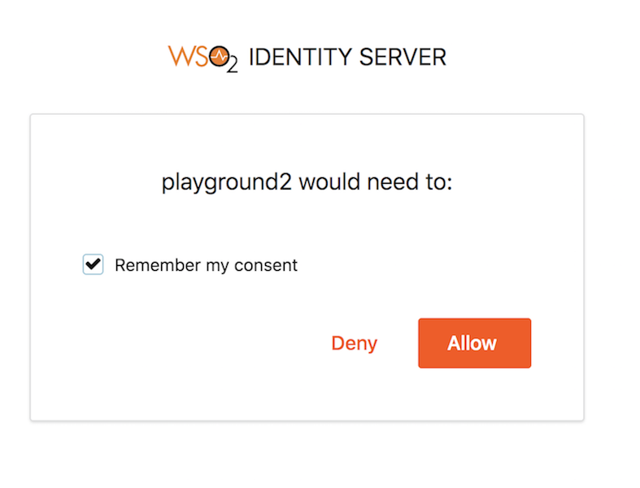
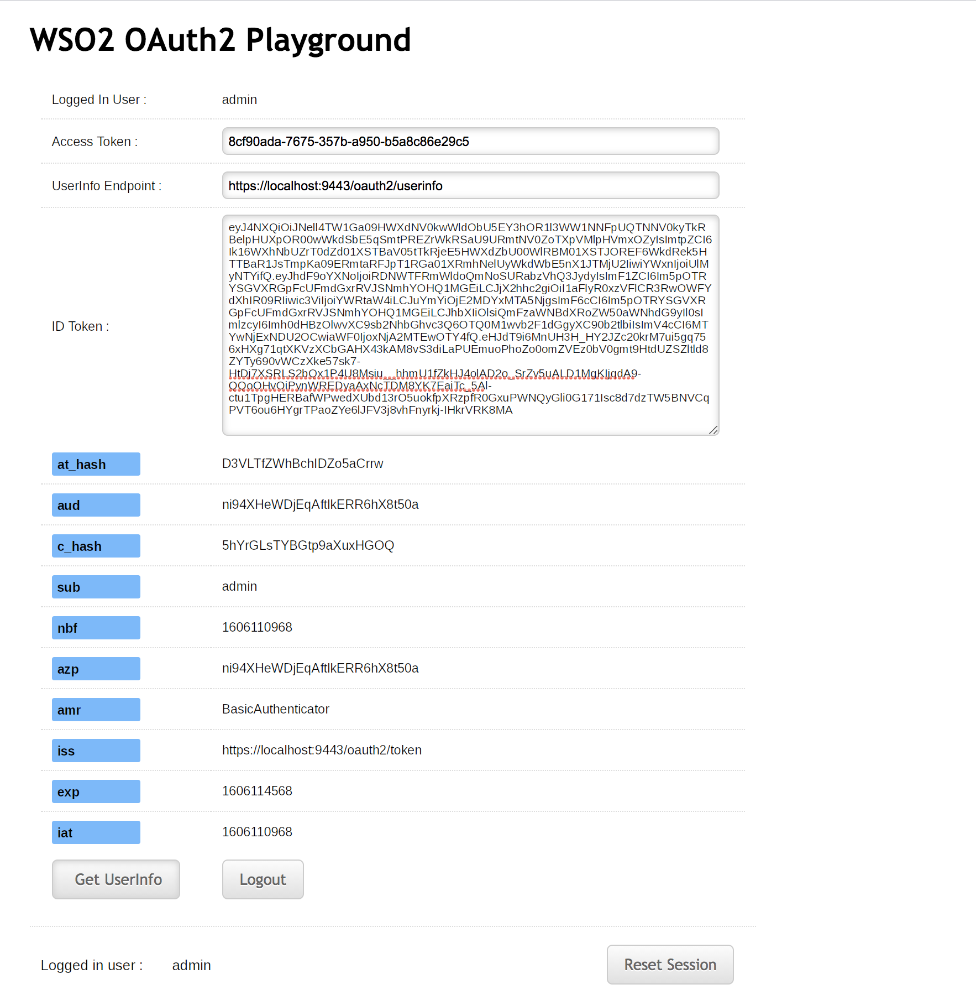
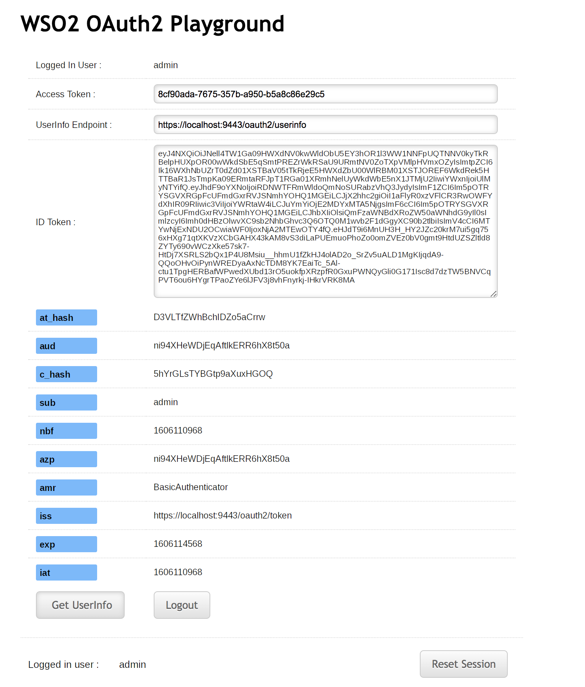

# Try Authorization Code Grant

The Authorization Code Grant is one of the grant types in the OAuth 2.0
specification. For more information about this grant type, see
[Authorization Code Grant](../../learn/authorization-code-grant).

!!! note "Before you begin" 
    You must first
    [set up the `playground` sample webapp.](../../learn/deploying-the-sample-app/#deploying-the-playground2-webapp)
    in order to try the following scenario.   

This section demonstrates the Authorization Code Grant with PKCE and
without PKCE.

!!! info 
    The Proof Key for Code Exchange (PKCE) is a specification supported by
    WSO2 Identity Server to mitigate code interception attacks. See
    [Mitigating Authorization Code Interception
    Attacks](../../administer/mitigating-authorization-code-interception-attacks)
    to configure PKCE for an OAuth application.

## Running the application (without PKCE)

1.  Visit the URL <http://localhost:8080/playground2/oauth2.jsp> to
    start the application.

2.  Enter the following details and click **Authorize**. For
    information on how to obtain these authorization details, see
    [Configuring OAuth2-OpenID
    Connect](../../learn/configuring-oauth2-openid-connect).

    **Authorization Grant Type:** Authorization Code 
    
    **Client ID:** (the client id received at the
    [application registration](../../learn/deploying-the-sample-app/#configuring-the-service-provider_1)
    
    **Callback URL:**
    <http://localhost:8080/playground2/oauth2client>  
    
    **Authorize Endpoint:** <https://localhost:9443/oauth2/authorize>
    
    **Scope:** Any scope you wish to obtain the token for (Optional)

     
    
    !!! Tip 
        The playground application will send an
        [authorization request](https://tools.ietf.org/html/rfc6749#section-4.1.1)
        the **authorize** endpoint of the WSO2 Identity Server using the
        following format.
        
        ```java
        https://<host>:<port>/oauth2/authorize?response_type=code
        &client_id=<client-ID>
        &redirect_uri=<callback-url>
        &scope=<scope>
        ```
        
        !!! Example
            ```java
            https://localhost:9443/oauth2/authorize?response_type=code
            &client_id=Cx4LKFNObeuXocx7xgOpz5vfzFoa
            &redirect_uri=http://wso2is.local:8080/playground2/oauth2client
            &scope=openid
            ``` 

3.  Log in with the user credentials.  
     

4.  Click **Allow**.
     

5.  Provide the following details and click **Get Access Token**.

    -   Callback URL: `http://wso2is.local:8080/playground2/oauth2client`
    -   Access Token Endpoint: `https://localhost:9443/oauth2/token`
    -   Client Secret: (client secret received at the application registration)

6.  Now you should be able to view the information as shown below.
    

## Running the application (with PKCE)

1.  Visit the URL <http://wso2is.local:8080/playground2/oauth2.jsp> to
    start the application.

2.  Enter the following details and click **Authorize**.

    Authorization Grant Type: Authorization Code  
    Client ID: (the client id received at the [application
                                    registration](../../learn/deploying-the-sample-app/#configuring-the-service-provider_1))  
    Callback URL: <http://localhost:8080/playground2/oauth2client>  
    Authorize Endpoint: <https://localhost:9443/oauth2/authorize>  
    Use PKCE: Yes  
    PKCE Challenge Method:

    

3.  Log in with the user credentials.  
    

4.  Click **Allow**.
    

5.  Provide the following details and click **Get Access Token**.

    -   Callback URL: `http://localhost:8080/playground2/oauth2client`
    -   Access Token Endpoint: `https://localhost:9443/oauth2/token`
    -   Client Secret: (client secret received at the application registration)

6.  Now you should be able to view the information as shown
    below.
     

!!! info "Related Topics"
    -   See [Invoke the OAuth Introspection
        Endpoint](../../learn/invoke-the-oauth-introspection-endpoint)
        to invoke the OAuth introspection endpoint using cURL commands.
    -   See [Mitigating Authorization Code Interception
        Attacks](../../administer/mitigating-authorization-code-interception-attacks)
        for more information about using PKCE with an OAuth application.
