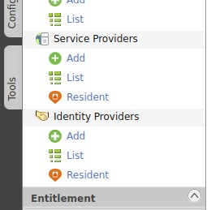
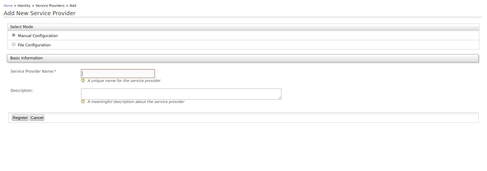
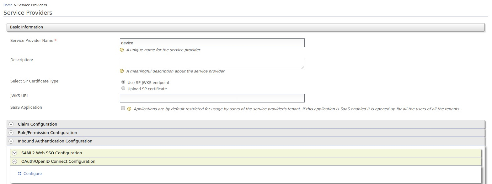
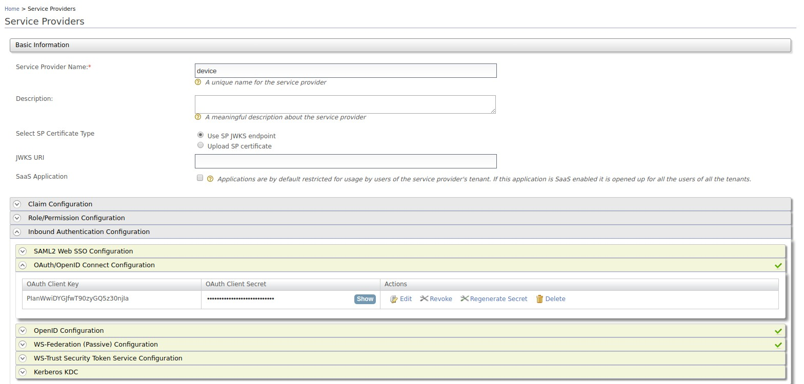
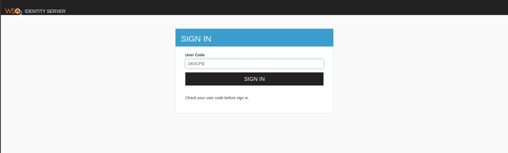
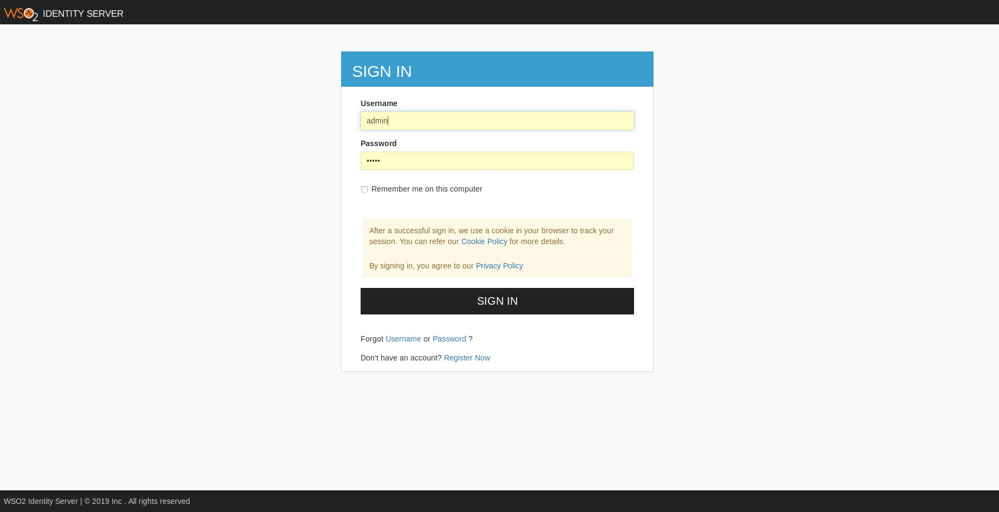
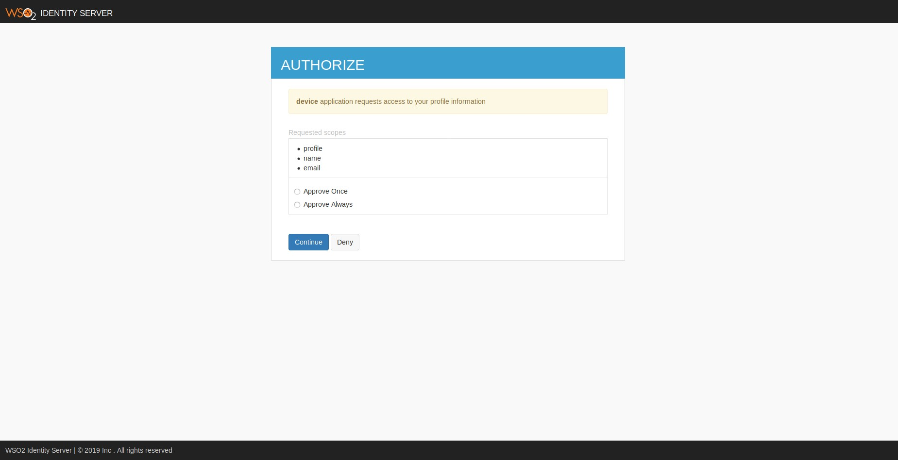

# Try Device Authorization Grant

The Device Authorization Grant is one of the grant types in the OAuth 2.0
specification. For more information about this grant type, see
[Device Authorization Grant](../../learn/device-flow-grant).
This section guides you on how to try out the Device Authorization grant type.

### Device Authorization Grant Configurations

Following are the device authorization grant properties that are configurable.

<table>
    <thead>
        <tr class="header">
            <th>
                Name
            </th>
            <th>
                Description
            </th>
            <th>
                Configuration
            </th>
        </tr>
    </thead>
    <tbody>
        <tr class="even">
            <td>
                <p>Key length</p>
            </td>
            <td>
                <p>The length of the user code.</p>
            </td>
            <td>
                key_length
            </td>
        </tr>
        <tr class="odd">
            <td>
                <p>Expiry time</p>
            </td>
            <td>
                <p>The expiry time of the user code and the device code.</p>
            </td>
            <td>
                expiry_time
            </td>
        </tr>
        <tr class="even">
            <td>
                <p>Polling interval</p>
            </td>
            <td>
                <p>The minimum delay of the client between each polling request to the
                 token endpoint.</p> 
            </td>
            <td>
                polling_interval
            </td>
        </tr>
        <tr class="odd">
            <td>
                <p>Key set</p>
            </td>
            <td>
                <p>The set of characters that is used to generate the user code.</p>
            </td>
            <td>
                key_set
            </td>
        </tr>
    </tbody>
</table>

### Configuring Device Authorization Grant properties during deployment

All the above parameters can be configured at the server level through the `deployment.toml` file. A sample configuration 
is shown below. 

```
[oauth.grant_type.device_code]
key_length = 7
expiry_time = "10m"
polling_interval = "5s"
key_set = "BCDFGHJKLMNPQRSTVWXYZbcdfghjklmnpqrstvwxyz23456789"
```

    
1. Navigate to <IS_HOME>/bin and start the server by executing the following command on a terminal window.

    ``` java tab="Linux/MacOS"
    sh wso2server.sh
    ```
    
    ``` java tab="Windows"
    wso2server.bat run
    ```

2. Access the [WSO2 Identity Server Management Console] (https://localhost:9443/carbon) and log in using your user
 name and password.

3. On the **Main** menu, click **Service Providers** > **Add**.

    
    
    

4. Expand **Inbound Authentication Configuration**  > **OAuth/OpenID Connect Configuration**. Click **Configure**.

    

5. Select `urn:ietf:params:oauth:grant-type:device_code` to enable using the device flow grant type. 

    !!! info
        Since these are public clients, ensure that the **Allow authentication without the client secret** option is checked.

6. Next, click **Update** to save the service provider configurations. Note the generated OAuth client key and client
 secret.

    

    !!! tip
        When configuring with your device, configure the client ID as your OAuth client-key.

7. Open a terminal window and run the following command to send a request to the `device_authorize` endpoint. 

    The client (the device) is initiating this request to obtain a device
    code, a user code, and a verification URI from the authorization server.

    <table>
    <tbody>
    <tr class="odd">
    <td>Request</td>
    <td>
    <div class="code panel pdl" style="border-width: 1px;">
    <div class="codeHeader panelHeader pdl" style="border-bottom-width: 1px;">
    <strong>Request</strong>
    </div>
    <div class="codeContent panelContent pdl">
    <div class="sourceCode" id="cb1" data-syntaxhighlighter-params="brush: bash; gutter: false; theme: Confluence" data-theme="Confluence" style="brush: bash; gutter: false; theme: Confluence"><pre class="sourceCode bash"><code class="sourceCode bash"><a class="sourceLine" id="cb1-1" title="1"><span class="ex">curl</span> -k -X POST -H <span class="st">&#39;Content-Type: application/x-www-form-urlencoded&#39;</span> --data-urlencode <span class="st">'client_id=<span class="op">&lt;</span>CLIENT_ID<span class="op">&gt;</span>'</span> https://localhost:9443/oauth2/device_authorize</a></code></pre></div>
    </div>
    </div>
    <div class="code panel pdl" style="border-width: 1px;">
    <div class="codeHeader panelHeader pdl" style="border-bottom-width: 1px;">
    <strong>Sample cURL</strong>
    </div>
    <div class="codeContent panelContent pdl">
    <div class="sourceCode" id="cb1" data-syntaxhighlighter-params="brush: bash; gutter: false; theme: Confluence" data-theme="Confluence" style="brush: bash; gutter: false; theme: Confluence"><pre class="sourceCode bash"><code class="sourceCode bash"><a class="sourceLine" id="cb1-1" title="1"><span class="ex">curl</span> -k -X POST -H <span class="st">&#39;Content-Type: application/x-www-form-urlencoded&#39;</span> --data-urlencode <span class="st">'client_id=bbwJEayR_OMwPkAgm9VOMzLnYLga'</span> https://localhost:9443/oauth2/device_authorize</a></code></pre></div>
    </div>
    </div></td>
    </tr>
    <tr class="even">
    <td>Response</td>
    <td><div class="code panel pdl" style="border-width: 1px;">
    <div class="codeContent panelContent pdl">
    <div class="sourceCode" id="cb3" data-syntaxhighlighter-params="brush: java; gutter: false; theme: Confluence" data-theme="Confluence" style="brush: java; gutter: false; theme: Confluence"><pre class="sourceCode java"><code class="sourceCode java"><a class="sourceLine" id="cb3-1" title="1">{"user_code":"s2DqSNK","device_code":"d3fe0db1-2334-48fa-b7d9-821ecfad10d5","interval":5000,"verification_uri_complete":"https://localhost:9443/authenticationendpoint/device.do?user_code=s2DqSNK","verification_uri":"https://localhost:9443/authenticationendpoint/device.do","expires_in":3600}</a></code></pre></div>
    </div>
    </div></td>
    </tr>
    </tbody>
    </table>

8. Access the obtained <code>verification_uri</code> from your non input-constrained device. You can either enter
 the user code there or access the <code>verification_uri_complete</code> obtained from the response.

    

12. Click Sign In. If the user code is correct, you will be prompted to enter your credentials. If you have entered the
 wrong user code or an expired(user code is one time use code) one, it will ask to re-enter your user code. In that
  case, get a new user code following the previous steps and enter the new user code along with your credentials.
 
    
    
    

13. Upon successful authentication, you will be redirected to the configured callback URL of the service provider.

14. To obtain an access token and a refresh token, the client must call the <code>/token</code> endpoint of the
 authorization server. The client will poll the authorization server with the polling interval mentioned in the
  response in step 7. 
  
    Open a terminal window and run the following command to send a token request to the authorization server.
    
    <table>
    <tbody>
    <tr class="odd">
    <td>Request</td>
    <td>
    <div class="code panel pdl" style="border-width: 1px;">
    <div class="codeHeader panelHeader pdl" style="border-bottom-width: 1px;">
    <strong>Request</strong>
    </div>
    <div class="codeContent panelContent pdl">
    <div class="sourceCode" id="cb1" data-syntaxhighlighter-params="brush: bash; gutter: false; theme: Confluence" data-theme="Confluence" style="brush: bash; gutter: false; theme: Confluence"><pre class="sourceCode bash"><code class="sourceCode bash"><a class="sourceLine" id="cb1-1" title="1"><span class="ex">curl</span> -k -X POST -H <span class="st">&#39;Content-Type: application/x-www-form-urlencoded&#39;</span> --data-urlencode <span class="st">'grant_type=urn:ietf:params:oauth:grant-type:device_code'</span> --data-urlencode <span class="st">'client_id=<span class="op">&lt;</span>CLIENT_ID<span class="op">&gt;</span>'</span> --data-urlencode <span class="st">'device_code=<span class="op">&lt;</span>DEVICE_CODE<span class="op">&gt;</span>'</span> https://localhost:9443/oauth2/token</a></code></pre></div>
    </div>
    </div>
    <div class="code panel pdl" style="border-width: 1px;">
    <div class="codeHeader panelHeader pdl" style="border-bottom-width: 1px;">
    <strong>Sample cURL</strong>
    </div>
    <div class="codeContent panelContent pdl">
    <div class="sourceCode" id="cb1" data-syntaxhighlighter-params="brush: bash; gutter: false; theme: Confluence" data-theme="Confluence" style="brush: bash; gutter: false; theme: Confluence"><pre class="sourceCode bash"><code class="sourceCode bash"><a class="sourceLine" id="cb1-1" title="1"><span class="ex">curl</span> -k -X POST -H <span class="st">&#39;Content-Type: application/x-www-form-urlencoded&#39;</span> --data-urlencode <span class="st">'grant_type=urn:ietf:params:oauth:grant-type:device_code'</span> --data-urlencode <span class="st">'client_id=bbwJEayR_OMwPkAgm9VOMzLnYLga'</span> --data-urlencode <span class="st">'device_code=7411f395-2f3a-4cb5-8562-d7059d69c66f'</span> https://localhost:9443/oauth2/token</a></code></pre></div>
    </div>
    </div></td>
    </tr>
    <tr class="even">
    <td>Response</td>
    <td><div class="code panel pdl" style="border-width: 1px;">
    <div class="codeContent panelContent pdl">
    <div class="sourceCode" id="cb3" data-syntaxhighlighter-params="brush: java; gutter: false; theme: Confluence" data-theme="Confluence" style="brush: java; gutter: false; theme: Confluence"><pre class="sourceCode java"><code class="sourceCode java"><a class="sourceLine" id="cb3-1" title="1">{"access_token":"74d610ab-7f4a-3b11-90e8-279d76644fc7","refresh_token":"fdb58069-ecc7-3803-9b8b-6f2ed85eff19","token_type":"Bearer","expires_in":3042}</a></code></pre></div>
    </div>
    </div></td>
    </tr>
    </tbody>
    </table>

14. To validate your token, use the introspection endpoint. [Invoke the OAuth Introspection Endpoint](../../learn/invoke-the-oauth-introspection-endpoint)
