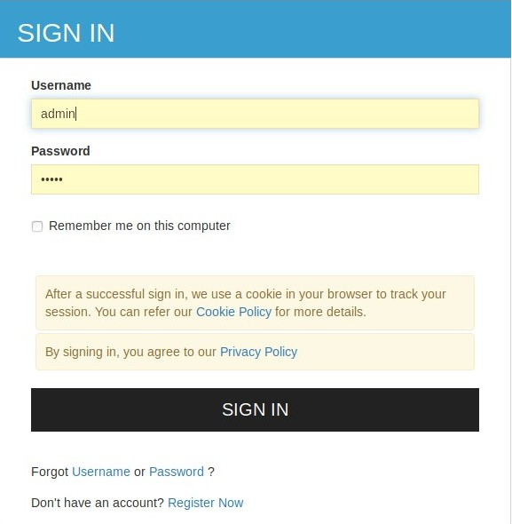
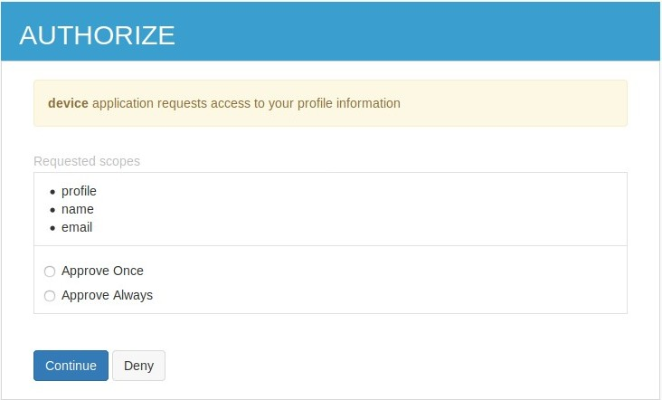
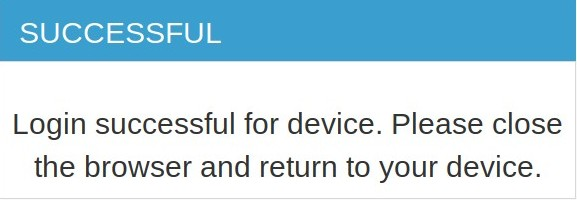

# Try Device Authorization Grant

The Device Authorization Grant is one of the grant types in the OAuth 2.0
specification. For more information about this grant type, see
[Device Authorization Grant](../../learn/device-flow-grant).

!!! note "Before you begin" 
    You must first set up the `Device Flow Demo App` sample webapp.
    in order to try the following scenario.   
    
1. Navigate to <IS_HOME>/bin and start the server by executing the following command on a terminal window.

    ``` java tab="Linux/MacOS"
    sh wso2server.sh
    ```

    ``` java tab="Windows"
    wso2server.bat run
    ```

2. Access the [WSO2 Identity Server Management Console] (https://localhost:9443/carbon) and log in using your user
 name and password.

3. On the **Main** menu, click **Users and Roles > Add**.

4. Then click **Add New User**.

    

5. On the **Main** menu, click **Service Providers > Add**.

6. Enter the **Service Provider Name** and click **Register**. 

    

    

7. Expand **Inbound Authentication Configuration** and then expand **OAuth/OpenID Connect** Configuration. Click **Configure**.

   

8. Select `urn:ietf:params:oauth:grant-type:device_code` to enable using the device flow grant type. 

    !!! info
    Since these are public clients, ensure that the **Allow authentication without the client secret** checkbox is selected.

    Next, click **Update** to save the service provider configurations. Take a note of the OAuth client key and client secret generated.

9. On your device (i.e., the demo app), configure the client ID as your OAuth client-key.

   

10. Start the demo app.

   

11. Now, click **Login**. This device will send a request to the /device_authorize endpoint along with its
 client ID.

For example:
    `https://localhost:9443/oauth2/device_authorize?client_id=GyPm7DliFituWP1fvWxhNcQOlGYa&scope=somescope_code`

    

12. Access the provided verification URI on your secondary device. You can either enter the user code there or scan the
 provided QR code. The QR code contains the complete verification URI(verification URI + user code).

    

13. Click **Sign In**. If the user code is correct, you will be prompted to enter your credentials. If you have entered the
 wrong user code or an expired(a user code is for one-time use) one, you will be prompted to re-enter your user code. In that case
  get a new user code and enter that along with your credentials.
 
    

    

You will be redirected to the device flow success page. Note that you are now successfully logged in to the service
 provider and you are instructed to close the browser.



On you demo app, you will see the following screen


To see the device authorization response and token response, navigate to the **Developer** tab. To validate your token
, use the introspection endpoint. For more details, see [Invoke the OAuth Introspection Endpoint](../../learn/invoke-the-oauth
-introspection-endpoint).
