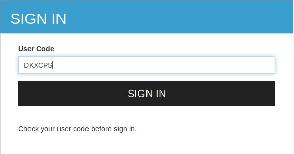

# Try Device Authorization Grant

The Device Authorization Grant is a grant type in the OAuth 2.0
specification. For more information, see
[Device Authorization Grant](../../learn/device-flow-grant).
This section guides you on how to try out the Device Authorization grant type.

### Configure Device Authorization Grant properties during deployment

The following are the configurable properties of the device authorization grant.

<table>
    <thead>
        <tr class="header">
            <th>
                Name
            </th>
            <th>
                Description
            </th>
            <th>
                Parameter
            </th>
        </tr>
    </thead>
    <tbody>
        <tr class="even">
            <td>
                <p>Key length</p>
            </td>
            <td>
                <p>The length of the user code.</p>
            </td>
            <td>
                key_length
            </td>
        </tr>
        <tr class="odd">
            <td>
                <p>Expiry time</p>
            </td>
            <td>
                <p>The expiry time of the user code and the device code.</p>
            </td>
            <td>
                expiry_time
            </td>
        </tr>
        <tr class="even">
            <td>
                <p>Polling interval</p>
            </td>
            <td>
                <p>The minimum delay of the client between each polling request to the
                 token endpoint.</p> 
            </td>
            <td>
                polling_interval
            </td>
        </tr>
        <tr class="odd">
            <td>
                <p>Key set</p>
            </td>
            <td>
                <p>The set of characters that is used to generate the user code.</p>
            </td>
            <td>
                key_set
            </td>
        </tr>
    </tbody>
</table>

All the above parameters can be configured at the server level from the `deployment.toml` file. A sample configuration 
is shown below. 

```
[oauth.grant_type.device_code]
key_length = 7
expiry_time = "10m"
polling_interval = "5s"
key_set = "BCDFGHJKLMNPQRSTVWXYZbcdfghjklmnpqrstvwxyz23456789"
```

### Configure Device Authorization Grant for an application
    
1. Start the WSO2 Identity server by executing the following command in the  <IS_HOME>/bin folder.

    ``` java tab="Linux/MacOS"
    sh wso2server.sh
    ```
    
    ``` java tab="Windows"
    wso2server.bat run
    ```

2. Access the [WSO2 Identity Server Management Console](https://localhost:9443/carbon) and log in using your username and password.

3. On the **Main** menu, click **Service Providers** > **Add**.

    

4. Provide a name for your application and click **Register**.
    
    

5. On the screen that follows, expand **Inbound Authentication Configuration**  > **OAuth/OpenID Connect Configuration** and click **Configure**.

    

6. Select `urn:ietf:params:oauth:grant-type:device_code` to enable device flow grant type. 

    !!! info
        Since these are public clients, ensure that the **Allow authentication without the client secret** option is checked.

7. Click **Add** to save the service provider configurations. Take note of the generated OAuth client key and client
 secret.

    

    !!! tip
        When configuring with your device, use the client ID as your OAuth client-key.

### Try it out

1. Open a terminal window and run the following command to send a request to the `device_authorize` endpoint. 

    <table>
    <tbody>
    <tr class="odd">
    <td>Request</td>
    <td>
    <div class="code panel pdl" style="border-width: 1px;">
    <div class="codeHeader panelHeader pdl" style="border-bottom-width: 1px;">
    <strong>Request</strong>
    </div>
    <div class="codeContent panelContent pdl">
    <div class="sourceCode" id="cb1" data-syntaxhighlighter-params="brush: bash; gutter: false; theme: Confluence" data-theme="Confluence" style="brush: bash; gutter: false; theme: Confluence"><pre class="sourceCode bash"><code class="sourceCode bash"><a class="sourceLine" id="cb1-1" title="1"><span class="ex">curl</span> -k -X POST -H <span class="st">&#39;Content-Type: application/x-www-form-urlencoded&#39;</span> --data-urlencode <span class="st">'client_id=<span class="op">&lt;</span>CLIENT_ID<span class="op">&gt;</span>'</span> https://localhost:9443/oauth2/device_authorize</a></code></pre></div>
    </div>
    </div>
    <div class="code panel pdl" style="border-width: 1px;">
    <div class="codeHeader panelHeader pdl" style="border-bottom-width: 1px;">
    <strong>Sample cURL</strong>
    </div>
    <div class="codeContent panelContent pdl">
    <div class="sourceCode" id="cb1" data-syntaxhighlighter-params="brush: bash; gutter: false; theme: Confluence" data-theme="Confluence" style="brush: bash; gutter: false; theme: Confluence"><pre class="sourceCode bash"><code class="sourceCode bash"><a class="sourceLine" id="cb1-1" title="1"><span class="ex">curl</span> -k -X POST -H <span class="st">&#39;Content-Type: application/x-www-form-urlencoded&#39;</span> --data-urlencode <span class="st">'client_id=bbwJEayR_OMwPkAgm9VOMzLnYLga'</span> https://localhost:9443/oauth2/device_authorize</a></code></pre></div>
    </div>
    </div></td>
    </tr>
    <tr class="even">
    <td>Response</td>
    <td><div class="code panel pdl" style="border-width: 1px;">
    <div class="codeContent panelContent pdl">
    <div class="sourceCode" id="cb3" data-syntaxhighlighter-params="brush: java; gutter: false; theme: Confluence" data-theme="Confluence" style="brush: java; gutter: false; theme: Confluence"><pre class="sourceCode java"><code class="sourceCode java"><a class="sourceLine" id="cb3-1" title="1">{"user_code":"s2DqSNK","device_code":"d3fe0db1-2334-48fa-b7d9-821ecfad10d5","interval":5000,"verification_uri_complete":"https://localhost:9443/authenticationendpoint/device.do?user_code=s2DqSNK","verification_uri":"https://localhost:9443/authenticationendpoint/device.do","expires_in":3600}</a></code></pre></div>
    </div>
    </div></td>
    </tr>
    </tbody>
    </table>

    The client (the device) initiates this request to the authorization server. In the response, the client receives a **device code**, a **user code**, and a **verification URI**. The client starts polling the **/token** endpoint of the authorization server using the **decice_code** at an interval as specified in the response.

2. From a device with no input constraints, access the <code>verification_uri</code> and enter the user code. You can alternatively access the <code>verification_uri_complete</code> link obtained in the response.

    

3. Click **Continue**. If the user code is correct, you will be prompted to enter your credentials.
 
    

    !!! info
        A user code is for one time use only. If your code is expired or if you have entered a wrong user code, get a new user code by following the previous steps.

4. Once you log in successfully, you will be redirected to the configured callback URL of the service provider.

    

5. The client, who has been polling the **/token** endpoint, receives the access token and the refresh token. To try this, open a terminal window and send the following token request to the authorization server.
    
    <table>
    <tbody>
    <tr class="odd">
    <td>Request</td>
    <td>
    <div class="code panel pdl" style="border-width: 1px;">
    <div class="codeHeader panelHeader pdl" style="border-bottom-width: 1px;">
    <strong>Request</strong>
    </div>
    <div class="codeContent panelContent pdl">
    <div class="sourceCode" id="cb1" data-syntaxhighlighter-params="brush: bash; gutter: false; theme: Confluence" data-theme="Confluence" style="brush: bash; gutter: false; theme: Confluence"><pre class="sourceCode bash"><code class="sourceCode bash"><a class="sourceLine" id="cb1-1" title="1"><span class="ex">curl</span> -k -X POST -H <span class="st">&#39;Content-Type: application/x-www-form-urlencoded&#39;</span> --data-urlencode <span class="st">'grant_type=urn:ietf:params:oauth:grant-type:device_code'</span> --data-urlencode <span class="st">'client_id=<span class="op">&lt;</span>CLIENT_ID<span class="op">&gt;</span>'</span> --data-urlencode <span class="st">'device_code=<span class="op">&lt;</span>DEVICE_CODE<span class="op">&gt;</span>'</span> https://localhost:9443/oauth2/token</a></code></pre></div>
    </div>
    </div>
    <div class="code panel pdl" style="border-width: 1px;">
    <div class="codeHeader panelHeader pdl" style="border-bottom-width: 1px;">
    <strong>Sample cURL</strong>
    </div>
    <div class="codeContent panelContent pdl">
    <div class="sourceCode" id="cb1" data-syntaxhighlighter-params="brush: bash; gutter: false; theme: Confluence" data-theme="Confluence" style="brush: bash; gutter: false; theme: Confluence"><pre class="sourceCode bash"><code class="sourceCode bash"><a class="sourceLine" id="cb1-1" title="1"><span class="ex">curl</span> -k -X POST -H <span class="st">&#39;Content-Type: application/x-www-form-urlencoded&#39;</span> --data-urlencode <span class="st">'grant_type=urn:ietf:params:oauth:grant-type:device_code'</span> --data-urlencode <span class="st">'client_id=bbwJEayR_OMwPkAgm9VOMzLnYLga'</span> --data-urlencode <span class="st">'device_code=7411f395-2f3a-4cb5-8562-d7059d69c66f'</span> https://localhost:9443/oauth2/token</a></code></pre></div>
    </div>
    </div></td>
    </tr>
    <tr class="even">
    <td>Response</td>
    <td><div class="code panel pdl" style="border-width: 1px;">
    <div class="codeContent panelContent pdl">
    <div class="sourceCode" id="cb3" data-syntaxhighlighter-params="brush: java; gutter: false; theme: Confluence" data-theme="Confluence" style="brush: java; gutter: false; theme: Confluence"><pre class="sourceCode java"><code class="sourceCode java"><a class="sourceLine" id="cb3-1" title="1">{"access_token":"74d610ab-7f4a-3b11-90e8-279d76644fc7","refresh_token":"fdb58069-ecc7-3803-9b8b-6f2ed85eff19","token_type":"Bearer","expires_in":3042}</a></code></pre></div>
    </div>
    </div></td>
    </tr>
    </tbody>
    </table>

6. To validate the token that you received, [use the introspection endpoint](../../learn/invoke-the-oauth-introspection-endpoint)
