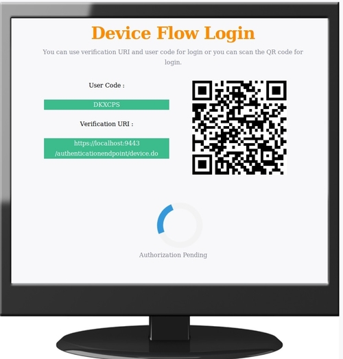

# Try Device Authorization Grant

The Device Authorization Grant is one of the grant types in the OAuth 2.0
specification. For more information about this grant type, see
[Device Authorization Grant](../../learn/device-flow-grant).

!!! note "Before you begin" 
    You must first set up the `Device Flow Demo App` sample webapp.
    in order to try the following scenario.   
    
Step 1:
Start WSO2 identity server by typing `sh wso2server.sh` in a terminal running on <IS_HOME>/bin/ .

Step 2:
Login to management console by providing your username and password.

Step 3:
Go to `identity->Users and Roles` and add a new user.

Step 4:
Now go to service providers and register a new service provider by providing a service provider name.

Step 5:
Go to `Service Providers-->List` and edit your service provider with OAuth.

Step 6:
Go to `Inbound Authentication Configuration-->OAuth/OpenID Connect Configuration` and click configure.

Step 7:
You need to tick `urn:ietf:params:oauth:grant-type:device_code` for use device flow grant type. Since these are 
treated as public clients, always remember to put a tick on Allow authentication without the client secret. 
After that update your service provider. Now you can see your OAuth client key and OAuth client secret.

Step 8:
In your device (this case demo app) you need to configure client id as your OAuth client-key.

Step 9:
Start the demo app.

Step 10:
Now click the login button.
This device will send a request to `/device_authorize` endpoint along with its client id.

ex: 

    https://localhost:9443/oauth2/device_authorize?client_id=GyPm7DliFituWP1fvWxhNcQOlGYa&scope=somescope_code

Now you can see the verification URI and user code. You need to go to verification URI in your secondary device and enter your user code in there or scan the QR code. QR code contains verification URI complete.

When you click the sign-in button with the correct user code, it will redirect you to enter your credentials. If you enter the wrong user code or expired one it will be asked to re-enter your credentials.

Then you will be redirected to the device flow success page. In there you can see that your SP has successfully logged and it will instruct you to close the browser.

When you go back to your demo app it will show,

In the developer tab, you can see your device authorization response and token response. If you want to validate your token, you can use the introspection endpoint for that.

!!! info "Related Topics"
    -   See [Invoke the OAuth Introspection
        Endpoint](../../learn/invoke-the-oauth-introspection-endpoint)
        to invoke the OAuth introspection endpoint using cURL commands.