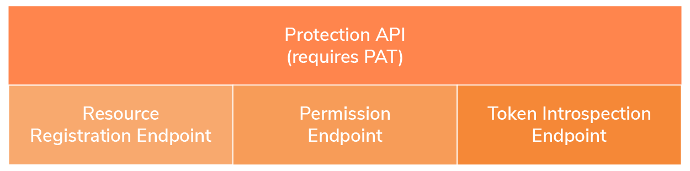

# User Managed Access

UMA 2.0 is a new federated authorization standard protocol approved by
the [Kantara Initiative](https://kantarainitiative.org/). It is built
on top of OAuth 2.0, which enables party-to-party sharing. As shown in
the diagram given below, UMA defines a workflow that creates
authorization policies on a centralized authorization server for
resource owners to control the access to their protected resources.

  

 

There are five main roles in a UMA workflow:

|                          |                                                                                                                                                         |
|--------------------------|---------------------------------------------------------------------------------------------------------------------------------------------------------|
| **Resource owner**       | Controls the resources that are on multiple resource servers from a single authorization server.                                                        |
| **Authorization server** | Protects the resources in the resource server on behalf of the resource owner. In this scenario, WSO2 Identity Server acts as the authorization server. |
| **Resource server**      | Hosts the protected resources. The resource server capable of accepting and responding to requests for protected resources.                             |
| **Client**               | An application which acts on behalf of the requesting party.                                                                                            |
| **Requesting party**     | An entity that seeks to access a protected resource using a client.                                                                                     |

#### Protection API endpoints

The Protection API consists of three endpoints:

 

<table>
<colgroup>
<col style="width: 18%" />
<col style="width: 81%" />
</colgroup>
<tbody>
<tr class="odd">
<td><strong><a href="../../learn/user-managed-access-endpoints#resource-registration-endpoint">Resource registration endpoint</a></strong></td>
<td>
Allows the resource owner to secure the resources using the authorization server and manage them over time.
</td>
</tr>
<tr class="even">
<td><strong><a href="../../learn/user-managed-access-endpoints#permission-endpoint">Permission endpoint</a></strong></td>
<td>
Allows the resource server to request permission(s) when the client’s resource request is unaccompanied by a Requesting Party Token (RPT) or is accompanied by an invalid RPT.
</td>
</tr>
<tr class="odd">
<td><strong><a href="../../learn/invoke-the-oauth-introspection-endpoint">Token introspection endpoint</a></strong></td>
<td>Allows the resource server to introspect the RPT which is required to access an UMA protected resource.</td>
</tr>
</tbody>
</table>

When a request is made by the resource server to the authorization
server it needs to be accompanied with a Protection API Access Token
(PAT) for the request to access the resource registration endpoint,
permission endpoint, and token introspection endpoint.  The PAT
represents the resource owner’s authorization to use the protection API.
The PAT token is an OAuth access token that has the
`         uma_protection        ` scope.

#### UMA grant

A client acting on behalf of the requesting party can obtain a
Requesting Party Token (RPT) from the authorization server after
successful evaluation of policy conditions, scopes, claims, and any
other relevant information.

## What's next?

-   For a tutorial that demonstrates how you can use WSO2 Identity
    Server as the authorization server to try out UMA, see [User Managed
    Access with WSO2 Identity
    Server](../../learn/user-managed-access-with-wso2-identity-server).

  
