# My Account

!!! note 
    The **User Portal** application has been renamed as **My Account** from this release onwards.

## Introduction

The new **WSO2 Identity Server**(WSO2 IS) **My Account** application is packed with a number of new
components through which users can manage their user account-related
preferences with more convenience. The latest set of features that will be
available with the new **My Account** includes:

- User profile management
- Linked accounts
- Export user profile
- Reset password
- Account recovery
- Multi-factor authentication
- Monitor active user sessions
- Consent management
- Review pending approvals

This section briefs what each of the above-mentioned features are and will explain how to use these features depending on user preferences and requirements.

---

## Access My Account and its components

1. Go to the **My Account** URL: `https://(host name):(port name)/myaccount/`. For example, `<https://localhost:9443/myaccount>`.

2. Enter the username and password and click **Sign In**.  

---

## User Profile Management

Various elements of the **My Account** application can be managed by the users themselves by following the instructions given below.

### Add personal details

1. [Access **My Account**](#access-my-account-and-its-components).
2. Click the **Personal info** tab on the side panel.
3. Under the **Profile** sub section, click on the plus icon, aligning with the field that needs to be added.
4. Enter the value to the profile and click **Save**.

### Update personal details

1. [Access **My Account**](#access-my-account-and-its-components).
2. Click the **Personal info** tab on the side panel.
3. Click on the pencil icon aligning with the field that needs to be edited.
4. Update the new value in the profile and click **Save**.

### Add and update profile picture

1. [Access **My Account**](#access-my-account-and-its-components).
2. Click the **Personal info** tab on the side panel.
3. Hover over the profile picture or the placeholder and click on the camera icon.

    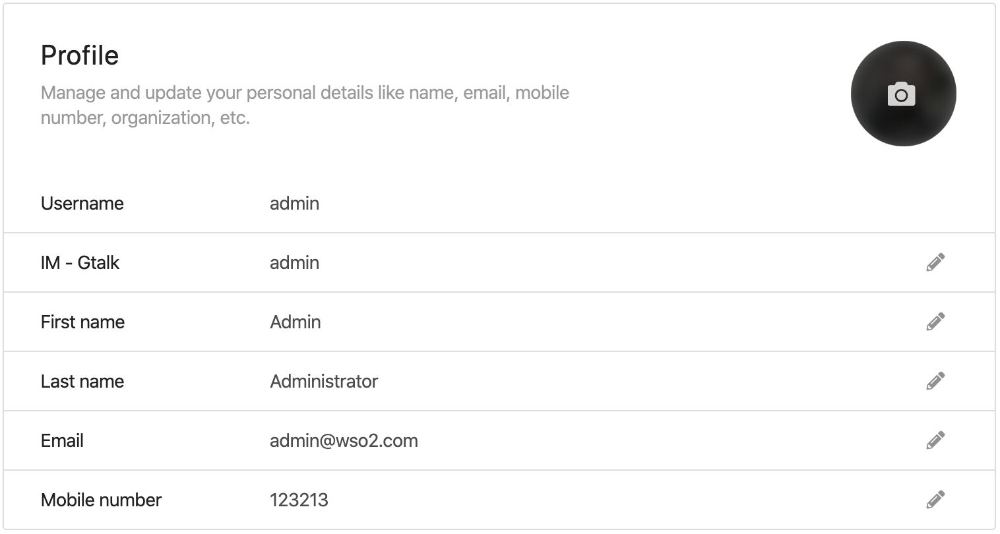
    
4. In the pop-up that appears, enter the URL of the image that needs to be set as the profile picture in the textbox.

    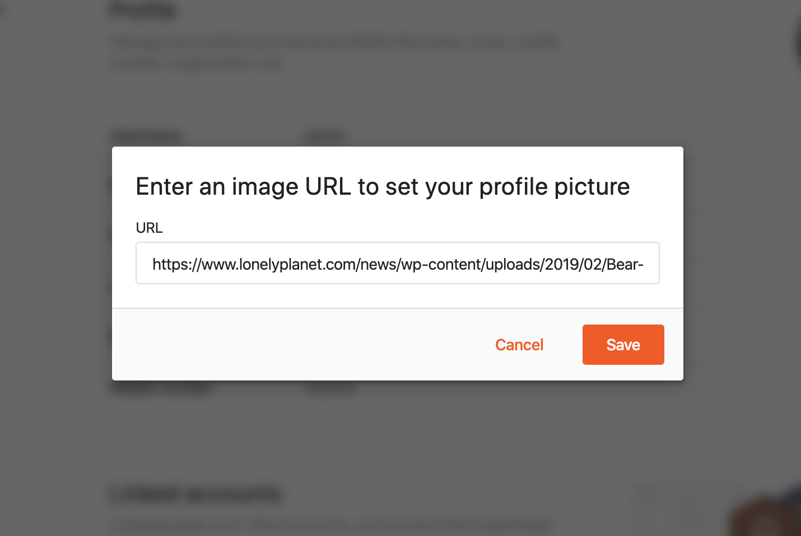

---

## Linked Accounts

WSO2 IS allows linking multiple accounts that a user has and switching between accounts once the user links their accounts. WSO2 IS also allows to connect a user's federated user credentials with their WSO2 Identity Server account. 

Users can link and manage local and federated accounts seamlessly using **My Account**.

### Link new accounts

1. [Access **My Account**](#access-my-account-and-its-components).
2. Click the **Personal info** tab on the side panel.
3. Under the linked account sub section, click **Add account**.

    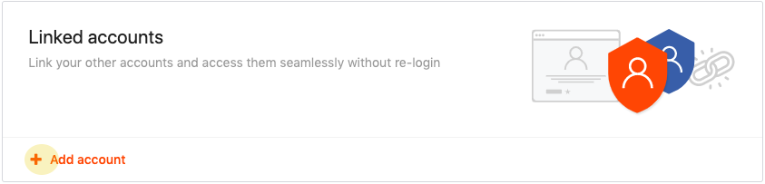

4. Enter the username and the password of the account that needs to be linked and click **Save**.

    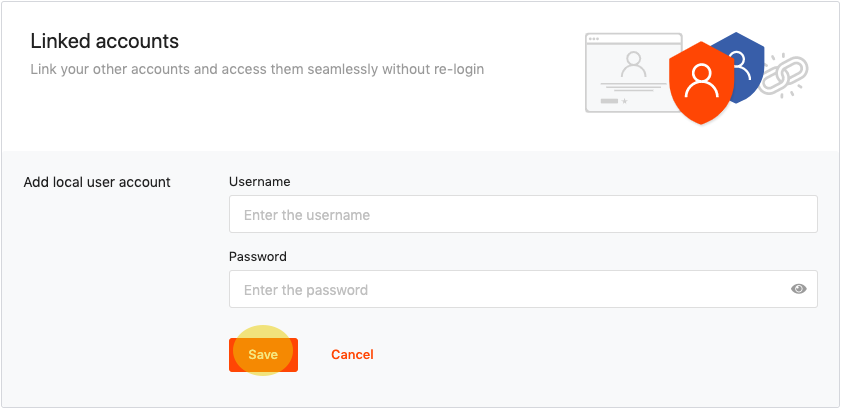

### Delete linked accounts

1. [Access **My Account**](#access-my-account-and-its-components).
2. Click the **Personal info** tab on the side panel.
3. Click on the **delete** button aligning with the linked account that needs to be deleted.
4. Confirm the deletion of the linked account by clicking **OK** in the confirmation popup that appears.

---

## Export user profile

Using the **export user profile** feature in **My Account**, a JSON file can be downloaded. This file includes the user's personal information, consents, and other claims allowing the user to extract the information that is being is recorded about them in WSO2 IS.

!!! tip
    The consent receipts in the
    `           userInfo.json          ` file contain the PII controller information 
    as it is, at the time that the receipt is generated. If the PII controller has 
    changed after the receipt was generated, this change will not be reflected in the 
    existing receipts. To get an updated consent receipt that reflects the change, 
    generate a new consent receipt by doing one of the following:

    1.  Revoke the consent via **My Account** and go through the flow that prompts 
        the relevant consent again (i.e., revoke the given consent for an application 
        in WSO2 IS, log out, then log back in. Now approve the consent again. A new consent 
        receipt will be generated for that application consent).

    2.  Use the [Consent Management REST APIs](../../develop/using-the-consent-management-rest-apis) to revoke the
        existing consent and add a new consent.

You can export your profile by following the instructions given below.

1. [Access **My Account**](#access-my-account-and-its-components).
2. Click the **Personal info** tab on the side panel.
3. Under the **Export profile** sub section, click on the **Download as JSON** button. All the profile details will be downloaded to your local machine as a JSON file.

    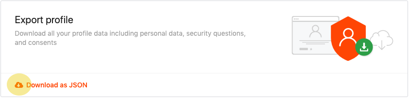

---

## Reset password

As a security measure, it is recommended for users to reset their passwords regularly. Using **My Account**, the users can change their password without a hassle. In order to change the password using **My Account**, follow the instructions given below.

1. [Access **My Account**](#access-my-account-and-its-components).
2. Click the **Security** tab on the side panel.
3. Under the **Change password** sub section, click **Change your password**.
4. Enter the current password, and the new password twice in order to confirm the new password.
5. Click **Submit**.     

---

## Account recovery

The account recovery feature implemented in WSO2 IS helps to recover the user account if the user has forgotten the username or password. This recovery process is also secured with captcha verification.

The main part of account recovery is setting up security or challenge questions for user accounts. With the WSO2 IS, users can set up challenge questions in different languages.

**My Account** allows users to add and update their challenge questions and update the email address that they can use to recover their accounts when required. Follow the instructions given below to use the account recovery options available in **My Account** more effectively.

### Add security questions

1. [Access **My Account**](#access-my-account-and-its-components).
2. Click **Security tab** on the side panel.
3. Under the **Account recovery** sub section, click on the **add** button aligning with the **security questions** section.
4. Select two questions from the sets questions given in the dropdown list and enter a unique answer only known to you. Make sure to remember these answers as they will be used to recover the account when required.
5. Click on **Save** to submit the configured questions and answers.

### Update security questions

1. [Access **My Account**](#access-my-account-and-its-components).
2. Click the **Security** tab on the side panel.
3. Under the **Account recovery** sub section, click on the edit icon aligning with the security question that needs to be updated.
4. Select a new question and add an answer, or just update the answer to the question that was previously chosen and click on **Save**.

### Add recovery email

1. [Access **My Account**](#access-my-account-and-its-components).
2. Click the **Security** tab on the side panel.
3. Click on the add button aligning with the **Email recovery** section.
4. Enter a preferred email address as the recovery email and click **update**.

    !!! info
        Please note that this will be added as the email address in user profile.

### Update recovery email

1. [Access **My Account**](#access-my-account-and-its-components).
2. Click the **Security** tab on the side panel.
3. Click on the **edit** button with the pencil icon aligning with the Email recovery section.
4. Edit the email address that has already been used as the recovery mail and click on the **update** button.

    !!! info
        Please note that this will update the email address in the profile as well.

---

## Multi-factor authentication

MFA creates a layered defense and makes it more difficult for an unauthorized person to access a target such as a physical location, computing device, web service, network, or database. If one factor is compromised or broken, the attacker still has at least one more barrier to breach before successfully breaking into the target. WSO2 Identity Server allows configuring multi-step authentication where you can define an authentication chain containing different authenticators in different steps.

Using the latest **My Account** application, users can update their mobile numbers through which they can authenticate themselves using the one-time verification code. Also, they can add inherence factors like FIDO devices and fingerprint sensors. The following section will provide instructions on how to configure MFA options in WSO2 IS using **My Account**.

### Via SMS

1. [Access **My Account**](#access-my-account-and-its-components).
2. Click the **Security** tab on the side panel.
3. Under the **Multi-factor authentication** section, click on the edit icon aligning with the **via SMS** section.
4. Enter the mobile number that needs to be added as the MFA factor and click **update**.

    !!! info
        This will also update the mobile number in the user profile.

### Via security device

!!! info
     This is supported by only a few browsers namely Chrome, Mozilla Firefox, and Microsoft Edge.

#### Add security device

1. [Access **My Account**](#access-my-account-and-its-components).
2. Click the **Security** tab on the side panel.
3. Under the **Multi-factor authentication** section, click on the add icon aligning with the **via security device** section.
4. Select an option depending on whether to add a USB security key or a built-in sensor.

    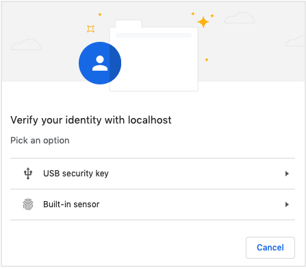

5. Click on **Continue**. Alternatively, click on the **Choose another option** dropdown to switch your option.

    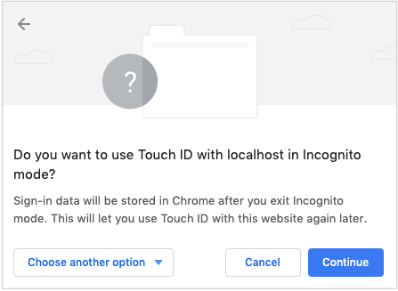
 
6. Click on **Continue**. Alternatively, click on the **Choose another option** dropdown to switch your option.

    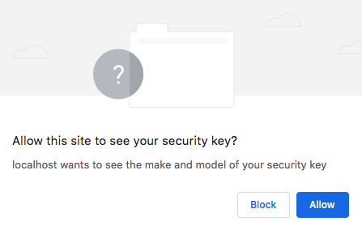
    
7. Add the preferred device name.

    

8. Once the device is successfully added, the registered device will be listed along with its name.

    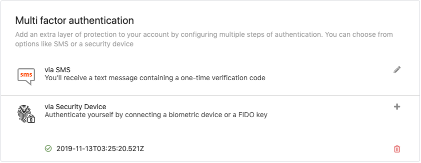
    
!!! info "Using an older FIDO device"
    If an older FIDO device is used when registering the device, an error message mentioning that the device cannot be used will be displayed. 
    This means the device is not capable of performing [passwordless authentication](../learn/passwordless-authentication-using-fido2.md) and can only be used as a [second factor](../learn/multi-factor-authentication-using-fido.md). The device will have to be added as an **"Older Device"**.

    Follow the steps given below to add the device as an older device.
    
    1. Click **close**.
    
        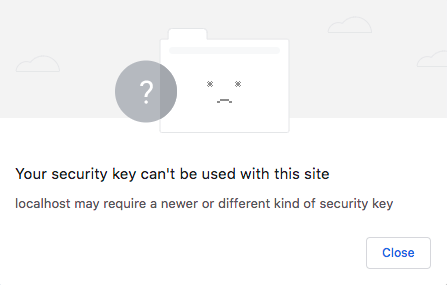
    
    
    2. Click **Try with an older Device**.
    
        
    
    
    3. From this point onwards, the steps to register the device are the same as the steps given in [Add security device](#add-security-device).

#### Delete security device

Any security device registered under MFA can be simply removed by clicking the delete icon.

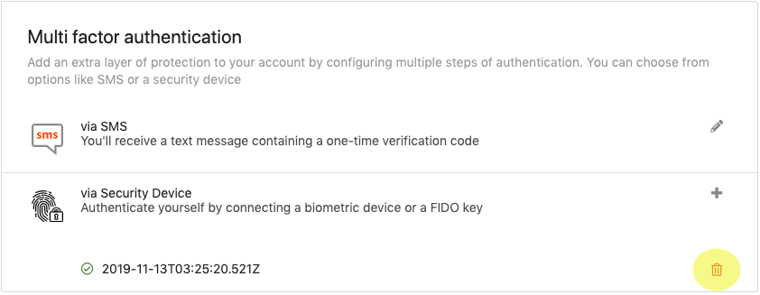

---

## Monitor active user sessions

The **Active user sessions** section in **My Account** enables users to view details related to the sessions of the different applications that are accessed via WSO2 IS. When the **show more** button aligning with a specific session is clicked, it will display a detailed view of the session including the operating system, ip address, applications list, login time, and the last accessed time.

Depending on the user’s preference, **My Account** allows the users either to terminate all the sessions at once or terminate sessions one by one. By clicking the **terminate all** button at the top right corner, users can terminate all the active sessions with a single button click. If they wish to terminate a specific session, they can click on **terminate session** in the **detailed view** section.

---

## Consent management

WSO2 IS provides a comprehensive consent management solution that can be used to manage consents related to Identity and Access Management (IAM), and also to manage consents that belong to third party applications.
**My Account** allows users to revoke or edit the consent given to applications registered in WSO2 IS. In order to edit or revoke application consents, refer to the instructions given below.

### Revoke consent

1. [Access **My Account**](#access-my-account-and-its-components).
2. Click the **Security** tab on the side panel.
3. Under the **Manage consent** section, click on the **Revoke** button aligning with the application for which consent needs to be revoked. 

### Edit consent

1. [Access **My Account**](#access-my-account-and-its-components).
2. Click the **Security** tab on the side panel.
3. Under the **Manage consent** section, click on the edit icon aligning with the application for which the consent needs to be edited. 
4. Click and disable the toggle button aligning with any claim to revoke your consent.
5. Click **update**.

---

## Review pending approvals

WSO2 IS enables more control over the tasks that are executed using workflows. This is particularly useful in a scenario where user accounts need to be approved in WSO2 IS. Workflows provide the flexibility to configure this approval process in a way that suits the user's scenario.

**My Account** allows you to review the workflow operations like adding users, updating user claims, deleting users, and approving or denying them. For the convenience of the users, pending approvals are categorized into three states namely, **ready, reserved and completed**.

Whenever a user gets created in the system, that task will appear under the **ready** section waiting for approval. Whenever a task  is reviewed and claimed, that task will be listed under the **reserved** section of approvals. Once the task is approved or denied, it will appear under the **completed** section.

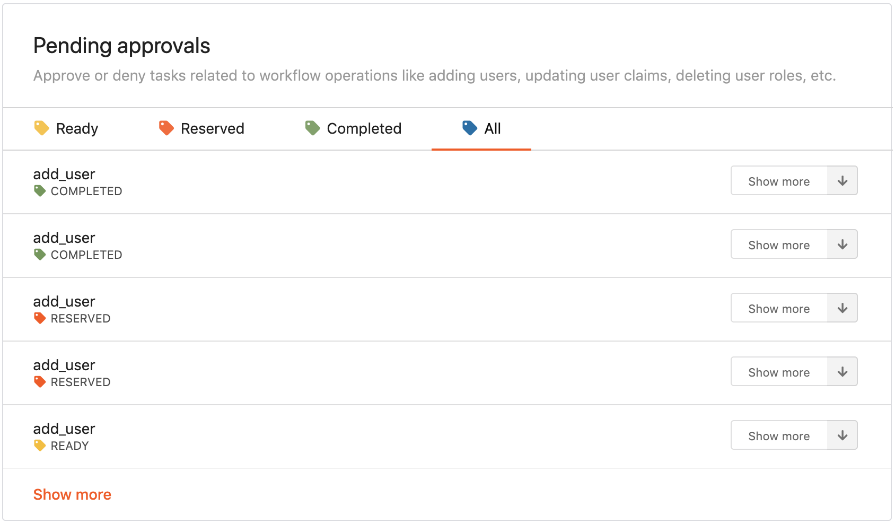
