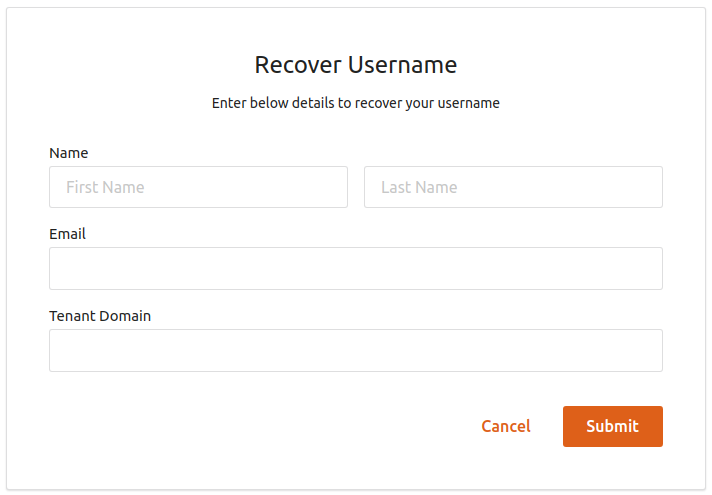

# Username Recovery

The user account recovery feature implemented in the WSO2 Identity
Server (WSO2 IS) helps to recover the username of the account if the user has
forgotten it. This recovery process is also secured with
captcha verification.

The service caller can define any number of claims that should be used
in the user details verification. The first claim can be the email
address and others can be the required attributes in the user
registration such as first name or last name. This is helpful to search
for a user if the system accepts multiple accounts with the same email
address. Upon the successful verification of the user details, the user
account ID is sent to the user by email.For this to be possible, the
user needs to fill the details in their respective user profile such as
email, first name, last name and any other required attributes.

!!! note
	WSO2 IS validates whether the user account is locked or disabled prior to account recovery. In addition, if any customization prior to account recovery such as checking the eligibility of the user for account recovery by validating certain conditions/ user claims is needed, WSO2 Identity Server provides an extension for that.

	WSO2 IS triggers the `PRE_ACCOUNT_RECOVERY` event prior to user account recovery using the WSO2 IS eventing framework. A custom event handler can be written upon which the `PRE_ACCOUNT_RECOVERY` event is triggered. For more information on how to write a custom handler and trigger an event, see [Writing a custom handler](../../develop/writing-a-custom-event-handler).

The instructions below guide you through setting up username recovery
with the WSO2 IS.

!!! warning
    From 5.3.0 onwards there is a new implementation for identity management
    features. The steps given below in this document follows the new
    implemenation, which is the **recommended approach** for username
    recovery.
    
    Alternatively, to see steps on how to enable this identity management
    feature using the **old implementation**, see [Username Recovery
    documentation in WSO2 IS
    5.2.0](https://docs.wso2.com/display/IS520/Username+Recovery). The old
    implementation has been retained within the WSO2 IS pack for backward
    compatitbility and can still be used if required.
    
    
!!! tip "Before you begin"
    
    Ensure that the identity listener  with the
    `         priority=50        ` is set to **false** and that the Identity
    Listeners with `         priority=95        ` and
    `         priority=97        ` are set to **true** by adding the following configuration in the
    `         <IS_HOME>/repository/conf/deployment.toml       ` file.
    
    ``` java
    [event.default_listener.identity_mgt]
    priority= "50"
    enable = false
    [event.default_listener.governance_identity_mgt]
    priority= "95"
    enable = true
    [event.default_listener.governance_identity_store]
    priority= "97"
    enable = true
    ```


1.  Enable the email sending configurations of the WSO2 Identity Server
    as explained [here](../../setup/configuring-email-sending).

    !!! tip
        The email template used to send this email notification is
        the **AccountIdRecovery** template.
    
        You can edit and customize the email template. For more information
        on how to do this, see [Customizing Automated
        Emails](../../learn/customizing-automated-emails).
    

2.  Start the WSO2 IS server and login to the management console.

3.  Click on **Resident** found under the **Identity Providers** section
    on the **Main** tab of the management console.
4.  Expand the **Account Management Policies** tab, then the **Account
    Recovery** tab.

5.  Select the **Enable Username Recovery** checkbox and the **Enable
    Notification Internally Management** checkbox.  
    For more information on the fields seen on this screen, see [Account Recovery REST API](../../develop/using-the-account-recovery-rest-apis).
      
     

    !!! info   
        To enable username recovery with reCaptcha verification, select the
        **Enable reCaptcha for Username Recovery** checkbox. For more
        information, see Configuring reCaptcha for Username recovery.

6.  To enable sending a confirmation email to the user's registered
    email address after the password reset, select the **Notify when
    Recovery Success** checkbox.

    !!! note
        If you are using a Google mail account, note that Google has
        restricted third-party apps and less secure apps from sending emails
        by default. Therefore, you need to configure your account to disable
        this restriction, as WSO2 IS acts as a third-party application when
        sending emails to confirm user registrations or notification for
        password reset WSO2 IS.
    
        ??? note "Click here for more information."
    
            Follow the steps given below to enable your Google mail account to
            provide access to third-party applications.
        
            1.  Navigate to <https://myaccount.google.com/security>.
            2.  Click **Signing in to Google** on the left menu and make sure
                that the **2-step Verification** is disabled or off.  
                
            3.  Click **Connected apps and sites** on the left menu and enable
                **Allow less secure apps**.  
                
    

### Try out username recovery

1.  [Create a user using the management
    console](../../learn/configuring-users#creating-a-new-user-using-the-management-console). Ensure that the user has login permissions.
2.  Edit the user profile and enter an email address for the user. The
    email notification for password recovery is sent to the email
    address given here.
3.  Access the [WSO2 Identity Server User Portal](https://localhost:9443/user-portal/).
4.  Click the **Forgot Username** link.
5.  Enter the required fields and click **Submit**.  
     

    !!! note
        In case you have enabled username recovery with reCaptcha
        verification, enter the required fields as specified above and
        select the recaptcha checkbox as well.
    
         

6.  An email notification is sent to the user's email address with the
    recovered username.  
     

!!! tip "Related Links" 
    -   For information on the REST APIs for username recovery, see [the swagger docs on Account Recovery RESTAPIs](../../develop/using-the-account-recovery-rest-apis).
    -   See [Configuring Claims](../../learn/configuring-claims) for more information on how to store
        the claim values in the user store.
    
