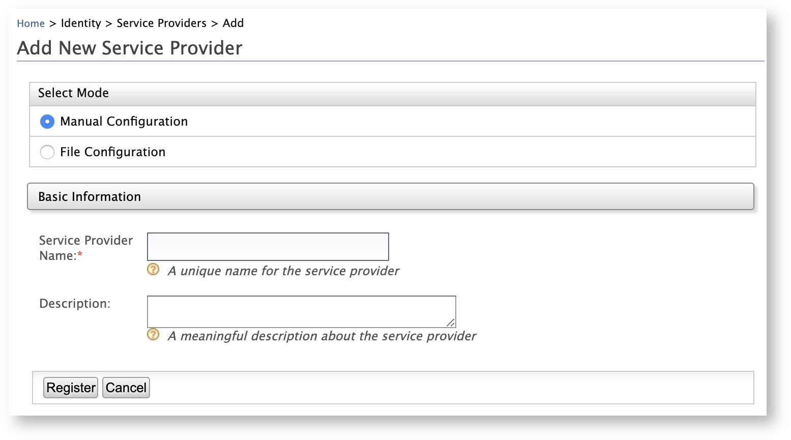
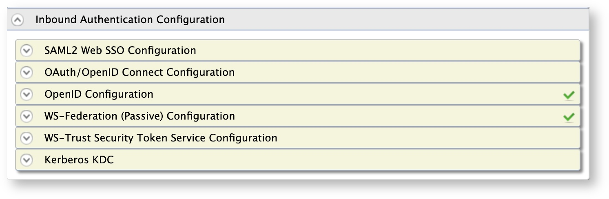

# Validating OAuth Access Token Scope Using XACML Policies During Token Issuance

To provide fine-grained access control to APIs, WSO2 Identity Server allows validating the scope of an OAuth access token using XACML policies during the token issuing phase.

If you want the XACML scope validator to execute when issuing an access token in an OAuth access token issuing flow, you can select the scope validator as XACML when you configure a service provider. This provides fine-grained access control to APIs.

Follow the steps below to configure WSO2 Identity Server to validate OAuth access tokens scopes using XACML policies. 
 
## Configuring the service provider

To configure the client application as a service provider in WSO2 Identity Server: 

<ol>
	<li>
		<p>On the <b>Main</b> menu of the <a href="../../setup/getting-started-with-the-management-console">Management Console</a>, click <b>Identity > Service Provider > Add</b>.</p>
		<p></p>
		<p>The <b>Add New Service Provider</b> screen appears.</p>
		<p></p>
	</li>
	<li>
		<p>Enter a meaningful name for the client application in the <b>Service Provider Name</b> text box and click <b>Register</b>. The <b>Service Providers</b> screen appears.</p>
		<p></p>
	</li>
	<li>
		<p>Under the <b>Inbound Authentication Configuration</b> section, click <b>OAuth/OpenID Connect Configuration > Configure</b>.</p>
		<p><</p> 
		<p>The <b>Register New Application</b> screen appears.</p>
		<p></p>
	</li>
	<li>Enter the <code>callback URL</code> or your application in the <b>Callback Url</b> text box.</li>
	<li>Select the <b>XACML Scope Validator</b> check box under <b>Scope Validators</b>.</li>
	<li>Click <b>Add</b>.</li>
</ol>

You have successfully added and configured the service provider. Next, we will learn how to configure a XACML policy to validate the OAuth access token scopes that are used to authenticate the access requests for the client application. 

## Setting up the XACML policy

To publish a XACML policy using a default XACML policy template in WSO2 Identity Server:

<ol>
	<li>
		<p>On the <b>Main</b> menu of the Management Console, click <b>Entitlement > PAP > Policy Administration</b>.</p>
		<p></p>
		<p>The <b>Policy Administration</b> screen appears.</p>
		<p></p>
	</li>
	<li>
		<p>Click <b>Edit</b> of the <b>scope_based_token_issuance_policy_template</b> policy.</p>
		<p></p>
		<p>The <b>Policy Editor</b> appears with the pre-configured template with place holders.</p>
		<p></p>
	</li>
	<li>
		<p>Edit the policy as required including the <b>PolicyId</b> and click <b>Save</b>.</p>
		<p>A new policy with the changes you made to the template appears with the policy ID you added. (The original policy is intact)</p>
	</li>
	<li>
		<p>Click <b>Publish To My PDP</b> of the new policy. The <b>Publish Policy</b> screen appears.</p>
		<p></p>		
	</li>
	<li>
		<p>Leave the default values as they are and click <b>Publish</b>.</p>
		<p>
			<div class="admonition tip">
				<p class="admonition-title">Tip</p>
				<p>To ensure that the policy has been successfully published:</p>
				<p>
					<ol>
						<li>
							<p>On the <b>Main</b> menu, click <b>Entitlement > PDP > Policy View</b>.</p>
							<p></p>
						</li>
						<li>Check whether the published policy is listed.</li>
					</ol>
				</p>
			</div> 
			<div class="admonition info">
				<p class="admonition-title">Info</p>
				<p>
					<ol>
						<li>For more information on Policy Administration Point (PAP), see [Configuring the Policy <a href="../../learn/configuring-the-policy-administration-point/">Administration Point</a>.</li>
						<li>For more information on publishing XACML policies, see <a href="../../learn/publishing-a-xacml-policy/">Publishing a XACML Policy</a>.</li>
					</ol>
				</p>
			</div>
		</p>
	</li>
</ol>

You have successfully published a XACML policy. Let's test the policy to evaluate whether the XACML scope is validated during OAuth token issuance.

## Try it out 

The XACML TryIt tool allows you to test the policies easily without having to create and send authorization requests to WSO2 Identity Server. It is a tool through which authorization requests can be created and evaluated against the available policies. You can write simple XACML 3.0 requests in XML format and try them using the web UI of the TryIt tool. 

To try out the policy using the XACML TryIt tool: 

<ol>
	<li>
		<p>On the <b>Tools</b> menu of the Management Console, click <b>XACML > TryIt</b>.</p>
		<p></p>
	</li>
	<li>
		<p>The <b>TryIt</b> screen appears.</p>
		<p></p>
	</li>
	<li>
		<p>Click <b>Create Request Using Editor</b>. The <b>Evaluate Entitlement Policy</b> screen appears.</p>
		<p></p>
	</li>
	<li>
		<p>Enter the following as the sample request and click <b>Evaluate With PDP</b>.</p>
		<p><code>
			<Request xmlns="urn:oasis:names:tc:xacml:3.0:core:schema:wd-17" CombinedDecision="false" ReturnPolicyIdList="false">
			    <Attributes Category="http://wso2.org/identity/sp">
			       <Attribute AttributeId="http://wso2.org/identity/sp/sp-name" IncludeInResult="false">
			          <AttributeValue DataType="http://www.w3.org/2001/XMLSchema#string">playground2</AttributeValue>
			       </Attribute>
			    </Attributes>
			    <Attributes Category="http://wso2.org/identity/identity-action">
			       <Attribute AttributeId="http://wso2.org/identity/identity-action/action-name" IncludeInResult="false">
			          <AttributeValue DataType="http://www.w3.org/2001/XMLSchema#string">scope_validation</AttributeValue>
			       </Attribute>
			    </Attributes>
			    <Attributes Category="http://wso2.org/identity/oauth-scope">
			       <Attribute AttributeId="http://wso2.org/identity/oauth-scope/scope-name" IncludeInResult="false">
			          <AttributeValue DataType="http://www.w3.org/2001/XMLSchema#string">SCOPE_1</AttributeValue>
			       </Attribute>
			    </Attributes>
			 </Request>
		</code>
		</p>
		<p>A response message with either Permit or Deny appears based on the XACML scope validation during token issuance.</p>
		<p>
			<div class="admonition note">
				<p class="admonition-title">Note</p>
				<p>For backward compatibility, you can disable this validation by setting the following property value to true in the <code>deployment.toml</code> file in the <code>[IS_HOME]/repository/conf</code> directory.</p>
				<p>
					```
                    [oauth.scope_validator.authz_implicit]
                    enable = false
					```
				</p>				
			</div> 
		</p>
	</li>
</ul>
