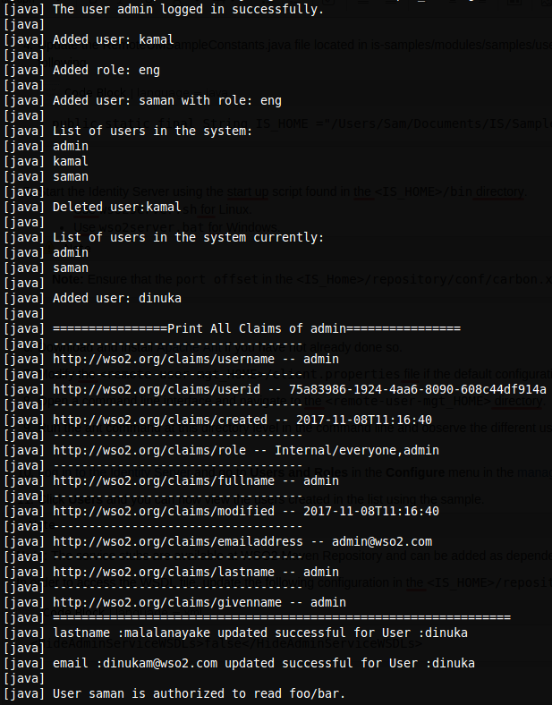

# Writing a Web Service Client for Authentication and User Admin Services

This topic demonstrates how to use different web services API exposed by
Identity Server, to write a client application "
[remote-user-mgt](https://github.com/wso2/samples-is/tree/master/user-mgt)
" to handle user management functionality (ex: create user, create
roles, assign roles) of WSO2 Identity Server remotely. The
[remote-user-mgt](https://github.com/wso2/samples-is/tree/master/user-mgt)
sample uses ` AuthenticationAdmin, RemoteUserStoreManagerService ` and `
RemoteAuthorizationManagerService ` admin services to perform different
operations. Go through the
[remote-user-mgt](https://github.com/wso2/samples-is/tree/master/user-mgt)
sample implementation to see details.

!!! info 
    You can learn more about the admin services used in this sample by
    referring [Calling Admin
    Services](../../develop/calling-admin-services),
    [Managing Users and Roles with
    APIs](../../develop/managing-users-and-roles-with-apis)
    and [Managing Permissions with
    APIs](../../develop/managing-permissions-with-apis)
    .

1.  The code for the sample can be checked out from the [GitHub
    repository](https://github.com/wso2/samples-is).
2.  Once you have downloaded the samples, go to the `
    <Sample_Home>/user-mgt/remote-user-mgt ` directory to
    build the remote user management client.
    
    !!! Tip 
        `<Samples_Home>` is referred to the
        [root directory of the WSO2 Identity Server's samples](https://github.com/wso2/samples-is).

3.  Make sure the URL of the remote server (`remote.server.url`),
    credentials of the user who performs user management operations
    (`user.name, user.password`) and truststore (`truststore.path,
    truststore.password`) configured in `<Samples_Home>/
    user-mgt/remote-user-mgt/client.propeties` are correct with respect
    to your environment. If you have changed the private key in the
    identity server, import the public certificate of the identity
    server to the truststore (`client-truststore.jks`) of the sample client
    in
    `<Samples_Home>/user-mgt/remote-user-mgt/src/main/resources/keystore`.

4.  Build the client using ` mvn install ` .

5.  Once the client is built successfully, run the
    `remote-user-mgt-client.sh ` file in Unix or
    `remote-user-mgt-client.bat ` in Windows. You can see that the
    actions performed is being printed by the client.  
    
      

!!! note
    
    The service stubs are available at WSO2 Maven Repository and
    can be added as dependencies to the project. Also, you can generate the
    service stubs from the WSDL file available at
    `https://localhost:9443/services/<ServiceName>?wsdl`
    
    In order to enable access to the WSDL files, add the following configuration in
    the `         <IS_HOME>/repository/conf/deployment.toml        ` file and restart the server.
    
    ``` xml
    [admin_service.wsdl]
    enable = false
    ```
    
