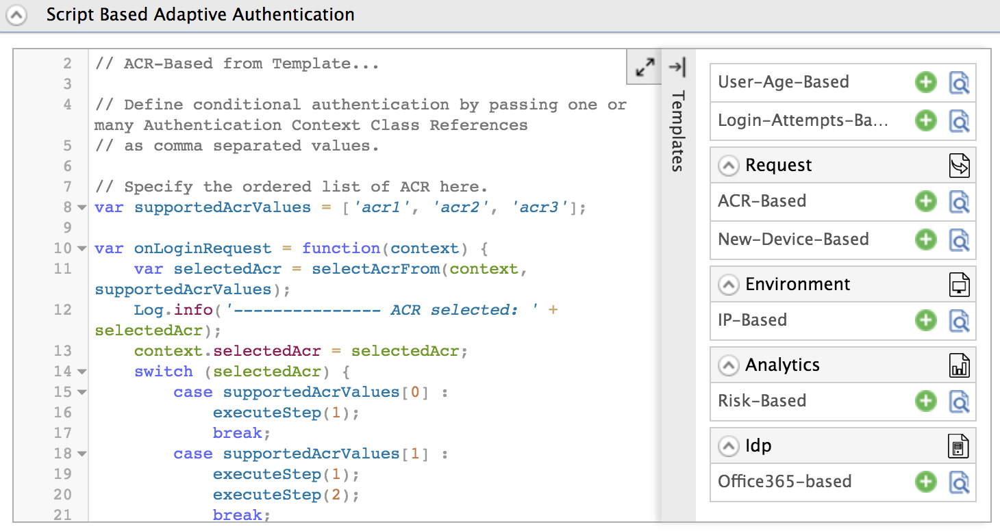
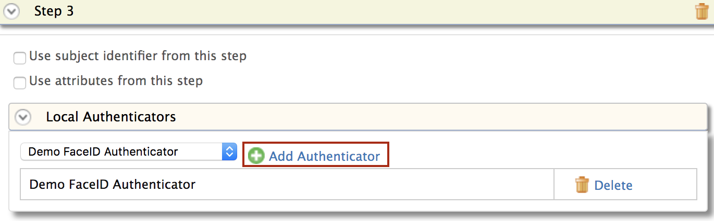
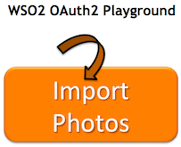

# Configure ACR-Based Adaptive Authentication

This page guides you through configuring Authentication-Context-Reference-based (ACR-based) adaptive authentication for a sample web application using a sample hardware key authenticator. 

----

If you have your own application, click the button below.

<a class="samplebtn_a" href="../../guides/adaptive-auth/work-with-acr-amr"   rel="nofollow noopener">I have my own application</a>

----

## Scenario

The instructions below guide you through specifying authentication steps based on the authentication context value used when logging in.

----
{! fragments/oauth-playground.md !}

## Deploy sample authenticators

1.  Download the [the sample authenticators](../../assets/attachments/org.wso2.carbon.identity.sample.extension.authenticators-5.10.0.jar) file and paste it inside the `<IS_HOME>/repository/components/dropins` directory.

    This `.jar` file contains an implementation of a Demo HardwareKey authenticator, Demo Fingerprint authenticator, and Demo FaceID authenticator.
            
2.  Download the [sample-auth.war](https://github.com/wso2/samples-is/releases/download/ v4.3.0/sample-auth.war) file and paste it inside the `<IS_HOME>/repository/deployment/server/webapps` folder.  

3. Add the following configuration to the `<IS_HOME>/repository/conf/deployment.toml` file. 

    ``` toml
    [[resource.access_control]]
    context = "/sample-auth(.*)"
    secure = false
    http_method = "all"
    ```

----

## Configure acr-based authentication

1.  Click **Service Providers > List**.

2.  Click **Edit** on the `saml2-web-app-pickup-dispatch.com` service provider.

3.  Expand the **Local and Outbound Configuration** section and click **Advanced Authentication**.

4.  Expand **Script Based Conditional Authentication**.

5.  Click **Templates** on the right side of the **Script Based Conditional Authentication** field and then click **ACR-Based**. 

    

6.  Click **Ok**. The authentication script and authentication steps
    are configured. 

	The authentication script prompts authentication steps based on the acr
	values as follows.
	
	-   'acr1' - step 1 (basic authentication)
	-   'acr2' - step 1 and 2 (basic authentication and demo hardware key
		authenticator)
	-   'acr3' - step 1 and 3 (basic authentication and demo faceID
		authenticator)
    
7. The authentication steps added are `totp` and `fido`. However, these are authentication steps that you would normally use in production. 

    To try out sample authenticators with the sample application, delete the two
    authenticators and add the following sample authenticators instead.

    1.  Click **Delete** to remove the `totp` authenticator from Step 2 (the
        second authentication step).
        
        
        
    2.  Select **Demo Hardware Key Authenticator** and click **Add**.  
        

    3.  Click **Delete** to remove the `            fido           `
        authenticator from Step 3.  
        

    4.  Select **Demo FaceID Authenticator** and click **Add**.  
        

8.  Click **Update**.

----

## Try it out

1.  Access the following sample Playground application URL:
    <http://wso2is.local:8080/playground2/index.jsp> 

2.  Click **Import Photos**.  

    
    
3.  Enter the client ID of the OAuth service provider application you
    registered above and enter 'acr2' as the **Authentication Context
    Class** value.  

    Leave the rest of the configurations as they are.  

    

4.  You are now prompted for basic authentication. Sign in with a user's
    credentials or use the admin/admin credentials to log in.  

5.  Since the ACR value entered was 'acr2', you are now also prompted
    for hardware key authentication as per the authentication script.

    !!! tip
        You can re-try this flow using the ACR value 'acr3'. Note that you
        are then prompted for step 1 and 3 (basic authentication and Demo
        FaceID authentication).
    
     

6.  Provide the required consent.  
    
7.  You are now successfully logged in to the application. You can click the **Logout** button to log out and try this flow with different ACR values. 

    

!!! Tip 
    Read more about ACR and AMR
    [here](insertlink)
