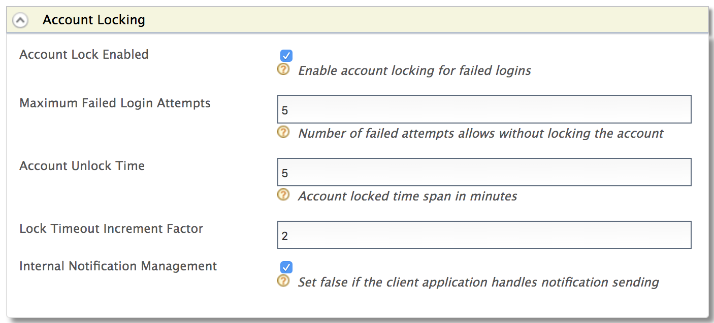

# Configure Login Attempts-Based Adaptive Authentication

This page guides you through configuring login attempts-based adaptive authentication for a sample web application using a sample hardware key authenticator. This is useful when you want to add security for users who successfully log in after a specific number of failed login attempts.

----

If you have your own application, click the button below.

<a class="samplebtn_a" href="../../guides/configure-adaptive-auth"   rel="nofollow noopener">I have my own application</a>

----

## Scenario

Consider a scenario where you want a user who successfully logs in after 3 failed login attempts to perform an additional level of authentication to access a resource.

----

{!fragments/adaptive-auth-samples.md!}

----

## Configure maximum failed login attempts

1. Start the server and log in to the [management console](insertlink).

2. Create a new user named "Alex" with login permission. 

    For instructions, see [Adding Users and Roles](insertlink).

3. Click **Identity Providers > Resident** and expand the **Login Policies > Account Locking** section.

4. Select **Account Lock Enabled**.

5. Enter a value for **Maximum Failed Login Attempts**. 

    

    !!! tip
        The **Maximum Failed Login Attempts** should be greater than the number of failed  login attempts you are going to consider for prompting two factor authentication.
        
        In this sample, since we are going to prompt two factor authentication after 3 failed login attempts, the **Maximum Failed Login Attempts** should be greater than 3.   
    
----

## Configure login attempts-based authentication

1.  Click **Service Providers > List**.

2.  Click **Edit** on the `saml2-web-app-pickup-dispatch.com` service provider.

3.  Expand the **Local and Outbound Configuration** section.

4.  Click **Advanced Authentication**.

5.  Expand **Script Based Conditional Authentication**.

6.  Click **Templates** on the right side of the **Script Based Conditional Authentication** field and then click **Login-Attempts-Based**. 

    

7.  Click **Ok**. The authentication script and authentication steps
    are configured. 
    
    The authentication script defines a conditional step that executes the second authentication step (i.e., hardware key authenticator) only if the user logs in after a specific number of invalid login attempts (which is defined by the `invalidAttemptsToStepup` parameter) have been exceeded.

8.  The authentication steps added are `totp` and `fido`. However, these are authentication steps that you would normally use in production. 

    To try out sample authenticators with the sample application, delete the two
    authenticators and add the following sample authenticators instead.

    1.  Click **Delete** to remove the `totp` authenticator from Step 2 (the
        second authentication step).
        
        
        
    2.  Select **Demo Hardware Key Authenticator** and click **Add**.  
        

9. Click **Update**.

----

## Try it out

1. Access the following sample PickUp application URL:

    <http://localhost.com:8080/saml2-web-app-pickup-dispatch.com>

2. Click **Login** and try to login using an invalid password (make a failed login attempt).

3.  Next, try to log in using the correct username and password. 

    Note that the second factor of authentication is not prompted because the number of failed attempts allowed has not been exceeded yet.

4. Make invalid failed attempts until you exceed the allowed failed attempts.

5. Now that you have exceeded the number of allowed failed attempts, try to login with the correct credentials.

5. You are prompted to use the hardware key after basic authentication according to the authentication step defined in the JavaScript above.

6.  Enter the 4-digit key given on the screen and click **Sign In**.
    

!!! note
    The failed login attempts need not be made during a given time frame. Login attempts-based adaptive authentication is valid even if the user makes two login attempts now and the other in a few days' time before trying to log in with the correct credentials.
    
