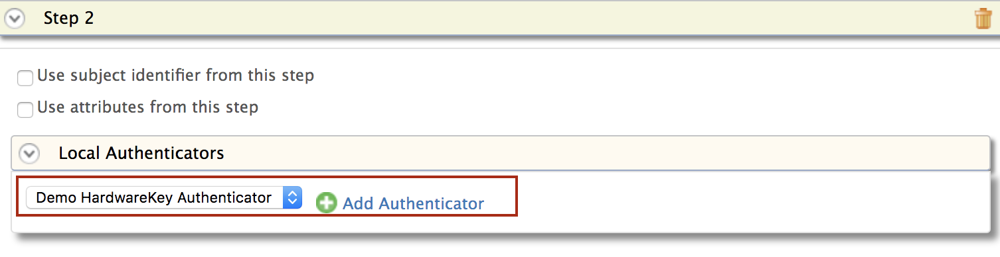
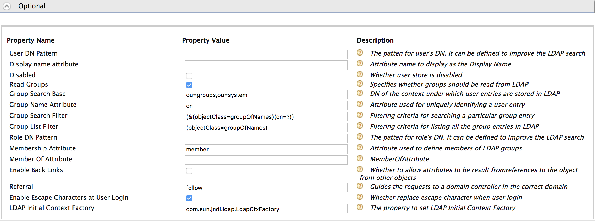

# Configure User Store-Based Adaptive Authentication

This page guides you through configuring user store-based adaptive authentication for a sample web application using a sample hardware key authenticator. 

This is useful if you want to add security for users logging in from other user store domains.
Using the user store-based adaptive authentication template, you can whitelist certain user store domains so that users from the whitelisted domains are prompted to perform an additional level of authentication, while users from any other user store domain can simply provide their credentials (basic authentication) to access a resource.

----

If you have your own application, click the button below.

<a class="samplebtn_a" href="../../guides/configure-adaptive-auth"   rel="nofollow noopener">I have my own application</a>

----

## Scenario

The instructions given below guide you through creating a new LDAP database and configuring it as a user store in WSO2 IS. In this tutorial, the new secondary user store will be whitelisted in the authentication script so that users beloging to the new user store are prompted for an extra step of authentication.

----

{!fragments/adaptive-auth-samples.md!}

----

## Configure user store-based authentication

1.  Click **Service Providers > List**.

2.  Click **Edit** on the `saml2-web-app-pickup-dispatch.com` service provider.

3.  Expand the **Local and Outbound Configuration** section and click **Advanced Authentication**.

4.  Expand **Script Based Conditional Authentication**.

5.  Click **Templates** on the right side of the **Script Based Conditional Authentication** field and then click **User Store-Based**.  

    

6.  Click **Ok**. The authentication script and authentication steps
    are configured. 
    
    The authentication script prompts the second step of authentication for users that belong to the user stores named `EMPLOYEES` and `CONTRACTORS`.

7.  The authentication steps added are `totp` and `fido`. However, these are authentication steps that you would normally use in production. 

    To try out sample authenticators with the sample application, delete the two
    authenticators and add the following sample authenticators instead.

    1.  Click **Delete** to remove the `            totp           ` and
        `            fido           ` authenticators from Step 2 (the
        second authentication step).
        
        
        
    2.  Select **Demo Hardware Key Authenticator** and click **Add**.  
        

8.  Click **Update**.

9. Next, set up the database. 

    This database will be connected to WSO2 Identity Server as a user store named `EMPLOYEES`.  If you do not already have an existing database, you can create a new LDAP server using Apache Directory Studio (Apache DS). See the instructions below to set this up.
    
!!! info
    **Alternatively**, you can also use an Active Directory or JDBC database, or an existing LDAP database.

----

{!fragments/create-ldap-server.md!}

----

## Configure user store

1. Start the server and log in to the [management console](insertlink).

2. Click **User Stores > Add**. 

3. Create a user store named "EMPLOYEES". 

    

3. Configure the following user store properties. 

    - **Connection URL:** ldap://localhost:10390
    - **Connection Name:** uid=admin,ou=system
    - **Connection Password:** secret
    - **User Search Base:** ou=users,ou=system
    - **Username Attribute:** uid
    - **User Search Filter:** (&(objectClass=person)(uid=?))
    - **User List Filter:** (objectClass=person)
    - **User ID Attribute:** uid
    - **User ID Search Filter:** (&(objectClass=person)(uid=?))

    

    For more information, see [User Store Configurations](insertlink).

4. Expand the **Optional** tab and enter `ou=groups,ou=system` as the **Group Search Base** property.
	
    

5. Click **Update** to save the configurations.

----

## Create users

1.  Create a new user named "Alex" in the `PRIMARY` user store. 

    Select `PRIMARY` as the **Domain** when creating the user.

    For instructions, see [Adding Users and Roles](insertlink).

2.  Create another new user named "Kim" in the `EMPLOYEES ` user store. 

    Select `EMPLOYEES` as the **Domain** when creating the user. 

    

----

## Try it out
    
1.  Access the following sample PickUp application URL:

    <http://localhost.com:8080/saml2-web-app-pickup-dispatch.com>
    
2.  Click **Login** and enter Alex's credentials. 

    Note that Alex is successfully logged in to the application after going through only the basic authentication step.
    
3.  Log out and login again using Kim's credentials. 

    Note that Kim is prompted for a second step of authentication (i.e., hardware key authenticator) since she belongs to the whitelisted user store domain `EMPLOYEES`.  
 
4. Enter the 4-digit key and click **Sign In**.  
    
      
    
5. Provide consent and you will be successfully logged in to the
    application.  
    
    

    !!! tip
        Ensure that the LDAP server in Apache DS is running when attempting to log in as Kim.
    