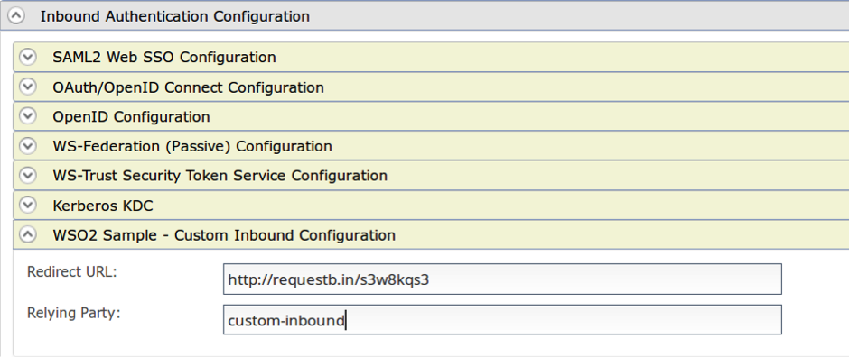

#Enable Login for a Sample Custom Web Application
This page guides you through integrating custom inbound authenticator with WSO2 Identity Server.

----
If you have your own application, click the button below.

<a class="samplebtn_a" href="../../guides/login/integrate-custom-protocol" rel="nofollow noopener">I have my own application</a>

----

{!fragments/deploying-sample-apps.md!}

----
## Download the sample
To be able to deploy a WSO2 Identity Server sample, you need to download it onto your machine first.

Follow the instructions below to download the sample from GitHub. 
Please refer ['Write a Custom Inbound Protocol'](insertlink) section for the implementation details.

1. Navigate to [WSO2 Identity Server Samples](insertlink).

2. [Download](inserlink) the TODO.war file and TODO-authenticator.jar from the latest release assets.

---
## Deploy the inbound authenticator

 - Copy the TODO-authenticator.jar to dropins directory (i.e. /repository/components/dropins)
 
----

{!fragments/register-a-service-provider.md!}

4. TODO :Expand 'Inbound Authentication Configuration' and fill the relevant data in 'Custom Inbound Configuration' section.

----

## Deploy and test the sample web app
1. Copy the extracted and modified TODO folder to the <TOMCAT_HOME>/webapps folder

2. Navigate to the web app page for the ‘TestApp’ application (e.g. http://localhost:8080/TestApp) and click on the Login button.

3. TODO: Explain the behaviour based on the sample.

!!! info "Related Topics"
 - [Enable Login for a Web Application](../../../guides/login/integrate-custom-protocol)
 - [Write a Custom Inbound Protocol](inserlink)