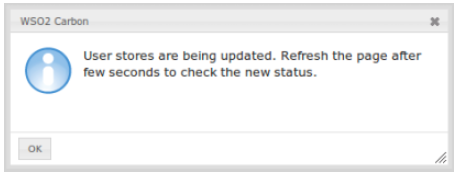

# Configuring Secondary User Stores

To work with WSO2 products, you must have a primary user store.
Additionally, you can configure several secondary user stores if
required. After configuration, users from different stores can log in
and perform operations depending on their roles/permissions. You can
also configure your own customized user stores and connect them with the
products as secondary stores.

You can use either the management console to create secondary user stores or you can create it manually. These will be stored in the deployment.toml file and will use the same format that is used to configure the primary user store.

## Configuring using the Management Console

1.  Log in to the management console and click **Add** under the **User Stores** sub menu in the **Main** menu. The **Add New User Store**
    page opens.

    !!! info 
        You cannot update the PRIMARY user store at runtime, so it is not
        visible on this page.

2.  From the User Store Manager Class drop-down list, select the user
    store manager class that suits your user store.
    
    

    The following table lists the available User store manager
    implementations and their usage:

    <table>
    <colgroup>
    <col style="width: 10%" />
    <col style="width: 40%" />
    <col style="width: 48%" />
    </colgroup>
    <thead>
    <tr class="header">
    <th>User store</th>
    <th>User store manager class</th>
    <th>Description</th>
    </tr>
    </thead>
    <tbody>
    <tr class="odd">
    <td><p>LDAP ActiveDirectory</p></td>
    <td><code>               org.wso2.carbon.user.core.ldap.ReadOnlyLDAPUserStoreManager              </code></td>
    <td>Used to do read-only operations for external LDAP or ActiveDirectory user stores.</td>
    </tr>
    <tr class="even">
    <td>LDAP</td>
    <td><code>               org.wso2.carbon.user.core.ldap.ReadWriteLDAPUserStoreManager              </code></td>
    <td>Used for external LDAP user stores to do both read and write operations.This is the default primary user store configuration in the deployment.toml file for WSO2 Identity Server.</td>
    </tr>
    <tr class="odd">
    <td>ActiveDirectory</td>
    <td><code>               org.wso2.carbon.user.core.ldap.ActiveDirectoryUserStoreManager              </code></td>
    <td>Used to configure an Active Directory Domain Service (AD DS) or Active Directory Lightweight Directory Service (AD LDS). This can be used only for read/write operations. If you need to use AD as read-only, you must use <code>               org.wso2.carbon.user.core.ldap.ReadOnlyLDAPUserStoreManager.              </code></td>
    </tr>
    <tr class="even">
    <td>JDBC</td>
    <td><code>               org.wso2.carbon.user.core.jdbc.JDBCUserStoreManager              </code></td>
    <td>Used for JDBC user stores. This is the default primary user store configuration in the deployment.toml file for all WSO2 Servers, except WSO2 Identity Server.</td>
    </tr>
    </tbody>
    </table>

    If you have added a custom user store manager to the system, that
    also be available in this drop-down menu.

3.  Enter a unique domain name with no underscore ( \_ ) characters, and a
    description (optional) for this user store.
4.  Enter values for the properties, using the descriptions in the
    'Descriptions' column for guidance. The properties that appear, vary
    based on the user store manager class you selected, and there may be
    additional properties in Optional or Advanced sections at the bottom
    of the screen.  
      
    In the following document, you can find the information on the
    properties that you need to configure in user store manager types
    and it provides the additional steps and recommendations specific to
    each user store manager.  
      
    -   [Properties for a JDBC User Store](../../setup/configuring-a-jdbc-user-store#properties-used-in-jdbc-user-store-manager)

    -   [Properties for a Read-only LDAP User
        Store](../../setup/configuring-a-read-only-ldap-user-store#properties-used-in-read-only-ldap-user-store-manager)

    -   [Properties for a Read-write Active Directory User
        Store](../../setup/configuring-a-read-write-active-directory-user-store#properties-used-in-read-write-active-directory-userstore-manager)
        
    -   [Properties for a Read-write LDAP User
        Store](../../setup/configuring-a-read-write-ldap-user-store#properties-used-in-read-write-ldap-user-store-manager)

5.  Make sure that all the mandatory fields are filled and a valid
    domain name is given, and click **Add**. A message appears saying
    that the user stores are being added.  
    

    !!! note
        The above message does not imply that the user store is added
        successfully. It simply means that the server is attempting to add
        the new user store to the end of the available chain of stores.
    

6.  Refresh the page after a few seconds to check the status.  
    If the new user store is successfully added, it will appear in the
    User Stores page. This can be viewed at any time by clicking
    **List** under **User Stores** in the **Main** menu.  
      
7.  After adding to the server, you can edit the properties of the new
    secondary user store and enable/disable it in a dynamic manner.  
    This will be saved to an XML file with the same name as the domain
    name, under
    `          <IS_HOME>/repository/deployment/server/userstores         `
    directory for super tenant and
    `          <IS_HOME>/repository/tenants/<tenantid>/userstores         `
    directory fortenant.

## Configuring manually

If you prefer to configure the user store manually. Follow the below
steps to create and save the .xml file:

1.  When you configure multiple user stores, you must give a unique
    domain name to each user store in the \<DomainName\> element. If you
    configure a user store without specifying a domain name, the server
    throws an exception at start up.

2.  If the configuration is done for the super tenant, save the
    secondary user store definitions in
    `           <IS_HOME>/repository/deployment/server/          `
    userstores directory.

3.  If the configuration is done for the tenant, save the configuration
    in
    `           <IS_HOME>/repository/tenants/<tenantid>/userstores          `
    directory.

    !!! note
        The secondary user store configuration file must have the same name
        as the domain with an underscore (\) in place of the period. For
        example, if the domain is 'wso2.com', name the file as
        `           wso2_com.xml          ` . One file contains the
        definition for one user store domain.
    
    In the following user store manager configuration sections, you can
    find sample configurations for each type of use store. Additionally,
    you need to set the DomainName property with the domain name of your
    user store.

    ``` xml
    <Property name="DomainName">Remote</Property>
    ```

    !!! note
        If we create a secondary user store from the UI in a clustered
        environment, it will not sync between all the nodes by default, so
        you need to copy manually to other nodes and same happens in
        deletion as well. So you can use some Sync mechanism like Rsync or
        first fully test it in a single node and apply to other nodes while
        setting up the cluster.  
    

      
      
