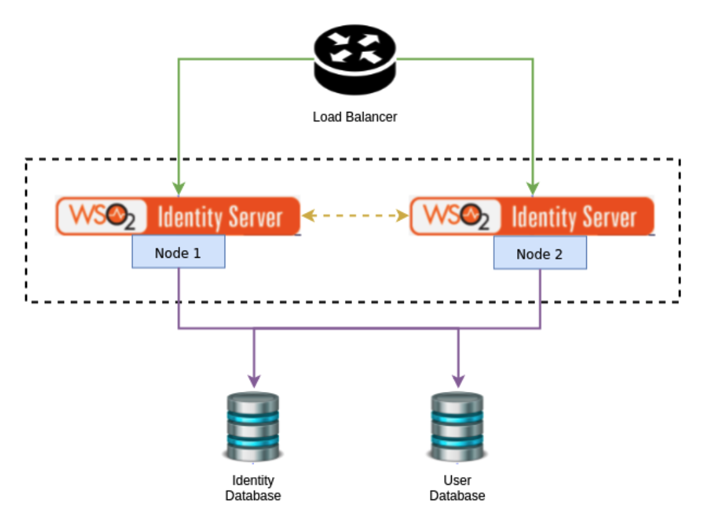

# Deployment Patterns

The following sections provide high level information on
the recommended deployment patterns. 


### Introduction

You can run multiple nodes of WSO2 Identity Server in a cluster mode to achieve two requirements.

1. Handle requests seamlessly: If one node becomes unavailable or is experiencing high traffic, another node will 
seamlessly handle the requests. 
2. Balancing traffic handling: Multiple nodes can handle the traffic together so that cluster throughput is higher 
than the throughput of a single node.

For complete information on clustering concepts, see [Clustering Overview](../../administer/clustering-overview). 
The following sections guide you through setting up the deployment pattern, which is an HA Clustered Deployment 
of 2 WSO2 Identity Server nodes. 

## Deployment prerequisites

As a first step in planning your deployment, ensure that you have the
necessary system requirements and a compatible environment.

**System requirements**

<table>
<tbody>
<tr>
<th>Memory</th>
<td><b>4GB</b> : 2 GB for the Java Virtual Machine (JVM) and 2 GB for the Operating System (OS)</td>
</tr>
<tr>
<th>Disk</th>
<td>10 GB minimum  </td>
</tr>
</tbody>
</table>

**Environment compatibility**

<table>
<tbody>
<tr class="odd">
<th>Operating systems</th>
<td><p>For information on tested operating systems, see <a href="../../setup/environment-compatibility/#tested-operating-systems-and-jdks">Tested Operating Systems and JDKs</a> 
.</p></td>
</tr>
<tr class="even">
<th>RDBMS</th>
<td><p>For information on tested DBMSs, see <a href="../../setup/environment-compatibility/#tested-dbmss">Tested DBMSs</a> .</p></td>
</tr>
<tr class="odd">
<th>Directory services</th>
<td><p>Supports Directory Services implementing following LDAP Protocols:</p>
<ul>
<li>LDAP v2</li>
<li>LDAP v3</li>
</ul>
<p>For information on tested LDAPs, see <a href="../../setup/environment-compatibility/#tested-ldaps">Tested LDAPs</a> .</p></td>
</tr>
<tr class="even">
<th>Java</th>
<td>Oracle JDK 1.8 (There’s a <a href="https://bugs.openjdk.java.net/browse/JDK-8189789">known issue</a> with JDK1.8.0_151)</td>
</tr>
<tr class="odd">
<th>Web browsers</th>
<td><p>For more information on tested web browsers, see <a href="../../setup/environment-compatibility/#tested-web-browsers">Tested Web Browsers</a> .</p></td>
</tr>
<tr class="even">
<th>Load balancers</th>
<td><p>For more information about load balancers, see <a href="https://docs.wso2.com/display/CLUSTER44x/Setting+up+a+Cluster#SettingupaCluster-Configuringtheloadbalancer">Configuring the load balancer</a> .</p></td>
</tr>
</tbody>
</table>

## Configuring Databases

In a clustered deployment, all WSO2 Identity Server nodes are pointed to the same databases to ensure the integrity 
of the data. Also, you can configure multiple logical databases if you require to keep your data logically separated 
in the environment. Following tutorial demonstrates deployment with an identity database (**IDENTITY_DB**) and a user 
database (**UM_DB**).

!!! note
    Alternatively, you can create more databases for each type of data to separate the data logically.  
    This will **NOT** make a difference in performance and is not mandatory. Separating databases logically may 
    sometimes help to have a different backup and scaling strategy when the deployment is large and complex.
    If you do wish to separate the data logically into separate databases, 
    see [Setting Up Separate Databases for Clustering](../../setup/setting-up-separate-databases-for-clustering).

The following diagram is a high-level component diagram showing how the system would look like when three databases 
are used.



!!! note
    For db scripts and more information related to databases, see 
    [Setting up the Physical Database](../../administer/setting-up-the-physical-database).

WSO2 Identity Server uses the `master-datasources.xml` file found in the  `<IS_HOME>/repository/conf/datasources` 
directory, to configure all databases in a single location. We define data sources that can be referred to in 
other configuration files as necessary. The code block below shows a sample configuration for a MySQL database. 
For instructions on how to configure the data sources for other databases, please see, 
[Changing the Carbon Database](../../administer/changing-the-carbon-database).

??? example "Click here to view the sample code block"
    ```xml
    <datasources>
        <datasource>
            <name>WSO2_CARBON_DB</name>
            <description>The datasource used for local registry</description>
            <jndiConfig>
                <name>jdbc/WSO2CarbonDB</name>
            </jndiConfig>
            <definition type="RDBMS">
                <configuration>
                    <url>jdbc:h2:./repository/database/WSO2CARBON_DB;DB_CLOSE_ON_EXIT=FALSE;LOCK_TIMEOUT=60000</url>
                    <username>wso2carbon</username>
                    <password>wso2carbon</password>
                    <driverClassName>org.h2.Driver</driverClassName>
                    <maxActive>50</maxActive>
                    <maxWait>60000</maxWait>
                    <testOnBorrow>true</testOnBorrow>
                    <validationQuery>SELECT 1</validationQuery>
                    <validationInterval>30000</validationInterval>
                    <defaultAutoCommit>false</defaultAutoCommit>
                </configuration>
            </definition>
        </datasource> 
        <datasource>
            <name>WSO2UserStore</name>
            <description>The datasource used for User management</description>
            <jndiConfig>
                <name>jdbc/WSO2UserDS</name>
            </jndiConfig>
            <definition type="RDBMS">
                <configuration>
                    <url>jdbc:mysql://wso2is-pattern1-mysql-service:3306/UM_DB?autoReconnect=true&amp;useSSL=false</url>
                    <username>wso2carbon</username>
                    <password>wso2carbon</password>
                    <driverClassName>com.mysql.jdbc.Driver</driverClassName>
                    <maxActive>80</maxActive>
                    <maxWait>60000</maxWait>
                    <minIdle>5</minIdle>
                    <testOnBorrow>true</testOnBorrow>
                    <validationQuery>SELECT 1</validationQuery>
                    <validationInterval>30000</validationInterval>
                    <defaultAutoCommit>false</defaultAutoCommit>
                </configuration>
            </definition>
        </datasource>
        <datasource>
            <name>WSO2_IDENTITY_DB</name>
            <description>The datasource used for identity management</description>
            <jndiConfig>
                <name>jdbc/WSO2IdentityDS</name>
            </jndiConfig>
            <definition type="RDBMS">
                <configuration>
                    <url>jdbc:mysql://wso2is-pattern1-mysql-service:3306/IDENTITY_DB?autoReconnect=true&amp;useSSL=false</url>
                    <username>wso2carbon</username>
                    <password>wso2carbon</password>
                    <driverClassName>com.mysql.jdbc.Driver</driverClassName>
                    <maxActive>80</maxActive>
                    <maxWait>60000</maxWait>
                    <minIdle>5</minIdle>
                    <testOnBorrow>true</testOnBorrow>
                    <validationQuery>SELECT 1</validationQuery>
                    <validationInterval>30000</validationInterval>
                    <defaultAutoCommit>false</defaultAutoCommit>
                </configuration>
            </definition>
        </datasource>
    </datasources>
    ```
    
    !!! note
        Observe the `jndiConfig` element defined with each data source.    
        ```xml
        <jndiConfig>
        <name>jdbc/WSO2CarbonDB</name>
        </jndiConfig>
        <jndiConfig>
        <name>jdbc/WSO2UserDS</name>
        </jndiConfig>
        …
        <jndiConfig>
        <name>jdbc/WSO2IdentityDS</name>
        </jndiConfig>
        ```
        These data sources can be referred by this `jndiConfig` Name.

### Linking identity database

As we’ve separated out Identity database and user database, we need to configure them in relevant files. 
Change the data source name to `jdbc/WSO2IdentityDS` in `<IS_HOME>/repository/conf/deployment.toml`
 file of both nodes, to configure the new identity database for identity management purposes.

```
[identity] 
data_source="jdbc/WSO2IdentityDS"
```

### Linking user database

Change the data source name to `jdbc/WSO2UserDS` in `<IS_HOME>/repository/conf/deployment.toml` file of both 
nodes, to configure the new user database for user management purposes.

```
[realm_manager]
data_source = "jdbc/WSO2UserDS"
...
```


## Mounting the shared registry

WSO2 Identity Server comprises of three different registry repositories.

1. **Local Repository**: Used to store configuration and runtime data that is local to the server.

2. **Configuration Repository**: Used to store product-specific configurations. 

3. **Governance Repository**: Used to store configuration and data that are shared across the whole platform. 
This typically includes services, service descriptions, endpoints or data sources.

!!! info
    For more information about the registry, 
    see [Working with the Registry](../../administer/working-with-the-registry).

In this cluster setup, we use the default h2 database as the local registry in each node individually. Also, 
governance and configuration registries should be mounted to share across all nodes. To do this add the following 
to the file `<IS_HOME>/repository/conf/registry.xml` in both nodes. 

!!! note
    We have used the `jndiConfig` name of the identity database to reference the data source.

```
<dbConfig name="sharedregistry">
    <dataSource>jdbc/WSO2IdentityDS</dataSource>
</dbConfig>
<remoteInstance url="https://localhost:9443/registry">
    <id>sharedregistry</id>
    <dbConfig>sharedregistry</dbConfig>
    <readOnly>false</readOnly>
    <registryRoot>/</registryRoot>
    <enableCache>true</enableCache>
    <cacheId>jdbc:mysql://wso2is-pattern1-mysql-service:3306/WSO2_IDENTITY_DB</cacheId>
</remoteInstance>
<mount path="/_system/config" overwrite="true">
    <instanceId>sharedregistry</instanceId>
    <targetPath>/_system/config</targetPath>
</mount>
<mount path="/_system/governance" overwrite="true">
    <instanceId>sharedregistry</instanceId>
    <targetPath>/_system/governance</targetPath>
</mount>
```

The local registry information is kept within each node in the in-built h2 database. This is reffered as 
**WSO2CarbonDB** in the above data sources configuration. There is no harm losing the local registry information 
and there is no backup requirement on this database. For more information on mounting the registry, 
see [Sharing Databases in a Cluster](../../administer/sharing-databases-in-a-cluster).

!!! note
    The production recommendation is to set the `<versionResourcesOnChange>` property in the `registry.xml` 
    file to false. This is because the automatic versioning of resources can be an extremely expensive operation. 
    `<versionResourcesOnChange>false</versionResourcesOnChange>`

To make sure the configurations were applied correctly:

<ol>
    <li>Log in to the management console.</li>
    <li>
        <p>Navigate to <b>Home > Registry > Browse</b>.</p>
        <p></p>
        <p>Note that the governance collection is shown with the symlink icon.</p>
    </li>    
</ol>

   

## Clustering-related configurations

Following configurations need to be done to both WSO2 Identity Server nodes in order to enable clustering between 
them.

1. Enable clustering on node 1 and node 2 by setting the membership scheme that fits your deployment by 
    editing the `<IS_HOME>/repository/conf/deployment.toml` file.
    ```
    [clustering]
    membership_scheme = "wka"
    ```

    !!! info      
        WSO2 supports the following membership schemes as well.
            - Multicast membership scheme
            - AWS membership scheme
            - Kubernetes membership scheme

        The simplest is the well-known address (WKA) based clustering method. It only suites where all the nodes are 
        deployed on machines having static IP addresses.             
        ```  
        <parameter name="membershipScheme">wka</parameter>
        ```
        For more information, see [About Membership Schemes](../../administer/clustering-overview/#about-membership-schemes).
    
    ??? tip "Click to see the instructions for WKA scheme"            
        Configure the `localMemberHost` and `localMemberPort` entries. Add the IP of the editing node itself.                    
                ```
                [clustering]
                local_member_host = "192.168.2.1"
                local_member_port = "4000"
                ```                    
        Under the `members` section, add the `hostName` and `port` for each WKA member. As we have only two nodes 
        in our sample cluster configuration, we will configure both nodes as WKA nodes.         
        
        You can also use IP address ranges for the hostName. For example, `192.168.1.2-10`. This should ensure 
        that the cluster eventually recovers after failures. One shortcoming of doing this is that you can define 
        a range only for the last portion of the IP address. You should also keep in mind that the smaller 
        the range, the faster the time it takes to discover members since each node has to scan a lesser 
        number of potential members. 
    
        
2. Configure caching.

    !!! note
        From WSO2 Identity Server 5.2.0 onwards, distributed caching is disabled and it is not recommended 
        to use this due to many practical issues that are related to configuring and running distributed 
        caching properly. WSO2 Identity Server employs **Hazelcast** as the primary method of implementing 
        cluster messages while using distributed caching in a simple setup.

    ??? info "About Caching"
        <ul>
            <li><b>Why caching</b></br>Caching is an additional layer on top of the databases. It enables to keep 
            the recently used data that are fetched from the database in local memory, so that for subsequent 
            data requests instead of fetching from the database the data can be served from the local memory. 
            Caching has certain advantages and disadvantages that you need to evaluate when deciding on your 
            caching strategy.</li>
            <li><b>Advantages</b>
                <ul>
                    <li>The load on the underlying database or LDAP is reduced as data is served from already 
                    fetched data in memory.</li>
                    <li>Improved performance due to the reduced number of database calls for repetitive 
                    data fetching.</li>
                </ul>
            </li>
            <li><b>Disadvantages</b>
                <ul>
                    <li>Coherency problems may occur when the data change is not immediately reflected on 
                    cached data if one node or an external system updates the database.</li>
                    <li>Data in memory can become stale yet be served, e.g., serving data from memory while 
                    its corresponding record in the database is deleted.</li>
                </ul>
            </li>
        </ul>

    ??? tip "Caching in WSO2 Identity Server"
        Historically WSO2 Identity Server used distributed caching to utilize the above-mentioned advantages 
        as well as to minimize the coherence problem. However, in newer deployment patterns where the network 
        is not tightly controlled, distributed caching fails in unexpected ways. Hence, we **no longer recommend 
        using distributed caching**. Instead, it is **recommended to have local caches** (if required) and 
        **cache invalidation messages** (if required) by considering the information given below.
        <ul>
            <li><b>The ForceLocalCache property</b></br>
            When Hazelcast clustering is enabled certain caches act as distributed caches. The `force_local_cache` property in the `<IS_HOME>/repository/conf/deployment.toml` directory is there to mark that all the caches should act like local caches even in a clustered setup. (This is by default set to `true`).
            ```
            [server]
            force_local_cache = true
            ```
            Cache invalidation uses Hazelcast messaging to distribute the invalidation message over the cluster 
            and invalidate the caches properly.  This is used to minimize the coherence problem in a multi-node setup.
            </li>
            <li><b>Typical clustered deployment cache scenarios</b></br>
            <table>
                <thead>
                    <tr>
                        <th>Scenario</th>
                        <th>Local Caching</th>
                        <th>Distributed Caching</th>
                        <th>Hazelcast Clustering</th>
                        <th>Distributed Invalidation</th>
                        <th>Description</th>
                    </tr>
                </thead>
                <tbody>
                    <tr>
                        <td>1. All caches are local with distributed cache invalidation</td>
                        <td>Enabled</td>
                        <td>Not Applicable</td>
                        <td>Enabled</td>
                        <td>Enabled</td>
                        <td>
                            <ul>
                                <li>This is the <b>recommended approach</b>.</li>
                                <li>Hazelcast messaging invalidates the caches.</li>
                            </ul>
                        </td>
                    </tr>
                    <tr>
                        <td>2. All caches are local without distributed cache invalidation</td>
                        <td>Enabled</td>
                        <td>Not Applicable</td>
                        <td>Disabled</td>
                        <td>Disabled</td>
                        <td>
                            <ul>
                                <li>Invalidation clears only the caches in specific nodes. Other caches are 
                                cleared at cache expiration.</li>
                                <li>Hazelcast communication is not used.</li>
                                <li>As the decisions take time to propagate over nodes (default cache 
                                timeout is 15 minutes), there is a security risk in this method. To reduce 
                                the risk, reduce the default cache timeout period. To learn how to reduce the 
                                default cache timeout period, 
                                see [Configuring Cache Layers - timeout](../../administer/configuring-cache-layers#timeout).</li>
                            </ul>
                        </td>
                    </tr>
                    <tr>
                        <td>3. No caching</td>
                        <td>Disabled</td>
                        <td>Disabled</td>
                        <td>Disabled</td>
                        <td>Disabled</td>
                        <td>
                            <ul>
                                <li>The data are directly acquired from the database.</li>
                                <li>Eliminates the security risks caused due to not having cache invalidation.</li>
                                <li>This method will create a performance degradation due to the lack of 
                                caching.</li>
                            </ul>
                        </td>
                    </tr>
                    <tr>
                        <td>4. Certain caches are disabled while the remaining are local</td>
                        <td>Enabled for the available local caches</td>
                        <td>Not Applicable</td>
                        <td>Enabled</td>
                        <td>Enabled</td>
                        <td>
                            <ul>
                                <li>To reduce the security risk created in the second scenario and to 
                                improve performance in comparison with the third scenario, disable the 
                                security-related caches and sustain the performance-related caches as 
                                local caches.</li>
                                <li>This requires identification of these caches depending on the use case.</li>
                            </ul>
                        </td>
                    </tr>
                    <tr>
                        <td>5. Distributed caching enabled</td>
                        <td>Disabled—the `force_local_cache` is set to `false`.</td>
                        <td>Enabled</td>
                        <td>Enabled</td>
                        <td>Not Applicable</td>
                        <td>
                            <ul>
                                <li>This scenario is only recommended if the network has tight tolerance 
                                where the network infrastructure is capable of handling high bandwidth with 
                                very low latency.</li>
                                <li>Typically this applies only when you deploy <b>all the nodes in a single 
                                server rack having fiber-optic cables</b>. In any other environments, this 
                                implementation will cause cache losses. Thus, this implementation is <b>not 
                                recommended for general use</b>.
                            </ul>
                        </td>
                    </tr>
                </tbody>
            </table>
            </li>
        </ul>

3. Go to the `<IS_HOME>/repository/conf/deployment.toml` file and add the proxy port as `443`. 
The port 443 is the Load Balancer frontend port.

    !!! example
        ```
        [transport.http]
        port = "80"

        [transport.https]
        proxyPort = "443" 
        ```

4. You may change the `<IS_HOME>/repository/conf/deployment.toml` file to access the servers using a 
hostname instead of the raw IP. This hostname is the one the external applications try to look up WSO2 
Identity Server endpoints. The `hostName` should be resolved to the Load Balancer front-end IP address.

    ```
    [server]
    hostname = "wso2.is.com<"
    ```

    !!! note 
        This hostname is used by the WSO2 Identity Server cluster and therefore it must be specified in 
        the `/etc/hosts` file in each node so that internal calls will not be routed through the Load Balancer.
        
        Example: 
        `192.168.2.1   wso2.is.com`

## Enabling artifact synchronization

To enable synchronization for runtime artifacts you must have a shared file system. You can use one of the following
 depending on your environment.
 
   -   **Network File System (NFS)**: This is one of the most commonly known shared file systems and can be used 
   in a linux environment.
   -   **Server Message Block (SMB) file system**: This can be used in a Windows environment.
   -   **Amazon EFS**: This can be used in an AWS environment.

Once you have chosen a file system, 

1. Mount it in the nodes that are participating in the cluster.
2. Create two directories called `Deployment` and `Tenants` in the shared file system.
3. Create a symlink from the `<IS_HOME>/repository/deployment` path to the `Deployment` directory of the shared 
file system that you created in step 2 of this section.
4. Create a symlink from the `<IS_HOME>/repository/tenants` path to the `Tenants` directory of the shared file 
system that you created in step 2 of this section.

!!! note
    Instead of mounting the file system directly to the `<IS_HOME>/repository/deployment` and
     `<IS_HOME>/repository/tenants` paths, a symlink is created to avoid issues that may occur 
     if you delete the product to redeploy it, the file system would get mounted to a non-existing path.
 

## Fronting with a load balancer

In order to access the two WSO2 Identity Server nodes, you need to front the system with a load balancer. 
You can use any load balancer that is available to your system. 

!!! info
    To learn how to front the 2 node cluster with an Nginx load balance, 
    see [Fronting with the Nginx load balancer](../../setup/fronting-with-the-nginx-load-balancer). 
    If you’ve changed the hostnames of nodes, make sure to keep that in mind when you’re configuring your 
    load balancer.


## Running the cluster

1. Start the load balancer and WSO2 Identity Server nodes.
2. Access the management console at `https://wso2.is.com/carbon/`. 
    Traffic will be served by one of the nodes in the cluster, depending on your load balancer.
3. Shut down the cluster node 1 and observe that the traffic is served by node 2. 
3. Start node 1 and shut down node 2. Note that traffic will be served by node 1.