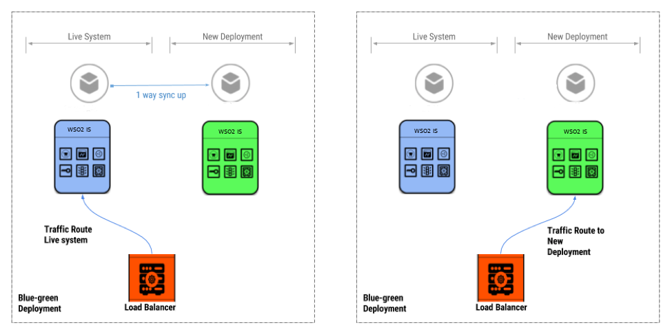

# Preparing for migration

!!! note
    Before you follow this section, see [Before you begin](../../setup/migration-guide) to read on 
    prerequisites.

!!! note
    In this section, `<OLD_IS_HOME> ` is the directory that current Identity
    Server resides in, and `<NEW_IS_HOME>` is the
    directory that WSO2 Identity Server 5.9.0 resides in. 
    
## Disabling versioning in the registry configuration
If there are frequently updating registry properties, having the versioning enabled for 
registry resources in the registry can lead to unnecessary growth in the registry related
tables in the database. To avoid this, we have disabled versioning by default in Identity 
Server 5.9.0.

Therefore, when migrating to IS 5.9.0 it is **required** to turn off the registry versioning in your
current Identity Server and run the below scripts against the database that is used by the registry.

!!! note "NOTE"
    Alternatively, it is possible to turn on registry versioning in IS 5.9.0 and continue. But this is
    highly **NOTE RECOMMENDED** and these configurations should only be changed once.

!!! info "Turning off registry versioning in your current IS and running the scripts"
    Open the `registry.xml` file in the `<OLD_IS_HOME>/repository/conf` directory.
    Set the `versioningProperties`, `versioningComments`, `versioningTags` and `versioningRatings`
    false.
    
    ```
    <staticConfiguration>
          <versioningProperties>false</versioningProperties>
          <versioningComments>false</versioningComments>
          <versioningTags>false</versioningTags>
          <versioningRatings>false</versioningRatings>
    </staticConfiguration>
    ```
    
    !!! warning
        If the above configurations are already set as `false` you should not run the below scripts.
    
    When the above configurations are turned off, we need to remove the versioning detatils from the
    database in order for the registry resources to work properly. Choose the relevant DB type and run the
    script against the DB that the registry resides in.
    
    ??? info "DB Scripts"
        ```tab="H2"
        -- Update the REG_PATH_ID column mapped with the REG_RESOURCE table --
        UPDATE REG_RESOURCE_TAG SET REG_RESOURCE_TAG.REG_PATH_ID=(SELECT REG_RESOURCE.REG_PATH_ID FROM REG_RESOURCE WHERE REG_RESOURCE.REG_VERSION=REG_RESOURCE_TAG.REG_VERSION);
        
        UPDATE REG_RESOURCE_COMMENT SET REG_RESOURCE_COMMENT.REG_PATH_ID=(SELECT REG_RESOURCE.REG_PATH_ID FROM REG_RESOURCE WHERE REG_RESOURCE.REG_VERSION=REG_RESOURCE_COMMENT.REG_VERSION);
        
        UPDATE REG_RESOURCE_PROPERTY SET REG_RESOURCE_PROPERTY.REG_PATH_ID=(SELECT REG_RESOURCE.REG_PATH_ID FROM REG_RESOURCE WHERE REG_RESOURCE.REG_VERSION=REG_RESOURCE_PROPERTY.REG_VERSION);
        
        UPDATE REG_RESOURCE_RATING SET REG_RESOURCE_RATING.REG_PATH_ID=(SELECT REG_RESOURCE.REG_PATH_ID FROM REG_RESOURCE WHERE REG_RESOURCE.REG_VERSION=REG_RESOURCE_RATING.REG_VERSION);
        
        -- Delete versioned tags, were the PATH_ID will be null for older versions --
        delete from REG_RESOURCE_PROPERTY where REG_PATH_ID is NULL;
        
        delete from REG_RESOURCE_RATING where REG_PATH_ID is NULL;
        
        delete from REG_RESOURCE_TAG where REG_PATH_ID is NULL;
        
        delete from REG_RESOURCE_COMMENT where REG_PATH_ID is NULL;
        
        delete from REG_PROPERTY where REG_ID NOT IN (select REG_PROPERTY_ID from REG_RESOURCE_PROPERTY);
        
        delete from REG_TAG where REG_ID NOT IN (select REG_TAG_ID from REG_RESOURCE_TAG);
        
        delete from REG_COMMENT where REG_ID NOT IN (select REG_COMMENT_ID from REG_RESOURCE_COMMENT);
        
        delete from REG_RATING where REG_ID NOT IN (select REG_RATING_ID from REG_RESOURCE_RATING);
        
        -- Update the REG_PATH_NAME column mapped with the REG_RESOURCE table --
        UPDATE REG_RESOURCE_TAG SET REG_RESOURCE_TAG.REG_RESOURCE_NAME=(SELECT REG_RESOURCE.REG_NAME FROM REG_RESOURCE WHERE REG_RESOURCE.REG_VERSION=REG_RESOURCE_TAG.REG_VERSION);
        
        UPDATE REG_RESOURCE_PROPERTY SET REG_RESOURCE_PROPERTY.REG_RESOURCE_NAME=(SELECT REG_RESOURCE.REG_NAME FROM REG_RESOURCE WHERE REG_RESOURCE.REG_VERSION=REG_RESOURCE_PROPERTY.REG_VERSION);
        
        UPDATE REG_RESOURCE_COMMENT SET REG_RESOURCE_COMMENT.REG_RESOURCE_NAME=(SELECT REG_RESOURCE.REG_NAME FROM REG_RESOURCE WHERE REG_RESOURCE.REG_VERSION=REG_RESOURCE_COMMENT.REG_VERSION);
        
        UPDATE REG_RESOURCE_RATING SET REG_RESOURCE_RATING.REG_RESOURCE_NAME=(SELECT REG_RESOURCE.REG_NAME FROM REG_RESOURCE WHERE REG_RESOURCE.REG_VERSION=REG_RESOURCE_RATING.REG_VERSION);
        
        ```
    
        ```tab="DB2"
        -- Update the REG_PATH_ID column mapped with the REG_RESOURCE table --
        UPDATE REG_RESOURCE_TAG SET REG_RESOURCE_TAG.REG_PATH_ID=(SELECT REG_RESOURCE.REG_PATH_ID FROM REG_RESOURCE WHERE REG_RESOURCE.REG_VERSION=REG_RESOURCE_TAG.REG_VERSION)
        /
        UPDATE REG_RESOURCE_COMMENT SET REG_RESOURCE_COMMENT.REG_PATH_ID=(SELECT REG_RESOURCE.REG_PATH_ID FROM REG_RESOURCE WHERE REG_RESOURCE.REG_VERSION=REG_RESOURCE_COMMENT.REG_VERSION)
        /
        UPDATE REG_RESOURCE_PROPERTY SET REG_RESOURCE_PROPERTY.REG_PATH_ID=(SELECT REG_RESOURCE.REG_PATH_ID FROM REG_RESOURCE WHERE REG_RESOURCE.REG_VERSION=REG_RESOURCE_PROPERTY.REG_VERSION)
        /
        UPDATE REG_RESOURCE_RATING SET REG_RESOURCE_RATING.REG_PATH_ID=(SELECT REG_RESOURCE.REG_PATH_ID FROM REG_RESOURCE WHERE REG_RESOURCE.REG_VERSION=REG_RESOURCE_RATING.REG_VERSION)
        /
        
        -- Delete versioned tags, were the PATH_ID will be null for older versions --
        delete from REG_RESOURCE_PROPERTY where REG_PATH_ID is NULL
        /
        delete from REG_RESOURCE_RATING where REG_PATH_ID is NULL
        /
        delete from REG_RESOURCE_TAG where REG_PATH_ID is NULL
        /
        delete from REG_RESOURCE_COMMENT where REG_PATH_ID is NULL
        /
        delete from REG_PROPERTY where REG_ID NOT IN (select REG_PROPERTY_ID from REG_RESOURCE_PROPERTY)
        /
        delete from REG_TAG where REG_ID NOT IN (select REG_TAG_ID from REG_RESOURCE_TAG)
        /
        delete from REG_COMMENT where REG_ID NOT IN (select REG_COMMENT_ID from REG_RESOURCE_COMMENT)
        /
        delete from REG_RATING where REG_ID NOT IN (select REG_RATING_ID from REG_RESOURCE_RATING)
        /
        
        -- Update the REG_PATH_NAME column mapped with the REG_RESOURCE table --
        UPDATE REG_RESOURCE_TAG SET REG_RESOURCE_TAG.REG_RESOURCE_NAME=(SELECT REG_RESOURCE.REG_NAME FROM REG_RESOURCE WHERE REG_RESOURCE.REG_VERSION=REG_RESOURCE_TAG.REG_VERSION)
        /
        UPDATE REG_RESOURCE_PROPERTY SET REG_RESOURCE_PROPERTY.REG_RESOURCE_NAME=(SELECT REG_RESOURCE.REG_NAME FROM REG_RESOURCE WHERE REG_RESOURCE.REG_VERSION=REG_RESOURCE_PROPERTY.REG_VERSION)
        /
        UPDATE REG_RESOURCE_COMMENT SET REG_RESOURCE_COMMENT.REG_RESOURCE_NAME=(SELECT REG_RESOURCE.REG_NAME FROM REG_RESOURCE WHERE REG_RESOURCE.REG_VERSION=REG_RESOURCE_COMMENT.REG_VERSION)
        /
        UPDATE REG_RESOURCE_RATING SET REG_RESOURCE_RATING.REG_RESOURCE_NAME=(SELECT REG_RESOURCE.REG_NAME FROM REG_RESOURCE WHERE REG_RESOURCE.REG_VERSION=REG_RESOURCE_RATING.REG_VERSION)
        /
        
        ```
    
        ```tab="MSSQL"
        -- Update the REG_PATH_ID column mapped with the REG_RESOURCE table --
        UPDATE REG_RESOURCE_TAG SET REG_PATH_ID=(SELECT REG_PATH_ID FROM REG_RESOURCE WHERE REG_RESOURCE.REG_VERSION=REG_RESOURCE_TAG.REG_VERSION);
        
        UPDATE REG_RESOURCE_COMMENT SET REG_PATH_ID=(SELECT REG_PATH_ID FROM REG_RESOURCE WHERE REG_RESOURCE.REG_VERSION=REG_RESOURCE_COMMENT.REG_VERSION);
        
        UPDATE REG_RESOURCE_PROPERTY SET REG_PATH_ID=(SELECT REG_PATH_ID FROM REG_RESOURCE WHERE REG_RESOURCE.REG_VERSION=REG_RESOURCE_PROPERTY.REG_VERSION);
        
        UPDATE REG_RESOURCE_RATING SET REG_PATH_ID=(SELECT REG_PATH_ID FROM REG_RESOURCE WHERE REG_RESOURCE.REG_VERSION=REG_RESOURCE_RATING.REG_VERSION);
        
        -- Delete versioned tags, were the PATH_ID will be null for older versions --
        delete from REG_RESOURCE_PROPERTY where REG_PATH_ID is NULL;
        
        delete from REG_RESOURCE_RATING where REG_PATH_ID is NULL;
        
        delete from REG_RESOURCE_TAG where REG_PATH_ID is NULL;
        
        delete from REG_RESOURCE_COMMENT where REG_PATH_ID is NULL;
        
        delete from REG_PROPERTY where REG_ID NOT IN (select REG_PROPERTY_ID from REG_RESOURCE_PROPERTY);
        
        delete from REG_TAG where REG_ID NOT IN (select REG_TAG_ID from REG_RESOURCE_TAG);
        
        delete from REG_COMMENT where REG_ID NOT IN (select REG_COMMENT_ID from REG_RESOURCE_COMMENT);
        
        delete from REG_RATING where REG_ID NOT IN (select REG_RATING_ID from REG_RESOURCE_RATING);
        
        -- Update the REG_PATH_NAME column mapped with the REG_RESOURCE table --
        UPDATE REG_RESOURCE_TAG SET REG_RESOURCE_NAME=(SELECT REG_NAME FROM REG_RESOURCE WHERE REG_RESOURCE.REG_VERSION=REG_RESOURCE_TAG.REG_VERSION);
        
        UPDATE REG_RESOURCE_PROPERTY SET REG_RESOURCE_NAME=(SELECT REG_NAME FROM REG_RESOURCE WHERE REG_RESOURCE.REG_VERSION=REG_RESOURCE_PROPERTY.REG_VERSION);
        
        UPDATE REG_RESOURCE_COMMENT SET REG_RESOURCE_NAME=(SELECT REG_NAME FROM REG_RESOURCE WHERE REG_RESOURCE.REG_VERSION=REG_RESOURCE_COMMENT.REG_VERSION);
        
        UPDATE REG_RESOURCE_RATING SET REG_RESOURCE_NAME=(SELECT REG_NAME FROM REG_RESOURCE WHERE REG_RESOURCE.REG_VERSION=REG_RESOURCE_RATING.REG_VERSION);
        
        ```

        ```tab="MySQL"
        -- Update the REG_PATH_ID column mapped with the REG_RESOURCE table --
        UPDATE REG_RESOURCE_TAG SET REG_RESOURCE_TAG.REG_PATH_ID=(SELECT REG_RESOURCE.REG_PATH_ID FROM REG_RESOURCE WHERE REG_RESOURCE.REG_VERSION=REG_RESOURCE_TAG.REG_VERSION);
        
        UPDATE REG_RESOURCE_COMMENT SET REG_RESOURCE_COMMENT.REG_PATH_ID=(SELECT REG_RESOURCE.REG_PATH_ID FROM REG_RESOURCE WHERE REG_RESOURCE.REG_VERSION=REG_RESOURCE_COMMENT.REG_VERSION);
        
        UPDATE REG_RESOURCE_PROPERTY SET REG_RESOURCE_PROPERTY.REG_PATH_ID=(SELECT REG_RESOURCE.REG_PATH_ID FROM REG_RESOURCE WHERE REG_RESOURCE.REG_VERSION=REG_RESOURCE_PROPERTY.REG_VERSION);
        
        UPDATE REG_RESOURCE_RATING SET REG_RESOURCE_RATING.REG_PATH_ID=(SELECT REG_RESOURCE.REG_PATH_ID FROM REG_RESOURCE WHERE REG_RESOURCE.REG_VERSION=REG_RESOURCE_RATING.REG_VERSION);
        
        -- Delete versioned tags, were the PATH_ID will be null for older versions --
        delete from REG_RESOURCE_PROPERTY where REG_PATH_ID is NULL;
        
        delete from REG_RESOURCE_RATING where REG_PATH_ID is NULL;
        
        delete from REG_RESOURCE_TAG where REG_PATH_ID is NULL;
        
        delete from REG_RESOURCE_COMMENT where REG_PATH_ID is NULL;
        
        delete from REG_PROPERTY where REG_ID NOT IN (select REG_PROPERTY_ID from REG_RESOURCE_PROPERTY);
        
        delete from REG_TAG where REG_ID NOT IN (select REG_TAG_ID from REG_RESOURCE_TAG);
        
        delete from REG_COMMENT where REG_ID NOT IN (select REG_COMMENT_ID from REG_RESOURCE_COMMENT);
        
        delete from REG_RATING where REG_ID NOT IN (select REG_RATING_ID from REG_RESOURCE_RATING);
        
        -- Update the REG_PATH_NAME column mapped with the REG_RESOURCE table --
        UPDATE REG_RESOURCE_TAG SET REG_RESOURCE_TAG.REG_RESOURCE_NAME=(SELECT REG_RESOURCE.REG_NAME FROM REG_RESOURCE WHERE REG_RESOURCE.REG_VERSION=REG_RESOURCE_TAG.REG_VERSION);
        
        UPDATE REG_RESOURCE_PROPERTY SET REG_RESOURCE_PROPERTY.REG_RESOURCE_NAME=(SELECT REG_RESOURCE.REG_NAME FROM REG_RESOURCE WHERE REG_RESOURCE.REG_VERSION=REG_RESOURCE_PROPERTY.REG_VERSION);
        
        UPDATE REG_RESOURCE_COMMENT SET REG_RESOURCE_COMMENT.REG_RESOURCE_NAME=(SELECT REG_RESOURCE.REG_NAME FROM REG_RESOURCE WHERE REG_RESOURCE.REG_VERSION=REG_RESOURCE_COMMENT.REG_VERSION);
        
        UPDATE REG_RESOURCE_RATING SET REG_RESOURCE_RATING.REG_RESOURCE_NAME=(SELECT REG_RESOURCE.REG_NAME FROM REG_RESOURCE WHERE REG_RESOURCE.REG_VERSION=REG_RESOURCE_RATING.REG_VERSION);
        
        ```
    
        ```tab="Oracle"
        -- Update the REG_PATH_ID column mapped with the REG_RESOURCE table --
        UPDATE REG_RESOURCE_TAG SET REG_RESOURCE_TAG.REG_PATH_ID=(SELECT REG_RESOURCE.REG_PATH_ID FROM REG_RESOURCE WHERE REG_RESOURCE.REG_VERSION=REG_RESOURCE_TAG.REG_VERSION)
        /
        UPDATE REG_RESOURCE_COMMENT SET REG_RESOURCE_COMMENT.REG_PATH_ID=(SELECT REG_RESOURCE.REG_PATH_ID FROM REG_RESOURCE WHERE REG_RESOURCE.REG_VERSION=REG_RESOURCE_COMMENT.REG_VERSION)
        /
        UPDATE REG_RESOURCE_PROPERTY SET REG_RESOURCE_PROPERTY.REG_PATH_ID=(SELECT REG_RESOURCE.REG_PATH_ID FROM REG_RESOURCE WHERE REG_RESOURCE.REG_VERSION=REG_RESOURCE_PROPERTY.REG_VERSION)
        /
        UPDATE REG_RESOURCE_RATING SET REG_RESOURCE_RATING.REG_PATH_ID=(SELECT REG_RESOURCE.REG_PATH_ID FROM REG_RESOURCE WHERE REG_RESOURCE.REG_VERSION=REG_RESOURCE_RATING.REG_VERSION)
        /
        
        -- Delete versioned tags, were the PATH_ID will be null for older versions --
        delete from REG_RESOURCE_PROPERTY where REG_PATH_ID is NULL
        /
        delete from REG_RESOURCE_RATING where REG_PATH_ID is NULL
        /
        delete from REG_RESOURCE_TAG where REG_PATH_ID is NULL
        /
        delete from REG_RESOURCE_COMMENT where REG_PATH_ID is NULL
        /
        delete from REG_PROPERTY where REG_ID NOT IN (select REG_PROPERTY_ID from REG_RESOURCE_PROPERTY)
        /
        delete from REG_TAG where REG_ID NOT IN (select REG_TAG_ID from REG_RESOURCE_TAG)
        /
        delete from REG_COMMENT where REG_ID NOT IN (select REG_COMMENT_ID from REG_RESOURCE_COMMENT)
        /
        delete from REG_RATING where REG_ID NOT IN (select REG_RATING_ID from REG_RESOURCE_RATING)
        /
        
        -- Update the REG_PATH_NAME column mapped with the REG_RESOURCE table --
        UPDATE REG_RESOURCE_TAG SET REG_RESOURCE_TAG.REG_RESOURCE_NAME=(SELECT REG_RESOURCE.REG_NAME FROM REG_RESOURCE WHERE REG_RESOURCE.REG_VERSION=REG_RESOURCE_TAG.REG_VERSION)
        /
        UPDATE REG_RESOURCE_PROPERTY SET REG_RESOURCE_PROPERTY.REG_RESOURCE_NAME=(SELECT REG_RESOURCE.REG_NAME FROM REG_RESOURCE WHERE REG_RESOURCE.REG_VERSION=REG_RESOURCE_PROPERTY.REG_VERSION)
        /
        UPDATE REG_RESOURCE_COMMENT SET REG_RESOURCE_COMMENT.REG_RESOURCE_NAME=(SELECT REG_RESOURCE.REG_NAME FROM REG_RESOURCE WHERE REG_RESOURCE.REG_VERSION=REG_RESOURCE_COMMENT.REG_VERSION)
        /
        UPDATE REG_RESOURCE_RATING SET REG_RESOURCE_RATING.REG_RESOURCE_NAME=(SELECT REG_RESOURCE.REG_NAME FROM REG_RESOURCE WHERE REG_RESOURCE.REG_VERSION=REG_RESOURCE_RATING.REG_VERSION)
        /
        
        ```
        
        ```tab="PostgreSQL"
        -- Update the REG_PATH_ID column mapped with the REG_RESOURCE table --
        UPDATE REG_RESOURCE_TAG SET REG_PATH_ID=(SELECT REG_PATH_ID FROM REG_RESOURCE WHERE REG_RESOURCE.REG_VERSION=REG_RESOURCE_TAG.REG_VERSION);
        
        UPDATE REG_RESOURCE_COMMENT SET REG_PATH_ID=(SELECT REG_PATH_ID FROM REG_RESOURCE WHERE REG_RESOURCE.REG_VERSION=REG_RESOURCE_COMMENT.REG_VERSION);
        
        UPDATE REG_RESOURCE_PROPERTY SET REG_PATH_ID=(SELECT REG_PATH_ID FROM REG_RESOURCE WHERE REG_RESOURCE.REG_VERSION=REG_RESOURCE_PROPERTY.REG_VERSION);
        
        UPDATE REG_RESOURCE_RATING SET REG_PATH_ID=(SELECT REG_PATH_ID FROM REG_RESOURCE WHERE REG_RESOURCE.REG_VERSION=REG_RESOURCE_RATING.REG_VERSION);
        
        -- Delete versioned tags, were the PATH_ID will be null for older versions --
        delete from REG_RESOURCE_PROPERTY where REG_PATH_ID is NULL;
        
        delete from REG_RESOURCE_RATING where REG_PATH_ID is NULL;
        
        delete from REG_RESOURCE_TAG where REG_PATH_ID is NULL;
        
        delete from REG_RESOURCE_COMMENT where REG_PATH_ID is NULL;
        
        delete from REG_PROPERTY where REG_ID NOT IN (select REG_PROPERTY_ID from REG_RESOURCE_PROPERTY);
        
        delete from REG_TAG where REG_ID NOT IN (select REG_TAG_ID from REG_RESOURCE_TAG);
        
        delete from REG_COMMENT where REG_ID NOT IN (select REG_COMMENT_ID from REG_RESOURCE_COMMENT);
        
        delete from REG_RATING where REG_ID NOT IN (select REG_RATING_ID from REG_RESOURCE_RATING);
        
        -- Update the REG_PATH_NAME column mapped with the REG_RESOURCE table --
        UPDATE REG_RESOURCE_TAG SET REG_RESOURCE_NAME=(SELECT REG_NAME FROM REG_RESOURCE WHERE REG_RESOURCE.REG_VERSION=REG_RESOURCE_TAG.REG_VERSION);
        
        UPDATE REG_RESOURCE_PROPERTY SET REG_RESOURCE_NAME=(SELECT REG_NAME FROM REG_RESOURCE WHERE REG_RESOURCE.REG_VERSION=REG_RESOURCE_PROPERTY.REG_VERSION);
        
        UPDATE REG_RESOURCE_COMMENT SET REG_RESOURCE_NAME=(SELECT REG_NAME FROM REG_RESOURCE WHERE REG_RESOURCE.REG_VERSION=REG_RESOURCE_COMMENT.REG_VERSION);
        
        UPDATE REG_RESOURCE_RATING SET REG_RESOURCE_NAME=(SELECT REG_NAME FROM REG_RESOURCE WHERE REG_RESOURCE.REG_VERSION=REG_RESOURCE_RATING.REG_VERSION);
        
        ```
       
!!! warning "Not recommended"
    If you decide to proceed with registry resource versioning enabled, Add the following
    configuration to the `deployment.toml` file of new WSO2 Identity Server. 
    `<NEW_IS_HOME>/repository/conf/deployment.toml`
    
    ```
    [registory.static_configuration]
    enable=false
    ```
    
    !!! note "NOTE"
        Changing these configuration should only be done before the initial Identity
        Server startup. If changes are done after the initial startup, the registry resource created
        previously will not be available.
   
## Migrating the Secondary Userstore Password to the Internal Keystore

Ideally, the internal keystore should be used for encrypting internal critical data. However, in 
previous versions, the secondary userstore passwords are encrypted using the primary keystore, 
which is also used to sign and encrypt tokens.

In WSO2 Identity Server 5.9.0 we have moved the secondary userstore password encryption functionality 
from the primary keystore to the internal keystore.

Check this [link](../../administer/migrating-the-secondary-userstore-password-to-the-internal-keystore) 
to see the instructions on migrating the secondary userstore password to encrypt using internal keystore. 


## Migrating custom components

In WSO2 Identity Server 5.9.0 we have done a major upgrade to our kernel and our main components. 
Any custom OSGI bundles which are added manually should be recompiled with new dependency versions 
that are relevant to the new WSO2 IS version.  All custom OSGI components reside in the 
`<OLD_IS_HOME>/repository/components/dropins` directory.

1.  Get the source codes of the custom OSGI components located in the dropins directory. 

2.  Change the dependency versions in the relevant POM files according to the WSO2 IS version that 
    you are upgrading to, and compile them. The compatible dependency versions can be found 
    [here](https://github.com/wso2/product-is/blob/v5.9.0/pom.xml). 

3.  If you come across any compile time errors, refer to the WSO2 IS code base and make the 
    necessary changes related to that particular component version.

4.  Add the compiled JAR files to the `<NEW_IS_HOME>/repository/components/dropins` directory.

5.  If there were any custom OSGI components in `<OLD_IS_HOME>/repository/components/lib` directory, 
    add newly compiled versions of those components to the `<NEW_IS_HOME>/repository/components/lib`  directory.

!!! warning 
    WSO2 Identity Server 5.9.0 switched from log4j to log4j2. If any custom components are already using 
    `carbon.logging` jar for logging purposes, make sure to update the custom components for logging to 
    work with log4j2. For instructions, see [Migrating to log4j2](../../setup/migrating-to-log4j2).
    

## Migrating the configurations

Previous WSO2 Identity Server versions supported multiple configuration files 
such as <code>carbon.xml</code>, <code>identity.xml</code>, and <code>axis2.xml</code>. With the 
[new configuration model](../../references/new-configuration-model) in WSO2 Identity Server 5.9.0, 
configurations are handled by the a single file named 
`deployment.toml` in the `<IS_HOME>/repository/conf` directory.

!!! warn "Note" 
    When you are migrating from older version of WSO2
    Identity Server, you need to convert old configurations to new
    configuration model as well.

Refer to the relevant feature documents and
[What Has Changed](../../setup/migrating-what-has-changed) to add the
necessary configurations according to the new configuration model.

!!! info
    If you have a WSO2 Subscription, it is highly recommended to reach 
    [WSO2 Support](https://support.wso2.com/jira/secure/Dashboard.jspa)
    before attempting to proceed with the configuration migration.
    
## Zero down time migration

!!! info
    If you do not require a zero down time migration, then you can directly proceed to the
    next section, [Migrating to 5.9.0](../../setup/migrating-to-590).
    
A typical WSO2 Identity Server deployment requires an update or upgrade from time to time, 
usually when there’s a patch, or critical security upgrade for products used in the solution, 
or an upgrade to a newer version. To address this situation while avoiding downtime, system 
admins and DevOps follow blue-green deployments to roll out updates.

??? Info "Blue-Green Migration"
    
    
    A blue-green deployment is a change management strategy for releasing software. 
    Blue-green deployments require two identical hardware environments that are 
    configured the same way. While one environment is live and serving all production 
    traffic, the other environment remains idle. In the diagram below, the blue 
    environment is live and the green is idle.
    
    As you prepare a new version of WSO2 Identity Server to be deployed into production, 
    the final stage of testing takes place in an environment that is idle, i.e., in 
    this example, the green environment. Once you have deployed and fully tested the 
    deployment in green, you switch the load balancer so all incoming requests now 
    go to green instead of blue. The green environment is now live, and blue is idle.
    
This guide provides instructions to do a blue-green deployment with mission-critical services 
enabled in the deployment. At the moment WSO2 allows,
    <ul>
        <li>Authentication with</li>
        <ul style="list-style-type:circle; padding-left: 25px;">
            <li>OAuth 2.0 / OIDC</li>
            <li>SAML 2</li>
            <li>WS-Federation (Passive)</li>
        </ul>
    </ul>
Data created when using the above-mentioned services are synced from the old system to the new system. 
All the other data will not be preserved in the new system.

Now let's see how to do the blue-green deployment with WSO2 Identity Server.

1.  Create a new databases for the new WSO2 Identity Server version (5.9.0) 
    that you are migrating to.
2.  Unzip a WSO2 Identity Server 5.9.0 distribution (use a WUM updated distribution 
    if possible). This will be used as the data sync tool between the Identity 
    Server versions. We will refer to WSO2 Identity Server distribution as 
    “**data sync tool**” and location as `<SYNC-TOOL-HOME>`. 
3.  Copy the [sync client jar]( https://maven.wso2.org/nexus/content/groups/wso2-public/org/wso2/carbon/identity/migration/resources/org.wso2.is.data.sync.client/1.0.92/org.wso2.is.data.sync.client-1.0.92.jar) file to the `<SYNC-TOOL-HOME>/repository/components/dropins` directory.
4.  Replace the `log4j2.properties` file located in `<SYNC-TOOL-HOME>/repository/conf` 
    with the log4j2.properties file from [here](../assets/attachments/migration/log4j2.properties). 
    This will create a separate log file `syn.log` in the `<SYNC-TOOL-HOME>/repository/logs` directory 
    which will contain the sync tool related logs.
5.  Add the data sources used in **source** and **target** WSO2 Identity Server deployments involved in the migration 
    to `deployment.toml` file located `<SYNC-TOOL-HOME>/repository/conf/deployment.toml`.
    
    ??? tip "A sample configuration written for the MySQL DB type will look this"
            
        ```
        [[datasource]]
        id="source"
        url="jdbc:mysql://localhost:3306/sourcedb"
        username="sourceUsername"
        password="sourcePassword"
        driver="com.mysql.jdbc.Driver"
        [datasource.pool_options]
        maxActive="80"
        maxWait="60000"
        minIdle="5"
        testOnBorrow="true"
        validationQuery="SELECT 1"
        validationInterval="30000"
        defaultAutoCommit="false"
        
        [[datasource]]
        id="target"
        url="jdbc:mysql://localhost:3306/targetdb"
        username="targetUsername"
        password="targetPassword"
        driver="com.mysql.jdbc.Driver"
        [datasource.pool_options]
        maxActive="80"
        maxWait="60000"
        minIdle="5"
        testOnBorrow="true"
        validationQuery="SELECT 1"
        validationInterval="30000"
        defaultAutoCommit="false"

        ```
                
6.  Create a property file with below properties as required and name it as `sync.properties`.
    
    | **Property**                             | **Description**                                                      | **Mandatory/Optional** | **Default value** |
    |------------------------------------------|----------------------------------------------------------------------|------------------------|-------------------|
    | sourceVersion={version}                  | Source product version                                               | Mandatory              | -                 |
    | targetVersion={version}                  | Target product version                                               | Mandatory              | -                 |
    | batchSize={batch_size}                   | Size of a sync batch                                                 | Optional               | 100               |
    | syncInterval={sync_interval}             | Interval in milliseconds between data sync batches                   | Optional               | 5000              |
    | syncTables={TBL_1,TBL_2}                 | Tables to be synced. Tables should be comma separated.               | Mandatory              | -                 |
    | identitySchema={source_jndi,target_jndi} | JNDI names of source and target data sources for an identity schema. | Mandatory              | -                 |

        
    ??? info "Tables that support syncing"
        
        | **Table**                     | **Purpose**                                             | **Recommendation**                                                                                                                                                       |
        |-------------------------------|---------------------------------------------------------|--------------------------------------------------------------------------------------------------------------------------------------------------------------------------|
        | IDN_IDENTITY_USER_DATA        | Identity claims when the identity data store is enabled | Usually recommended to sync if identity management features are enabled in the system.                                                                                   |
        | IDN_OAUTH2_ACCESS_TOKEN       | OAuth 2.0 tokens                                        | Need to sync if the tokens created during the migration period needs to be valid after migration.                                                                         |
        | IDN_OAUTH2_ACCESS_TOKEN_SCOPE | OAuth 2.0 scopes                                        | If the IDN_OAUTH2_ACCESS_TOKEN is synced, this table also needs to be synced.                                                                                            |
        | IDN_OAUTH2_AUTHORIZATION_CODE | OAuth 2.0 authorization codes                           | Need to sync if the authorization codes created during the migration period need to be valid after migration. Not generally required since the validity period is small. |
    
    
    !!! tip
            A sample `sync.properties` file can be found [here](../assets/attachments/migration/sync.properties).
            

7.  Disable the endpoints in the WSO2 Identity Server that are not mission-critical for the maintenance window.
    
    ??? info "Currently traffic allowed endpoints"
        
        **For login common**
        
        | **Endpoint (pattern)**                 | **Use case**                               |
        |----------------------------------------|--------------------------------------------|
        | /commonauth                            | All authentication use cases               |
        | /authenticationendpoint                | All authentication use cases               |
        | /x509certificateauthenticationendpoint | Client certificate based authentication    |
        
        
        **For OAuth 2.0/OpenID Connect**
        
        | **Endpoint (pattern)** | **Use case**                  |
        |------------------------|-------------------------------|
        | /oauth2/token          | OAuth 2.0 token generation    |
        | /oauth2/userinfo       | OAuth 2.0 user info retrieval |
        | /oauth2/introspect     | OAuth 2.0 token introspection |
        | /oauth2/revoke         | OAuth 2.0 token revocation    |
        | /oauth2/authorize      | OAuth 2.0 authorization       |
        | /oauth2/jwks           | OAuth 2.0 jwks                |
        | /oidc/checksession     | OIDC session management       |
        | /oidc/logout           | OIDC logout                   |
        
        
        **For SAML2 Web SSO**
        
        | **Endpoint (pattern)** | **Use case**                  |
        |------------------------|-------------------------------|
        | /samlsso               | SAML 2.0 login                |
        
        
        **For WS-Federation (Passive)**
        
        | **Endpoint (pattern)** | **Use case**                  |
        |------------------------|-------------------------------|
        | /passivests            | Passive sts login             |
        
        
        **For the second factors in the login**
        
        | **Endpoint (pattern)**          | **Use case**             |
        |---------------------------------|--------------------------|
        | /smsotpauthenticationendpoint   | SMS OTP authentication   |
        | /totpauthenticationendpoint     | TOTP authentication      |
        | /emailotpauthenticationendpoint | Email OTP authentication |
        
        
        **For authorization XACML**
        
        | **Endpoint (pattern)**          | **Use case**             |
        |---------------------------------|--------------------------|
        | /api/identity/entitlement       | XACML REST Profile       |

8.  Start the sync tool with the following command.
    +   If you want to create the required tables and trigger directly on the database.
        ```bash
        sh wso2server.sh -DprepareSync -DconfigFile=<path to sync.properties file>/sync.properties
        ```
    +   If you want to generate the DDL scripts for the required tables and trigger 
        (after generating you need to manually execute them) on the database.
        ```bash
        sh wso2server.sh -DprepareSync -DgenerateDDL -DconfigFile=<path to sync.properties file>/sync.properties
        ```
    This will generate the required triggers and the metadata tables to sync the data between the databases used for 
    the 2 versions of the identity server. At the moment below tables are supported to be synced.
        +   IDN_IDENTITY_USER_DATA
        +   IDN_OAUTH2_ACCESS_TOKEN
        +   IDN_OAUTH2_ACCESS_TOKEN_SCOPE
        +   IDN_OAUTH2_AUTHORIZATION_CODE
    
9.  Create database dumps from the old databases (databases used in the old version of the WSO2 Identity Server) 
and restore in the new databases created.

10. Proceed to the next section [Migrating to 5.9.0](../../setup/migrating-to-590).
