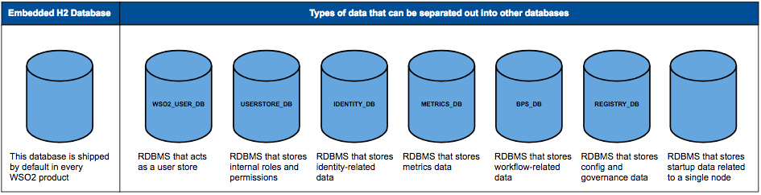

# Setting Up Separate Databases for Clustering

This section guides you through the logical separation of data that you
can do when clustering WSO2 Identity Server.

!!! tip "Before you begin"
    
    Creating separate databases as shown below **is not actually required and can be skipped.** Instead, you can point all the datasources given below to a single database. This will NOT make a difference in performance. To do this, see the steps given within the flow of the deployment pattern setup in the [Configuring the
    datasources](../../setup/configuring-the-datasources). 
    
    However, if you do want to separate the data logically into separate
    databases, you can follow the steps given below.
    

WSO2 Identity Server uses a database to store information such as
user management details and registry data. All nodes in the cluster must
use one central database for config and governance registry mounts. By
default, each WSO2 product is shipped with an embedded H2 database that
works for all types of data.

!!! warning "Embedded H2 is not recommended in production"
    
    The embedded H2 database is NOT recommended in enterprise testing and
    production environments. It has lower performance, clustering
    limitations, and can cause file corruption failures. Please use an
    industry-standard RDBMS such as Oracle, PostgreSQL, MySQL, or MS SQL
    instead.
    
    You can use the embedded H2 database in development environments and as
    the local registry in a registry mount. However, in a production
    environment it is recommended to change this. For more information on
    how to do this, [set up the
    database](../../administer/setting-up-the-physical-database)
    and see the [Changing the Carbon
    Database](../../administer/changing-the-carbon-database)
    topic in the product administration guide.
    

You can create the following databases and associated datasources. This
is **NOT** mandatory and you can choose to not create these databases if
you wish and simply have a single database to handle all these concerns.

<table>
<thead>
<tr class="header">
<th>Database Name</th>
<th>Description</th>
<th>Script location</th>
<th>Datasource file to be modified</th>
</tr>
</thead>
<tbody>
<tr class="odd">
<td><code>             USERSTORE_DB            </code></td>
<td>Authorization manager configurations, internal permissions and roles.</td>
<td><pre><code>&lt;IS_HOME&gt;/dbscripts/</code></pre></td>
<td><code>             &lt;IS_HOME&gt;/repository/conf/datasources/master-datasources.xml            </code></td>
</tr>
<tr class="even">
<td><code>             IDENTITY_DB            </code></td>
<td>
Contains identity related data. For example, OAuth 2.0, SAML 2.0, user managed access ( UMA) etc.
</td>
<td>

<pre><code>&lt;IS_HOME&gt;/dbscripts/identity/</code></pre>

Tip

UMA related scripts are in the <code><IS_HOME>/dbscripts/identity/uma</code> directory. You can run the scripts to create the UMA related tables and indexes in the <code>IDENTITY_DB</code>.

</td>
<td><code>             &lt;IS_HOME&gt;/repository/conf/datasources/master-datasources.xml            </code></td>
</tr>
<tr class="odd">
<td><code>             METRICS_DB            </code></td>
<td>Metrics Database is used to store the runtime metrics data reported by the Metrics JDBC Reporter periodically. There are 5 tables to store metrics data for each metric type. The metric types are Counter, Meter, Gauge, Histogram, and Timer.</td>
<td><pre><code>&lt;IS_HOME&gt;/dbscripts/</code></pre></td>
<td><code>             &lt;IS_HOME&gt;/repository/conf/datasources/metrics-datasources.xml            </code></td>
</tr>
<tr class="even">
<td><code>             BPS_DB            </code></td>
<td>This is used to create, drop, and truncate data pertaining to the workflow feature.</td>
<td><ul>
<li>To create workflow related tables and indexes, use the scripts in the <code>               &lt;IS_HOME&gt;/dbscripts/bps/bpel/create              </code> directory.</li>
<li>To delete workflow related tables, use the scripts in the <code>               &lt;IS_HOME&gt;/dbscripts/bps/bpel/drop              </code> directory.</li>
<li>To remove workflow related data from tables, use the scripts in the <code>               &lt;IS_HOME&gt;/dbscripts/bps/bpel/truncate              </code> directory.</li>
</ul></td>
<td><code>             &lt;IS_HOME&gt;/repository/conf/datasources/bps-datasources.xml            </code></td>
</tr>
<tr class="odd">
<td><code>             REGISTRY_DB            </code></td>
<td>Shared database for config and governance registry mounts in the product's nodes. This includes data on tenants and keystores.</td>
<td><pre><code>&lt;IS_HOME&gt;/dbscripts/</code></pre></td>
<td><code>             &lt;IS_HOME&gt;/repository/conf/datasources/master-datasources.xml            </code></td>
</tr>
<tr class="even">
<td><code>             CONSENT_MGT            </code></td>
<td>This is used for data pertaining to user consents.</td>
<td><code>             &lt;IS_HOME&gt;/dbscripts/consent            </code></td>
<td><code>             &lt;IS_HOME&gt;/repository/conf/datasources/master-datasources.xml            </code></td>
</tr>
</tbody>
</table>

To understand this concept further, see the following diagram.

For more information on the concept of sharing governance and config
registry databases across the cluster, see the topic on [Sharing
Databases in a
Cluster](../../administer/sharing-databases-in-a-cluster).

Do the following configurations to implement the database setup.

#### Creating the databases

Create the databases that you require using the RDBMS of your choice and
run the relevant script for the RDBMS of your choice according to the
table above. For instructions on how to do this, see [Setting up the
Physical
Database](../../administer/setting-up-the-physical-database).

#### Configuring the datasources

Configure the datasources for the databases that you created above in
both the WSO2 Identity Server nodes of your cluster. For instructions on
how to configure the datasources for the databases you created, see
[Changing the Carbon
Database](../../administer/changing-the-carbon-database).
