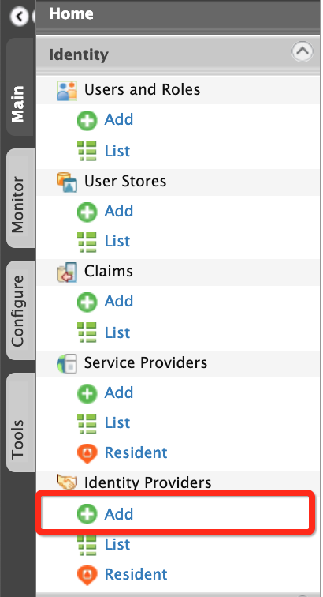
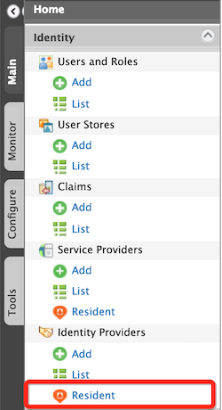

# Adding and Configuring an Identity Provider

### Introduction

An Identity Provider (IdP) is responsible for authenticating users and
issuing identification information by using security tokens like [SAML
2.0](../../learn/saml-2.0-web-sso), [OpenID
Connect](../../learn/oauth2-openid-connect-overview),
[OAuth 2.0](../../learn/oauth2-openid-connect-overview)
and [WS-Trust](../../learn/ws-trust). This is a
favourable alternative to explicitly authenticating a user within a
security realm.

The responsibility of the identity provider configuration is to
represent external identity providers. These external identity providers
can be Facebook, Yahoo, Google, Salesforce, Microsoft Windows Live, etc.
If you want to authenticate users against these identity providers, then
you must associate one or more federated authenticators with the WSO2
Identity Server. These identity providers support for different
authentication protocols. For example, if you want to authenticate users
against Salesforce, then you must associate the SAML 2.0 authenticator
with the Salesforce identity provider, if you want to authenticate users
against Yahoo, then you must associate the OpenID Connect authenticator
with it. To make this process much easier, the WSO2 Identity Server also
comes with a set of more specific federated authenticators. For example,
if you want to authenticate against Facebook, you do not need to
configure OAuth 2.0 authenticator. Instead, you can directly use the
Facebook federated authenticator.

Each identity provider configuration can also maintain a claim mapping.
This is to map the identity provider's own set of claims to WSO2
Identity Server's claims. When the response from an external identity
provider is received by the response processor component of the
federated authenticator, before it hands over the control to the
authentication framework, the response processor will create a
name/value pair of user claims received in the response from the
identity provider. These claims are specific to the external identity
provider. Then it is the responsibility of the authentication framework
to read the claim mapping configuration from the identity provider
component and do the conversion. So, while inside the framework, all the
user claim values will be in a common format.

So, in short, WSO2 Identity Server allows you to add identity providers
and specify various details that help you to link the identity provider
to WSO2 Identity Server.  Therefore, you must specify all information
required to send the authentication requests and get a response back
from the identity provider. This topic contains the following sections.

### Adding an identity provider

Follow the instructions below to add a new identity provider.

1.  Access the WSO2 Identity Server [Management
    Console](../../setup/getting-started-with-the-management-console) and sign in
    as an admin user.
2.  On the **Main** tab, click **Identity \> Identity Providers \> Add**
    .  
     

3.  Fill in the details in the **Basic Information** section.  
       
    Note the following when filling the above form.
    <table>
    <thead>
    <tr class="header">
    <th>Field</th>
    <th>Description</th>
    <th>Sample Value</th>
    </tr>
    </thead>
    <tbody>
    <tr class="odd">
    <td>Identity Provider Name</td>
    <td><p>The <strong>Identity Provider Name</strong> must be unique as it is used as the primary identifier of the identity provider.</p></td>
    <td><code>               FacebookIdP              </code></td>
    </tr>
    <tr class="even">
    <td>Display Name</td>
    <td><p>The <strong>Display Name</strong> is used to identify the identity provider. If this is left blank, the <strong>Identity Provider Name</strong> is used. This is used in the login page when selecting the identity provider that you want to use to log in to the service provider.</p></td>
    <td><code>               Facebook              </code></td>
    </tr>
    <tr class="odd">
    <td>Description</td>
    <td>The <strong>Description</strong> is added in the list of identity providers to provide more information on what the identity provider is. This is particularly useful in situations where there are many identity providers configured and a description is required to differentiate and identify them.</td>
    <td><code>               This is the identity provider configuration for Facebook.              </code></td>
    </tr>
    <tr class="even">
    <td>Federation Hub Identity Provider</td>
    <td><p>Select the <strong>Federation Hub Identity Provider</strong> check-box to indicate if this points to an identity provider that acts as a federation hub. A federation hub is an identity provider that has multiple identity providers configured to it and can redirect users to the correct identity provider depending on their Home Realm identifier or their Identity Provider Name. When we have this check-box selected additional window will pop-up in the multi-option page in the first identity server to get the home realm identifier for the desired identity provider in the identity provider hub.</p></td>
    <td>Selected</td>
    </tr>
    <tr class="odd">
    <td>Home Realm Identifier</td>
    <td><p>The <strong>Home Realm Identifier</strong> value can be specified in each federated IDP and can send the Home Realm Identifier value as the “fidp” query parameter (e.g., fidp=googleIdp) in the authentication request by the service provider. Then WSO2 Identity Server finds the IDP related to the “fidp” value and redirects the end user to the IDP directly rather than showing the SSO login page. By using this, you can avoid multi-option, in a multi-option scenario without redirecting to the multi-option page.</p></td>
    <td><code>               FB              </code></td>
    </tr>
    <tr class="even">
    <td><div class="content-wrapper">
    <p>Identity Provider Public Certificate</p>
    </div></td>
    <td><div class="content-wrapper">
    <p>The <strong>Identity Provider Public Certificate</strong> is the public certificate of the identity provider. Uploading this is necessary to authenticate responses from the identity provider.<br />
    If necessary, you can upload multiple certificates for an identity provider. This is useful in scenarios where one certificate is expired, but the second can be used for certificate validation.</p>
    <p>For example, consider a scenario where a third party IDP needs to change its certificate in one week, but cannot specify the exact time that the certificate would change. In such a scenario, it is useful to be able to upload a secondary certificate to the IDP so that during SAML assertion validation if certificate validation fails with the first certificate, the second certificate can be used for certificate validation.</p>
    <div class="admonition note">
    <p class="admonition-title">Note</p>
        <p>To create the identity provider certificate, navigate to the <code>                 &lt;IS_HOME&gt;/repository/resources/security/                </code> directory in a command prompt and execute the following command:</p>
        <div class="code panel pdl" style="border-width: 1px;">
        <div class="codeContent panelContent pdl">
        <div class="sourceCode" id="cb1" data-syntaxhighlighter-params="brush: java; gutter: false; theme: Confluence" data-theme="Confluence" style="brush: java; gutter: false; theme: Confluence"><pre class="sourceCode java"><code class="sourceCode java"><a class="sourceLine" id="cb1-1" title="1">keytool -export -alias wso2carbon -file wso2.<span class="fu">crt</span> -keystore wso2carbon.<span class="fu">jks</span> -storepass wso2carbon</a></code></pre></div>
        </div>
        </div>
        <p>Note that the <code>                 wso2.crt                </code> file is generated. This file is located in the <code>                 &lt;IS_HOME&gt;/repository/resources/security/                </code> directory.</p>
        <p>Click <strong>Choose File</strong> and navigate to this location to obtain and the file so that you can upload the file.</p>
        <div>
        See <a href="../../administer/using-asymmetric-encryption">Using Asymmetric Encryption</a> in the WSO2 Product Administration Guide for more information.</div>
        </div>
        <div class="admonition tip">
        <p class="admonition-title">Tip</p>
        <p>If you are adding an identity provider using a configuration file, and you want to specify multiple certificates for the identity provider, use the following sample configuration:</p>
        <div class="code panel pdl" style="border-width: 1px;">
        <div class="codeContent panelContent pdl">
        <div class="sourceCode" id="cb2" data-syntaxhighlighter-params="brush: java; gutter: false; theme: Confluence" data-theme="Confluence" style="brush: java; gutter: false; theme: Confluence"><pre class="sourceCode java"><code class="sourceCode java"><a class="sourceLine" id="cb2-1" title="1">&lt;<span class="bu">Certificate</span>&gt;</a>
        <a class="sourceLine" id="cb2-2" title="2">-----BEGIN CERTIFICATE-----</a>
        <a class="sourceLine" id="cb2-3" title="3">MIIDUTCCAjmgAwIBAgIEXvHuADANBgkqhkiG9w0BAQsFADBZMQswCQYDVQQGEwJMSzELMAkGA1UE</a>
        <a class="sourceLine" id="cb2-4" title="4">CBMCV1MxCzAJBgNVBAcTAlNMMQ0wCwYDVQQKEwRIb21lMQ0wCwYDVQQLEwRIb21lMRIwEAYDVQQD</a>
        <a class="sourceLine" id="cb2-5" title="5">-----END CERTIFICATE-----</a>
        <a class="sourceLine" id="cb2-6" title="6">-----BEGIN CERTIFICATE-----</a>
        <a class="sourceLine" id="cb2-7" title="7">MIIDUTCCAjmgAwIBAgIEXvHuADANBgkqhkiG9w0BAQsFADBZMQswCQYDVQQGEwJMSzELMAkGA1UE</a>
        <a class="sourceLine" id="cb2-8" title="8">CBMCV1MxCzAJBgNVBAcTAlNMMQ0wCwYDVQQKEwRIb21lMQ0wCwYDVQQLEwRIb21lMRIwEAYDVQQD</a>
        <a class="sourceLine" id="cb2-9" title="9">-----END CERTIFICATE-----</a>
        <a class="sourceLine" id="cb2-10" title="10">-----BEGIN CERTIFICATE-----</a>
        <a class="sourceLine" id="cb2-11" title="11">MIIDUTCCAjmgAwIBAgIEHMcPtzANBgkqhkiG9w0BAQsFADBZMQswCQYDVQQGEwJM</a>
        <a class="sourceLine" id="cb2-12" title="12">SzELMAkGA1UECBMCV1MxCzAJBgNVBAcTAlNMMQ0wCwYDVQQKEwRIb21lMQ0wCwYD</a>
        <a class="sourceLine" id="cb2-13" title="13">-----END CERTIFICATE-----</a>
        <a class="sourceLine" id="cb2-14" title="14">&lt;/<span class="bu">Certificate</span>&gt;</a></code></pre></div>
        </div></div>
        </div>
    <p>See <a href="../../administer/using-asymmetric-encryption">Using Asymmetric Encryption</a> in the WSO2 Product Administration Guide for information on how public keys work, and how to get the keys signed by a certification authority.</p>
    </div></td>
    <td><div class="content-wrapper">
    <p>This can be any certificate. If the identity provider is another Identity Server, this can be a wso2.crt file.</p>
    <p><br />
    </p>
    </div></td>
    </tr>
    <tr class="odd">
    <td>Alias</td>
    <td><p>The <strong>Alias</strong> is a value that has an equivalent value specified in the identity provider that we are configuring. This is required for authentication in some scenarios.</p></td>
    <td><code>               http://localhost:9443/oauth2/token              </code></td>
    </tr>
    <tr class="even">
        <td>Identity Provider's Issuer Name</td>
        <td>
        <div class="content-wrapper">
        <p>The <strong>Identity Provider's Issuer Name</strong> is a optional property that can be used to define the issuer name of the Identity Provider if it is different from the <strong>Identity Provider Name</strong>.</p>
        <div class="admonition warning">
        <p class="admonition-title">Warning</p>
            <p>
            To make this property available, apply the 0224 WUM update for WSO2 Identity Server 5.10.0 using the WSO2 Update Manager
                (WUM). To deploy a WUM update into production, you need to have a paid subscription. If you do not have a paid
                subscription, you can use this feature with the next version of WSO2 Identity Server when it is released. For
                more information on updating WSO2 Identity Server using WUM, see [Updating WSO2 Products](https://is.docs.wso2
                .com/en/latest/administer/getting-wso2-updates/)
            </p>
        </div>
        </div>
        </td>   
        <td><code>               http://is.wso2.com              </code></td>
     </tr>
    </tbody>
    </table>

    ??? note "Click here for more information on the federation hub and the home realm identifier"

        !!! info "About the federation hub and the home realm identifier"

            The federation hub has multiple identity providers configured to it.
            In a typical federation hub with multiple identity providers, each
            identity provider can have a unique home realm identifier that can
            be used to identify the identity provider you are logging into.

            So when a user tries to log in to a service provider following flow
            will happen,

            -   The Identity Server which this service provider is configured on
                will find the required federated authenticator from the service
                provider configuration
            -   If this Identity Provider configured as a federation hub, the
                user can specify the preferred identity provider in the
                federation hub using the multi-option page of the first Identity
                Server.
            -   This information will pass with the authentication request to
                the federation hub.
            -   When the request comes to the federation hub, it is sent to the
                identity provider that the user specifies from the first
                identity server. For instance, if the users prefer to use their
                Facebook credentials to log in, and Facebook is one of the
                identity providers configured in the federation hub, the user
                simply has to specify Facebook as the domain in the login screen
                of first Identity Server.

             

            When the Home Realm Identifier is not specified, you can either
            select the domain name from a dropdown in the login page, or you
            have to enter the domain value in a separate page prior to logging
            in (as shown below).
            
             
                     
            The `proxy_mode` configuration allows the framework to operate in either
            `smart` mode or `dumb` mode. 
            
            In `smart` mode, both local and federated authentication is supported, while in `dumb` mode, only federated
            authentication is supported. If `dumb` mode is configured here, you must provide the Home Realm Identifier,
            or you have to display a separate screen to the user to get it.

            If smart mode is configured, the default behavior applies, where you can enter a local username and 
            password, or use federated authenticators for authentication.
            
            To configure the `proxy_mode`, open the `deployment.toml` file in the `<IS_HOME>/repository/conf` directory 
            and add the following configuration.
            ```               
            [authentication] 
            proxy_mode="smart" 
            ```       
            

    ??? note "Click here for more information on the Alias"

        !!! info "About the Alias"

            The **Alias** is used in the following authentication scenario.

            

            Here a SAML identity provider sends a SAML token to a web
            application for authentication. The SAML token has an audience
            restriction element that controls access and has a reference to the
            web application in order to access it. Using this token, the
            authentication takes place. Now, if the web application needs to
            access an API that is protected by OAuth 2.0, the same SAML token is
            sent to the token endpoint of the Identity Server. The **Alias**
            value you configure in the Identity Server is associated with this
            token endpoint. This alias value must be added to the audience
            restriction element of the SAML token. When this SAML token is sent
            to the Identity Server, you obtain an access token, which is used to
            access the API.

            So in order to configure this, you must add the SAML identity
            provider as an identity provider in the Identity Server using the
            instructions in this topic. When configuring this in the Identity
            Server, you must specify the token alias for this scenario to work.
            This indicates that any token coming from the SAML identity provider
            must have this alias value in the audience restriction element.

4.  Enter the **Identity Provider Name** and provide a brief
    **Description** of the identity provider. Only **Identity Provider
    Name** is a required field.

5.  Fill in the remaining details where applicable. Click the arrow
    buttons to expand the forms available to update.  
    

    -   See [here](../../learn/configuring-claims-for-an-identity-provider) for details on how to configure claims.

    -   See [here](../../learn/configuring-roles-for-an-identity-provider) for details on how to configure roles.

    -   See [here](../../learn/configuring-federated-authentication) for details on how to configure federated authenticators.
    
    -   See [here](../../learn/configuring-just-in-time-provisioning-for-an-identity-provider) for details on how to configure just-in-time provisioning.

    -   See [here](../../learn/configuring-outbound-provisioning-connectors-for-an-identity-provider) for details on how to configure outbound provisioning connectors.

6.  Click **Register** to add the Identity Provider.  
      

### Configuring a resident identity provider

Apart from mediating authentication requests between service providers
and identity providers, WSO2 Identity Server can act as a service
provider and an identity provider. When WSO2 Identity Server acts as an
identity provider, it is called the **resident identity provider**.

!!! note
    
    The resident identity provider configuration is helps service providers
    to send authentication or provisioning requests to WSO2 Identity Server
    via SAML, OpenID Connect, SCIM, or WS-Trust. For an example on how a
    resident identity provider is used to implement a security token
    service, see [Configuring WS-Trust Security Token
    Service](../../learn/configuring-ws-trust-security-token-service). The Resident
    identity provider configuration is a one-time configuration for a given
    tenant. It shows WSO2 Identity Server's metadata, e.g., endpoints. The
    resident identity provider configurations can be used to secure the
    WS-Trust endpoint with a security policy.
    

Follow the instructions below to configure a resident identity provider:

1.  Access the WSO2 Identity Server Management Console.
2.  Sign in as an admin user.
3.  On the **Main** tab, click **Identity \> Identity Providers \>
    Resident**.  
       
    The Resident Identity Provider page appears.  
     

4.  Enter the required values as given below.

    <table>
    <thead>
    <tr class="header">
    <th>Field</th>
    <th>Description</th>
    <th>Sample Value</th>
    </tr>
    </thead>
    <tbody>
    <tr class="odd">
    <td><strong>Home Realm Identifier</strong></td>
    <td>This is the domain name of the identity provider. If you do not enter a value here, when an authentication request comes to WSO2 Identity Server, a user will be prompted to specify a domain. You can enter multiple identifiers as a comma-separated list.</td>
    <td><code>                localhost               </code></td>
    </tr>
    <tr class="even">
    <td><strong>Idle Session Time Out</strong></td>
    <td>This is the duration in minutes for which an SSO session can be idle for. If WSO2 Identity Server does not receive any SSO authentication requests for the given duration, a session time out occurs. The default value is <code>                15               </code> .</td>
    <td><code>                15               </code></td>
    </tr>
    <tr class="odd">
    <td><strong>Remember Me Period</strong></td>
    <td><div class="content-wrapper">
    <p>This is the duration in weeks for which WSO2 Identity Server should remember an SSO session given that you have selected the <strong>Remember Me</strong> option in the WSO2 Identity Server login screen.</p>
    <p>The default value is <code>                  2                 </code> weeks.</p>
    </div></td>
    <td><code>                2               </code></td>
    </tr>
    </tbody>
    </table>

5.  You may configure inbound authentication by expanding the **Inbound
    Authentication Configuration** section.  
    1.  To configure SAML2 configurations:
        1.  Click **SAML2 Web SSO Configuration**.  
               
            The SAML2 Web SSO Configuration form appears.  
             
        2.  Enter the required values and learn the fixed values as
            given below.

            | Field                           | Description                                                                                                                                                                             | Sample/Fixed Value                                                                                                      |
            |---------------------------------|-----------------------------------------------------------------------------------------------------------------------------------------------------------------------------------------|-------------------------------------------------------------------------------------------------------------------------|
            | **Identity Provider Entity ID** | This is for tenant identification. The users who are provisioned through this tenant can be identified using this ID.                                                                   | `                    localhost                   `                                                                      |
            | **Destination URLs**            | This defines the destination URL of the identity provider. This helps the service providers that connect to WSO2 Identity Server through a proxy server to locate WSO2 Identity Server. | `                                         https://localhost:9443/samlsso                                       `        |
            | **SSO URL**                     | This is the SAML SSO endpoint of the identity provider.                                                                                                                                 | `                                         https://localhost:9443/samlsso                                       `        |
            | **Logout Url**                  | This is the identity provider's end point that accepts SAML logout requests.                                                                                                            | `                                         https://localhost:9443/samlsso                                       `        |
            | **Artifact Resolution URL**     | This is the identity provider's endpoint that resolves SAML artifacts.                                                                                                                  | `                                         https://localhost:9443/samlartresolve                                       ` |
            | **Metadata Validity Period**    | This is the duration for which the metadata will be valid for.                                                                                                                          | `                    60                   `                                                                             |
            | **Enable metadata signing**     | This facilitates to enable or disable metadata signing                                                                                                                                  | `                    false                   `                                                                          |

    2.  To configure OAuth2 or OIDC, click **OAuth2/OpenID Connect
        Configuration**.  
         

        | Field                                        | Description                                                                                                                                                                                         | Sample/Fixed Value                                                                                                                     |
        |----------------------------------------------|-----------------------------------------------------------------------------------------------------------------------------------------------------------------------------------------------------|----------------------------------------------------------------------------------------------------------------------------------------|
        | **Identity Provider Entity ID**              | This is for tenant identification. The users who are provisioned through this tenant can be identified using this ID.                                                                               | `                  localhost                 `                                                                                         |
        | **Authorization Endpoint URL**               | This is the identity provider's OAuth2/OpenID Connect authorization endpoint URL.                                                                                                                   | `                                     https://localhost:9443/oauth2/authorize                                   `                      |
        | **Token Endpoint URL**                       | This is the identity provider's token endpoint URL.                                                                                                                                                 | `                                     https://localhost:9443/oauth2/token                                   `                          |
        | **Token Revocation Endpoint URL**            | This is the URL of the endpoint at which access tokens and refresh token are revoked.                                                                                                               | `                                     https://localhost:9443/oauth2/revoke                                   `                         |
        | **Token Introspection Endpoint URL**         | This is the URL of the endpoint at which OAuth tokens are validated.                                                                                                                                | `                                     https://localhost:9443/oauth2/introspect                                   `                     |
        | **User Info Endpoint URL**                   | This the URL of the endpoint through which user information can be retrieved. The information is gathered by passing an access token.                                                               | `                                     https://localhost:9443/oauth2/userinfo                                   `                       |
        | **Session iFrame Endpoint URL**              | This the URL of the endpoint that provides an iframe to synchronize the session states between the client and the identity provider.                                                                | `                                     https://localhost:9443/oidc/checksession                                   `                     |
        | **Logout Endpoint URL**                      | This is the identity provider's endpoint that accepts SAML logout requests.                                                                                                                         | `                                     https://localhost:9443/oidc/logout                                   `                           |
        | **Web finger Endpoint URL**                  | This is the URL of the OpenID Connect token discovery endpoint at which WSO2 Identity Server's meta data are retrieved from.                                                                        | `                                     https://localhost:9443/.well-known/webfinger                                   `                 |
        | **Discovery Endpoint URL**                   | This is the URL of the endpoint that is used to discover the end user's OpenID provider and obtain the information required to interact with the OpenID provider, e.g., OAuth 2 endpoint locations. | `                                     https://localhost:9443/oauth2/oidcdiscovery                                   `                  |
        | **Dynamic Client Registration Endpoint URL** | This is the URL of the endpoint at which OpenID Connect dynamic client registration takes places.                                                                                                   | `                                     https://localhost:9443/api/identity/oauth2/dcr/v1.1/register                                   ` |
        | **JWKS Endpoint URL**                        | This is the URL of the endpoint that returns WSO2 Identity Server's public key set in JSON Web Key Set (JWKS) format.                                                                               | `                                     https://localhost:9443/oauth2/jwks                                   `                           |

    3.  To secure the WS-Trust endpoint with a security policy, click
        **Security Token Service Configuration** section.  
           
        For more information on security token service (STS), see
        [Configuring WS-Trust Security Token
        Service](../../learn/configuring-ws-trust-security-token-service).

6.  You may view the inbound provisioning configurations by clicking
    **Inbound Provisioning Configuration** section.
     

    | Field                   | Description                                                                                                                                                    | Sample Value                                                                                              |
    |-------------------------|----------------------------------------------------------------------------------------------------------------------------------------------------------------|-----------------------------------------------------------------------------------------------------------|
    | **SCIM User Endpoint**  | This is the identity provider's endpoint for SCIM user operations, e.g., creating and managing users.                                                          | `                                 https://localhost:9443/wso2/scim/Users                               `  |
    | **SCIM Group Endpoint** | This is the identity provider's endpoint for the SCIM user role operations, e.g., creating user roles, assigning user roles to users, and managing user roles. | `                                 https://localhost:9443/wso2/scim/Groups                               ` |

7.  Click **Update**.

!!! note
    
    To modify the host name of the above-above mentioned URLs,
    
    1.  open the `            deployment.toml           ` file in the
        `            <IS_HOME>/repository/conf           ` directory and
        add the following configuration.
    
        ``` xml
        [server]
        hostname = "localhost"
        ```
    
    2.  Open the `            deployment.toml           ` file in the
        `            <IS_HOME>/repository/conf         `
        and add the following configuration.
    
        ``` xml
        [sts.endpoint] 
        idp="https://localhost:9443/samlsso"
        ```
    
        To ensure the client application is communicating with the right
        identity provider, WSO2 Identity Server compares the destination
        value in the SAML request with the URL in the above configuration.
    

### <a name="exporting-saml2-metadata-of-the-resident-idp"></a> Exporting SAML2 metadata of the resident IdP

To configure WSO2 Identity Server as a trusted identity provider in a
service provider application, export the SAML2 metadata of the resident
identity provider of WSO2 IS and import the metadata to the relevant
service provider.

!!! tip
    
    Use **one** of the following approaches to do this.
    
    -   Start the server and download the SAML2 metadata by accessing this
        URL: <https://localhost:9443/identity/metadata/saml2>.
    -   **Alternatively**, access the management console and follow the
        steps given below to download the metadata.
    

1.  Expand the **Inbound Authentication Configuration** section and then
    expand **SAML2 Web SSO Configuration**.
2.  Click **Download SAML2 metadata**. A
    `           metadata.xml          ` file will be downloaded on to
    your machine.
3.  Import the `            metadata.xml           ` file to the
    relevant service provider to configure WSO2 Identity Server as a
    trusted identity provider for your application.

     

### Managing identity providers

This section provides instructions on how to manage identity providers
once they are created.

#### Viewing identity providers

Follow the instructions below to view the list of identity providers
added in the WSO2 Identity Server.

1.  Sign in. Enter your username and password to log on to
    the Management Console.
2.  In the **Main** menu under the **Identity** section, click **List**
    under **Identity Providers**. The list of identity providers you
    added appears.  
     

#### Editing identity providers

Follow the instructions below to edit an identity provider's details.

1.  Sign in. Enter your username and password to log on to
    the Management Console.
2.  In the **Main** menu under the **Identity** section, click **List**
    under **Identity Providers**. The list of identity providers you
    added appears.
3.  Locate the identity provider you want to edit and click on the
    corresponding **Edit** link.  
     
4.  You are directed to the edit screen where you can modify the details
    you configured for the identity provider.

#### Deleting identity providers

Follow the instructions below to delete an identity provider.

1.  Sign in. Enter your username and password to log on to
    the Management Console.
2.  In the **Main** menu under the **Identity** section, click **List**
    under **Identity Providers**. The list of identity providers you
    added appears.
3.  Locate the identity provider you want to delete and click on the
    corresponding **Delete** link.  
     
4.  Confirm your request in the WSO2 Carbon window. Click the **Yes**
    button.

#### Disabling/Enabling identity providers

Follow the instructions below to disable or enable an identity provider.

1.  Sign in. Enter your username and password to log on to
    the Management Console.
2.  In the **Main** menu under the **Identity** section, click **List**
    under **Identity Providers**. The list of identity providers you
    added appears.
3.  Locate the identity provider you want to delete and click on the
    corresponding **Disable** link to disable the identity provider.
    Clicking this link will change the link to **Enable**. To enable
    the identity provider again, click the **Enable** link.
     
4.  Click **Ok** on the confirmation form that appears when clicking
    **Disable** / **Enable**.  

!!! info "Related Topics"

    See the following topics for information on configuring service
    providers using different specifications.

    -   See [Identity Federation](../../learn/identity-federation) for information on
        configuring federated authenticators.

    See the following topics to configure different applications as service
    providers in Identity Server.

    -   [Configuring Shibboleth IdP as a Trusted Identity
        Provider](../../learn/configuring-shibboleth-idp-as-a-trusted-identity-provider)
    -   [Logging in to Salesforce with
        Facebook](../../learn/logging-in-to-salesforce-with-facebook)
    -   [Logging in to Salesforce with Integrated Windows
        Authentication](../../learn/logging-in-to-salesforce-with-integrated-windows-authentication)
    -   [Logging in to your application via Identity Server using Facebook
        Credentials](../../learn/logging-in-to-your-application-via-identity-server-using-facebook-credentials)
