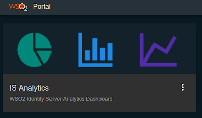

# Configuring Identity Analytics

Using the WSO2 Identity Server Analytics distribution, you can view and analyze statistics related to authentication requests that go through the WSO2 Identity Server. For more information, see [Analytics](../../learn/analytics).

## Scenario

A taxi company called "Pickup" has launched a new application to be used by their customers. The Pickup developers wish to measure the performance of the authentication mechanism used for users to log into the application so that they can improve the user login experience. 

To do this, the developers need to view authentication statistics about the login attempts to the application. This tutorial demonstrates how the Pickup developers can setup WSO2 IS Analytics to view login attempts to the Pickup application. 

## Set up 

1. [Download WSO2 Identity Server](https://wso2.com/identity-and-access-management/).

2. [Download WSO2 Identity Server Analytics distribution](https://github.com/wso2/analytics-is/releases/tag/v5.8.0-rc3).

## Enable analytics

Follow the instructions given below.

-   Open the `deployment.toml` file found in the `<IS_HOME>/repository/conf` folder and enable the following event publishers in WSO2 Identity Server.

    - Enable analytics for login data

        ``` toml
        [identity_mgt.analytics_login_data_publisher]
        enable=true
        ```

    - Enable analytics for session data

        ``` toml
        [identity_mgt.analytics_session_data_publisher] 
        enable=true
        ```

    - Enable analytics for token issuance data

        ``` toml
        [[event_listener]]
        id = "oauth_data_publisher_token_issuance"
        type = "org.wso2.carbon.identity.core.handler.AbstractIdentityHandler"
        name = "org.wso2.carbon.identity.data.publisher.oauth.listener.OAuthTokenIssuanceDASDataPublisher"
        order = 13
        ```

-   Configure WSO2 IS to publish user information with pending status.

    For self registered users, by default, user information such as username, tenant domain, etc. will not be published to analytics if the account is in `PENDING_SR` state. Learn more about [Account Pending Status](../../learn/pending-account-status).

    !!! Note
        The capability of publishing user information for `PENDING_SR` users is available as an update in WSO2 IS 5.10.0 from 2022-06-01 onwards (WUM model) and from update level 146 onwards (Updates 2.0 model). If you don't already have this update, see the instructions on [updating WSO2 products](https://updates.docs.wso2.com/en/latest/updates/overview/).

    -  To enable this configuration globally, apply the following to the `<IS_HOME>/repository/conf/deployment.toml` file:

        ```toml
        [show_pending_user_information]
        enable=true
        ```

    -  To enable this configuration per tenant, apply the following steps: 
    
        1. First, be sure to enable the configuration management feature by using the [Configuration Management REST APIs](../../develop/using-the-configuration-management-rest-apis).
    
        2. Create a resource type named `basic-authenticator-config` through the following cURL command:
            ```powershell
            curl --location --request POST 'https://localhost:9443/api/identity/config-mgt/v1.0/resource-type' --header 'accept: application/json' --header 'Content-Type: application/json' --header 'Authorization: Basic YWRtaW46YWRtaW4=' --data-raw '{"name": "basic-authenticator-config", "description": "This is the resource type for pending users."}'
            ```

        3. Then, create the `user-information` resource and the attribute through the following cURL command:
            ```powershell
            curl --location --request POST 'https://localhost:9443/api/identity/config-mgt/v1.0/resource/basic-authenticator-config' --header 'accept: application/json' --header 'Content-Type: application/json' --header 'Authorization: Basic YWRtaW46YWRtaW4=' --data-raw '{"name": "user-information","attributes": [{"key": "ShowPendingUserInformation.enable","value": "true"}]}'
            ```

The rest of the configurations required to connect the analytics distribution with the WSO2 IS distribution have already been pre-configured for fresh distributions. To see more information about these pre-configurations, see [Prerequisites to Publish Statistics](../../learn/prerequisites-to-publish-statistics).

If you do not need to change the default values, proceed to start the servers.

## Configure event publisher

By default, the events are published on the analytics publisher of WSO2 Identity Server.

If you need to get the logs on the WSO2 Identity Server console, navigate to `<Identity Server_HOME>/repository/deployment/server/` and update the `eventpublishers` file with the following configurations.

``` xml
<?xml version="1.0" encoding="UTF-8"?>
<eventPublisher
  name="IsAnalytics-Publisher-wso2event-OauthTokenIssueRefresh"
  statistics="disable" trace="disable" xmlns="http://wso2.org/carbon/eventpublisher">
  <from streamName="org.wso2.is.analytics.stream.OauthTokenIssuance" version="1.0.0"/>
  <mapping customMapping="disable" type="json"/>
  <to eventAdapterType="logger">
    <property name="uniqueId">log_id</property>
  </to>
</eventPublisher>
```

## Start the servers

1. Navigate to `<IS_HOME>/bin` directory via a command prompt and start the WSO2 IS server by executing one of the following commands.

    ``` java tab="Linux/MacOS"
    sh wso2server.sh
    ```

    ``` java tab="Windows"
    wso2server.bat run
    ```

2. WSO2 IS Analytics has two nodes. Navigate to `<ISANALYTICS_HOME>/bin` directory and execute the following commands via a command prompt to start each node. 
    1. Start the worker node. The worker node listens to the authentication statistics from WSO2 Identity Server and then analyzes and monitors them. 
    
        ``` java tab="Linux/MacOS"
        sh worker.sh
        ```

        ``` java tab="Windows"
        worker.bat run
        ```

    2. Start the dashboard node. The dashboard node displays the processed information using the dashboard interface. 

        ``` java tab="Linux/MacOS"
        sh dashboard.sh
        ```

        ``` java tab="Windows"
        dashboard.bat run
        ```

## Try it out

Let's create some basic authentication statistics. To do this, log in to the WSO2 IS dashboard. This login attempt will be published to WSO2 IS Analytics and you will be able to view the login attempt using the WSO2 IS Analytics dashboard. 

1. Log in to the [WSO2 Identity Server User Portal](https://localhost:9443/user-portal/) using admin/admin credentials. 

2. Next, access the WSO2 Identity Server Analytics Dashboard at the following URL: 

    `http://<HTTPS_IS_ANALYTICS_HOST>: 9643 /portal`

3. Log in using admin/admin credentials. 

4. Click **IS Analytics**. 

    

    Note that there is 1 successful login attempt published on the dashboard. 

    

You have succesfully enabled WSO2 IS Analytics and published statistics to the dashboard. For more information on what you can do with IS analytics, see [Analytics](../../learn/analytics).