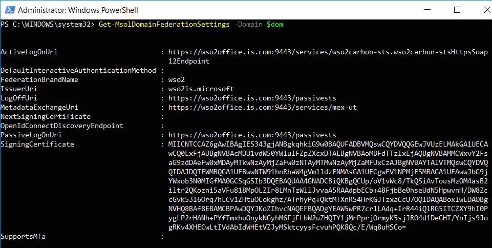

# Configuring Office365 WS-Federation with WSO2 IS

This tutorial guides you through configuring WS-Federation
authentication for Office365 with WSO2 Identity Server (WSO2 IS). Follow
the instructions in the sections below to set this up.

## Prerequisites

-   Office 365 Business Account with access to the [Office 365 Admin
    Portal](https://portal.office.com/adminportal/home).

    !!! tip
        If you do not already have an account, you can use a 30-day
        [trial
        version](https://products.office.com/en/compare-all-microsoft-office-products?tab=2)
        to try out this feature.
    

-   Add a new domain to Office 365 using the [Office 365 Admin
    Portal](https://portal.office.com/adminportal/home). For
    instructions on how to do this, see [Add A Domain to Office
    365](https://support.office.com/en-us/article/add-a-domain-to-office-365-6383f56d-3d09-4dcb-9b41-b5f5a5efd611)
    in the Microsoft documentation.

    !!! tip
        Office 365 SSO requires an internet-resolvable domain name
        to use as the suffix in each user’s username. You cannot federate
        the default domain that is provided by Microsoft that ends with "
        [onmicrosoft.com](http://onmicrosoft.com) ".
    
        You can register a free domain using a site such as
        [www.dot.tk](http://www.dot.tk/) if you do not already have a
        registered domain name.
    

-   A Windows platform Windows Azure Active Directory Powershell
    installed. If you do not already have the Azure AD module, run the
    following commands to install the required modules.

    ``` java
    #uninstall any existing older version of the AzureAD module
    uninstall-module AzureAD

    install-module AzureAD
    install-module AzureADPreview
    install-module MSOnline
    ```

## Configuring the WSO2 IS issuer

1.  Navigate to `           <IS_HOME>/bin/          ` and run the
    following command to start WSO2 Identity Server.

    -   **Windows**
    
    ``` java
    .\wso2server.bat
    ```
    
    -   **Linux/Unix**

    ``` java
    sh wso2server.sh
    ```

2.  Access the following URL and log in to the management console:
    <https://localhost:9443/carbon/>

3.  Click **Resident Identity Provider** under **Identity Providers** on
    the **Main** tab.
4.  Expand the **Inbound Authentication Configuration** section and then
    expand **WS-Federation (Passive) Configuration**.
5.  Enter " `          wso2.microsoft         `" as the **Identity
    Provider Entity Id** value. 
     
    

## Configuring the claims

1.  Click **Add** under **Claims** and then click **Add Local Claim**.  
    Add the following local claims.
    <table>
    <colgroup>
    <col style="width: 43%" />
    <col style="width: 56%" />
    </colgroup>
    <thead>
    <tr class="header">
    <th>Field</th>
    <th>Sample value</th>
    </tr>
    </thead>
    <tbody>
    <tr class="odd">
    <td><p>Dialect URI</p></td>
    <td><p>http://wso2.org/claims</p></td>
    </tr>
    <tr class="even">
    <td><p>Claim URI</p></td>
    <td><p>http://wso2.org/claims/upn</p></td>
    </tr>
    <tr class="odd">
    <td><p>Display Name *</p></td>
    <td><p>userPrincipalName</p></td>
    </tr>
    <tr class="even">
    <td><p>Description *</p></td>
    <td><p>userPrincipalName</p></td>
    </tr>
    <tr class="odd">
    <td><p>Mapped Attribute (s) *</p></td>
    <td><p><strong>User Store Domain Name:</strong> PRIMARY</p>
    <p><strong>Mapped Attribute:</strong> userPrincipalName</p></td>
    </tr>
    <tr class="even">
    <td><p>Supported by Default</p></td>
    <td><p>true</p></td>
    </tr>
    </tbody>
    </table>

    

    <table>
    <colgroup>
    <col style="width: 41%" />
    <col style="width: 58%" />
    </colgroup>
    <thead>
    <tr class="header">
    <th>Field</th>
    <th>Sample value</th>
    </tr>
    </thead>
    <tbody>
    <tr class="odd">
    <td><p>Dialect URI</p></td>
    <td><p>http://wso2.org/claims</p></td>
    </tr>
    <tr class="even">
    <td><p>Claim URI</p></td>
    <td><p>http://wso2.org/claims/objectguid</p></td>
    </tr>
    <tr class="odd">
    <td><p>Display Name *</p></td>
    <td><p>ObjectGuid</p></td>
    </tr>
    <tr class="even">
    <td><p>Description *</p></td>
    <td><p>ObjectGuid</p></td>
    </tr>
    <tr class="odd">
    <td><p>Mapped Attribute (s) *</p></td>
    <td><p><strong>User Store Domain Name:</strong> PRIMARY</p>
    <p><strong>Mapped Attribute:</strong> objectGuid</p></td>
    </tr>
    <tr class="even">
    <td><p>Supported by Default</p></td>
    <td>true</td>
    </tr>
    </tbody>
    </table>

    

**Remove unsupported claims**

The following attributes are not supported by Active Directory by
default. Disable the following claims in WSO2 Identity Server to avoid
errors when updating the user profile.

To disable the claims, do the following.

1.  Click **List** under **Claims** and select the
    [http://wso2.org/claims](https://localhost:9443/carbon/identity-claim-mgt/list-local-claims.jsp)
    dialect.
2.  Click **Edit** next to the following claims and unselect the **Supported
    by Default** checkbox to disable the claim.
    -   Country
    -   Organization
    -   IM

## Configuring the service provider

1.  Click **Add** under **Service Providers** and create a new service
    provider called 'Office365'.
2.  Expand **Inbound Authentication Configuration** and then expand
    **WS-Federation (Passive) Configuration**.  
    Configure the following fields and leave the rest of the default
    configurations as it is.

    | Field                  | Sample value                                |
    |------------------------|---------------------------------------------|
    | Passive STS Realm      | urn:federation:MicrosoftOnline              |
    | Passive STS WReply URL | https://login.microsoftonline.com/login.srf |

    

3.  Expand **Claim Configuration** and select **Define Custom Claim
    Dialect.**
4.  Click **Add Claim URI** and add the following claims.

    | Service Provider Claim                           | Local Claim     |  Requested Claim                                                  |
    |--------------------------------------------------|-----------------|-------------------------------------------------------------------|
    | http://schemas.microsoft.com/ws/2008/06/identity/claims/role       | http://wso2.org/claims/role                                       | Selected (True) |
    | http://schemas.microsoft.com/LiveID/Federation/2008/05/ImmutableID | http://wso2.org/claims/objectguid                                 | Selected (True) |
    | http://schemas.xmlsoap.org/claims/UPN                              | http://wso2.org/claims/upn                                        | Selected (True) |

    

5.  Set
    `                       http://schemas.xmlsoap.org/claims/UPN                     `
    as the **Subject Claim URI** and
    `                       http://schemas.microsoft.com/ws/2008/06/identity/claims/role                     `
    as the **Role Claim URI**.

6.  Click **Update** to save changes.

## Configure Azure AD to trust WSO2 IS

1.  Log in to a Windows machine and start Windows Azure Active Directory
    Powershell.
2.  Run the following command. It prompts for the Azure AD admin
    credentials.

    ``` java
    $cred=Get-Credential
    ```

    

3.  Enter the credentials and click OK. Run the following command to
    connect to the service with the stored credentials.

    ``` java
    Connect-MsolService –Credential $cred
    ```

4.  Run the following command to verify the availability of the
    validated domain.  
    The ‘Status’ of the domain should be ‘Verified’, and
    ‘Authentication’ should be ‘Managed’.

    ``` java
    Get-MsolDomain
    ```

    

5.  Configure the domain as a federated domain by providing the
    respective federation settings that match the WSO2 IS IdP. Store the
    federation settings in parameters.

    1.  Store your domain.

        ``` java
		$dom = "wso2.cf"
		$brandname = "wso2"
        ```

    2.  Set the Passive STS endpoint URL of the IdP (i.e., the Passive
        STS endpoint URL of WSO2 IS).

        ``` java
        $passiveLogonUri = "https://wso2office.is.com:9443/passivests"
        ```

    3.  Set the MetaData Exchange endpoint URL of the IdP.

        ``` java
        $mex = "https://wso2office.is.com:9443/services/mex-ut"
        ```

    4.  Set the issuer ID of the IdP. This value should be the
        `             Identity Provider Entity Id            ` that you
        configured in the WS-Federation configuration of the Resident
        IdP of WSO2 IS.

        ``` java
        $issueruri = "wso2is.microsoft"
        ```

        !!! tip
                If you will be configuring Office365 Active STS clients
                (complying with the WS-Trust protocol) through WSO2 Identity
                Server as well, do the following configuration along with these
                configurations.
        
                Set the Active STS Endpoint URL of the IdP. This should be the
                Security Token Service endpoint of the WSO2 Identity server.
                Note that this endpoint is specific to WS-Trust and will not be
                used for the Passive STS use case.
        
                ``` java
                $activeLogonUri="https://aysh.is.com:9443/services/wso2carbon-sts.wso2carbon-stsHttpsSoap12Endpoint"
                ```


    5.  Store the IdP certificate. Enter the Base64 encoded signing
        certificate of WSO2 IS.  
        For the default key store configured in WSO2 IS, the certificate
        is as given below.

        !!! tip
        
                Note that the certificate value should be given in a
                single line without a break.
        

        ``` java
        $cert = "MIICNTCCAZ6gAwIBAgIES343gjANBgkqhkiG9w0BAQUFADBVMQswCQYDVQQGEwJVUzELMAkGA1UECAwCQ0ExFjAUBgNVBAcMDU1vdW50YWluIFZpZXcxDTALBgNVBAoMBFdTTzIxEjAQBgNVBAMMCWxvY2FsaG9zdDAeFw0xMDAyMTkwNzAyMjZaFw0zNTAyMTMwNzAyMjZaMFUxCzAJBgNVBAYTAlVTMQswCQYDVQQIDAJDQTEWMBQGA1UEBwwNTW91bnRhaW4gVmlldzENMAsGA1UECgwEV1NPMjESMBAGA1UEAwwJbG9jYWxob3N0MIGfMA0GCSqGSIb3DQEBAQUAA4GNADCBiQKBgQCUp/oV1vWc8/TkQSiAvTousMzOM4asB2iltr2QKozni5aVFu818MpOLZIr8LMnTzWllJvvaA5RAAdpbECb+48FjbBe0hseUdN5HpwvnH/DW8ZccGvk53I6Orq7hLCv1ZHtuOCokghz/ATrhyPq+QktMfXnRS4HrKGJTzxaCcU7OQIDAQABoxIwEDAOBgNVHQ8BAf8EBAMCBPAwDQYJKoZIhvcNAQEFBQADgYEAW5wPR7cr1LAdq+IrR44iQlRG5ITCZXY9hI0PygLP2rHANh+PYfTmxbuOnykNGyhM6FjFLbW2uZHQTY1jMrPprjOrmyK5sjJRO4d1DeGHT/YnIjs9JogRKv4XHECwLtIVdAbIdWHEtVZJyMSktcyysFcvuhPQK8Qc/E/Wq8uHSCo="
        ```

6.  Run the following command to establish trust.

    ``` java
	Set-MsolDomainAuthentication -DomainName $dom -Authentication Federated -ActiveLogOnUri $activeLogonUri -IssuerUri $issuerUri -SigningCertificate $cert -LogOffUri $passiveLogonUri -FederationBrandName $brandname -MetadataExchangeUri $mex -PassiveLogOnUri $passiveLogonUri -PreferredAuthenticationProtocol WsFed
    ```

7.  Run the following command to verify the federation settings.

    ``` java
    Get-MsolDomainFederationSettings -Domain $dom
    ```

    

You have now successfully set up trust between the on-premise identity
provider of WSO2 IS and the Azure Active Directory.

  

!!! tip
    If you wish to redo the configurations, do the following:
    
    1.  Run the following command to first move your domain back to the
        'Managed' authentication mode.
    
        ``` java
        Set-MsolDomainAuthentication -DomainName $dom -Authentication Managed
        ```

    2.  Re-set the parameters as listed in step 5 and then set the authentication method again as shown in step 6.


## What's next?

To see how this feature works, try out the [Configuring On-Demand
Provisioning with Azure
AD](../../learn/configuring-on-demand-provisioning-with-azure-ad) tutorial to
provision users directly to Azure AD at the point of authentication.
