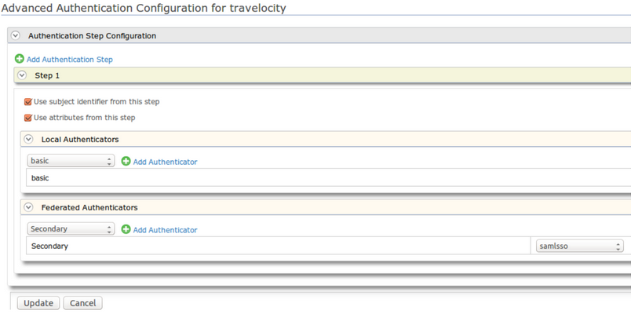

# Log in to the Identity Server using another Identity Server - SAML2

This topic demonstrates a scenario where two WSO2 Identity Server
instances with different user stores can be used for federated
authentication.

!!! note "The scenario uses the following software" 
    -   [WSO2 Identity Server](http://wso2.com/products/identity-server/) as the Identity Provider 
    -   [Apache Tomcat](http://tomcat.apache.org/) to run the client application
    

Follow the instructions in the sections below to set up and configure
this scenario:

### Setting up the WSO2 Identity Server instances

1.  Download the WSO2 Identity Server from
    [here](http://wso2.com/products/identity-server).
2.  Extract the file to a dedicated directory. For the purposes of this
    scenario, this is referred to as
    `          <IS_HOME_PRIMARY>         ` in this topic.
3.  Make a copy of this folder in the same location and rename it. For
    the purposes of this scenario, this is referred to as
    `          <IS_HOME_SECONDARY>         ` in this topic.
4.  By default, the HTTPS port of the primary IS instance is 9443. Let
    this be left as it is. Go to the
    `          <IS_HOME_SECONDARY>/repository/conf         ` directory
    and open the `          deployment.toml         ` file. Change the
    `          offset         ` value to 1. This changes the
    HTTPS port in the secondary IS instance to 9444 to avoid conflicts
    with the primary IS instance.
5.  Install and run the two Identity Server instances.
    -   Go to `            <IS_HOME_PRIMARY>/bin           ` and
        `            <IS_HOME_SECONDARY>/bin           ` in your command
        line and type the following command for each instance.
        -   On Windows:
            `              wso2server.bat --run             `
        -   On Linux/Solaris:
            `              sh wso2server.sh             `
6.  The [Management
    Console](../../setup/getting-started-with-the-management-console)
    for the primary Identity Server can be accessed using the following
    URL: <https://localhost:9443/carbon>
7.  The Management Console for the secondary Identity Server can be
    accessed using the following URL: <https://localhost:9444/carbon>

### Configuring the secondary IS as IdP in the primary IS

The next step in this scenario is to configure the secondary Identity
Server as an identity provider (IdP) in the primary Identity Server.

1.  Go to the Management Console of the primary IS.
2.  Navigate to the **Identity Providers** section in the **Main** menu
    and click **Add**.
3.  Enter “Secondary" as the **Identity Provider Name** for this
    scenario.
4.  Expand the **Federated Authenticators** section and then expand the
    **SAML2 Web SSO** **Configuration** section.  
     

5.  Make the following changes.
    1.  Select the **Enable SAML2 Web SSO** check box.
    2.  Enter `            Secondary IDP           ` as the **Identity
        Provider Entity Id**.
    3.  Enter `            Primary           ` as the **Service Provider
        Entity Id**.
    4.  Enter `             https://localhost:9444/samlsso/            `
        as the **SSO URL**. This is the SAML2 SSO URL of the secondary
        IS.

    5.  Select the **Enable Logout** check box.

6.  Click **Register**. The new identity provider named 'Secondary' is
    listed under **List** (go to **Main** menu and click **List** under
    **Identity Providers** ).

### Configuring the primary IS as an SP in the secondary IS

Now that the secondary Identity Server is added as an IdP in the primary
Identity Server, the primary IS should be added as service provider(SP)
in the secondary IS instance.

1.  Log in to the management console of the secondary IS instance using
    the following URL: <https://localhost:9444/carbon>

2.  Navigate to the **Main** menu and click **Add** under **Service
    Providers**. Enter service provider name as 'PrimaryIDP' for this
    sample scenario.

3.  Click **Register**.

4.  In the form that appears, expand the **Inbound Authentication
    Configuration** and **SAML2 Web SSO Configuration** sections.

5.  Click **Configure**.

6.  Enter the following details in the form.

    1.  Enter `             Primary            ` as the **Issuer.**

    2.  Enter
        `                           https://localhost:9443/commonauth                         `
        as **Assertion Consumer URL**.

    3.  Select **Enable Response Signing**.

    4.  Select **Enable Single Logout**.

7.  Click **Update** and then click **Register**. The primary Identity
    Server instance is added as the service provider in the secondary
    Identity Server instance.

### Setting up an application as the SP in the primary IS

The client application in this scenario is the travelocity sample
application.

1.  [Deploy travelocity application and configure it as a service provider](../../learn/deploying-the-sample-app#deploying-the-travelocity-webapp) in the primary Identity Server instance. 
 
2.  After adding the client application as a service provider in the
    primary Identity Server instance, navigate to the **Main** menu and
    click **List** under **Service Providers**. Click **Edit** next to
    the service provider you created.
    
3.  Expand the **Local & Outbound Authentication Configuration**
    section. Here we set the travelocity client to use the primary IS
    instance and the identity provider named 'Secondary' also as its
    identity provider. For this we have to add authentication steps.  
    
      
     
    1.  Click **Advanced Configuration** and from next UI, click
        **Add Authentication Step**.
        
    2.  Under **Local Authenticators** add the “ **basic** ”
        authenticator by selecting it from the combo box and clicking
        **Add Authenticator**.
        
    3.  Under **Federated Authenticators** select “Secondary” and add
        it.
        
    4.  Click **Update** to save your changes.
    
4.  Click **Update** to save changes to your service provider
    configurations. Now when you log in to the client application it
    can select either the primary IS instance or secondary IS instance
    as the identity provider and therefore has access to both user
    spaces.
    
5.  Go to <https://localhost:9443/carbon>, the primary IS instance, and
    create a user named 'primaryuser' and set the password as
    'primepass'.
    
6.  Go to <https://localhost:9444/carbon>, the secondary IS instance
    and create a user named 'secondaryuser' and set the password as
    'secondpass'.
    
7.  Test your application.
    1.  After copying the "travelocity.war" file to the
        `            <TOMCAT_HOME>/webapps           ` directory, run
        the Tomcat server.
    
    2.  Go to
        [http://wso2is.local:8080/travelocity.com](http://localhost:8080/travelocity.com)
        . This is the client application.  
        
         
    
    3.  Since we are using SAML for authentication, click the link in
        the first line.
    
    4.  In the resulting screen, log in with the username 'primaryuser'
        and the password 'primepass' for authentication as a local user
        in the primary IS instance.  
          
           
        
        If you wish to authenticate a user in the secondary IS instance
        which is the secondary IdP, click “Secondary” under **Other
        login options**. In the resulting screen, log in using the
        username “secondaryuser' and password 'secondpass'. These
        credentials were created in the secondary IS instance.
