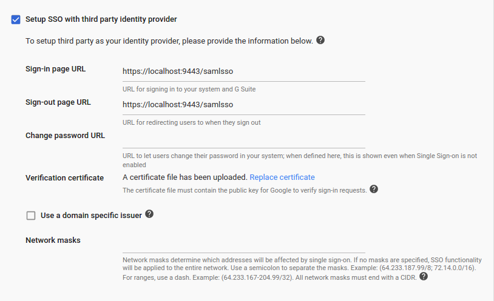

# Logging in to Google using the Identity Server

This topic provides instructions on how to log into Google using your
WSO2 Identity Server credentials. In this tutorial, Google acts as the
service provider and WSO2 Identity Server acts as the identity provider.

Let's get started!

!!! tip "Before you begin!" 
    You need to have a Google domain. Click
    [here](https://www.bettercloud.com/monitor/the-academy/create-google-apps-domain-three-easy-steps/)
    for more information on creating the domain.
    

## Configuring Google

1.  Go to your domain's admin console via
    `                     https://admin.google.com                   `.
2.  Click **Security**.

    !!! info 
		Can't see the Security section? Click the **MORE CONTROLS** bar at
		the bottom and you can see the Security section.

    

3.  Click **Set up single sign-on(SSO)** and select **Setup SSO with
    third party identity provider**.

4.  Enter the following URLs to your third-party Identity Provider
    (IdP).

    -   **Sign-in page URL:**
        `             https://<SERVER_HOSTNAME>:9443/samlsso            `

    -   **Sign-out page URL:**
        `             https://<SERVER_HOSTNAME>:9443/samlsso            `

    

5.  Upload the Identity Server certificate:  
    The certificate file must contain the public key for Google to
    verify the sign-in requests.

    1.  Navigate to the
        `            <IS_HOME>/repository/resources/security           `
        directory via the terminal.
    2.  Run the command given below to import the public certificate
        from the keystore to a `            .pem            ` file.

        ``` java
        keytool -export -alias wso2carbon  -keystore wso2carbon.jks -storepass wso2carbon -file mycert.pem
        ```

        !!! info 
			The `              mycert.pem             ` file is created in
			the same directory mentioned in **step** **a** above. If you
			want to change the name of the file that is being generated,
			enter a preferred name instead of
			`              mycert             ` in the above command.

    3.  Click **Replace certificate** and upload the
        `           .pem           ` file you just generated.

## Configuring WSO2 IS to use the email as the username

When you log into Google, you use an email address. Therefore, to
integrate this with the Identity Server, you need to configure WSO2 IS
to enable users to log in using their email addresses. In order to do
that, follow the steps given below.

1.  Download the WSO2 Identity Server from
    [here](http://wso2.com/products/identity-server/).
2.  When you log in to Google, you normally use an email address. So, to
    integrate this with the Identity Server, you need to configure WSO2
    IS to enable users to log in using their email addresses. In order
    to do that, follow the steps found in the [Using Email Address as
    the Username](../../learn/using-email-address-as-the-username) topic.
3.  Restart the Identity Server. Since the username and password of the
    admin user were updated, start the WSO2 IS server using the -Dsetup
    parameter as shown in the command below.

    ``` java
    sh wso2server.sh -Dsetup
    ```

Now that you are done with configuring WSO2 Identity Server to use the
email address, configure the service provider.

## Configuring the Service Provider

1.  Sign in to the WSO2 Identity Server [Management
    Console](../../setup/getting-started-with-the-management-console).
2.  On the **Main** menu, click **Identity \> Service Providers \>**
    **Add**.
3.  Fill in the **Service Provider Name** and provide a brief
    **Description** of the service provider. Only **Service Provider
    Name** is a required field and you can use Google-SP as the name for
    this example.
4.  Click **Register**.
5.  Expand the **Inbound Authentication Configuration** and the **SAML2
    Web SSO Configuration**, and click **Configure**.
6.  In the form that appears, fill out the following configuration
    details required for single sign-on. For more details about
    attributes in the following configuration refer [SAML2 Web SSO
    Configuration](../../learn/configuring-inbound-authentication-for-a-service-provider#configuring-inbound-authentication-with-saml2-web-sso)
   .  
    See the following table for details.

    <table>
    <thead>
    <tr class="header">
    <th>Field</th>
    <th>Value</th>
    <th>Description</th>
    </tr>
    </thead>
    <tbody>
    <tr class="odd">
    <td>Issuer</td>
    <td><div class="content-wrapper">
    <p><code>                 google.com                </code></p>
    </div></td>
    <td>This is the <code>               &lt;saml:Issuer&gt;              </code> element that contains the unique identifier of the service provider.</td>
    </tr>
    <tr class="even">
    <td>Assertion Consumer URL</td>
    <td><pre><code>https://www.google.com/a/&lt;ENTER_YOUR_DOMAIN&gt;/acs</code></pre>
    <code>              </code></td>
    <td>This is the URL to which the browser should be redirected to after the authentication is successful. This is the Assertion Consumer Service (ACS) URL of the service provider. The identity provider redirects the SAML2 response to this ACS URL. However, if the SAML2 request is signed and SAML2 request contains the ACS URL, the Identity Server will honor the ACS URL of the SAML2 request.</td>
    </tr>
    <tr class="odd">
    <td>NameID Format</td>
    <td>The default value can be used here.</td>
    <td>This defines the name identifier formats supported by the identity provider. The service provider and identity provider usually communicate with each other regarding a specific subject. That subject should be identified through a Name-Identifier (NameID), which should be in some format so that It is easy for the other party to identify it based on the format. Name identifiers are used to provide information regarding a user.</td>
    </tr>
    <tr class="even">
    <td>Certificate Alias</td>
    <td>wso2carbon</td>
    <td>Select the <strong>Certificate Alias</strong> from the drop-down. This is used to validate the signature of SAML2 requests and is used to generate encryption.Basically, the service provider’s certificate must be selected here. Note that this can also be the Identity Server tenant's public certificate in a scenario where you are doing a tenant-specific configuration.</td>
    </tr>
    <tr class="odd">
    <td>Enable Response Signing</td>
    <td>Selected</td>
    <td><p>Select <strong>Enable Response Signing</strong> to sign the SAML2 Responses returned after the authentication process.</p></td>
    </tr>
    <tr class="even">
    <td>Enable Attribute Profile</td>
    <td>Selected</td>
    <td>Select <strong>Enable Attribute Profile</strong> to enable this and add a claim by entering the claim link and clicking the <strong>Add Claim</strong> button. The Identity Server provides support for a basic attribute profile where the identity provider can include the user’s attributes in the SAML Assertions as part of the attribute statement.</td>
    </tr>
    <tr class="odd">
    <td>Include Attributes in the Response Always</td>
    <td>Selected</td>
    <td>Once you select the checkbox to <strong>Include Attributes in the Response Always</strong> , the identity provider always includes the attribute values related to the selected claims in the SAML attribute statement.</td>
    </tr>
    </tbody>
    </table>

7.  Click **Register** to save your configurations.

## Try it out

Now, you have successfully configured Google and WSO2 Identity Server.
Let's look at how you can try it out:

!!! note
    The admin users of your Google domain do not get redirected to WSO2 IS.
    Therefore, to try out the tutorial you need to use a user who is not an
    admin in your Google account.
    

1.  Create a user in WSO2 Identity Server. Make sure that the same user
    exists in your Google domain.  
    Example: In this example, `          alex@wso2support.com         `
    is in the Google domain that is used for this tutorial. Therefore,
    we create the same user in WSO2 Identity Server.  
    1.  On the **Main** tab in the Management Console, click **Add**
        under **Users and Roles**.
    2.  Click **Users**. This link is only visible to users with the
        Admin role.
    3.  Click **Add New User**. The following screen appears.  
        

    4.  Click **Next \>**.
    5.  Optionally, select the role(s) you want this user to have. If
        you have many roles in your system, you can search for them by
        name.
    6.  Click **Finish**.

2.  Navigate to
    `          https://google.com/a/<ENTER_YOUR_DOMAIN>/acs         `
    and enter the email address (username) of the user you created.  
    You are navigated to WSO2 Identity Server's sign in screen.
3.  Enter the username and password of the user you created.  
    You are navigated to the G-Suite of that domain and you can select
    the application you need to use.

  

!!! tip
    If you want to only access Gmail, navigate to
    [mail.google.com](http://mail.google.com), enter the username of the
    user, enter the username and password of the user on the WSO2 Identity
    Server sign in screen, and you are navigated to the user's mail account.
    
