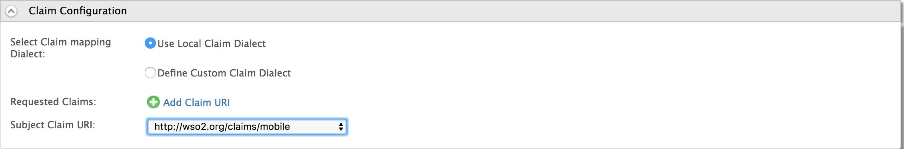
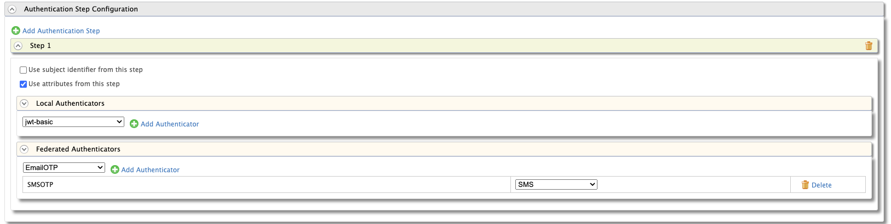
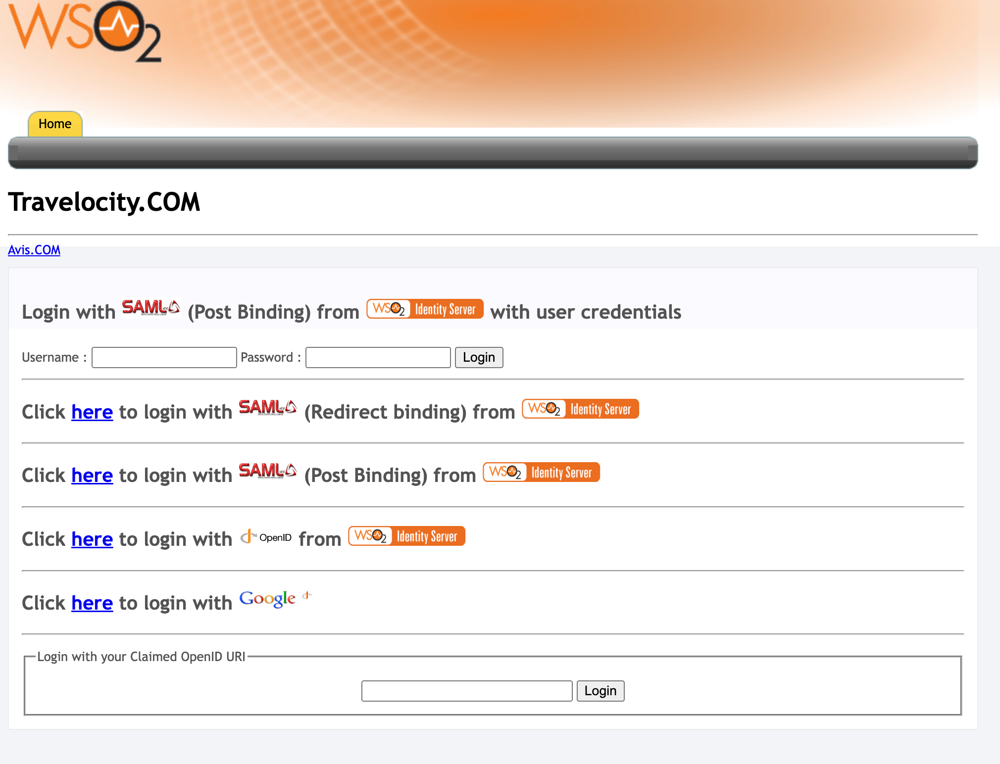
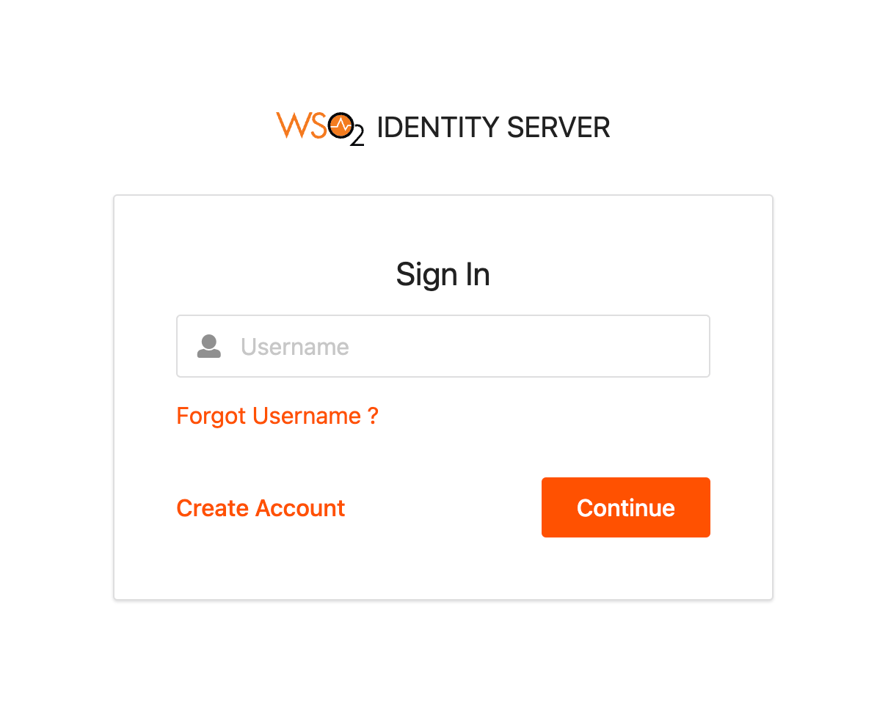
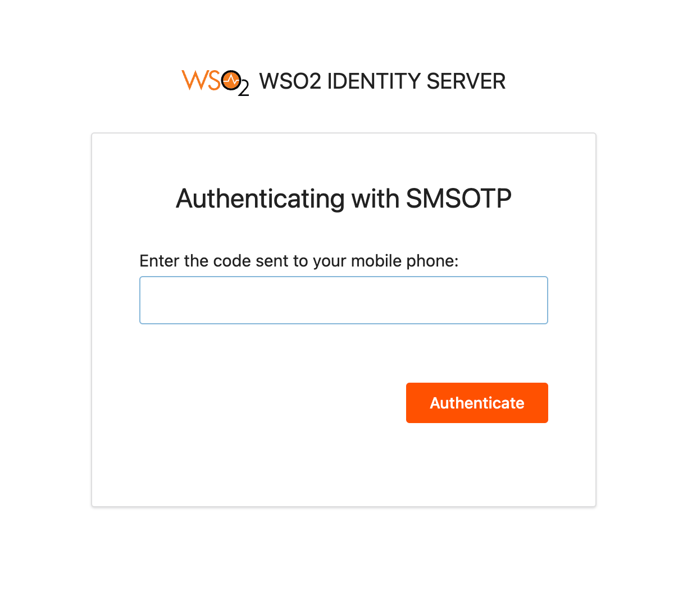

# Passwordless authentication using SMS OTP

WSO2 Identity Server supports passwordless authentication using SMS OTP. It allows users
to log in by providing a one-time passcode sent to their mobile instead of entering a password.

!!! info
    This capability is available as an update in WSO2 IS 5.10.0 from update level **5.10.0.247** onwards (Updates 2.0 model). See the instructions on [updating WSO2 products](https://updates.docs.wso2.com/en/latest/).

Follow the instructions in the sections below to configure passwordless authentication using
SMS OTP:

## Deploying travelocity sample application

In this guide, we will be using `travelocity.com` as a sample application. To deploy the travelocity sample application, follow the steps in [Deploying the travelocity.com Sample App](../../learn/deploying-the-sample-app/#deploying-the-travelocity-webapp).

------------------------------------------------------------------------

## Configuring the identity provider

First, you have to configure the WSO2 Identity Server by adding a new identity provider.

1. [Start the Server](../../setup/running-the-product).

2. Download the certificate of the SMS provider by going to the SMS provider's website on your browser, and clicking the HTTPS trust icon on the address bar.

    !!! example
        If you wish to have NEXMO as your SMS provider, navigate to [https://www.nexmo.com](https://www.nexmo.com/), click the padlock next to the URL on Chrome, and download the certificate.

3. Navigate to the `<IS_HOME>/repository/resources/security` directory via the terminal and import the downloaded certificate into the WSO2 IS client keystore.

    ``` java
    keytool -importcert -file <CERTIFICATE_FILE_PATH> -keystore client-truststore.jks -alias "Nexmo" 
    ```

4. You are prompted to enter the keystore password. The default `client-truststore.jks` password is **`wso2carbon`**.

5. Log into the [management console](../../setup/getting-started-with-the-management-console) as an administrator.

6. Navigate to **Main** tab -> **Identity** -> **Identity Providers** -> **Add**.

7. Give a suitable name (e.g., SMSOTP) as the **Identity Provider Name**.

8. Go to the **SMS OTP Configuration** under **Federated Authenticators**.

9. Select both check-boxes to **Enable SMSOTP Authenticator** and to make it the **Default**.

10. Enter the SMS URL, the HTTP Method used (e.g., GET or POST), and the
    headers and payload if the API uses any.

    !!! info
        - If the text message and the phone number are passed as parameters in any field, include them as `$ctx.num` and `$ctx.msg` respectively.

        - Optionally, enter the HTTP response code the SMS service provider sends when the API is successfully called. Nexmo API and  Bulksms API send 200 as the code, while Clickatell and Plivo send 202. If this value is unknown, leave it blank and the connector checks if the response is 200, 201, or 202.

    ??? Note "Click here to configure Nexmo as the service provider."

        Follow the steps given below if Nexmo is used as the SMS provider:

        1. Go to <https://dashboard.nexmo.com/sign-up> and sign up.
        2. Once you successfully register, the API **key** and **secret** are displayed. Copy and save them as you need them for the next step.  
            Example:  
            
            
        
        3. The Nexmo API requires the parameters to be encoded in the URL, so the SMS URL would be as follows.
            <html>
                <table>
                    <tbody>
                    <tr class="odd">
                        <td><strong>SMS URL</strong></td>
                        <td><code> https://rest.nexmo.com/sms/json?api_key=&api_secret=&from=NEXMO&to=\$ctx.num&text=\$ctx.msg </code></td>
                    </tr>
                    <tr class="even">
                        <td><strong>HTTP Method</strong></td>
                        <td><code>POST</code></td>
                    </tbody>
                </table>
            </html>

    ??? Note "Click here to configure Clickatell as the service provider."

        Follow the steps given below if Clickatell is used as the SMS provider:

        1. Go to <https://www.clickatell.com/sign-up/> and create an account.
        
        2. The Auth token is provided when you register with Clickatell.

        3. Clickatell uses a POST method with headers and the text message and phone number are sent as the payload. So the fields would be as follows.
            
            <html>
                <table>
                    <tbody>
                        <tr class="odd">
                            <td><strong>SMS URL</strong></td>
                            <td><code>https://api.clickatell.com/rest/message</code></td>
                        </tr>
                        <tr class="even">
                            <td><strong>HTTP Method</strong></td>
                            <td><code>POST</code></td>
                        </tr>
                        <tr class="odd">
                            <td><strong>HTTP Headers</strong></td>
                            <td><code>X-Version: 1,Authorization: bearer <ENTER_AUTH_TOKEN>,Accept: application/json,Content-Type: application/json</code></td>
                        </tr>
                        <tr class="even">
                            <td><strong>HTTP Payload</strong></td>
                            <td><code> {"text":" $ctx.msg ","to":[" $ctx.num "]} </code></td>
                        </tr>
                    </tbody>
                </table>
            </html>

    ??? Note "Click here to configure Plivo as the service provider."

        Follow the steps given below if Plivo is used as the SMS provider:

        1. Sign up for a free [Plivo trial account](https://manage.plivo.com/accounts/register/?utm_source=send%bulk%20sms&utm_medium=sms-docs&utm_campaign=internal).

        2. Phone numbers must be verified at the [Sandbox Numbers](https://manage.plivo.com/sandbox-numbers/) page (add at least two numbers and verify them).

        3. The Plivo API is authenticated with Basic Auth using your `AUTH ID` and `AUTH TOKEN`, Your Plivo `AUTH ID` and `AUTH TOKEN` can be found when you log in to your [dashboard.](https://manage.plivo.com/dashboard/)

        4. Plivo uses a POST method with headers, and the text message and phone number are sent as the payload. So the fields would be as follows.
            
            <html>
                <table>
                    <tbody>
                        <tr class="odd">
                            <td><strong>SMS URL</strong></td>
                            <td><code> https://api.plivo.com/v1/Account/{auth_id}/Message/  </code></td>
                        </tr>
                        <tr class="even">
                            <td><strong>HTTP Method</strong></td>
                            <td><code>POST</code></td>
                        </tr>
                        <tr class="odd">
                            <td><strong>HTTP Headers</strong></td>
                            <td><code> Authorization: Basic ********,Content-Type: application/json </code></td>
                        </tr>
                        <tr class="even">
                            <td><strong>HTTP Payload</strong></td>
                            <td><code> {"src":"+94*********","dst":"$ctx.num","text":"$ctx.msg"} </code></td>
                        </tr>
                    </tbody>
                </table>
            </html>

    ??? Note "Click here to configure Bulksms as the service provider."

        Follow the steps given below if Bulksms is used as the SMS provider:

        1. Go to <https://www2.bulksms.com/login.mc> and create an account.
        2. While registering the account, verify your mobile number and click **Claim** to get free credit.  
            
            

            Bulksms API authentication is performed by providing the username and password request parameters.

        3. Bulksms uses the POST method and the required parameters are to be encoded in the URL. So the fields would be as follows.
            
            <html>
                <table>
                    <tbody>
                        <tr class="odd">
                            <td><strong>SMS URL</strong></td>
                            <td><code>https://bulksms.vsms.net/eapi/submission/send_sms/2/2.0?username=&password=&message=\$ctx.msg&msisdn=\$ctx.num</code></td>
                        </tr>
                        <tr class="even">
                            <td><strong>HTTP Method</strong></td>
                            <td><code>POST</code></td>
                        </tr>
                        <tr class="odd">
                            <td><strong>HTTP Headers</strong></td>
                            <td><code>Content-Type: application/x-www-form-urlencoded</code></td>
                        </tr>
                    </tbody>
                </table>
            </html>

    ??? Note "Click here to configure Twilio as the service provider."

        You will need a Twilio-enabled phone number (a phone number purchased through Twilio) to send SMS using Twilio.

        Follow the steps given below if Twilio is used as the SMS provider:

        1. Go to <https://www.twilio.com/try-twilio> and create an account.
        2. While registering the account, verify your mobile number and click on console home <https://www.twilio.com/console> to get free credit (Account SID and Auth Token).

        3.  Twilio uses the POST method with headers, and the text message and phone number are sent as the payload. The fields would be as follows.
            
            <html>
                <table>
                    <tbody>
                        <tr class="odd">
                            <td><strong>SMS URL</strong></td>
                            <td><code> https://api.twilio.com/2010-04-01/Accounts/{AccountSID}/SMS/Messages.json </code></td>
                        </tr>
                        <tr class="even">
                            <td><strong>HTTP Method</strong></td>
                            <td><code>POST</code></td>
                        </tr>
                        <tr class="odd">
                            <td><strong>HTTP Headers</strong></td>
                            <td><code> Authorization: Basic base64{AccountSID:AuthToken}</code></td>
                        </tr>
                        <tr class="even">
                            <td><strong>HTTP Payload</strong></td>
                            <td><code> Body=\$ctx.msg&To=\$ctx.num&From=urlencode{FROM_NUM} </code></td>
                        </tr>
                    </tbody>
                </table>
            </html>

        4. After signing up for your trial account, navigate to the **Phone Numbers** page in your console. You’ll see the phone number that has been selected for you. Note the phone number’s capabilities, such as "Voice", "SMS", and "MMS".
        
        
        
        

        Get your first Twilio phone number and use that as the `FROM_NUM` in your HTTP Payload. For more information, see [this tutorial](https://www.twilio.com/docs/usage/tutorials/how-to-use-your-free-trial-account) in the Twilio documentation.

11. Enter the values for **SMS OTP length**, and **SMS OTP expiry time**, and select Use only numeric characters for OTP fields.

12. Click **Register**.

------------------------------------------------------------------------

### Configure the Service Provider

In the [Deploying travelocity sample application](#deploying-travelocity-sample-application) section you have [configured a service provider](../../learn/deploying-the-sample-app/#configuring-the-service-provider) to register the travelocity.com as an application in the WSO2 Identity Server. Follow the steps below to modify the same service provider in order to configure SMS OTP as the first authentication step.

1. Return to the Management Console home screen.

2. Click **List** under **Main \> Identity \> Service Providers** and locate the above created service provider and click **Edit**.

3. Go to **Claim configuration** and select the **`http://wso2.org/claims/mobile`** claim for the **Subject Claim URI**.

    

4. Go to **Local and Outbound Authentication Configuration** section.

    1. Select the **Advanced configuration** radio button option.

    2. Click **Add Authentication Step**.

    3. Click **Add Authenticator** that is under Federated Authenticators of Step 1 to add the SMS OTP as the first step. Also, select the **Use attributes from this step** option.

       

    !!! note

        You cannot directly use the SMS OTP authenticator from **Federated Authentication** under **Local and Outbound Authentication Configuration**. You need to select **Advanced configuration** and configure the first step.

5. Click **Update**.

    You have now added and configured the service provider.

    !!! note

        For more information on service provider configuration, see [Configuring SAML2 Web Single Sign-On](../../learn/configuring-saml2-web-single-sign-on).

------------------------------------------------------------------------

## Updating the mobile number of the user

Follow the steps given below to update the mobile number of the users in
WSO2 IS.

1. Navigate to **Main** -> **Identity** ->  **Users and Roles** -> **List** -> **Users** to view existing users.

2. Click **User Profile** of the user you want to edit and update the mobile number.

    !!! warning
        The mobile number needs to be in the following format.

        **Example:** 94778888888
         
        **NOTE:** If the format is wrong you will not get the text message.

    !!! note
        Make sure the number is registered with an SMS provider in order to send the SMS. For this tutorial, you can use the mobile number that was used to register with the SMS provider.

------------------------------------------------------------------------

### Test the sample

1. To test the sample, go to the following URL: <http://wso2is.local:8080/travelocity.com>

   

2. Click the link to log in with SAML(Post Binding) from WSO2 Identity Server.

3. The login page will appear and enter the username.

   

4. You receive a token on your mobile. Enter the code to authenticate. If the authentication is successful, you are taken to the home page of the [travelocity.com](http://travelocity.com) app.

   

   
