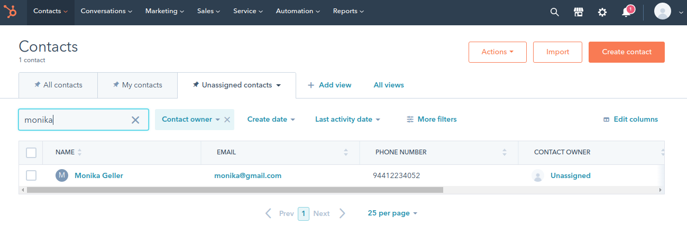

# Provisioning users to Hubspot

If your business uses or is willing to use enterprise marketing softwares such as Hubspot or Salesforce, WSO2 IAM 
solution has the ability to interact with those systems while giving you the simplicity to manage your 
organizations' identities from a single place.

This topic provides instructions on how to integrate HubSpot with WSO2 Identity Server to provision users from WSO2 
Identity Server. After completing this tutorial, you can see the users you add using WSO2 Identity Server being created 
in HubSpot and lead information updates in WSO2 Identity Server being updated in HubSpot as well.

## Configuring HubSpot

1. **Test accounts are created and managed within developer accounts.** 
        
      If you do not have a developer account in HubSpot, you can sign up from 
      [here](https://app.hubspot.com/signup/developers?_ga=2.39153443.1802613489.1576611619-500942594.1573763828).
    
    !!! Note 
        Once you sign in to your developer account, you can create an app or a test account.

    

2. Create a test account.
3. Add a test account name and create an account. The created account appears with the corresponding details as shown below. 
    

4. Click on the application and navigate to **settings>Integration>API key**.
5. Click the **Generate Key** button and copy the API key.

    

## Configure WSO2 Micro Integrator

In the WSO2 Micro Integrator, an API is deployed which will act as a proxy for receiving SCIM requests and invoking the 
Hubspot APIs via the HubSpot connector. Follow the steps given below to deploy the MI application.

1. Download [WSO2 Micro Integrator](https://wso2.com/integration/micro-integrator/#).
2. Download the [MarketingSoftwareIntegrationCompositeApplication_1.0.0.car](../../assets/attachments/MarketingSoftwareIntegrationCompositeApplication_1.0.0.car).
3. Navigate to `<WSO2-EI-HOME>/micro-integrator/repository/deployment/server/carbonapps` and place the downloaded file.
4. Navigate to `<WSO2-EI-HOME>/bin` and start the server by executing one of the following commands.

    ``` 
    Linux/MacOs: sh micro-integrator.sh
    Windows: micro-integrator.bat run
    ```

1. After the server starts, navigate to the `<WSO2-EI-HOME>/micro-integrator/registry/config/custom` directory and edit 
the file to configure the HubSpot API key as follows.

    ```
    <EndPointsList xmlns:ns1="http://endpoints">
    <APIKEY>7xxxxxxxxxxxxxxxxxxxxxxxxxxxx8</APIKEY>
    </EndPointsList> 
    ```

## Configuring Identity Server

### Step 01: Set up Identity server and configure a required claim

1. Download [WSO2 Identity Server](https://wso2.com/identity-and-access-management/).
2. Navigate to `<IS_HOME>\bin` and start the server by executing one of the following commands.

    ```
    Linux/MacOS: sh wso2server.sh
    Windows: wso2server.bat run
    ```

3. Access the [WSO2 Identity Server Management Console](https://localhost:9443/carbon) using the admin credentials.
4. Click on **List** under **Claims** on the left pane and click **http://wso2.org/claims**.
5. Click edit on &quot; **Telephone**&quot; and uncheck supported and required checkboxes.

    

6. Then click edit on &quot; **Phone Numbers**&quot; and select supported and required checkboxes.

    

### Step 02: Configure HubSpot as the identity Provider

1. On the Management Console, click **Add** under **Identity Providers**.
2. In the form that appears, provide a name for your identity provider by filling in the **Identity Provider Name**. 
You can use &quot;HubSpot.com&quot; as an example, but this can be any name you choose. See 
[Configuring an Identity Provider](https://is.docs.wso2.com/en/latest/learn/adding-and-configuring-an-identity-provider/) 
for information on registering and configuring an identity provider.
3. Expand the **Outbound Provisioning Connectors** section followed by the **SCIM Provisioning Configuration** section.

4. Check the **Enable** Checkbox and give the **Username** and **Password** as given below.
5. The value of the User Endpoint should be the same as the SCIM receiving endpoint that we deployed in the MI.

    ```
    Username: admin
    Password: admin
    User Endpoint: https://localhost:8253/hubspot/contacts
    ```

    

1. Click **Update** and save the configuration

### Step 03: Configuring the outbound provisioning

Now we need to enable sending out provisioning requests to the previously configured provisioning system for any user 
management operation done via the management console, SOAP API, or the SCIM API. To do that, you must configure outbound 
provisioning identity providers against the resident service provider. So, based on the outbound provisioning, 
users created in WSO2 Identity Server can also be provisioned to external systems like HubSpot or Google Apps.

1. Log in to the [Management Console](https://localhost:9443/carbon/) using the username and password.
2. In the **Main** menu under the **Identity** section, click **Resident** under **Service Providers.**
3. In the resulting screen, expand the **Outbound Provisioning Configuration** section.
4. In the **Outbound Provisioning Configuration** section, do the following.

    1. Select the identity provider you added from the drop-down menu available and click the + sign to add it. If you 
    have not added an identity provider yet, this step is not possible.
    2. Once added, the identity provider is displayed as an entry in the list. Select scim from the drop-down to ensure 
    that the SCIM operation is used for provisioning.
    3. If the option, **Blocking** is enabled, the outbound provisioning request will be blocked until the response is 
    received. By default, the request would be non-blocking.
    4. If the option, **Enable Rules** is enabled, the outbound provisioning request will be executed along with the 
    XACML rules enabled.
    5. Click **Update** to save your configurations.

    

## Try it out

1. Access WSO2 Identity Server [User Portal](https://localhost:9443/user-portal/).
2. Click **Create Account**.

    

3. Enter the user name and click **Proceed to Self Register**.

    

1. The **Create New Account** screen appears.

    

1. Enter the **First Name** and **LastName**.
2. Enter a preferred password in the **Password** and **Confirm password** text boxes.
3. Enter your email address in the **Email** text box and the phone number in the Phone **Numbers** text box.
4. You may enter other details in the given text boxes.
5. Read the Privacy Policy and select the **Privacy Policy** checkbox.
6. Click **Register**.
7. Login to HubSpot.
8. On the navigation panel, click **contacts**. You will see that the user you created in WSO2 IS has also been created in 
HubSpot.
9. Then try to edit user details through the user portal as follows.

    

10. You can see the edited user details in the HubSpot contacts as well.

    
