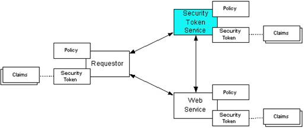

# Requesting and Renewing Received SAML2 Bearer Type Tokens

WSO2 Security Token Service is shipped as the resident identity provider
of WSO2 Identity Server. The responsibility of a Security Token Service
(STS) is to provide tokens that are trusted by a relying party to a
requester or service consumer. 

### Terms and concepts

The following terminology is used extensively in this topic:

-   **RST** : Request for a Security Token. This is the initial request
    sent by a requester to a STS requesting for a security token.
    Basically this is a XML tag introduced in the WS-Trust
    specification.

    ``` xml
    <wst:RequestSecurityToken xmlns:wst="http://schemas.xmlsoap.org/ws/2005/02/trust">
    ```

-   **RSTR** : Response for a Security Token Request. This is the
    response issued by the STS along with a signed security token to the
    requested party.

    ``` xml
        <wst:RequestSecurityTokenResponse xmlns:wst="http://schemas.xmlsoap.org/ws/2005/02/trust">
    ```

-   **Claim** : A statement made about something. For example,
    `          <email>client@example.com</email>         ` is a claim
    about client’s email address.
-   **Relying Party** : The service provider who trusts the security
    token service. In the figure below, ‘Web Service’ is considered a
    relying party. (This is referred to as ‘Relying Party’ since STS is
    also a service provider as well as a Web service that can be
    described using WSDL).

### How STS works



The following communication paths are illustrated in the above figure
using arrows.

-   -   The requester provides credentials to STS and grant a security
        token by sending a RST to the STS or from a third party
        application.
    -   STS validates the client credentials and reply with security
        token (SAML) to the requester.
    -   The token is then submitted to the relying party(web service) by
        the requester in order to access its services.
    -   The Web service either trusts the issuing security token service
        or may request a token service to validate the token (or the Web
        service may validate the token itself).
    -   Then STS send the decision to the web service.  
    -   If the token is valid then web service allow accessing the
        protected resource(s).

### Requesting tokens

#### Configuring the Identity Server to request tokens

You must do the configuration in this section to simulate the scenario
with WSO2 identity Server. According to the specification, there are
three parties communicating with each other and trusting each other. You
can equate each party to the following in order to understand the
simulation of the scenario.

-   **STS** : WSO2 Identity Server’s resident identity provider (WSO2
    STS)
-   **Relying Party** : Echo Service of WSO2 ESB
-   **Requester** : STS Sample Client

Do the following to configure this.

1.  Run WSO2 Identity Server on the default port (9443). See the
    [Installation Guide](../../setup/installing-the-product) guide for
    information on how to download and run the product.
2.  Navigate to the resident identity provider section from **Main**
    menu, by clicking **Resident** under **Identity Providers.**
3.  Expand the **Security Token Service Configuration** section under
    **Inbound Authentication Configuration**.  
    
4.  Set inbound authentication properties by providing the username
    token to authenticate requesters before issuing tokens. This is done
    to secure the STS from issuing tokens to every individual who sends
    a RSTs. To do this, click **Apply Security Policy**.
5.  Select UserNameToken (in this security scenario, the requester
    should submit a username and a password in order to get a security
    token, as described in WS-Security. By default, the username and
    password are similar to management console user name and password
    (“admin”,”admin”).
6.  Add all user groups from the next window and click **Finish**.

#### Running the requester

You can run the STS client without setting the relying party in IS in
order to grant a security token. It is not necessary to have a relying
party to grant the security token from the STS.

!!! tip
    
    Before you begin!
    
    [Git checkout the samples directory](https://github.com/wso2/samples-is).
    

1.  Navigate to
    `          <IS_SAMPLES>/modules/samples/sts/sts-client         `
    directory.  
    The client code is written to send RSTs to a given endpoint defined
    in the
    `          <IS_SAMPLES>/modules/samples/sts/sts-client/src/main/resources/client.properties         `
    file.
2.  The following is the service URL of the STS if you have started the
    IS on default port:
    `                     https://localhost:9443/services/wso2carbon-sts                   `
3.  Without changing any of the properties you can safely run the client
    via the shell script that is inside the
    `           <IS_SAMPLES>/modules/samples/sts/sts-client          `
    directory.

    ``` java
    sh sts-client.sh
    ```

    It prints the received SAML assertion on the terminal. You can also
    view the RST and RSTR on the [SOAP
    tracer](../../learn/soap-tracer) of the
    Management Console in the Identity Server.

#### Changing the client properties

Client configurations can be modified using the client.properties file,
which is located in the src/main/resources directory.

1.  You can change the relying party address in this file. In this
    instance, the endpoint URL of the WSO2 ESB echo service is provided.

    ``` java
        address.relyingParty=http://localhost:8281/services/echo
    ```

2.  The SAML version of the RST can be changed in this file (depending
    on the version, the SAML assertion issued from the STS can be
    modified).

    ``` java
        saml.token.type=2.0
    ```

3.  You can also specify the username and password for the UsernameToken
    security policy.

    ``` java
        ut.username=admin
        ut.password=admin
    ```

### Renewing received tokens

The SAML 2.0 tokens that are received by the Identity Server can
eventually expire according to the following attribute specification.
This section defines how to renew the received bearer type SAML 2.0
token using the WSO2 Identity Server’s resident token service.

``` xml
<wsu:Created>2014-08-19T09:41:55.832Z</wsu:Created>
<wsu:Expires>2014-08-19T09:46:55.832Z</wsu:Expires
```

After the security token service is configured(refer **Configuring the
Identity Server to request tokens** ) you can follow the below steps to
run the [STS
client](https://svn.wso2.org/repos/wso2/carbon/platform/branches/turing/products/is/5.0.0/modules/samples/sts/sts-client/)
as the token renewer.

#### Running the client

The client supports command line arguments to select the SAML Version
and send token renew requests.

1.  Using the configuration file in src/main/resources/ you can enable
    the renew property to send renew requests to the server.

    ``` java
        enable.renew=true
    ```

2.  You can specify SAML version on the command line. For SAML version
    2.0, the following is the command.

    ``` java
        sh sts-client.sh samlVersion 2.0
    ```

    For SAML 1.1, the following can be used.

    ``` java
        sh sts-client.sh samlVersion 1.1
    ```

#### Testing out the scenario

1.  If you want to send a request for a SAML 2.0 security token, then to
    renew it and validate the renewed token you can do following
    configurations.

    ``` java
        enable.binding.validate=true
        enable.renew=true
    ```

2.  Then run the following for the version of SAML you are using.

    ``` java
        sh sts-client.sh samlVersion 2.0
    ```

    You can see the original SAML assertion and the renewed assertion
    printed on the console.

Here is the response for SAML 2.0 security token request and a renewal
response.

  

**Initial SAML Assertion**

``` xml
<saml2:Assertion xmlns:saml2="urn:oasis:names:tc:SAML:2.0:assertion" xmlns:xs="http://www.w3.org/2001/XMLSchema" ID="urn:uuid:6E835985EF7F8C729E1412054251018" IssueInstant="2014-09-30T05:17:31.016Z" Version="2.0"><saml2:Issuer>localhost</saml2:Issuer><ds:Signature xmlns:ds="http://www.w3.org/2000/09/xmldsig#">
<ds:SignedInfo>
<ds:CanonicalizationMethod Algorithm="http://www.w3.org/2001/10/xml-exc-c14n#" />
<ds:SignatureMethod Algorithm="http://www.w3.org/2000/09/xmldsig#rsa-sha1" />
<ds:Reference URI="#urn:uuid:6E835985EF7F8C729E1412054251018">
<ds:Transforms>
<ds:Transform Algorithm="http://www.w3.org/2000/09/xmldsig#enveloped-signature" />
<ds:Transform Algorithm="http://www.w3.org/2001/10/xml-exc-c14n#"><ec:InclusiveNamespaces xmlns:ec="http://www.w3.org/2001/10/xml-exc-c14n#" PrefixList="xs" /></ds:Transform>
</ds:Transforms>
<ds:DigestMethod Algorithm="http://www.w3.org/2000/09/xmldsig#sha1" />
<ds:DigestValue>15wzu6K5Mk1Ffwvxx67MP0k2sDU=</ds:DigestValue>
</ds:Reference>
</ds:SignedInfo>
<ds:SignatureValue>
LaXHKhd8SFGGvBnNoICaSAlwRxxzZMQD5zjqtQ3quAY7fogVJo5QHBJwDLI8k2zl6X0s6z/PWcJx
20CZ+UrJZjnbp0mslVl3iM7U7SWD5bSPkrlPwFgiXh6CO/qmdfCPnBNdNGqgZPCQX4o6AR4+ohox
zxp7hJm+RhpMZhHj8Tk=
</ds:SignatureValue>
<ds:KeyInfo><ds:X509Data><ds:X509Certificate>MIICNTCCAZ6gAwIBAgIES343gjANBgkqhkiG9w0BAQUFADBVMQswCQYDVQQGEwJVUzELMAkGA1UE
CAwCQ0ExFjAUBgNVBAcMDU1vdW50YWluIFZpZXcxDTALBgNVBAoMBFdTTzIxEjAQBgNVBAMMCWxv
Y2FsaG9zdDAeFw0xMDAyMTkwNzAyMjZaFw0zNTAyMTMwNzAyMjZaMFUxCzAJBgNVBAYTAlVTMQsw
CQYDVQQIDAJDQTEWMBQGA1UEBwwNTW91bnRhaW4gVmlldzENMAsGA1UECgwEV1NPMjESMBAGA1UE
AwwJbG9jYWxob3N0MIGfMA0GCSqGSIb3DQEBAQUAA4GNADCBiQKBgQCUp/oV1vWc8/TkQSiAvTou
sMzOM4asB2iltr2QKozni5aVFu818MpOLZIr8LMnTzWllJvvaA5RAAdpbECb+48FjbBe0hseUdN5
HpwvnH/DW8ZccGvk53I6Orq7hLCv1ZHtuOCokghz/ATrhyPq+QktMfXnRS4HrKGJTzxaCcU7OQID
AQABoxIwEDAOBgNVHQ8BAf8EBAMCBPAwDQYJKoZIhvcNAQEFBQADgYEAW5wPR7cr1LAdq+IrR44i
QlRG5ITCZXY9hI0PygLP2rHANh+PYfTmxbuOnykNGyhM6FjFLbW2uZHQTY1jMrPprjOrmyK5sjJR
O4d1DeGHT/YnIjs9JogRKv4XHECwLtIVdAbIdWHEtVZJyMSktcyysFcvuhPQK8Qc/E/Wq8uHSCo=</ds:X509Certificate></ds:X509Data></ds:KeyInfo></ds:Signature><saml2:Subject><saml2:NameID Format="urn:oasis:names:tc:SAML:1.1:nameid-format:emailAddress">admin</saml2:NameID><saml2:SubjectConfirmation Method="urn:oasis:names:tc:SAML:2.0:cm:bearer" /></saml2:Subject><saml2:Conditions NotBefore="2014-09-30T05:17:31.016Z" NotOnOrAfter="2014-09-30T05:22:31.016Z"><saml2:AudienceRestriction><saml2:Audience>https://localhost:10443/services/echo</saml2:Audience></saml2:AudienceRestriction></saml2:Conditions><saml2:AuthnStatement AuthnInstant="2014-09-30T05:17:31.016Z"><saml2:AuthnContext><saml2:AuthnContextClassRef>urn:oasis:names:tc:SAML:2.0:ac:classes:Password</saml2:AuthnContextClassRef></saml2:AuthnContext></saml2:AuthnStatement><saml2:AttributeStatement><saml2:Attribute Name="http://wso2.org/claims/emailaddress" NameFormat="http://wso2.org/claims/emailaddress"><saml2:AttributeValue xmlns:xsi="http://www.w3.org/2001/XMLSchema-instance" xsi:type="xs:string">admin@wso2.com</saml2:AttributeValue></saml2:Attribute><saml2:Attribute Name="http://wso2.org/claims/givenname" NameFormat="http://wso2.org/claims/givenname"><saml2:AttributeValue xmlns:xs
```

**Renewed Assertion**

``` xml
<saml2:Assertion xmlns:saml2="urn:oasis:names:tc:SAML:2.0:assertion" xmlns:xs="http://www.w3.org/2001/XMLSchema" ID="urn:uuid:6E835985EF7F8C729E1412054251018" IssueInstant="2014-09-30T05:17:31.016Z" Version="2.0"><saml2:Issuer>localhost</saml2:Issuer><ds:Signature xmlns:ds="http://www.w3.org/2000/09/xmldsig#">
<ds:SignedInfo>
<ds:CanonicalizationMethod Algorithm="http://www.w3.org/2001/10/xml-exc-c14n#" />
<ds:SignatureMethod Algorithm="http://www.w3.org/2000/09/xmldsig#rsa-sha1" />
<ds:Reference URI="#urn:uuid:6E835985EF7F8C729E1412054251018">
<ds:Transforms>
<ds:Transform Algorithm="http://www.w3.org/2000/09/xmldsig#enveloped-signature" />
<ds:Transform Algorithm="http://www.w3.org/2001/10/xml-exc-c14n#"><ec:InclusiveNamespaces xmlns:ec="http://www.w3.org/2001/10/xml-exc-c14n#" PrefixList="xs" /></ds:Transform>
</ds:Transforms>
<ds:DigestMethod Algorithm="http://www.w3.org/2000/09/xmldsig#sha1" />
<ds:DigestValue>S2GS5Q2WFl4i2FupmZr+F8g8tfo=</ds:DigestValue>
</ds:Reference>
</ds:SignedInfo>
<ds:SignatureValue>
CUwxOhZDFQ0NdQiHz0gMBl0hsLn6eYegxSdQ+TjrsvMwrlacnSnRRT+1uMX5vCStgtm9bkI5dweS
Z1fZX3WGka0N7MHbly98H4a/2fpZIJari++/RVa68or3O80SwoJqIdnKwt1q5xPBhndpzgXEp3J7
hBPYVH4IsZYnaPpdfNk=
</ds:SignatureValue>
<ds:KeyInfo><ds:X509Data><ds:X509Certificate>MIICNTCCAZ6gAwIBAgIES343gjANBgkqhkiG9w0BAQUFADBVMQswCQYDVQQGEwJVUzELMAkGA1UE
CAwCQ0ExFjAUBgNVBAcMDU1vdW50YWluIFZpZXcxDTALBgNVBAoMBFdTTzIxEjAQBgNVBAMMCWxv
Y2FsaG9zdDAeFw0xMDAyMTkwNzAyMjZaFw0zNTAyMTMwNzAyMjZaMFUxCzAJBgNVBAYTAlVTMQsw
CQYDVQQIDAJDQTEWMBQGA1UEBwwNTW91bnRhaW4gVmlldzENMAsGA1UECgwEV1NPMjESMBAGA1UE
AwwJbG9jYWxob3N0MIGfMA0GCSqGSIb3DQEBAQUAA4GNADCBiQKBgQCUp/oV1vWc8/TkQSiAvTou
sMzOM4asB2iltr2QKozni5aVFu818MpOLZIr8LMnTzWllJvvaA5RAAdpbECb+48FjbBe0hseUdN5
HpwvnH/DW8ZccGvk53I6Orq7hLCv1ZHtuOCokghz/ATrhyPq+QktMfXnRS4HrKGJTzxaCcU7OQID
AQABoxIwEDAOBgNVHQ8BAf8EBAMCBPAwDQYJKoZIhvcNAQEFBQADgYEAW5wPR7cr1LAdq+IrR44i
QlRG5ITCZXY9hI0PygLP2rHANh+PYfTmxbuOnykNGyhM6FjFLbW2uZHQTY1jMrPprjOrmyK5sjJR
O4d1DeGHT/YnIjs9JogRKv4XHECwLtIVdAbIdWHEtVZJyMSktcyysFcvuhPQK8Qc/E/Wq8uHSCo=</ds:X509Certificate></ds:X509Data></ds:KeyInfo></ds:Signature><saml2:Subject><saml2:NameID Format="urn:oasis:names:tc:SAML:1.1:nameid-format:emailAddress">admin</saml2:NameID><saml2:SubjectConfirmation Method="urn:oasis:names:tc:SAML:2.0:cm:bearer" /></saml2:Subject><saml2:Conditions NotBefore="2014-09-30T05:17:31.439Z" NotOnOrAfter="2014-09-30T05:22:31.439Z" /><saml2:AuthnStatement AuthnInstant="2014-09-30T05:17:31.016Z"><saml2:AuthnContext><saml2:AuthnContextClassRef>urn:oasis:names:tc:SAML:2.0:ac:classes:Password</saml2:AuthnContextClassRef></saml2:AuthnContext></saml2:AuthnStatement><saml2:AttributeStatement><saml2:Attribute Name="http://wso2.org/claims/emailaddress" NameFormat="http://wso2.org/claims/emailaddress"><saml2:AttributeValue xmlns:xsi="http://www.w3.org/2001/XMLSchema-instance" xsi:type="xs:string">admin@wso2.com</saml2:AttributeValue></saml2:Attribute><saml2:Attribute Name="http://wso2.org/claims/givenname" NameFormat="http://wso2.org/claims/givenname"><saml2:AttributeValue xmlns:xs
```

Additionally, if the renewed token is validated, you can see the
following.

``` java
Renewed SAML 2.0 Token is valid
```
