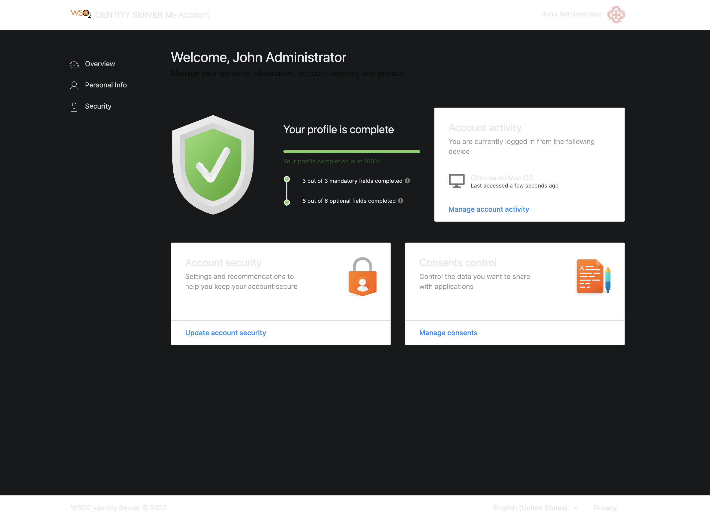
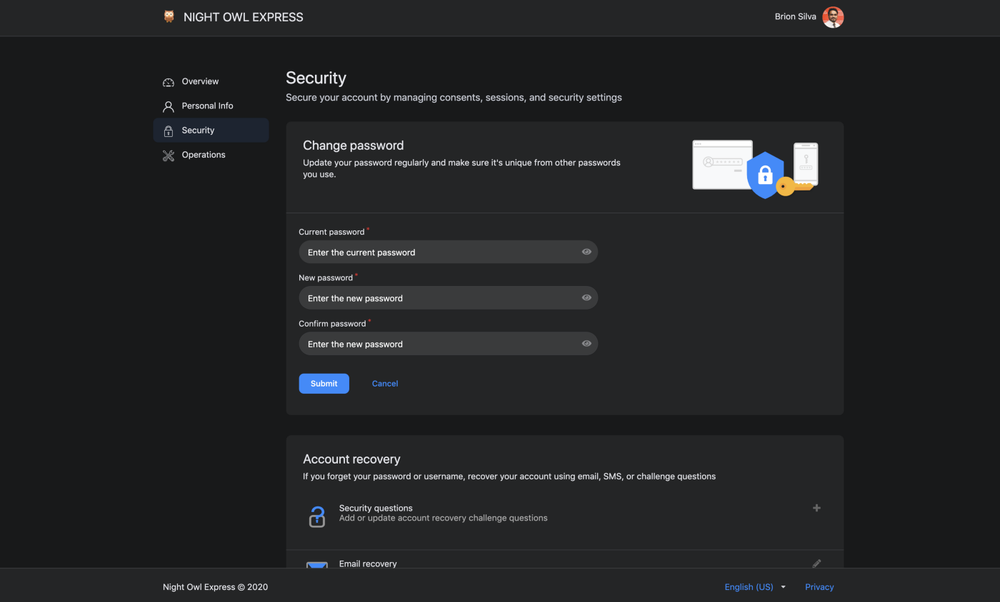
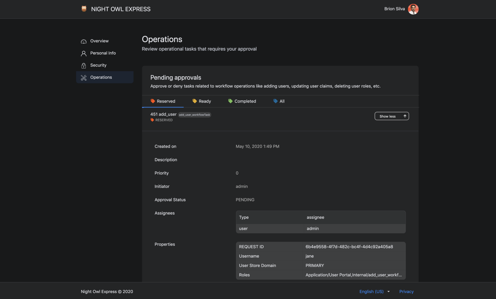

# Customizing the My Account UI

From [WSO2 Identity Server 5.10.0](https://wso2.com/identity-and-access-management/) onwards, a new **user portal** has been introduced which is the successor to the dashboard. It also adheres to the UI extensions scheme introduced with WSO2 Identity Server 5.9.0 to use a centralized theming for all the front-end portals.

!!! note
    The **User Portal** application has been renamed as **My Account** from this release onwards.

This section explains how we can customize the theming of **My Account**.

!!! warning
    Customizing the theme for My Account may result in the product missing out on updates intended for these components.

    Learn more about [WSO2 Updates](../../administer/getting-wso2-updates/).

---

## Change the default theme to dark mode

A customized version of the [default theme](https://github.com/Semantic-Org/Semantic-UI-LESS/tree/master/themes/default) in the Semantic UI LESS package has been used to achieve the look and feel of the **My Account**.


For information on the Semantic UI theming, see [Semantic UI documentation](https://semantic-ui.com/usage/theming.html).

---

## Before you begin

1. Check out the corresponding identity apps source code from the [identity-apps](https://github.com/wso2/identity-apps) repository. You can check out the `v1.0.558` tag since `v1.0.558` of identity-apps is used in IS 5.11.0.

    ```java
    $ git fetch --all --tags --prune
    $ git checkout tags/v1.0.558 -b feature-dark-theme-demo
    ```

2. Navigate to the `modules/theme/src/themes` folder within identity-apps. All the theme global variable overrides can be found in the `modules/theme/src/themes/default/globals/site.variables` file. For the full set of variables, see the [original theme variables file](https://github.com/Semantic-Org/Semantic-UI-LESS/blob/master/themes/default/globals/site.variables).

---

Follow the steps given below to further customize **My Account**. 

## Step 1: Change the primary color of My Account

To change the primary color of the portal, the variables in the `modules/theme/src/themes/default/globals/site.variables` file need to be overridden.

1. Add a new variable under 'Site Colors' and give it a value as shown below. In this example, the variable is `facebookBlue`.

    ```java
    /*-------------------
        Site Colors
    --------------------*/

    @facebookBlue     : #2d88ff;
    ```

2. Now, change the primary color variable to refer the site color variable you defined above.

    ```java
    /*-------------------
        Brand Colors
    --------------------*/

    @primaryColor        : @facebookBlue;
    ```

3. Next, add a new variable under 'Brand Colors' and give it a value as shown below. In this example, the variable name is `globalBackgroundColor`. This will be used to change the background color from white to dark gray.

    ```java
    /*-------------------
        Brand Colors
    --------------------*/

    @globalBackgroundColor: #18191a;
    ```

4. Now, change the page background color (by using the `globalBackgroundColor` variable defined above) and the text color as shown below.

    ```java
    /*-------------------
            Page
    --------------------*/

    @pageBackground      : @globalBackgroundColor;
    @textColor           : #e4e6eb;
    ```

5. Build the `theme` module by running the following command and check the results reflected on the dev server.

    ```java
    # from inside `modules/theme`
    $ npm run build
    ```
    The response should be similar to the screenshot given below. 

    
    
The background color of the header, footer, side navigation, and content cards can be changed by following the steps given below.

1. To change the header and footer background colors,

    1. Add a new variable to the 'Brand Colors' section in the `modules/theme/src/themes/default/globals/site.variables` file and give it a value as shown below. This variable is named `globalForegroundColor` in this example.

        ```java
        /*-------------------
            Brand Colors
        --------------------*/

        @globalForegroundColor: #1d2630;
        ```

    2. Add the color defined in the step above (`globalForegroundColor`) to the Menu, App Header, and App Footer sections in the `modules/theme/src/themes/default/collections/menu.variables` file as shown below.

        ```java
        /*******************************
                    Menu
        *******************************/

        @background: @globalForegroundColor;
        ```
        ```java
        /*-------------------
            App Header
        --------------------*/

        @appHeaderBackground: @globalForegroundColor;
        ```

        ```java
        /*-------------------
            App Footer
        --------------------*/

        @appFooterBackground: @globalForegroundColor;
        ```

2. To change the side panel background, apply the following to the `modules/theme/src/themes/default/collections/menu.overrides` file.

    ```java
    .ui.vertical.menu {
        &.side-panel {
            background: @globalBackgroundColor;

            // Other styles
        }
    }
    ```

3. To change the content card background color, apply the following to the `modules/theme/src/themes/default/views/card.variables` file.

    ```java
    @background: @globalForegroundColor;
    ```

The status can be checked by rebuilding the theme module.

```java
# from inside `modules/theme`
$ npm run build
```

The changes should be reflected on the running dev server in no time. A sample screen of the new theme is shown below.


## Step 2: Deploy changes in the web app

The final step of the process is the deployment. Follow the sequence of steps listed below to deploy the changes performed in the previous steps.

1.  Build the theme module.

    ```java
    # from inside modules/theme
    $ npm run build
    ```

2. Copy the `default` theme folder available inside `modules/theme/dist/lib/themes/` directory into the `<IS_HOME>/repository/deployment/server/webapps/myaccount/libs/themes/` folder.

    !!! warning
        Make sure that you keep a backup of the original theme folder.

<!--
The final theme should look similar to following.




-->
