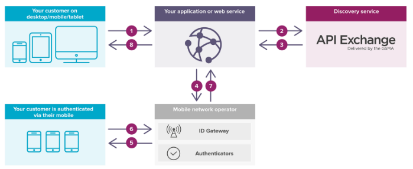

# Mobile Connect Authenticator

The Mobile Connect authenticator allows you to authenticate a user using
[Mobile Connect](https://mobileconnect.io/) through the [WSO2 Identity
Server](https://wso2.com/identity-and-access-management).

### Introduction

Privacy and security are the biggest factors to consider when aiming to
achieve sustainable digital growth in your business or enterprise. In
today's technology-driven world, the mobile device acts as a link
between people, businesses, social media, etc. The mobile device is
often the common factor that connects to the most number of users around
the globe. Thus, there is a possibility of gaining a business advantage
by having a mobile device as a sensible and secure way of authentication
for people worldwide. This topic aims to explain how Mobile Connect and
an identity and access management system can help achieve this.

------------------------------------------------------------------------

#### What is Mobile Connect?

Mobile Connect is a mobile operator facilitated authentication solution
that provides simple, secure, and convenient access to online
services. It is the convenient alternative to passwords that protect
customer privacy. This is a concept introduced by
[GSMA](http://www.gsma.com/) (GSM Association), which provides a global
and secure authentication platform by combining the user's unique mobile
number and PIN to verify and authenticate the user, anywhere at
anytime. It also allows the user to log in swiftly without the need of
any usernames or passwords.

------------------------------------------------------------------------

#### How does Mobile Connect work?

Mobile Connect works differently from a technical perspective and from
the perspective of a consumer.

##### Technical perspective

The sequence above depicts the flow of actions from a technical
perspective, or the perspective of someone who is setting this up.

1.  Consumer requests for authentication using Mobile Connect.
2.  The application or Web service connects with the discovery service
    and finds the local mobile operator.
3.  The application or Web service asks the mobile operator to
    authenticate the user.
4.  The user is authenticated via the mobile and is able to access the
    services from the device.

##### Consumer perspective

 

The given sequence above depicts the Mobile Connect flow, from sign
up/login to the complete authentication in just 4 steps. The
authentication process is carried out through your mobile device rather
than your personal device.

1.  Click on the **Sign up** or **Log in** button.
2.  Enter your mobile number (optional).
3.  Confirm your authentication via the mobile device (via USSD, SMS,
    etc.). This method varies depending on your mobile service provider.
4.  Log in process is complete.

------------------------------------------------------------------------

#### Why would you use Mobile Connect?

The 21st century is a digital era where cyber attacks have become a
critical problem and many organizations are still concerned with the
security of their systems and products. Today, the security levels
required for data and information has eliminated access to these
resources unless there is proper registration with the resource
provider. Therefore, it becomes mandatory for users to sign up with the
system, which results in remembering numerous usernames and passwords.
What if we had a simple and secure mechanism to carry out the
authentication process without much hassle, in just seconds?

By reducing the need for remembering the number of usernames and
passwords, Mobile Connect eliminates the frustration of the end user,
drives more repeat business, and ensures less abandoned transactions.

The following table highlights the advantage of using Mobile Connect for
both service providers and consumers.

| Service Provider                                                                                                                               | Consumer                               |
|------------------------------------------------------------------------------------------------------------------------------------------------|----------------------------------------|
| Accelerate and ease verification and authentication to make it easier to interact with consumers                                               | Universal log-in for multiple websites |
| Reduce friction to increase registration and engagement                                                                                        | Strong security                        |
| Enable access to services that utilize the attributes of subscribers (regardless of their operator) to provide better and more secure services | Control over personal data             |

  

------------------------------------------------------------------------

#### How WSO2 Identity Server can be used with Mobile Connect

WSO2 Identity Server is an open source identity and access management
product that can interact with Mobile Connect to achieve the following
solutions.

##### Scenario 1: Federated authentication

You can configure your application with the Identity Server and Mobile
Connect so that the authentication request is sent from your application
to the Identity Server and then federated to Mobile Connect. Mobile
Connect does the authentication and sends the response back to the
Identity Server, which in turn sends the response back to the
application and authenticates the user. The following diagram
illustrates this scenario.  
 

!!! info "Configurations to be done"
    To make this scenario work, you must do the following.

    -   Configure your application in Mobile Connect.
    -   Configure your application as a service provider in the WSO2
        Identity Server.
    -   Mobile Connect is configured as an Identity Provider in the WSO2
        Identity Server.
    -   Federated authentication is enabled in the Identity Server.

##### Scenario 2: Multi-factor authentication

You can configure your application with the Identity Server and Mobile
Connect so that multi-step authentication can take place. The user can
log in to your application with their credentials (or any other form of
basic authentication), and as a second factor, an authentication request
is sent to Mobile Connect. Mobile Connect does the authentication and
sends the response back to the Identity Server, which in turn sends the
response back to the application and authenticates the user. The
following diagram illustrates this scenario.

 

!!! info "Configurations to be done"
    To make this scenario work, you must do the following.

    -   Configure your application in Mobile Connect.
    -   Configure your application as a service provider in the WSO2
        Identity Server.
    -   Mobile Connect is configured as an Identity Provider in the WSO2
        Identity Server.
    -   Multi-step authentication is configured in the Identity Server.

------------------------------------------------------------------------

### Additional information

To download the authenticator and other artifacts, go to the [WSO2 store
location for this
connector](https://store.wso2.com/store/assets/isconnector/list).

To watch a webinar on configuring an authentication flow with Mobile
Connect and WSO2 Identity Server, click
[here](http://wso2.com/library/webinars/2016/11/securing-access-to-saas-apps-with-gsma-mobile-connect/)
.
