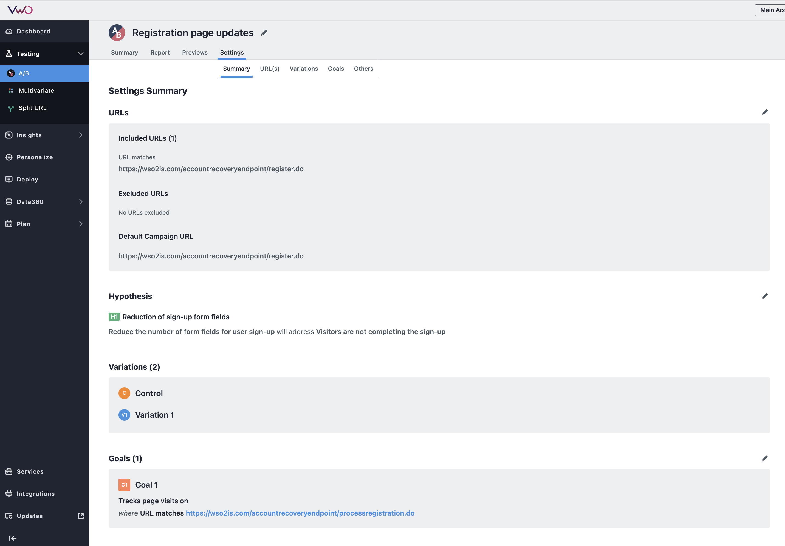
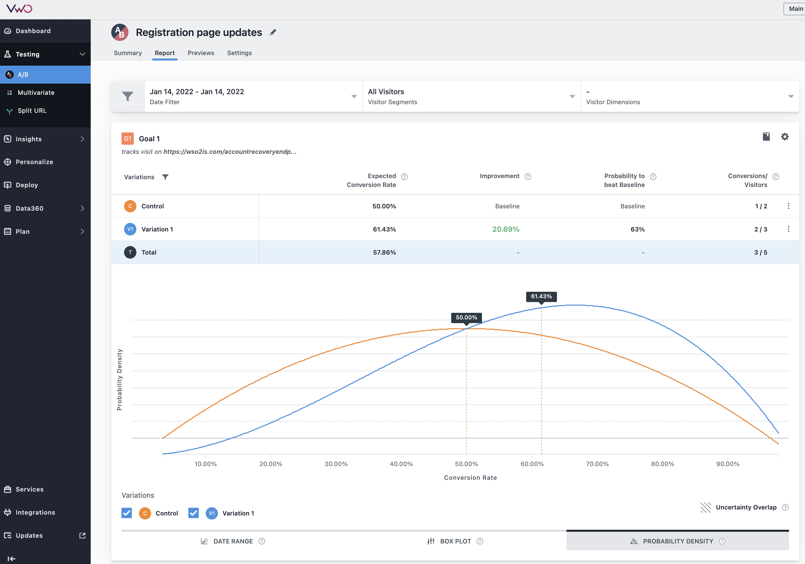

# A/B Testing

A/B testing is a method used for comparing two variants of a web page to
determine which one performs better.

When you integrate an application with WSO2 Identity Server for
its identity and access management requirements, you can verify
the usability of your application’s login pages etc., by running an A/B test.

For example, when you configure your application’s [self-registration](../self-registration/)
flow, you may want to test alternate registration page layouts to understand which one will result in more user registrations. Also, you may want to test whether having a fewer number of attributes during user registration would result in more registrations.

WSO2 Identity Server can easily integrate with [VWO](https://vwo.com/) to perform a/b testing.

## A/B Testing with VWO

1.  Set up a test in VWO.

    !!! info
        See the VWO [knowledge base](https://help.vwo.com/hc/en-us/articles/360021171954-How-to-Create-an-A-B-Test-in-VWO-) for instructions.

2.  Get the **smart code** provided for the test.

3.  Add the smart code as instructed in the test to the identified web pages in WSO2 Identity Server.

## Examples

A sample test configured for the self-registration page would look like this in VWO:

A report like the one below will be available with the test results:

